# Machine Learning — Complete Class Notes & Concepts

Welcome to **`ClassnoteMachineLearning.md`**! This document serves as a comprehensive, structured repository for Machine Learning notes, theoretical foundations, mathematical formulations, code implementations, and practical workflows.

---

## 📂 Table of Contents
0. [Key Industry Terminology](#0-key-industry-terminology)
1. [Overview & Machine Learning Fundamentals](#1-overview--machine-learning-fundamentals)
   - [1.0 Historical Evolution & Journey](#10-the-historical-evolution--journey-of-machine-learning)
   - [1.1 Hierarchy (AI, ML, DL)](#11-hierarchy-of-artificial-intelligence-machine-learning--deep-learning)
   - [1.2 Classical Programming vs. Machine Learning Paradigm](#12-classical-programming-vs-machine-learning-paradigm)
   - [1.3 Modern AI Architectural Spectrum & Learning Path](#13-modern-ai-industry-architectural-spectrum--learning-path)
   - [1.4 Core ML & Deep Learning Libraries Ecosystem](#14-core-ml--deep-learning-libraries-ecosystem)
2. [Supervised Learning](#2-supervised-learning)
   - [2.0 Standard 6-Step Execution Blueprint](#20-standard-6-step-execution-blueprint-for-any-supervised-ml-model)
   - [2.1 Regression Analysis & Applications](#21-regression-analysis--applications)
   - [2.2 Classification Models & Thresholding](#classification-models)
3. [Unsupervised Learning](#3-unsupervised-learning)
   - [Clustering](#clustering)
   - [Dimensionality Reduction](#dimensionality-reduction)
4. [Feature Engineering & Data Preprocessing](#4-feature-engineering--data-preprocessing)
5. [Model Evaluation & Validation](#5-model-evaluation--validation)
6. [Bias-Variance Tradeoff & Regularization](#6-bias-variance-tradeoff--regularization)
7. [Ensemble Techniques](#7-ensemble-techniques)
8. [Practical Machine Learning Workflow](#8-practical-machine-learning-workflow)
9. [Code Snippets & Cheatsheets](#9-code-snippets--cheatsheets)
10. [Reference Links & External Learning Resources](#10-reference-links--external-learning-resources)

---

## 0. Key Industry Terminology

| Term | 1 to 2 Line Definition / Description |
| :--- | :--- |
| **ML (Machine Learning)** | A branch of Artificial Intelligence where algorithms learn statistical patterns from data to make predictions or decisions automatically without being explicitly programmed. |
| **MLOps (Machine Learning Operations)** | The engineering practice of automating and managing the entire ML lifecycle—including data pipelines, CI/CD deployment, continuous monitoring, and model governance in production. |
| **Generative AI (GenAI)** | A category of AI models trained on vast datasets to create brand new content (such as text, images, code, audio, and video) rather than just categorizing existing data. |
| **LLM (Large Language Model)** | A deep neural network (typically Transformer-based) trained on massive text corpora with billions of parameters to understand, summarize, translate, and generate human language. |
| **Base Model (Foundation Model)** | A large-scale neural network pre-trained on broad data that serves as a general foundation, designed to be fine-tuned or adapted for specific downstream tasks. |
| **Base LLM** | A raw Large Language Model trained strictly to complete text by predicting the next token, before any instruction-tuning (IT) or Reinforcement Learning from Human Feedback (RLHF) is applied. |
| **RAG (Retrieval-Augmented Generation)** | An architecture framework that enhances LLM responses by retrieving relevant facts/documents from external databases or vector stores before generating answers, preventing hallucinations. |
| **MCP (Model Context Protocol)** | An open standard protocol that enables AI models and agents to securely connect to external tools, databases, local file systems, and API services through a standardized interface. |
| **MultiAgent (Multi-Agent System)** | An architectural framework where multiple specialized AI agents collaborate, divide complex workflows, share context, and coordinate tool execution to accomplish tasks beyond single-agent capabilities. |
| **Transformer** | A breakthrough neural network architecture relying on self-attention mechanisms to process sequential data in parallel, serving as the core foundation for modern LLMs and Generative AI. |
| **OLS (Ordinary Least Squares)** | A foundational linear regression optimization method that calculates model coefficients ($\beta$) by minimizing the sum of squared differences (residuals) between actual and predicted target values. |

---

## 1. Overview & Machine Learning Fundamentals

### 1.0 The Historical Evolution & Journey of Machine Learning

#### 🏛️ The Coining of "Machine Learning" (Arthur Samuel, 1959)
* **Arthur Samuel** (an IBM computer scientist and pioneer in computer gaming) coined the term **"Machine Learning"** in **1959**.
* He demonstrated this by creating a self-learning **Checkers program** on the IBM 704 computer. The program played thousands of games against itself, calculated board positions, and gradually learned to beat human players.
* **Arthur Samuel's Classic Definition**:
  > *"Machine Learning is the field of study that gives computers the ability to learn without being explicitly programmed."*

---

#### 📈 Andrew Ng's Scale Paradigm: Traditional ML vs. Deep Learning

Pioneering AI educator **Andrew Ng** illustrated a fundamental law of AI scalability that explains why the industry shifted from traditional ML to Deep Learning and LLMs:

```
  Model Performance
         ▲
         │                                       /  Large Neural Nets / Transformers (LLMs)
         │                                      /
         │                                     /   Medium Neural Nets
         │                                    /
         │  ---------------------------------/     Small Neural Nets
         │  --------------------------------/      Traditional ML (SVMs, Random Forests, Logistic Reg)
         │  ───────────────────────────────/       (Performance plateaus as data volume increases)
         │
         └─────────────────────────────────────────────────────────────────► Amount of Data / Compute
```

* **Traditional ML Bottleneck**: Algorithms like Support Vector Machines (SVMs), Logistic Regression, and Decision Trees hit a **performance plateau**. Adding millions of extra data points yields diminishing returns.
* **Deep Learning & LLM Scaling Law**: Large Neural Networks (Deep Learning and Transformers) scale continuously—the more data and compute you feed them, the better their performance becomes ($P \propto \text{Data} \times \text{Parameters} \times \text{Compute}$).

---

#### ⏳ Complete Chronological Timeline of Machine Learning & AI

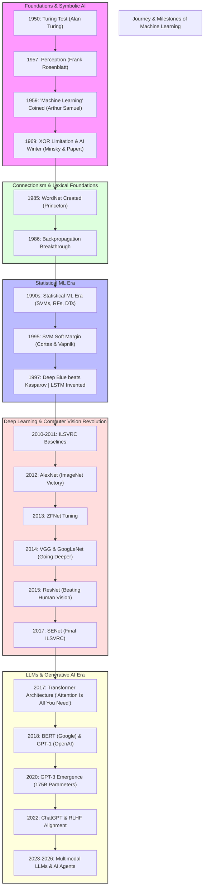
```mermaid
flowchart TD
    title[Journey & Milestones of Machine Learning]
    
    subgraph Era1["Foundations & Symbolic AI"]
        Turing["1950: Turing Test (Alan Turing)"]
        Perceptron["1957: Perceptron (Frank Rosenblatt)"]
        Coined["1959: 'Machine Learning' Coined (Arthur Samuel)"]
        Winter["1969: XOR Limitation & AI Winter (Minsky & Papert)"]
        
        Turing --> Perceptron --> Coined --> Winter
    end
    
    subgraph Era2["Connectionism & Lexical Foundations"]
        WordNet["1985: WordNet Created (Princeton)"]
        Backprop["1986: Backpropagation Breakthrough"]
        
        Winter --> WordNet --> Backprop
    end
    
    subgraph Era3["Statistical ML Era"]
        StatML["1990s: Statistical ML Era (SVMs, RFs, DTs)"]
        SVM["1995: SVM Soft Margin (Cortes & Vapnik)"]
        Chess["1997: Deep Blue beats Kasparov | LSTM Invented"]
        
        Backprop --> StatML --> SVM --> Chess
    end

    subgraph Era4["Deep Learning & Computer Vision Revolution"]
        ILSVRC["2010-2011: ILSVRC Baselines"]
        AlexNet["2012: AlexNet (ImageNet Victory)"]
        ZFNet["2013: ZFNet Tuning"]
        GoogLeNet["2014: VGG & GoogLeNet (Going Deeper)"]
        ResNet["2015: ResNet (Beating Human Vision)"]
        SENet["2017: SENet (Final ILSVRC)"]
        
        Chess --> ILSVRC --> AlexNet --> ZFNet --> GoogLeNet --> ResNet --> SENet
    end

    subgraph Era5["LLMs & Generative AI Era"]
        Transformer["2017: Transformer Architecture ('Attention Is All You Need')"]
        BERT["2018: BERT (Google) & GPT-1 (OpenAI)"]
        GPT3["2020: GPT-3 Emergence (175B Parameters)"]
        ChatGPT["2022: ChatGPT & RLHF Alignment"]
        Multimodal["2023-2026: Multimodal LLMs & AI Agents"]
        
        SENet --> Transformer --> BERT --> GPT3 --> ChatGPT --> Multimodal
    end

    %% Styles for subgraphs
    style Era1 fill:#f9f,stroke:#333,stroke-width:2px
    style Era2 fill:#dfd,stroke:#333,stroke-width:2px
    style Era3 fill:#bbf,stroke:#333,stroke-width:2px
    style Era4 fill:#fdd,stroke:#333,stroke-width:2px
    style Era5 fill:#ffd,stroke:#333,stroke-width:2px
```

---

### 📂 Chronological History by Era & Category

#### 🏛️ Category 1: The Foundations & Symbolic AI Era (1950s – 1970s)

##### 1.1 Foundations of Artificial Intelligence
*   **1950 — [Turing Test](https://en.wikipedia.org/wiki/Turing_test) (Alan Turing)**: Alan Turing published *"Computing Machinery and Intelligence"*, proposing the Turing Test as a standard for machine thought.

##### 1.2 Early Connectionism (Neural Networks)
*   **1957 — [Perceptron](https://en.wikipedia.org/wiki/Perceptron) (Frank Rosenblatt)**: Built the Perceptron, the first hardware artificial neural network capable of learning linear binary classification rules.

##### 1.3 Game Playing & The First AI Winter
*   **1959 — Arthur Samuel Coined ["Machine Learning"](https://en.wikipedia.org/wiki/Arthur_Samuel#Checkers_play_program)**: Samuel built a self-learning Checkers program that could defeat its creator, demonstrating self-learning software.
*   **1969 — Minsky & Papert's ["Perceptrons" Book](https://en.wikipedia.org/wiki/Perceptrons_(book))**: Mathematically proved that single-layer perceptrons could not solve non-linear separations like the XOR function, triggering the 1st "AI Winter" (funding freeze).

---

#### 🧬 Category 2: Connectionism & Lexical Foundations (1980s)

##### 2.1 Lexical Semantics
*   **1985 — [WordNet](https://en.wikipedia.org/wiki/WordNet) Created**: George A. Miller at Princeton University launched WordNet, a large lexical database of English linking nouns, verbs, and adjectives into semantic hierarchies.

##### 2.2 Multi-Layer Neural Training
*   **1986 — [Backpropagation](https://en.wikipedia.org/wiki/Backpropagation) Algorithm**: Popularized by Rumelhart, Hinton, and Williams, showing that backpropagation through multiple hidden layers could learn complex non-linear representations.

---

#### 📊 Category 3: The Statistical Machine Learning Era (1990s – 2000s)

##### 3.1 Kernel Methods & Randomization
*   **1995 — [Support Vector Machine (SVM)](https://en.wikipedia.org/wiki/Support_vector_machine) Soft Margin**: Vladimir Vapnik & Corinna Cortes published the soft-margin SVM classifier, popularizing robust kernel-based margin classification.
*   **2001 — Random Forests**: Leo Breiman introduced Random Forests, combining parallel decision trees with bootstrap aggregation (Bagging) and random feature subsets to reduce overfitting.

##### 3.2 Chess Benchmarks & Sequence Modeling
*   **1997 — Deep Blue beats Kasparov**: IBM's [Deep Blue](https://en.wikipedia.org/wiki/Deep_Blue_(chess_computer)) defeated chess champion Garry Kasparov in a 6-game match under tournament conditions, demonstrating a milestone for symbolic heuristics.
*   **1997 — Sepp Hochreiter & Jürgen Schmidhuber Invented [LSTM](https://en.wikipedia.org/wiki/Long_short-term_memory)**: Introduced Long Short-Term Memory networks, resolving the vanishing/exploding gradient problems in recurrent neural networks.

---

#### 👁️ Category 4: The Deep Learning Revolution & Computer Vision Era (2010s)

##### 4.1 The ImageNet & Convolutional Neural Networks Era (ILSVRC 2010 – 2017)
The [ImageNet](https://en.wikipedia.org/wiki/ImageNet) Large Scale Visual Recognition Challenge (ILSVRC) evaluated algorithms on 1,000 object classes. The year-by-year subset performance represents the rise of Deep Learning:
*   **2010 - 2011 — Pre-Deep Learning Baselines**: Won by shallow models using SIFT/Fisher Vectors. Error rates hovered around **25.8% to 28.2%**.
*   **2012 — [AlexNet](https://en.wikipedia.org/wiki/AlexNet) (CNN Breakthrough)**: Alex Krizhevsky, Ilya Sutskever, & Geoffrey Hinton trained an 8-layer GPU-accelerated CNN, slashing error rate to **15.3%** and initiating the deep learning revolution.
*   **2013 — ZFNet (Activations & Tuning)**: Zeiler & Fergus adjusted hyperparameters using Deconvolutional Networks to visualize layer activations, dropping error to **11.7%**.
*   **2014 — VGG & GoogLeNet (Going Deeper)**:
    *   **GoogLeNet** (Inception v1, 22 layers, parallel inception blocks) won the challenge with **6.7%** error rate.
    *   **VGGNet** (VGG-16/VGG-19, small $3\times3$ filters) stood second with **7.3%** error rate.
*   **2015 — [Residual Neural Network (ResNet)](https://en.wikipedia.org/wiki/Residual_neural_network)**: Kaiming He et al. introduced skip connections (ResNet-152), dropping error rate to **3.57%**, surpassing human-level visual accuracy (~5%).
*   **2017 — SENet (Final ILSVRC)**: Squeeze-and-Excitation Networks won the final challenge with **2.25%** error rate by dynamically weighting channels.

##### 4.2 Generative Models & Optimizers
*   **2014 — Generative Adversarial Networks (GANs)**: Ian Goodfellow introduced GANs, pitting a Generator against a Discriminator in a minimax game to generate realistic data.
*   **2014 — Adam Optimizer**: Kingma & Ba introduced Adam, an adaptive learning rate optimization algorithm combining AdaGrad and RMSProp.

---

#### 💬 Category 5: The Large Language Models (LLM) & Generative AI Era (2017 – Present)

##### 5.1 The Transformer Revolution
*   **2017 — [Transformer](https://en.wikipedia.org/wiki/Transformer_(deep_learning_architecture)) Architecture**: Google published *"Attention Is All You Need"*, introducing self-attention mechanisms and replacing LSTMs for sequence tasks.

##### 5.2 Pre-training & Scaling Laws
*   **2018 — [BERT](https://en.wikipedia.org/wiki/BERT_(language_model))**: Google introduced BERT, popularizing bi-directional encoder pre-training.
*   **2018 - 2020 — [GPT Series](https://en.wikipedia.org/wiki/Generative_pre-trained_transformer)**: OpenAI demonstrated autoregressive decoder-only pre-training, culminating in GPT-3 (175B parameters) showing zero/few-shot learning.

##### 5.3 Alignment, Multimodality & Agentic AI
*   **2022 — [ChatGPT](https://en.wikipedia.org/wiki/ChatGPT) & [RLHF](https://en.wikipedia.org/wiki/Reinforcement_learning_from_human_feedback) Alignment**: OpenAI launched ChatGPT, using Reinforcement Learning from Human Feedback to align LLMs for conversational tasks.
*   **2023 - Present — [Multimodal LLMs](https://en.wikipedia.org/wiki/Large_language_model) & [AI Agents](https://en.wikipedia.org/wiki/AI_agent)**: Proliferation of multimodal models (GPT-4, Gemini, Claude, Llama 3) integrated with tools, RAG, and autonomous agentic loops.

---

### 1.1 Hierarchy of Artificial Intelligence, Machine Learning & Deep Learning

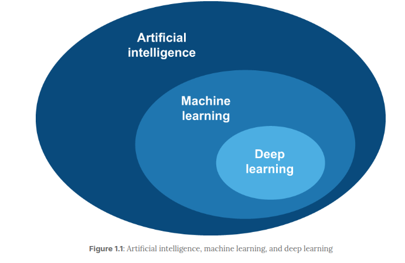

```
┌──────────────────────────────────────────────────────────────────────────┐
│ ARTIFICIAL INTELLIGENCE (AI)                                             │
│  Systems or machines mimicking human intelligence to perform tasks       │
│  ┌────────────────────────────────────────────────────────────────────┐  │
│  │ MACHINE LEARNING (ML)                                              │  │
│  │  Algorithms learning statistical patterns from data automatically │  │
│  │  ┌──────────────────────────────────────────────────────────────┐  │  │
│  │  │ DEEP LEARNING (DL)                                           │  │  │
│  │  │  Multi-layer neural networks (Transformers, CNNs, RNNs)     │  │  │
│  │  └──────────────────────────────────────────────────────────────┘  │  │
│  └────────────────────────────────────────────────────────────────────┘  │
└──────────────────────────────────────────────────────────────────────────┘
```

* **Artificial Intelligence (AI)**: The broader field of creating intelligent systems capable of reasoning, problem-solving, and decision-making.
* **Machine Learning (ML)**: A sub-field of AI focused on learning mapping functions $f(X) \to y$ from data without explicit hardcoded rules.
* **Deep Learning (DL)**: A sub-field of ML based on deep artificial neural networks capable of learning hierarchical feature representations directly from raw unstructured data.

---

### 1.2 Classical Programming vs. Machine Learning Paradigm

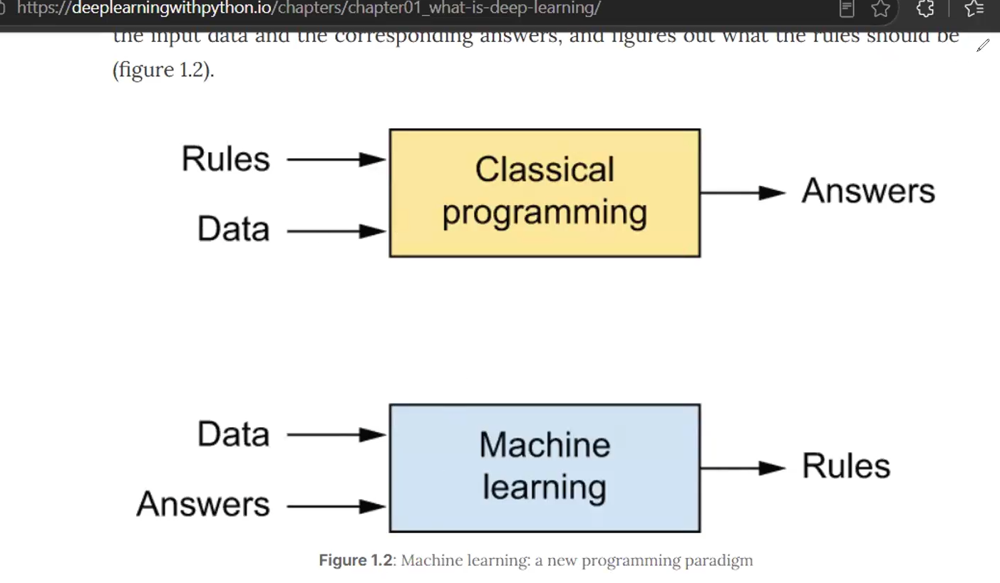

```
Classical Programming Paradigm (Software 1.0):
┌───────────┐
│   Rules   │──┐
└───────────┘  │    ┌──────────────────────┐
               ├────► Classical Programming ├────► Answers
┌───────────┐  │    └──────────────────────┘
│   Data    │──┘
└───────────┘

Machine Learning Paradigm (Software 2.0):
┌───────────┐
│   Data    │──┐
└───────────┘  │    ┌──────────────────────┐
               ├────►   Machine Learning   ├────► Rules (Trained Model)
┌───────────┐  │    └──────────────────────┘
│  Answers  │──┘
└───────────┘
```

#### Detailed Breakdown & Comparison

| Dimension | Classical Programming (Software 1.0) | Machine Learning Paradigm (Software 2.0) |
| :--- | :--- | :--- |
| **Input Ingredients** | Human-written **Rules** (if-else logic, explicit math formulas) $+$ Input **Data**. | Historical **Data** (features $X$) $+$ Ground-truth **Answers** (labels $y$). |
| **Output Result** | Computed **Answers** (calculated output values). | Learned **Rules** (trained model function $f(X) \to y$, parameters $\theta$). |
| **Who Writes the Rules?** | Human programmers explicitly code every single condition and edge case. | The ML algorithm automatically extracts and learns rules by analyzing patterns. |
| **Handling Complexity** | Becomes brittle and unmaintainable for complex tasks (e.g. face recognition, sentiment analysis). | Excels at high-dimensional, unstructured, complex problems (images, audio, text, sensor data). |
| **Analogy** | Following a rigid, hardcoded baking recipe to make a cake. | Feeding a chef 1,000 cakes and raw ingredients so the chef deduces the recipes. |

* **Technical Definition (Tom Mitchell, 1997)**: A computer program is said to learn from experience **E** with respect to some class of tasks **T** and performance measure **P**, if its performance at tasks in **T**, as measured by **P**, improves with experience **E**.

---

#### 💡 How Machine Learning Works: Representation Learning & Coordinate Transformations

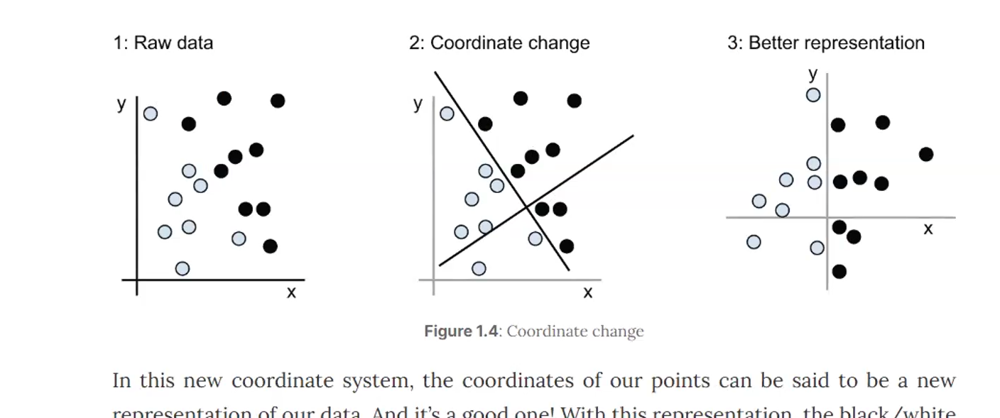

```
Step 1: Raw Data                    Step 2: Coordinate Change              Step 3: Better Representation
(Entangled in original space)       (Mathematical transformation)          (Linearly separable at x = 0)
        y │                                y │                                    y │
          │  ●   ●                           │ \  ●   ●                             │  │
       ○  │    ●   ●                      ○  │  \   ●   ●                        ○   │  │ ●   ●
     ○  ○ │  ●                              ○  ○ │   \  ●                        ○  ○  │  │   ●   ●
       ○  │    ●                              ○  │ \  \   ●                        ○   │  │ ●
          │  ●                                   │  \  \                         ───┼──┼──────────► x
   ───────┼──────────► x                  ───────┼───\──\───► x                     │  │ ●
          │                                      │    \  \                          │  │   ●
```

##### The Core Mechanism of Machine Learning:
* **Machine Learning is Searching for Useful Representations**: Machine Learning algorithms do not just "memorize" data; they apply **geometric transformations** (rotations, scaling, projections, activations) to project raw input data into a new coordinate space where the underlying pattern or decision boundary becomes simple and linearly separable.
* **Classical ML vs. Deep Learning Representation**:
  * **Classical ML**: Relies on engineers to manually engineer coordinate transformations (e.g. PCA, SVM kernel trick, polynomial projections).
  * **Deep Learning**: Automatically learns complex multi-layered coordinate transformations sequentially across neural network layers.

---

### 1.3 Modern AI Industry Architectural Spectrum & Learning Path

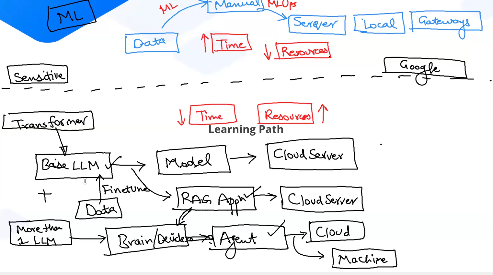

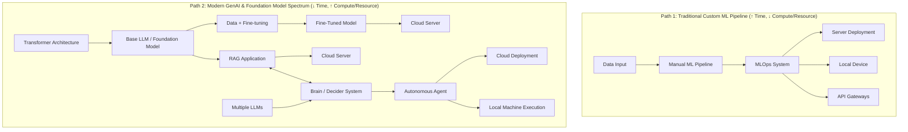
```mermaid
flowchart TD
    subgraph Traditional_ML["Path 1: Traditional Custom ML Pipeline (↑ Time, ↓ Compute/Resource)"]
        Data[Data Input] --> ManualML[Manual ML Pipeline]
        ManualML --> MLOps[MLOps System]
        MLOps --> S1[Server Deployment]
        MLOps --> S2[Local Device]
        MLOps --> S3[API Gateways]
    end

    subgraph GenAI_Architecture["Path 2: Modern GenAI & Foundation Model Spectrum (↓ Time, ↑ Compute/Resource)"]
        TF[Transformer Architecture] --> BaseLLM[Base LLM / Foundation Model]
        
        %% Fine-tuning path
        BaseLLM --> FTData[Data + Fine-tuning]
        FTData --> FTModel[Fine-Tuned Model]
        FTModel --> Cloud1[Cloud Server]

        %% RAG path
        BaseLLM --> RAG[RAG Application]
        RAG --> Cloud2[Cloud Server]

        %% Multi-Agent path
        MultiLLM[Multiple LLMs] --> Decider[Brain / Decider System]
        RAG <--> Decider
        Decider --> Agent[Autonomous Agent]
        Agent --> Cloud3[Cloud Deployment]
        Agent --> EdgeMachine[Local Machine Execution]
    end
```

#### Comparison of Architectural Trade-offs
| Spectrum / Approach | Time to Value ($\text{Time}$) | Resource & Compute Requirements ($\text{Resources}$) | Infrastructure & Deployment | Primary Use Cases |
| :--- | :--- | :--- | :--- | :--- |
| **Traditional Custom ML** | **Higher Time ($\uparrow$)**: Requires manual feature engineering, custom training & tuning. | **Lower Resources ($\downarrow$)**: Runs efficiently on standard CPUs / lightweight servers. | Deployed via MLOps pipelines to Local, Server, or API Gateways. | Structured tabular data, Fraud scoring, Churn prediction, Sensor metrics. |
| **Foundation Models / GenAI** | **Lower Time ($\downarrow$)**: Pre-trained Base LLMs provide immediate out-of-the-box capabilities. | **Higher Resources ($\uparrow$)**: Requires GPU clusters, high memory, and token budget. | Deployed on Cloud Servers, Vector DBs (RAG), and Autonomous Agent Runtimes. | Text generation, Document Q&A (RAG), Code synthesis, Multi-Agent decision-making. |

---

### Primary Types of Machine Learning

```
                               ┌───────────────────────────┐
                               │ Machine Learning Types    │
                               └─────────────┬─────────────┘
                                             │
       ┌──────────────────────┬──────────────┴───────────────┬──────────────────────┐
       ▼                      ▼                              ▼                      ▼
┌──────────────┐       ┌──────────────┐              ┌──────────────┐       ┌──────────────┐
│ 1.Supervised │       │2.Unsupervised│              │3.Semi-Superv.│       │4.Reinforcement│
│   Learning   │       │   Learning   │              │   Learning   │       │   Learning   │
└──────┬───────┘       └──────────────┘              └──────────────┘       └──────┬───────┘
       │ (Labeled Data)  (Unlabeled Data)             (Small Labeled +             │ (Environment &
       ├───────────────┐                              Large Unlabeled)             │  Feedback Loop)
       ▼               ▼                                                           ▼
┌─────────────┐ ┌──────────────┐                                            ┌──────────────┐
│ Regression  │ │Classification│                                            │  Recurrent   │
│ (Continuous)│ │ (Categories) │                                            │Feedback Loop │
└─────────────┘ └──────────────┘                                            └──────────────┘
       ▲               ▲
       └───────┬───────┘
               │ (Meta-Technique)
        ┌──────────────┐
        │   Ensemble   │
        │   Learning   │
        └──────────────┘
```

| # | Type / Paradigm | Data & Signal Source | Learning Mechanism & Objective | Key Examples & Use Cases |
| :--- | :--- | :--- | :--- | :--- |
| **1** | **Supervised Learning** | Fully Labeled dataset $(X, y)$ | Learns an explicit mapping function $f(X) \to y$ from known input-output pairs. | Spam detection, House pricing, Credit scoring |
| **2** | **Unsupervised Learning** | Unlabeled dataset $(X)$ | Discovers intrinsic patterns, clusters, hidden structures, or reduced representations without targets. | Customer segmentation, Anomaly detection, PCA |
| **3** | **Semi-Supervised Learning** | Small labeled dataset $+$ large volume of unlabeled data | Leverages unlabeled data distribution to improve learning accuracy when labeling is expensive. | Medical image diagnosis, Protein annotation, Web categorization |
| **4** | **Reinforcement Learning** | Environment, Agent, States ($S$), Actions ($A$), and Reward signals ($R$) | Learns an optimal policy $\pi(s)$ via **feedback loops** (trial-and-error) to maximize long-term cumulative reward. | Robotics, Autonomous vehicles, Game AI (Chess/Go), RLHF (LLM alignment) |

---

### Core Sub-Types & Model Combinations

1. **Regression (Sub-type)**: Output is a continuous numerical value (e.g., salary, price, temperature).
2. **Classification (Sub-type)**: Maps continuous inputs/probabilities into discrete groups/categories (e.g., $0$ vs $1$, Cat vs Dog).
3. **Ensemble Learning (Meta-type / Multi-model Synergy)**: A powerful approach where **multiple models work together** to produce a single, superior prediction:
   * **Bagging (Parallel)**: Trains multiple models independently on different data subsets and averages their votes (e.g., Random Forest).
   * **Boosting (Sequential)**: Trains models in series, where each new model focuses on correcting the errors/feedback of previous models (e.g., XGBoost, LightGBM).
   * **Stacking (Heterogeneous)**: Combines predictions of completely different model types using a meta-model.

---

### 1.4 Core ML & Deep Learning Libraries Ecosystem

| Library | Backed / Created By | Primary Domain & Focus | Key Capabilities & Features | Typical Import & Usage |
| :--- | :--- | :--- | :--- | :--- |
| **SciPy** | SciPy / NumFOCUS Community | Scientific Computing & Advanced Math | Advanced numerical integration, optimization (`scipy.optimize`), hypothesis testing & probability (`scipy.stats`), linear algebra, and signal processing. | `import scipy as sp`<br>`from scipy import stats, optimize` |
| **Scikit-learn (`scikit`)** | INRIA / Open-Source Community | Traditional Machine Learning | Industry-standard toolkit for classical ML: classification, regression, clustering, feature scaling (`StandardScaler`), model selection, and pipelines. | `import sklearn`<br>`from sklearn.ensemble import RandomForestClassifier` |
| **TensorFlow** | **Google** (Google Brain / DeepMind) | Industrial & Enterprise Deep Learning | End-to-end production DL framework with Keras API, static graph compilation, mobile/edge deployment (TF Lite), and TF Serving for high-throughput production. | `import tensorflow as tf`<br>`from tensorflow import keras` |
| **PyTorch** | **Meta** (FAIR / PyTorch Foundation) | Research & Generative AI Deep Learning | Dynamic computational graphs (`autograd`), highly pythonic syntax, dominant ecosystem for Transformers, LLMs (Hugging Face), and modern GenAI research. | `import torch`<br>`import torch.nn as nn` |
| **Keras** | François Chollet / **Google** & Community | High-Level Deep Learning API | User-friendly, high-level API designed for fast experimentation. Keras 3 functions as a multi-backend API supporting **TensorFlow**, **PyTorch**, and **JAX** seamlessly. | `import keras`<br>`from keras import layers, models` |

---

## 2. Supervised Learning

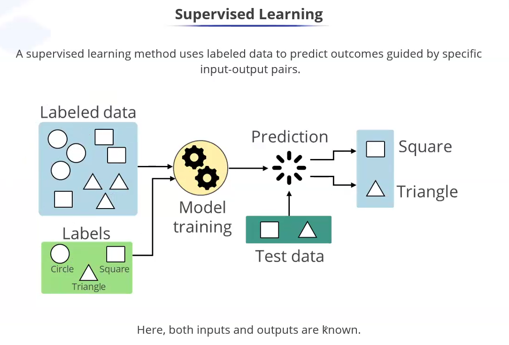

> **Key Rule**: A supervised learning method uses labeled data to predict outcomes guided by specific input-output pairs. Here, both inputs and outputs are known.

Supervised Learning is divided into two primary categories based on the nature of the target variable $y$: **Regression** and **Classification**.

---

### 2.0 Complete End-to-End Supervised Machine Learning Pipeline

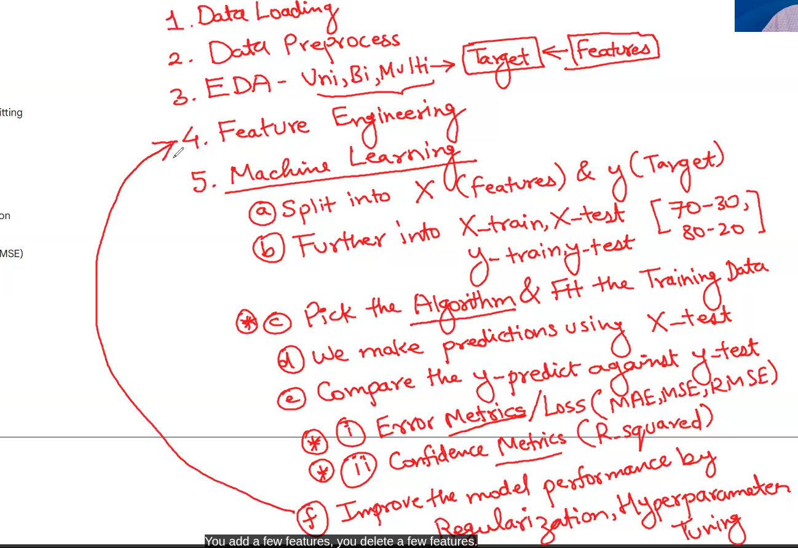

Every real-world Machine Learning project follows an iterative 5-phase end-to-end lifecycle, encompassing crucial **Pre-Preprocessing Steps** before model training:

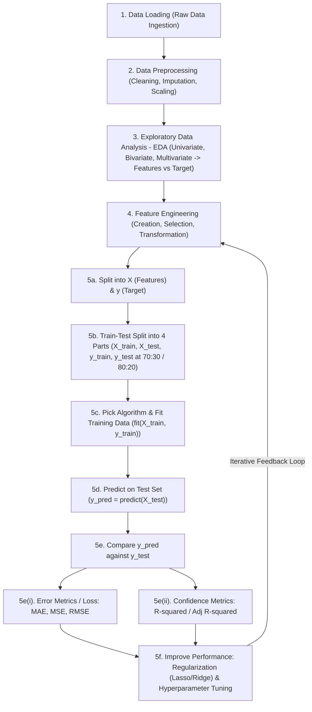
```mermaid
flowchart TD
    P1["1. Data Loading (Raw Data Ingestion)"] --> P2["2. Data Preprocessing (Cleaning, Imputation, Scaling)"]
    P2 --> P3["3. Exploratory Data Analysis - EDA (Univariate, Bivariate, Multivariate -> Features vs Target)"]
    P3 --> P4["4. Feature Engineering (Creation, Selection, Transformation)"]
    
    P4 --> M5a["5a. Split into X (Features) & y (Target)"]
    M5a --> M5b["5b. Train-Test Split into 4 Parts (X_train, X_test, y_train, y_test at 70:30 / 80:20)"]
    M5b --> M5c["5c. Pick Algorithm & Fit Training Data (fit(X_train, y_train))"]
    M5c --> M5d["5d. Predict on Test Set (y_pred = predict(X_test))"]
    M5d --> M5e["5e. Compare y_pred against y_test"]
    
    M5e --> M5e1["5e(i). Error Metrics / Loss: MAE, MSE, RMSE"]
    M5e --> M5e2["5e(ii). Confidence Metrics: R-squared / Adj R-squared"]
    
    M5e1 & M5e2 --> M5f["5f. Improve Performance: Regularization (Lasso/Ridge) & Hyperparameter Tuning"]
    
    M5f -- "Iterative Feedback Loop" --> P4
```

#### Detailed Phase-by-Phase Implementation Blueprint

| Phase # | Pipeline Step Name | Analytical Objective & Operational Details | Code & Library Reference |
| :--- | :--- | :--- | :--- |
| **Phase 1** | **1. Data Loading** | Ingest raw data from CSV, SQL databases, or APIs into structured DataFrames. | `import pandas as pd`<br>`df = pd.read_csv("data.csv")` |
| **Phase 2** | **2. Data Preprocessing** | Handle missing values (`SimpleImputer`), treat outliers, scale numbers (`StandardScaler`), and encode categories (`OneHotEncoder`). | `from sklearn.impute import SimpleImputer`<br>`from sklearn.preprocessing import StandardScaler` |
| **Phase 3** | **3. Exploratory Data Analysis (EDA)** | Perform **Univariate**, **Bivariate**, and **Multivariate** analysis to discover correlations between Features $\leftrightarrow$ Target ($y$). | `import seaborn as sns`<br>`sns.pairplot(df)`<br>`df.corr()` |
| **Phase 4** | **4. Feature Engineering** | Create new domain features, drop collinear attributes, apply polynomial expansions, or apply PCA. | `df['feature_ratio'] = df['f1'] / df['f2']` |
| **Phase 5a** | **5a. Feature & Target Separation ($X, y$)** | Split DataFrame into feature matrix $X$ (independent variables) and target vector $y$ (outcome). | `X = df.drop(columns=['target'])`<br>`y = df['target']` |
| **Phase 5b** | **5b. Train-Test Splitting (4 Parts)** | Partition $X$ and $y$ into 4 parts ($X_{train}, X_{test}, y_{train}, y_{test}$) at **80:20** or **70:30** ratio with fixed `random_state`. | `from sklearn.model_selection import train_test_split`<br>`X_train, X_test, y_train, y_test = train_test_split(X, y, test_size=0.2, random_state=42)` |
| **Phase 5c** | **5c. Algorithm Fitting (`fit`)** | Select model family (e.g., `LinearRegression`, `RandomForest`) and fit parameters on $X_{train}, y_{train}$. | `model = LinearRegression()`<br>`model.fit(X_train, y_train)` |
| **Phase 5d** | **5d. Predictions (`predict`)** | Feed unseen test features $X_{test}$ into the fitted model to generate test predictions $\hat{y}_{pred}$. | `y_pred = model.predict(X_test)` |
| **Phase 5e** | **5e. Result Comparison & Metrics** | Statistically evaluate $\hat{y}_{pred}$ against true $y_{test}$:<br>*(i) Error/Loss*: MAE, MSE, RMSE<br>*(ii) Confidence*: $R^2$ / Adjusted $R^2$ | `from sklearn.metrics import mean_squared_error, r2_score`<br>`mse = mean_squared_error(y_test, y_pred)`<br>`r2 = r2_score(y_test, y_pred)` |
| **Phase 5f** | **5f. Optimization & Feedback Loop** | Tune hyperparameters (`GridSearchCV`), apply **Regularization** (Lasso, Ridge, ElasticNet), and iterate back to **Phase 4 (Feature Engineering)**. | `from sklearn.linear_model import Ridge`<br>`from sklearn.model_selection import GridSearchCV` |

---

### 💡 Core Distinction: Regression vs. Classification

```
                          ┌──────────────────────────┐
                          │   Supervised Learning    │
                          └────────────┬─────────────┘
                                       │
            ┌──────────────────────────┴──────────────────────────┐
            ▼                                                     ▼
  ┌───────────────────┐                                 ┌───────────────────┐
  │    REGRESSION     │                                 │  CLASSIFICATION   │
  │ Continuous Output │                                 │ Categorical/Group │
  │  y ∈ (-∞, +∞)     │                                 │     y ∈ {0, 1}    │
  └───────────────────┘                                 └───────────────────┘
   Predicts a quantity                                   Predicts a category
   (e.g., $450,000, 36.6°C)                             (e.g., 0: Safe, 1: Spam)
```

#### Detailed Comparison Table
| Feature / Dimension | Regression Models | Classification Models |
| :--- | :--- | :--- |
| **Output Type** | Continuous numerical value ($y \in \mathbb{R}$) | Discrete label / category ($y \in \{0, 1\}$ or $\{C_1, C_2, \dots, C_K\}$) |
| **Primary Goal** | Estimate a quantity or value on a continuous scale. | Group data points into predefined categories. |
| **Decision Mechanism** | Direct numerical output based on features. | Probability estimation + **Thresholding** (e.g., if $P(y=1) \ge 0.5 \implies 1$). |
| **Common Loss Functions** | Mean Squared Error (MSE), Mean Absolute Error (MAE), RMSE | Binary Cross-Entropy (Log Loss), Categorical Cross-Entropy |
| **Example Questions** | *"What will be the price of this house?"* <br> *"What will tomorrow's temperature be?"* | *"Is this email spam (1) or inbox (0)?"* <br> *"Is this transaction fraudulent (1) or legitimate (0)?"* |

---

### How Classification Converts Numbers into Groups (0 and 1)

Classification often works internally by predicting a **continuous probability score** between $0$ and $1$, and then applying a **decision threshold** to assign a discrete group label:

1. **Raw Numerical Output ($z$)**: The model computes a linear combination of input features:
   $$z = \theta_0 + \theta_1 x_1 + \theta_2 x_2 + \dots + \theta_n x_n = \theta^T X$$
2. **Probability Mapping (Sigmoid Activation)**: The raw score $z$ (which can be any real number from $-\infty$ to $+\infty$) is squeezed into a probability range $[0, 1]$:
   $$\hat{p} = \sigma(z) = \frac{1}{1 + e^{-z}}$$
3. **Thresholding (Converting into Groups 0 or 1)**:
   $$\hat{y} = \begin{cases} 1 & \text{if } \hat{p} \ge \text{Threshold } (e.g., 0.5) \quad \Rightarrow \text{Group 1 (Positive Class)} \\ 0 & \text{if } \hat{p} < \text{Threshold } (e.g., 0.5) \quad \Rightarrow \text{Group 0 (Negative Class)} \end{cases}$$

---

### 2.1 Regression Analysis & Applications

#### 🌳 Machine Learning & Regression Taxonomy Tree

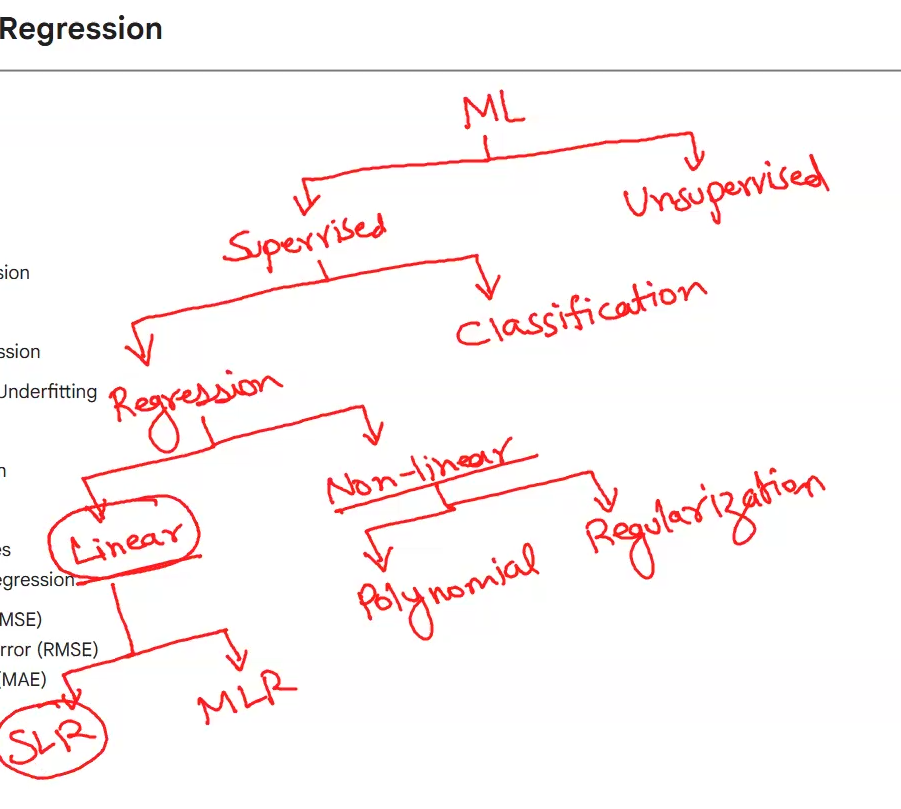

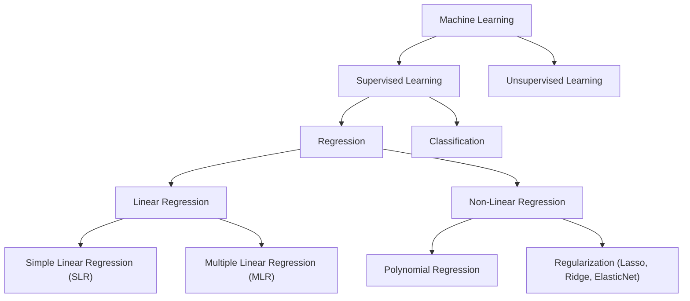
```mermaid
flowchart TD
    ML[Machine Learning] --> Supervised[Supervised Learning]
    ML --> Unsupervised[Unsupervised Learning]

    Supervised --> Regression[Regression]
    Supervised --> Classification[Classification]

    Regression --> Linear[Linear Regression]
    Regression --> NonLinear[Non-Linear Regression]

    Linear --> SLR["Simple Linear Regression (SLR)"]
    Linear --> MLR["Multiple Linear Regression (MLR)"]

    NonLinear --> Polynomial[Polynomial Regression]
    NonLinear --> Regularization["Regularization (Lasso, Ridge, ElasticNet)"]
```

---

#### 🌐 Industry Use Cases of Regression
| Industry Domain | Real-World Application & Objective | Input Features ($X$) | Target Variable ($y$) |
| :--- | :--- | :--- | :--- |
| **Real Estate** | Property price valuation and market appraisal. | Square footage, location, bedrooms, age, proximity to transit | House Sale Price ($) |
| **Retail & E-commerce** | Demand forecasting and inventory planning. | Promotional spend, historical sales, season, price discount | Product Demand Units |
| **Healthcare** | Patient disease progression & hospital stay length. | Age, BMI, blood pressure, dosage, biomarker levels | Recovery Time (Days) |
| **Marketing** | Campaign effectiveness and ROI estimation. | Ad spend (TV, Social, Search), target demographic size | Expected Revenue ($) |
| **Energy / Oil & Gas** | Surface & subsurface global production forecasting. | Pressure, flow rate, temperature, well depth | Daily Oil Production (Barrels) |

---

#### 📐 Linear Regression Foundations

##### 1. Simple Linear Regression (Single Feature)
* **Equation**: 
  $$y = \beta_0 + \beta_1 x + \epsilon$$
  *(where $\beta_0$ is the intercept, $\beta_1$ is the slope, and $\epsilon \sim \mathcal{N}(0, \sigma^2)$ is random error).*
* **Ordinary Least Squares (OLS) Closed-Form Solution**:
  $$\beta_1 = \frac{\sum_{i=1}^n (x_i - \bar{x})(y_i - \bar{y})}{\sum_{i=1}^n (x_i - \bar{x})^2}, \quad \beta_0 = \bar{y} - \beta_1 \bar{x}$$

##### 2. Multiple Linear Regression (Multiple Features)
* **Equation**:
  $$\hat{y} = \beta_0 + \beta_1 x_1 + \beta_2 x_2 + \dots + \beta_p x_p = X \beta$$
* **Normal Equation (Matrix Closed-Form Solution)**:
  $$\hat{\beta} = (X^T X)^{-1} X^T y$$

##### ⚠️ 5 Critical Assumptions of Linear Regression
1. **Linearity**: The relationship between features $X$ and target $y$ is additive and linear.
2. **Independence of Errors**: Residuals $e_i = y_i - \hat{y}_i$ are uncorrelated (no autocorrelation).
3. **Homoscedasticity**: The variance of errors is constant across all predicted values ($\text{Var}(e_i) = \sigma^2$).
4. **Normality of Residuals**: The residual errors follow a normal distribution ($\epsilon \sim \mathcal{N}(0, \sigma^2)$).
5. **No Multicollinearity**: Input features are not highly linearly correlated with each other ($\text{VIF} < 5$).

---

#### 📈 Non-Linear Regression: Polynomial Regression

When data exhibits a non-linear curvature, we expand input features into higher-degree polynomial terms:

$$y = \beta_0 + \beta_1 x + \beta_2 x^2 + \beta_3 x^3 + \dots + \beta_d x^d + \epsilon$$

```python
from sklearn.preprocessing import PolynomialFeatures
from sklearn.linear_model import LinearRegression
from sklearn.pipeline import make_pipeline

# 2nd Degree Polynomial Model
poly_model = make_pipeline(PolynomialFeatures(degree=2), LinearRegression())
# poly_model.fit(X_train, y_train)
```

---

#### 📊 Regression Performance Metrics

| Metric | Mathematical Formula | Key Characteristics & Interpretation |
| :--- | :--- | :--- |
| **MSE** *(Mean Squared Error)* | $\frac{1}{n} \sum_{i=1}^n (y_i - \hat{y}_i)^2$ | Heavily penalizes large outlier errors due to squaring term. |
| **RMSE** *(Root Mean Squared Error)* | $\sqrt{\frac{1}{n} \sum_{i=1}^n (y_i - \hat{y}_i)^2}$ | Interpretable in the exact same units as target variable $y$. |
| **MAE** *(Mean Absolute Error)* | $\frac{1}{n} \sum_{i=1}^n \|y_i - \hat{y}_i\|$ | Robust to outliers (linear penalty for deviations). |
| **$R^2$** *(Coefficient of Determination)* | $1 - \frac{\sum (y_i - \hat{y}_i)^2}{\sum (y_i - \bar{y})^2}$ | Measures proportion of target variance explained by features ($0 \le R^2 \le 1$). |
| **Adjusted $R^2$** | $1 - \left[ \frac{(1 - R^2)(n - 1)}{n - p - 1} \right]$ | Adjusts $R^2$ by penalizing the addition of irrelevant/noise features ($p$). |

---

#### 🛡️ Regularization Techniques (L1, L2 & ElasticNet)

Regularization prevents **Overfitting** (High Variance) by adding a penalty term to the MSE loss function to constrain model coefficients ($\beta$).

```
                      Loss = MSE + Penalty(β)
```

##### 1. Lasso Regression (L1 Penalty)
* **Objective Function**:
  $$J(\beta) = \frac{1}{2n} \sum_{i=1}^n (y_i - X_i \beta)^2 + \alpha \sum_{j=1}^p |\beta_j|$$
* **Key Characteristic**: Performs **Automatic Feature Selection** by driving irrelevant feature coefficients to **exact zero** ($\beta_j = 0$).

##### 2. Ridge Regression (L2 Penalty)
* **Objective Function**:
  $$J(\beta) = \frac{1}{2n} \sum_{i=1}^n (y_i - X_i \beta)^2 + \alpha \sum_{j=1}^p \beta_j^2$$
* **Key Characteristic**: Shrinks coefficients towards zero, effectively mitigating **Multicollinearity** and preventing any single feature from dominating.

##### 3. ElasticNet Regression (L1 + L2 Hybrid)
* **Objective Function**:
  $$J(\beta) = \text{MSE} + \alpha \left[ l_1\text{-ratio} \sum_{j=1}^p |\beta_j| + \frac{1 - l_1\text{-ratio}}{2} \sum_{j=1}^p \beta_j^2 \right]$$
* **Key Characteristic**: Combines Lasso's sparsity/feature selection with Ridge's stability when handling correlated feature groups.

---

#### ⚙️ End-to-End Production Pipeline (Scikit-Learn `Pipeline` & `ColumnTransformer`)

Using Scikit-Learn `Pipeline` guarantees that missing value imputation (`SimpleImputer`), feature scaling (`StandardScaler`), categorical encoding (`OneHotEncoder`), and model fitting occur inside cross-validation folds without **Data Leakage**:

```python
import numpy as np
import pandas as pd
from sklearn.compose import ColumnTransformer
from sklearn.pipeline import Pipeline
from sklearn.impute import SimpleImputer
from sklearn.preprocessing import StandardScaler, OneHotEncoder
from sklearn.linear_model import Ridge
from sklearn.model_selection import GridSearchCV, train_test_split

# 1. Define Numeric & Categorical Columns
num_cols = ["housing_median_age", "total_rooms", "median_income"]
cat_cols = ["ocean_proximity"]

# 2. Build Preprocessing Pipelines
num_pipeline = Pipeline([
    ("imputer", SimpleImputer(strategy="median")),
    ("scaler", StandardScaler())
])

cat_pipeline = Pipeline([
    ("imputer", SimpleImputer(strategy="most_frequent")),
    ("encoder", OneHotEncoder(handle_unknown="ignore"))
])

# 3. Combine Preprocessors
preprocessor = ColumnTransformer([
    ("num", num_pipeline, num_cols),
    ("cat", cat_pipeline, cat_cols)
])

# 4. Create Full Execution Pipeline with Ridge Model
full_pipeline = Pipeline([
    ("preprocessing", preprocessor),
    ("regressor", Ridge())
])

# 5. Hyperparameter Tuning with GridSearchCV
param_grid = {
    "regressor__alpha": [0.1, 1.0, 10.0, 100.0]
}

# grid_search = GridSearchCV(full_pipeline, param_grid, cv=5, scoring="r2")
# grid_search.fit(X_train, y_train)
```

---

### Classification Models
Predicting discrete class labels $y \in \{0, 1, \dots, K-1\}$.

#### Logistic Regression
* **Sigmoid Function**:
  $$\sigma(z) = \frac{1}{1 + e^{-z}}$$
* **Decision Boundary**: $\hat{p} \ge 0.5 \implies \hat{y} = 1$
* **Binary Cross-Entropy Loss**:
  $$J(\theta) = -\frac{1}{m} \sum_{i=1}^{m} \left[ y^{(i)} \log(\hat{y}^{(i)}) + (1 - y^{(i)}) \log(1 - \hat{y}^{(i)}) \right]$$

---

#### Naive Bayes Classifier
* **Bayes' Theorem**:
  $$P(y|X) = \frac{P(X|y)P(y)}{P(X)}$$
* **Naive Assumption**: Assumes conditional independence between features given the class:
  $$P(x_1, \dots, x_n|y) = \prod_{i=1}^{n} P(x_i|y)$$

---

#### K-Nearest Neighbors (KNN)
* **Mechanism**: Distance-based instance learning (lazy learner). Computes distance (Euclidean, Manhattan) from test point to all training points and votes among $K$ nearest neighbors.
* **Minkowski Distance**:
  $$D(x, y) = \left( \sum_{i=1}^{n} |x_i - y_i|^p \right)^{1/p}$$
  *(where $p=1$ is Manhattan distance, and $p=2$ is Euclidean distance).*
* **Key Guidelines**:
  - Always apply feature scaling (`StandardScaler`) before running KNN.
  - Pick odd $K$ to break ties (rule of thumb: $K \approx \sqrt{N}$).

---

#### Decision Tree Classifier (CART)
A non-parametric supervised learning algorithm that splits data recursively based on feature thresholds to maximize node purity.

##### 1. Anatomy of a Decision Tree
* **Root Node**: The top node containing the entire dataset, representing the first feature split.
* **Decision Nodes**: Intermediate nodes representing conditions (splits) on features.
* **Leaf Nodes**: Endpoints containing the final class prediction or label.

##### 2. Splitting Criteria Formulas
To determine the best split, the algorithm calculates impurity at each node:

* **Gini Impurity (Gini Index)**: Measures the probability of misclassification.
  $$\text{Gini}(D) = 1 - \sum_{i=1}^{C} (p_i)^2$$
  *(Ranges from $0$ for perfect purity to $0.5$ for maximum impurity in binary splits).*

* **Entropy**: Measures the uncertainty or information disorder.
  $$\text{Entropy}(D) = - \sum_{i=1}^{C} p_i \log_2(p_i)$$
  *(Ranges from $0$ for perfect purity to $1$ for maximum uncertainty).*

* **Information Gain (IG)**: The reduction in entropy (or impurity) after a split.
  $$\text{Information Gain} = \text{Entropy(Parent)} - \sum_{j=1}^{k} \left( \frac{|D_j|}{|D|} \times \text{Entropy}(D_j) \right)$$
  *(The tree splits on the feature and threshold that yields the maximum Information Gain).*

##### 3. Overfitting & Pruning
Because Decision Trees split recursively until leaf nodes are pure, they are highly prone to overfitting (100% train accuracy but poor generalization). We control this via:
* **Pre-Pruning (Early Stopping)**: Parameters like `max_depth` (maximum tree height), `min_samples_split` (minimum samples required to split), and `min_samples_leaf` (minimum samples allowed in a leaf).
* **Post-Pruning (Minimal Cost-Complexity Pruning)**: Uses the complexity parameter `ccp_alpha` ($\alpha \ge 0$) to balance tree size ($|T|$) and error rate ($R(T)$):
  $$R_\alpha(T) = R(T) + \alpha |T|$$

##### 4. Python Implementation & Tuning
```python
from sklearn.tree import DecisionTreeClassifier
from sklearn.model_selection import GridSearchCV
from sklearn.pipeline import Pipeline
from sklearn.preprocessing import StandardScaler

# Create pipeline with scaler and decision tree
pipeline = Pipeline([
    ('scaler', StandardScaler()),
    ('dt', DecisionTreeClassifier(random_state=42))
])

# Define grid of hyperparameters (including ccp_alpha for post-pruning)
param_grid = {
    'dt__max_depth': [None, 5, 10, 15],
    'dt__min_samples_split': [2, 5, 10],
    'dt__min_samples_leaf': [1, 2, 4],
    'dt__ccp_alpha': [0.0, 0.005, 0.01, 0.05]
}

# Run grid search
grid_search = GridSearchCV(pipeline, param_grid, cv=5, scoring='accuracy')
grid_search.fit(X_train, y_train)

best_model = grid_search.best_estimator_
print(f"Best Parameters: {grid_search.best_params_}")
```

##### 5. Interactive Split Calculator
An interactive, animated visual calculator for Gini Index and Entropy splits has been created at [4.IHFC AIML: Machine Learning/gini_calculator/index.html](file:///media/jignesh/Data/ihfc/IHFC-Leaning/4.IHFC AIML: Machine Learning/gini_calculator/index.html). It displays real-time item animations and step-by-step mathematical substitutions.

---

#### Support Vector Machine (SVM)
A powerful supervised machine learning algorithm used for classification, regression, and outlier detection. It constructs an optimal decision boundary (hyperplane) that separates classes with the maximum possible margin.

##### 1. Historical Background
*   **1963 (Linear SVM)**: Vladimir Vapnik and Alexey Chervonenkis proposed the original linear support vector optimal hyperplane algorithm (hard-margin).
*   **1992 (Non-linear Kernel SVM)**: Bernhard Boser, Isabelle Guyon, and Vladimir Vapnik introduced the **Kernel Trick**, allowing the algorithm to fit non-linear decision boundaries.
*   **1995 (Soft-Margin SVM)**: Corinna Cortes and Vladimir Vapnik published the modern **[Soft-Margin Support Vector Machine](https://en.wikipedia.org/wiki/Support_vector_machine#Soft-margin)**, which uses slack variables ($\xi_i$) to allow controlled misclassifications on noisy datasets.

##### 2. Mathematical Optimization Formulations

###### A. The Primal Formulation (Hard-Margin)
For linearly separable binary classification where labels $y_i \in \{-1, 1\}$, the SVM seeks to solve:
$$\min_{\mathbf{w}, b} \frac{1}{2} \|\mathbf{w}\|^2 \quad \text{subject to} \quad y_i(\mathbf{w}^T \mathbf{x}_i + b) \ge 1 \quad \forall i$$

###### B. The Soft-Margin Formulation (With Slack Variables)
To handle non-separable or noisy datasets, we introduce slack variables $\xi_i \ge 0$ and a regularization parameter $C > 0$:
$$\min_{\mathbf{w}, b, \boldsymbol{\xi}} \left( \frac{1}{2} \|\mathbf{w}\|^2 + C \sum_{i=1}^{n} \xi_i \right) \quad \text{subject to} \quad y_i(\mathbf{w}^T \mathbf{x}_i + b) \ge 1 - \xi_i, \quad \xi_i \ge 0 \quad \forall i$$

###### C. The Dual Formulation (Applying Lagrange Multipliers)
Using Lagrange multipliers $\alpha_i \ge 0$, the primal is transformed into its Wolfe Dual representation. This formulation is critical because it only depends on the dot product of input vectors, enabling the **Kernel Trick**:
$$\max_{\boldsymbol{\alpha}} \left( \sum_{i=1}^{n} \alpha_i - \frac{1}{2} \sum_{i=1}^{n} \sum_{j=1}^{n} \alpha_i \alpha_j y_i y_j K(\mathbf{x}_i, \mathbf{x}_j) \right)$$
$$\text{subject to} \quad \sum_{i=1}^{n} \alpha_i y_i = 0 \quad \text{and} \quad 0 \le \alpha_i \le C \quad \forall i$$

##### 3. The Kernel Trick (Non-linear projections)
By replacing the dot product $K(\mathbf{x}_i, \mathbf{x}_j) = \phi(\mathbf{x}_i)^T \phi(\mathbf{x}_j)$, SVM operates in an infinite-dimensional feature space without explicitly calculating coordinates:
*   **Linear Kernel**: $K(\mathbf{x}_i, \mathbf{x}_j) = \mathbf{x}_i^T \mathbf{x}_j$
*   **Polynomial Kernel**: $K(\mathbf{x}_i, \mathbf{x}_j) = (\gamma \mathbf{x}_i^T \mathbf{x}_j + r)^d$
*   **Radial Basis Function (RBF) Kernel**: $K(\mathbf{x}_i, \mathbf{x}_j) = \exp(-\gamma \|\mathbf{x}_i - \mathbf{x}_j\|^2)$

##### 4. Multiclass SVM Extensions
Since the core SVM optimization is natively a binary classifier ($y_i \in \{-1, 1\}$), multiclass classification ($K > 2$ classes) is achieved using meta-strategies:
*   **One-vs-Rest (OvR / One-vs-All)**: Trains $K$ separate binary classifiers (each class against all other classes combined). The class with the highest decision score is predicted.
*   **One-vs-One (OvO)**: Trains $\frac{K(K-1)}{2}$ binary classifiers for every possible pair of classes. The final class is decided by majority vote (preferred for SVM as it scales better with smaller subset sizes, despite having more classifiers).

##### 5. Key Hyperparameters
*   **$C$ (Regularization)**: Controls the tradeoff between margin maximization and training error minimization (Softness).
*   **Gamma ($\gamma$)**: Controls the reach/radius of influence of individual support vectors (high $\gamma \implies$ tight boundary, low $\gamma \implies$ smooth boundary).

##### 6. Python Implementation
```python
from sklearn.svm import SVC
from sklearn.pipeline import Pipeline
from sklearn.preprocessing import StandardScaler

# SVM is highly distance-sensitive; feature scaling is strictly mandatory
svm_pipeline = Pipeline([
    ('scaler', StandardScaler()),
    ('svm', SVC(kernel='rbf', C=1.0, gamma='scale', decision_function_shape='ovo'))
])
# svm_pipeline.fit(X_train, y_train)
```

##### 7. Interactive Hyperplane Classification Demo
An interactive, 3D visual demonstration of SVM Hyperplane Classification has been created. It features real-time 3D coordinate space rotation, dimension toggling (2D vs. 3D), margin width tuning, active support vector highlighting, and real-time classification accuracy calculations.
*   **Local File**: [4.IHFC AIML: Machine Learning/svm-hyperplan-classification/index.html](file:///media/jignesh/Data/ihfc/IHFC-Leaning/4.IHFC AIML: Machine Learning/svm-hyperplan-classification/index.html)
*   **GitHub Preview**: [Live Interactive Hyperplane Visualizer (Preview Mode)](https://htmlpreview.github.io/?https://github.com/JigneshRana/IHFC-Leaning/blob/Master/4.IHFC%20AIML:%20Machine%20Learning/svm-hyperplan-classification/index.html)

---

## 3. Unsupervised Learning

### 🔍 Machine Learning & Unsupervised Learning Hierarchy Mindmap
Here is the visual mapping of Machine Learning categories, highlighting the branches of Supervised and Unsupervised Learning along with their core algorithms and evaluation metrics:

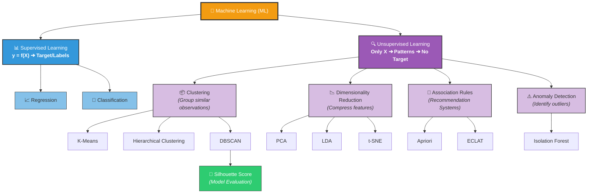
```mermaid
flowchart TD
    ML["🤖 Machine Learning (ML)"] --> Sup["📊 Supervised Learning<br><b>y = f(X) ➔ Target/Labels</b>"]
    ML --> Unsup["🔍 Unsupervised Learning<br><b>Only X ➔ Patterns ➔ No Target</b>"]
    
    %% Supervised branches
    Sup --> Reg["📈 Regression"]
    Sup --> Clf["🎯 Classification"]
    
    %% Unsupervised branches
    Unsup --> Cluster["📦 Clustering<br><i>(Group similar observations)</i>"]
    Unsup --> DimRed["📉 Dimensionality Reduction<br><i>(Compress features)</i>"]
    Unsup --> Assoc["🛒 Association Rules<br><i>(Recommendation Systems)</i>"]
    Unsup --> Anom["⚠️ Anomaly Detection<br><i>(Identify outliers)</i>"]
    
    %% Clustering Algorithms
    Cluster --> KMeans["K-Means"]
    Cluster --> Hier["Hierarchical Clustering"]
    Cluster --> DBScan["DBSCAN"]
    DBScan --> Sil["📏 Silhouette Score<br><i>(Model Evaluation)</i>"]
    
    %% Dimensionality Reduction Algorithms
    DimRed --> PCA["PCA"]
    DimRed --> LDA["LDA"]
    DimRed --> TSNE["t-SNE"]
    
    %% Association Algorithms
    Assoc --> Apri["Apriori"]
    Assoc --> Eclat["ECLAT"]
    
    %% Anomaly Detection Algorithms
    Anom --> IsoFor["Isolation Forest"]
    
    %% Styling
    style ML fill:#f39c12,stroke:#333,stroke-width:3px,color:#fff
    style Sup fill:#3498db,stroke:#333,stroke-width:2px,color:#fff
    style Unsup fill:#9b59b6,stroke:#333,stroke-width:2px,color:#fff
    
    style Reg fill:#85c1e9,stroke:#333,stroke-width:1px
    style Clf fill:#85c1e9,stroke:#333,stroke-width:1px
    
    style Cluster fill:#d7bde2,stroke:#333,stroke-width:1.5px
    style DimRed fill:#d7bde2,stroke:#333,stroke-width:1.5px
    style Assoc fill:#d7bde2,stroke:#333,stroke-width:1.5px
    style Anom fill:#d7bde2,stroke:#333,stroke-width:1.5px
    
    style Sil fill:#2ecc71,stroke:#333,stroke-width:1px,color:#fff
```

---

### 3.0 Introduction to Unsupervised Learning
In Unsupervised Learning, the model works with **unlabeled datasets**. There is **no target variable ($y$)** to predict. Instead, the algorithm searches for hidden patterns, structures, or relationships within the input features ($X$).

```
Supervised Learning:    X ➔ y  (Mapping features to known labels)
Unsupervised Learning:  X ➔ ?  (Discovering hidden structure; no target label y exists)
```

---

#### ❓ The 3 Core Questions of Unsupervised Learning

To understand which Unsupervised Learning method to apply, we look at the three fundamental questions:

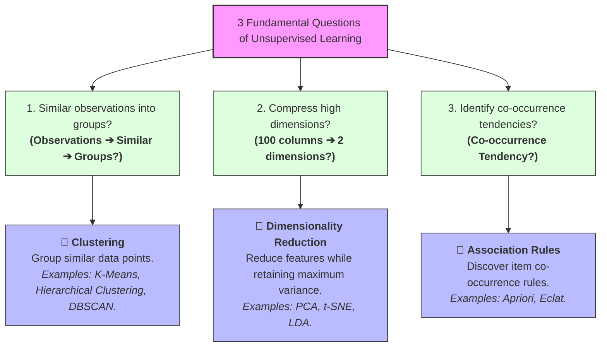
```mermaid
flowchart TD
    Q["3 Fundamental Questions of Unsupervised Learning"] --> Q1["1. Similar observations into groups?<br><b>(Observations ➔ Similar ➔ Groups?)</b>"]
    Q --> Q2["2. Compress high dimensions?<br><b>(100 columns ➔ 2 dimensions?)</b>"]
    Q --> Q3["3. Identify co-occurrence tendencies?<br><b>(Co-occurrence Tendency?)</b>"]
    
    Q1 --> A1["🎯 <b>Clustering</b><br>Group similar data points.<br><i>Examples: K-Means, Hierarchical Clustering, DBSCAN.</i>"]
    Q2 --> A2["🎯 <b>Dimensionality Reduction</b><br>Reduce features while retaining maximum variance.<br><i>Examples: PCA, t-SNE, LDA.</i>"]
    Q3 --> A3["🎯 <b>Association Rules</b><br>Discover item co-occurrence rules.<br><i>Examples: Apriori, Eclat.</i>"]

    style Q fill:#f9f,stroke:#333,stroke-width:2px
    style Q1 fill:#dfd,stroke:#333,stroke-width:1px
    style Q2 fill:#dfd,stroke:#333,stroke-width:1px
    style Q3 fill:#dfd,stroke:#333,stroke-width:1px
    style A1 fill:#bbf,stroke:#333,stroke-width:1px
    style A2 fill:#bbf,stroke:#333,stroke-width:1px
    style A3 fill:#bbf,stroke:#333,stroke-width:1px
```

| Question / Query | Machine Learning Approach | Description & Examples |
| :--- | :--- | :--- |
| **1. Observations ➔ Similar ➔ Groups?** | **Clustering** | Groups similar observations together based on distance or density metrics. <br> *Examples: Customer segmentation, fraud detection.* |
| **2. 100 columns ➔ 2 dimensions?** | **Dimensionality Reduction** | Compresses high-dimensional feature spaces into fewer variables while preserving variance. <br> *Examples: PCA (Principal Component Analysis), t-SNE.* |
| **3. Co-occurrence Tendency?** | **Association Rules** | Identifies rules and probabilities of items appearing together in transactional datasets. <br> *Examples: Market Basket Analysis (e.g., 'purchasing bread links to buying butter').* |

---

### 3.1 Clustering Techniques

#### A. K-Means Clustering

> 💡 **Layman Analogy**:
> Imagine you have a large pile of unsorted colored lego blocks, and you want to organize them into $K$ distinct piles.
> 1. You randomly place $K$ empty cups (centroids) on the floor.
> 2. You assign each lego block to the cup that is closest to it.
> 3. Once all blocks are sorted into piles, you move each cup to the exact geometric center of its new pile.
> 4. You repeat this process—reassigning blocks to the nearest cup and shifting the cups to the centers—until the cups stop moving.
>
> **The Algorithmic Steps:**
> 1.  **Initialize**: Randomly choose $K$ initial cluster centroids in the feature space.
> 2.  **Assignment Step**: Assign each data point to its nearest centroid using distance metrics (typically Euclidean distance).
> 3.  **Update Step**: Recompute the centroid of each cluster as the mean of all points assigned to it.
> 4.  **Repeat**: Iterate steps 2 and 3 until centroids converge (no longer shift significantly) or max iterations are reached.

###### Choosing the Optimal Number of Clusters ($K$):
*   **The Elbow Method**: Plot the **Within-Cluster Sum of Squares (WCSS) / Inertia** against different values of $K$. WCSS measures the compactness of clusters. The "elbow" point is where WCSS decrease slows down dramatically, indicating the optimal balance.
    > 💡 **Layman Analogy (Elbow Method)**:
    > Think of setting up delivery hubs in a city. Having only 1 hub means delivery boys travel huge distances (high WCSS). Adding a 2nd or 3rd hub drops the travel distance drastically. But opening 20 hubs is extremely expensive and barely reduces travel distance any further.
    > The "Elbow" point on the graph represents that sweet spot (optimal $K$) where you get the maximum benefit before adding more hubs becomes redundant.
*   **Silhouette Score**: Measures how similar a point is to its own cluster compared to other clusters. The score ranges from $-1$ to $+1$:
    $$s(i) = \frac{b(i) - a(i)}{\max(a(i), b(i))}$$
    *(where $a(i)$ is the mean distance between point $i$ and all other points in the same cluster, and $b(i)$ is the mean distance from $i$ to the nearest cluster it is not a part of).*
    *   A high average Silhouette Score near $+1$ indicates well-separated, dense clusters.

##### 🔍 K-Means Model Validation & Prediction Workflow
To choose $K$, train the model, and evaluate its clustering quality, we follow this chronological workflow:

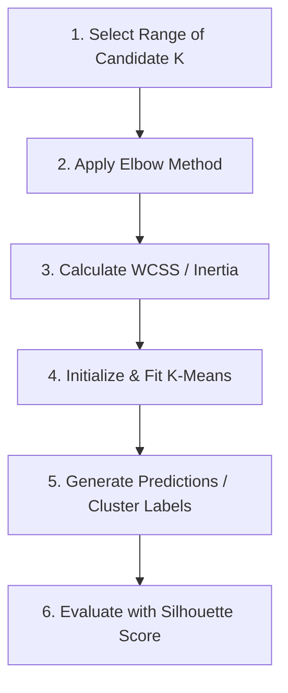
```mermaid
flowchart TD
    K[1. Select Range of Candidate K] --> Elbow[2. Apply Elbow Method]
    Elbow --> WCSS[3. Calculate WCSS / Inertia]
    WCSS --> Fit[4. Initialize & Fit K-Means]
    Fit --> Predict[5. Generate Predictions / Cluster Labels]
    Predict --> Silhouette[6. Evaluate with Silhouette Score]
```

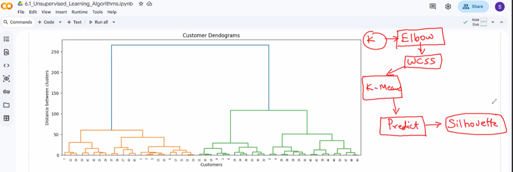

*   **Step 1 to 3 (Elbow Method / WCSS)**: Focuses on **closeness/distance**. It measures how tightly grouped the points are within each cluster. WCSS always decreases as $K$ increases, so we look for the "elbow" point where the rate of drop slows down.
*   **Step 4 to 6 (K-Means Fitting & Silhouette)**: Focuses on **separability**. After fitting the model and generating predictions (cluster labels), we calculate the Silhouette Score. A score near $+1$ validates that the clusters are distinct and do not overlap.

---

#### B. K-Medoids Clustering

> 💡 **Layman Analogy**:
> Imagine you want to select a class monitor (representative) who represents the average weight of the class. 
> *   **K-Means approach**: You calculate the average weight of the class (e.g. 57.3 kg) and declare this exact number as the center. But no actual student might weigh exactly 57.3 kg—it is a calculated virtual centroid.
> *   **K-Medoids approach**: You must select an **actual student** from the class whose weight is closest to the average. This real student is the **Medoid**.

K-Medoids is a clustering algorithm similar to K-Means, but instead of using the average (mean) vector of points as a centroid, it uses **actual data points** (medoids) as cluster centers.

##### Why use K-Medoids over K-Means?
1.  **Robustness to Outliers**: Since it uses medoids (which are actual data points) rather than means, extreme outliers do not distort the cluster center.
2.  **Custom Distance Metrics**: K-Medoids can be used with any arbitrary distance metric (e.g., Manhattan distance, Cosine similarity), whereas K-Means is mathematically tied to Euclidean distance.
3.  **Real-world representation**: The cluster center is a real data point, making it highly interpretable (e.g., in customer segmentation, the medoid represents a real customer profile).

#### C. Hierarchical Clustering

> 💡 **Layman Analogy**:
> Imagine building a family tree of animals. 
> *   **Agglomerative (Bottom-Up)**: You start with every individual animal in its own separate family of one. You search for the two most similar animals (e.g., Dog and Wolf) and merge them into a small family. Next, you merge other close families (e.g., merging Cat with Lion, or the Dog-Wolf family with Fox), constructing a tree (**Dendrogram**) upwards until all animals are united under one giant family tree.
> *   **Divisive (Top-Down)**: You start with all animals in one single giant family and recursively split them into smaller, more specific sub-groups (e.g., splitting into Vertebrates and Invertebrates, then mammals vs reptiles) until every animal is by itself.
>
> Unlike K-Means, Hierarchical Clustering does not require specifying the number of clusters in advance. It builds a hierarchical tree representation called a **Dendrogram**.

###### Approaches:
1.  **Agglomerative (Bottom-Up)**: Starts with each data point as a single cluster and successively merges the closest pairs of clusters until only one cluster remains.
2.  **Divisive (Top-Down)**: Starts with all data points in one single cluster and recursively splits clusters into smaller sub-clusters.

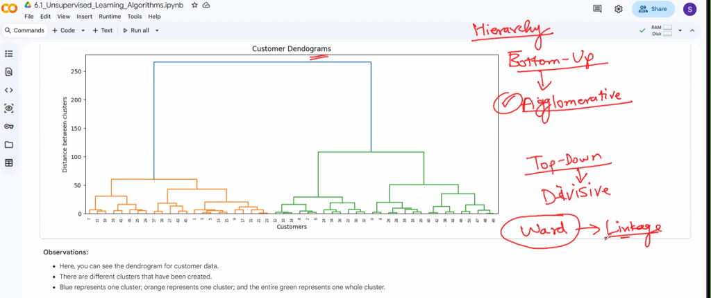

##### Linkage Criteria:
Determines how the distance between two clusters is calculated during merging/splitting:
*   **Single Linkage**: Minimum distance between any point in Cluster A and any point in Cluster B.
*   **Complete Linkage**: Maximum distance between any point in Cluster A and any point in Cluster B.
*   **Average Linkage**: Average distance between all pairs of points from Cluster A and Cluster B.
*   **Centroid Linkage**: Distance between the centroids (mean vectors) of Cluster A and Cluster B.
*   **Ward Linkage (Variance Minimization)**: The default and most robust linkage criterion in Scikit-Learn. Instead of measuring pure minimum/maximum distances, it merges clusters in a way that minimizes the **Within-Cluster Variance (sum of squared differences)**.

##### 📊 Anatomy & Interpretation of a Dendrogram
A dendrogram is a tree diagram showing the taxonomic relationships of merges.

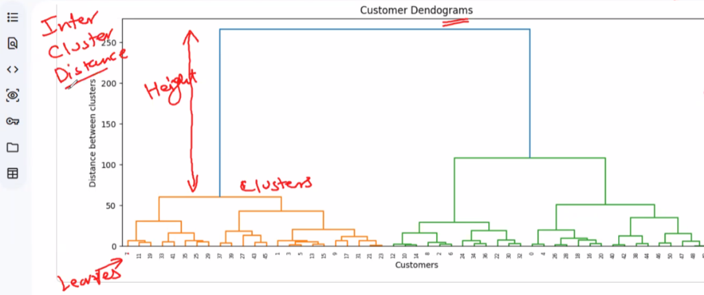

*   **Leaves (Observations)**: The individual data points at the very bottom (representing raw records/samples).
*   **Height / Inter-Cluster Distance (Y-Axis)**: The vertical axis represents the distance/height of the merges. A higher vertical line means the merged clusters were very different from each other.
*   **Clusters (Horizontal Links)**: The horizontal brackets showing which groups were merged at that height.
*   **Determining Optimal Clusters**: Identify the longest vertical line in the dendrogram that does not cross any horizontal merge lines. Drawing a horizontal line through this section determines the optimal number of clusters.

#### D. DBSCAN (Density-Based Spatial Clustering of Applications with Noise)

> 💡 **Layman Analogy**:
> Imagine you are a security analyst mapping out crowds in a busy airport terminal:
> 1.  **Core Points (The Center of the Crowd)**: People standing close together in dense groups of at least `min_samples` individuals within arm's reach (`eps` radius).
> 2.  **Border Points (The Edges of the Crowd)**: People standing on the fringe of a group. They are close enough to be considered part of the crowd, but they don't have enough people directly around them to form a new group themselves.
> 3.  **Noise Points (The Loners)**: A traveler sitting completely alone in a far corner, far away from any crowd. They are classified as outliers/noise.
> 
> Unlike K-Means, DBSCAN doesn't need you to guess how many crowds exist beforehand. It simply follows the dense paths of the crowds and automatically isolates the isolated loners.
>
> **The Core Concepts:**
> A density-based clustering algorithm that groups points together that are close to each other, while identifying outliers (noise points).
> 
> ##### Key Parameters:
> *   `eps` ($\epsilon$): The maximum distance (radius) within which to search for neighboring points.
> *   `min_samples`: The minimum number of points required within the `eps` radius to form a dense region.

##### Core Point Classification:
1.  **Core Point**: Has $\ge \text{min\_samples}$ within its `eps` radius.
2.  **Border Point**: Has fewer than `min\_samples` within its `eps` radius but is reachable from a Core Point.
3.  **Noise Point (Outlier)**: Neither a Core nor a Border point.

##### Advantages:
*   Does not require specifying the number of clusters beforehand.
*   Can find clusters of arbitrary, non-linear shapes (unlike K-Means).
*   Robust to outliers and noise.

#### E. Comparison of Different Clustering Algorithms
To select the best clustering algorithm for a specific dataset, we analyze their behavior across different shapes (concentric rings, moons, dense groups, varying densities, etc.).

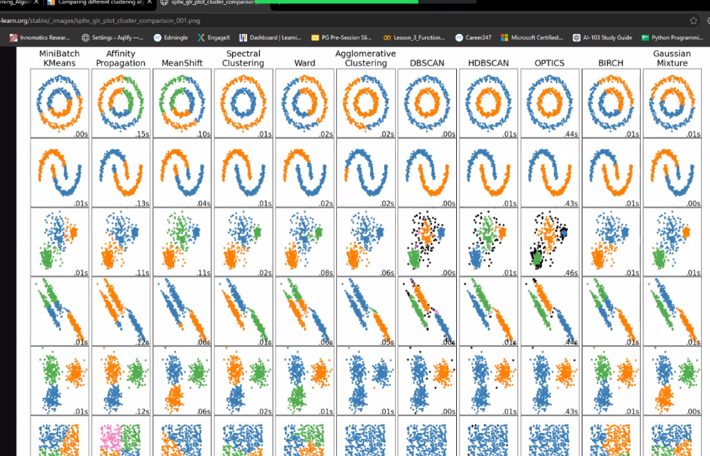

##### 1. MiniBatch KMeans / KMeans
*   **Logical Behavior**: Partitions data by minimizing the variance of points to centroids (spherical assumption).
*   **Result**: Fails completely on concentric circles and interlocking moons, splitting them radially into blocks. Highly sensitive to outliers.

##### 2. Affinity Propagation
*   **Logical Behavior**: Selects "exemplars" by sending real-valued messages of responsibility and availability between data points.
*   **Result**: Does not require pre-specifying $K$, but over-segments nested circles and moons into too many small, non-linear blocks based on similarity parameters.

##### 3. MeanShift
*   **Logical Behavior**: A non-parametric density-based method that finds centroids by shifting points toward local maxima of density.
*   **Result**: Fails on moons and concentric circles, dividing them into radial sections due to its reliance on a spherical kernel window.

##### 4. Spectral Clustering
*   **Logical Behavior**: Projects the data graph using Laplacian eigenvalues (dimensionality reduction) before running K-Means.
*   **Result**: Highly effective at identifying complex, non-spherical structures (like concentric circles and moons). Computational cost is very high ($O(N^3)$), making it unusable for massive datasets.

##### 5. Ward / Agglomerative Clustering
*   **Logical Behavior**: Hierarchical bottom-up merging minimizing within-cluster variance.
*   **Result**: Fails on non-linear moons and nested rings, dividing them into block-like segments, but performs exceptionally well on standard dense Gaussian blobs.

##### 6. DBSCAN
*   **Logical Behavior**: Follows dense continuous paths within an $\epsilon$-radius and tags low-density isolated points as noise/outliers.
*   **Result**: Perfect at identifying concentric circles and moons, isolating outliers cleanly (black points). Fails to cluster correctly when datasets have varying density zones.

##### 7. HDBSCAN
*   **Logical Behavior**: Extends DBSCAN by calculating cluster stability across a range of variable epsilon values.
*   **Result**: Outperforms DBSCAN on real-world datasets because it natively handles clusters of varying densities and noise without requiring a single global `eps` parameter.

##### 8. OPTICS
*   **Logical Behavior**: Identifies clustering structures by sorting points sequentially based on reachability distance.
*   **Result**: Similar to DBSCAN but handles varying density regions much better. Computationally slower due to ordering calculations.

##### 9. BIRCH
*   **Logical Behavior**: Generates a tree structure of clustering feature nodes to handle extremely large datasets.
*   **Result**: Very fast and memory-efficient, but restricted to spherical shapes. Fails on non-linear structures like nested rings and moons.

##### 10. Gaussian Mixture Models (GMM)
*   **Logical Behavior**: Probabilistic model assuming data is generated from a mixture of several Gaussian distributions with unknown parameters.
*   **Result**: Extremely flexible; can handle elongated, elliptical clusters (unlike K-Means). However, fails on highly curved, non-elliptical shapes (nested rings/moons).

---

### 3.2 Dimensionality Reduction Techniques

#### A. Feature Selection vs Feature Extraction
*   **Feature Selection**: Selecting a subset of original features without modifying them (e.g., SelectKBest, VarianceThreshold).
*   **Feature Extraction**: Transforming original features into a new, lower-dimensional space (e.g., PCA, LDA).

#### B. Principal Component Analysis (PCA)
An unsupervised linear transformation technique that projects data into a lower-dimensional space while maximizing variance.

##### Mathematical Steps:
1.  **Standardization**: Scale the features to have a mean of 0 and variance of 1.
2.  **Covariance Matrix**: Compute the covariance matrix $\mathbf{\Sigma}$ to capture linear dependencies between feature pairs:
    $$\mathbf{\Sigma} = \frac{1}{n-1}\mathbf{X}^T\mathbf{X}$$
3.  **Eigenvalue Decomposition**: Solve for eigenvalues ($\lambda$) and eigenvectors ($\mathbf{v}$) of the covariance matrix:
    $$\mathbf{\Sigma}\mathbf{v} = \lambda\mathbf{v}$$
4.  **Selecting Principal Components**: Sort eigenvalues in descending order. Select the top $k$ eigenvectors corresponding to the largest eigenvalues to form the projection matrix $\mathbf{W}$.
5.  **Recasting Data**: Project original data $\mathbf{X}$ into the new space:
    $$\mathbf{X}_{\text{new}} = \mathbf{X}\mathbf{W}$$

#### C. Linear Discriminant Analysis (LDA)
A supervised dimensionality reduction method that projects features to maximize class separability.
*   **Objective**: Maximize between-class variance ($S_B$) while minimizing within-class variance ($S_W$).

##### 🔍 PCA vs. LDA: The Core Differences (in Simple Language)

To understand when to use PCA vs. LDA, we look at their mathematical objectives and how they handle class labels:

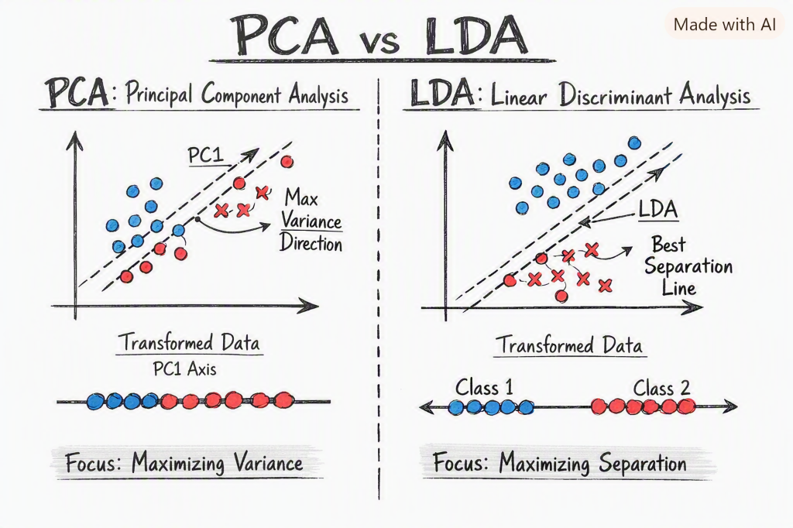

*   **Principal Component Analysis (PCA) — Unsupervised**:
    *   **How it works**: PCA does not care about target class labels ($y$). It looks at the entire dataset as one single group and finds the direction of **maximum variance** (where the data spreads out the most, labeled PC1).
    *   **Simple Analogy**: Imagine you are taking a photo of a large crowd of people. You want to adjust your camera angle to capture the maximum spread/width of the crowd so that everyone is visible in the frame, regardless of which group or family they belong to.
    *   **Output**: Projects the data to preserve raw features' information, but different classes (e.g., red and blue points) might end up completely mixed together along the new axis.
*   **Linear Discriminant Analysis (LDA) — Supervised**:
    *   **How it works**: LDA actively uses target class labels ($y$). It projects the data onto a new axis that **maximizes separation** between different classes (increasing the distance between class means) while **minimizing variance** within each individual class (keeping same-class points grouped tightly together).
    *   **Simple Analogy**: Imagine you are an airport security officer and need to separate domestic travelers from international travelers. You draw a dividing line on the floor that maximizes the gap (separation) between the two groups, making it extremely clear who belongs to which group.
    *   **Output**: Projects the data in a way that separates different classes as cleanly as possible along the new axis.

| Aspect | PCA (Principal Component Analysis) | LDA (Linear Discriminant Analysis) | t-SNE (t-Distributed Stochastic Neighbor Embedding) |
| :--- | :--- | :--- | :--- |
| **Learning Type** | **Unsupervised** (does not use target labels $y$). | **Supervised** (requires target labels $y$). | **Unsupervised** (does not use target labels $y$). |
| **Linearity** | **Linear** transformation. | **Linear** transformation. | **Non-Linear** transformation. |
| **Primary Goal** | **Maximize variance/information representation**. | **Maximize class separability** (distinct boundaries). | **Preserve local neighborhood structure** (neighbors stay close). |
| **Focus** | Finds directions of maximum spread in the features. | Finds directions that maximize the distance between groups. | Maps relationships to conditional probabilities to visualize clusters in 2D/3D. |
| **Main Use Case** | Feature engineering, dimensionality reduction, noise reduction. | Pre-classification feature projection. | **Data visualization only** (exploring structures/clusters). |
| **Limitations** | May mix different classes together when projecting. | Cannot be used when target labels are unavailable. | Very slow computationally; has no `transform()` function for test data. |

---

#### D. t-SNE (t-Distributed Stochastic Neighbor Embedding)

> 💡 **Layman Analogy**:
> Imagine you are trying to flatten a spherical 3D globe of the earth onto a flat 2D sheet of paper:
> *   You want to make sure that cities that are very close to each other in 3D (like Ahmedabad and Gandhinagar) stay right next to each other on the 2D paper.
> *   To keep these close neighbors together, you are willing to let far-away distances (like Ahmedabad to New York) get slightly stretched or warped.
> *   t-SNE does exactly this: it ignores far-away distances and focuses heavily on keeping **close neighbors clustered together**.

t-SNE is a non-linear, unsupervised dimensionality reduction technique primarily used for **2D/3D visualization** of high-dimensional datasets.

##### How it works:
1.  **High-Dimensional Space**: Computes probability distributions over pairs of high-dimensional objects in such a way that similar objects have a high probability of being chosen, while dissimilar points have an infinitesimal probability.
2.  **Low-Dimensional Space**: Defines a similar probability distribution over the points in the low-dimensional map, using a **Student-t distribution** (which has heavier tails than a Gaussian distribution to solve the *crowding problem*, preventing points from collapsing into a single cluster).
3.  **Optimization**: Minimizes the difference between these two probability distributions (using Kullback-Leibler divergence via gradient descent).

##### Key Characteristics:
*   **Non-Linear**: Can capture complex, manifold structures (e.g., Swiss rolls or concentric circles) that linear methods like PCA or LDA fail to project properly.
*   **No Projection Formula**: Unlike PCA, t-SNE does not output a transformation matrix or projection equation. Therefore, you **cannot** use it to transform new out-of-sample data points (there is no `transform()` method for test data in Scikit-Learn; you must run `fit_transform()` on the entire dataset).
*   **Purely for Visualization**: Due to its non-linear warping of global distances and high computational complexity, it is used for visual exploratory analysis rather than as a preprocessing step for model features.

---

---

### 3.3 Association Rule Learning

Used to discover interesting relationships (rules) between variables in large databases (e.g., Market Basket Analysis).

#### A. Key Metrics
*   **Support**: The probability of a transaction containing items $A$ and $B$:
    $$\text{Support}(A \rightarrow B) = P(A \cap B) = \frac{\text{Transactions containing } A \text{ and } B}{\text{Total Transactions}}$$
*   **Confidence**: The conditional probability of buying $B$ given $A$ was bought:
    $$\text{Confidence}(A \rightarrow B) = P(B | A) = \frac{\text{Transactions containing } A \text{ and } B}{\text{Transactions containing } A}$$
*   **Lift**: Measures the strength of the rule compared to random chance:
    $$\text{Lift}(A \rightarrow B) = \frac{P(A \cap B)}{P(A)P(B)} = \frac{\text{Confidence}(A \rightarrow B)}{\text{Support}(B)}$$
    *   $\text{Lift} > 1$: Strong positive relationship.
    *   $\text{Lift} = 1$: Independence.
    *   $\text{Lift} < 1$: Negative relationship (substitute goods).

#### B. Algorithms
*   **Apriori Algorithm**: Uses a bottom-up approach where frequent subsets are extended one at a time. Employs the *Apriori property*: any subset of a frequent itemset must also be frequent.
*   **Eclat Algorithm**: Equivalence Class Transformation. Uses a depth-first search approach on a vertical data layout (lists of transaction IDs containing each item) to quickly count support.

---

### 3.4 Anomaly Detection Techniques

#### Isolation Forest
An unsupervised anomaly detection algorithm that isolates anomalies rather than profiling normal data points.
*   **Mechanism**: Builds an ensemble of isolation trees (randomly partitioning features). Because anomalies have unusual feature values, they require fewer random splits to isolate and appear much closer to the root of the tree (shorter average path lengths).

---

### 3.5 Semi-Supervised Learning

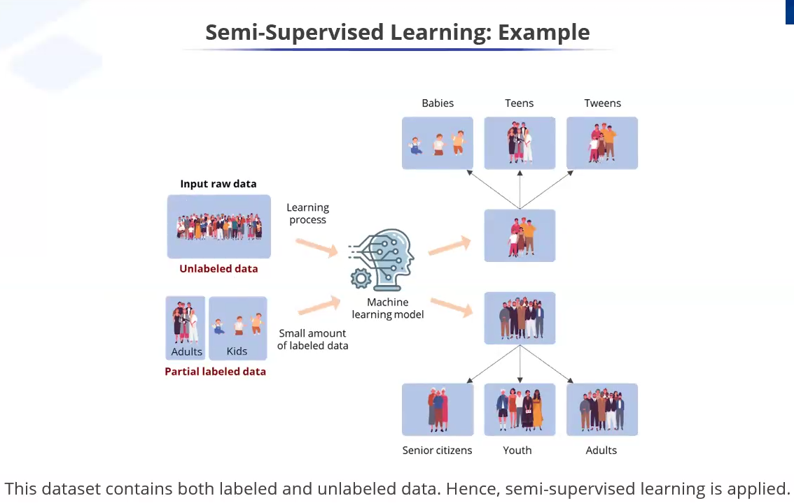

> **Key Concept**: Semi-Supervised Learning combines a **small amount of labeled data** with a **large volume of unlabeled raw data**. The machine learning model uses the labeled points as anchors and leverages the structural distribution of the unlabeled data to infer labels across fine-grained target categories (e.g. Babies, Teens, Tweens, Adults, Youth, Senior citizens).

* **When to Use**: When acquiring target labels is extremely expensive, time-consuming, or requires domain expertise (e.g. medical image annotation, genome sequencing), but large amounts of raw unlabeled data are readily available.
* **Common Techniques**: Pseudo-Labeling, Label Propagation, Self-Training, Semi-Supervised VAEs / GANs.

---

## 4. Recommendation Systems

Recommendation Systems predict the rating or preference a user would give to an item.

### 4.1 Collaborative Filtering
Recommends items based on user-item interaction histories.

#### A. Memory-Based Collaborative Filtering
Calculates similarity between users or items directly from the interaction matrix:
*   **User-Based Collaborative Filtering**: Recommends items liked by users who are similar to the target user. Cosine Similarity between user vectors $u$ and $v$:
    $$\text{Sim}(u, v) = \frac{\mathbf{r}_u \cdot \mathbf{r}_v}{\|\mathbf{r}_u\| \|\mathbf{r}_v\|} = \frac{\sum_i r_{u,i} r_{v,i}}{\sqrt{\sum_i r_{u,i}^2} \sqrt{\sum_i r_{v,i}^2}}$$
*   **Item-Based Collaborative Filtering**: Recommends items similar to those the target user has interacted with in the past. Calculates similarity between item rating vectors.

#### B. Model-Based Collaborative Filtering
Learns underlying mathematical patterns (latent factors) to predict missing ratings.
*   **Matrix Factorization**: Decomposes the user-item rating matrix $\mathbf{R} \in \mathbb{R}^{M \times N}$ into two lower-rank matrices: user latent factors $\mathbf{P} \in \mathbb{R}^{M \times K}$ and item latent factors $\mathbf{Q} \in \mathbb{R}^{K \times N}$ such that:
    $$\mathbf{R} \approx \mathbf{P} \times \mathbf{Q}$$
*   **Singular Value Decomposition (SVD)**: Decomposes the rating matrix $\mathbf{R}$ into three matrices:
    $$\mathbf{R} \approx \mathbf{U} \mathbf{\Sigma} \mathbf{V}^T$$
    *   $\mathbf{U}$: User-to-latent-factor association.
    *   $\mathbf{\Sigma}$: Singular values indicating factor importance.
    *   $\mathbf{V}^T$: Item-to-latent-factor association.

---

### 4.2 Content-Based Filtering
Recommends items similar to those a user liked in the past based on item descriptors (features) and user preferences:
*   Uses **Cosine Similarity** between the **User Profile Vector** (aggregated vector of features of items the user liked) and **Item Feature Vectors** (TF-IDF keyword vectors, genre tags).

---

### 4.3 Hybrid Filtering
Combines collaborative and content-based filtering strategies to leverage the advantages of both and overcome individual limitations (e.g., blending scores linearly or using meta-classifiers).

---

### 4.4 Metrics & Evaluation
*   **GetTopN**: Extracts the top $N$ items with the highest predicted scores for a user.
*   **Hit Rate**: Evaluates whether the top $N$ recommendations contain at least one item that the user actually interacted with/liked:
    $$\text{Hit Rate} = \frac{\text{Number of Hits}}{\text{Total Users Evaluated}}$$

---

### 4.5 Challenges in Recommenders
*   **Cold Start Problem**:
    *   *User Cold Start*: Unable to recommend items to new users because they have no interaction history.
    *   *Item Cold Start*: New items have no user ratings/interactions, so they are not recommended.
    *   *Mitigation*: Ask for initial user preferences during onboarding, use popular items as fallbacks, or rely on content-based filtering until enough data is collected.
*   **Feedback Types**:
    *   *Explicit Feedback*: Direct actions indicating preference (ratings, reviews, likes).
    *   *Implicit Feedback*: Indirect behavioral signals (page views, clicks, purchase history, dwell time).

---

## 5. Feature Engineering & Data Preprocessing

* **Scaling Techniques**:
  * **Standardization (Z-Score)**: $x' = \frac{x - \mu}{\sigma}$ (Mean = 0, Std = 1)
  * **Min-Max Scaling**: $x' = \frac{x - x_{min}}{x_{max} - x_{min}}$ (Bounds $[0, 1]$)
* **Categorical Encoding**:
  * **One-Hot Encoding**: For nominal categories without ordinal relationship.
  * **Ordinal Encoding**: For categories with inherent order (e.g., Low, Medium, High).

---

## 6. Model Evaluation & Validation

### Classification Metrics
| Metric | Formula | Interpretation |
| :--- | :--- | :--- |
| **Accuracy** | $\frac{TP + TN}{TP + TN + FP + FN}$ | Overall proportion of correct predictions. |
| **Precision** | $\frac{TP}{TP + FP}$ | Out of all predicted positives, how many were truly positive? (Low FP focus) |
| **Recall (Sensitivity)** | $\frac{TP}{TP + FN}$ | Out of all actual positives, how many did we catch? (Low FN focus) |
| **F1-Score** | $2 \cdot \frac{\text{Precision} \cdot \text{Recall}}{\text{Precision} + \text{Recall}}$ | Harmonic mean of Precision and Recall. |

---

## 7. Bias-Variance Tradeoff & Regularization

* **High Bias (Underfitting)**: Model is too simple, fails to capture underlying patterns.
* **High Variance (Overfitting)**: Model is too complex, fits noise in training data.
* **Regularization Techniques**:
  * **L1 Regularization (Lasso)**: Adds $\lambda \sum |\theta_j|$ penalty. Promotes sparsity (feature selection).
  * **L2 Regularization (Ridge)**: Adds $\lambda \sum \theta_j^2$ penalty. Shrinks coefficients towards zero.

---

## 8. Ensemble Techniques

Ensemble methods combine multiple base models (weak learners) to construct a superior predictive model (strong learner).

### 📂 Ensemble Taxonomy Hierarchy
Below is the structural map of Ensemble Methods, classifying them into **Parallel (Bagging)** and **Sequential (Boosting)** workflows, their base estimators, and execution relative speeds:

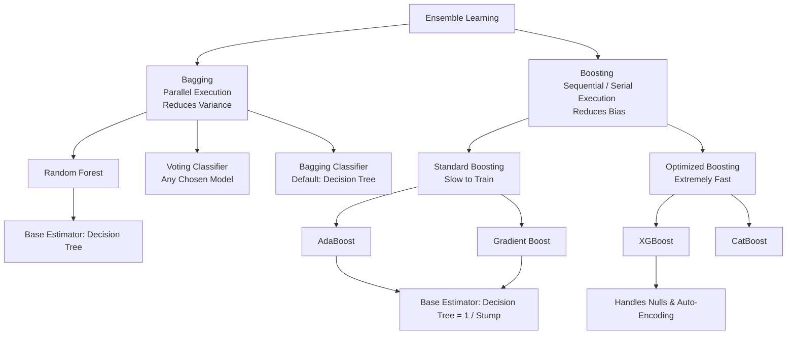
```mermaid
graph TD
    Ensemble[Ensemble Learning] --> Bagging[Bagging <br/> Parallel Execution <br/> Reduces Variance]
    Ensemble --> Boosting[Boosting <br/> Sequential / Serial Execution <br/> Reduces Bias]

    Bagging --> RF[Random Forest]
    Bagging --> VC[Voting Classifier <br/> Any Chosen Model]
    Bagging --> BC[Bagging Classifier <br/> Default: Decision Tree]

    RF --> RF_DT[Base Estimator: Decision Tree]

    Boosting --> Slow[Standard Boosting <br/> Slow to Train]
    Boosting --> Fast[Optimized Boosting <br/> Extremely Fast]

    Slow --> Ada[AdaBoost]
    Slow --> GBM[Gradient Boost]
    Ada & GBM --> Stump[Base Estimator: Decision Tree = 1 / Stump]

    Fast --> XGB[XGBoost]
    Fast --> Cat[CatBoost]
    XGB --> XGB_Features[Handles Nulls & Auto-Encoding]
```

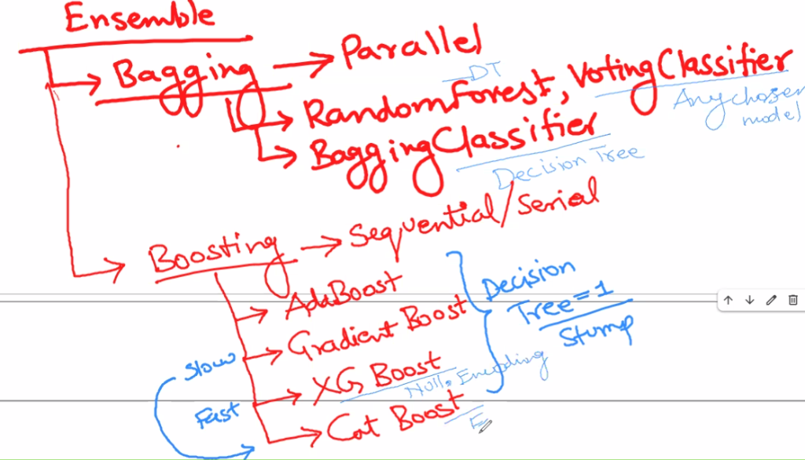

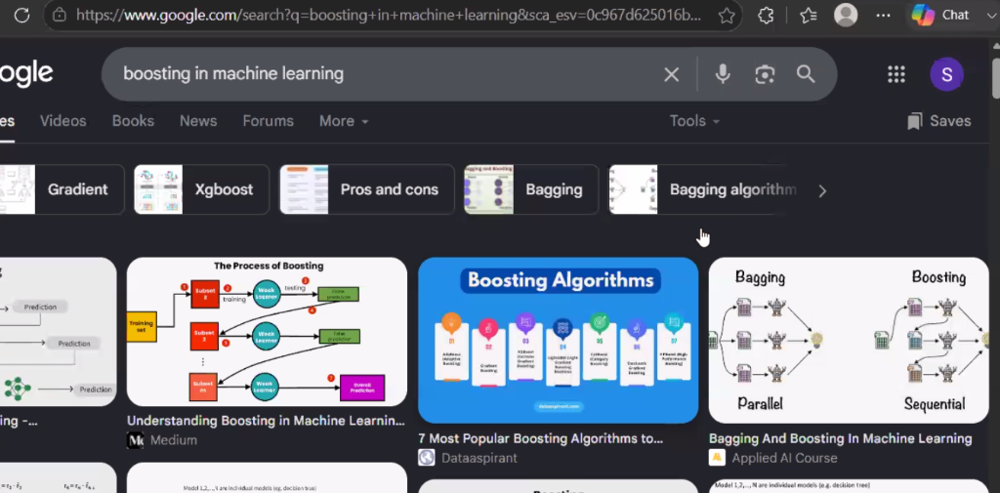

---

### 8.1 Bagging (Bootstrap Aggregating) — **Parallel Execution**
Bagging reduces the model's **variance** (overfitting) by training multiple estimators **independently and in parallel** on bootstrapped subsets of the training data.

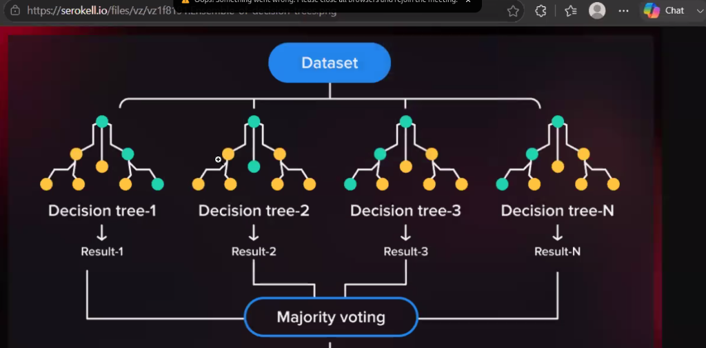

#### Random Forest
*   **Mechanism**: A bagging ensemble of Decision Trees. Randomness is injected in two ways:
    1.  **Row Bootstrap**: Each tree is trained on a random sample of the training data with replacement.
    2.  **Feature Subsets**: At each split, only a random subset of features is considered (typically $\sqrt{P}$ features, where $P$ is total features).
*   **Result**: Averaging predictions (by majority voting for classification, or averaging for regression) cancels out individual tree errors, preventing overfitting.

```python
from sklearn.ensemble import RandomForestClassifier
rf = RandomForestClassifier(n_estimators=100, max_features='sqrt', random_state=42)
# rf.fit(X_train, y_train)
```

---

### 8.2 Boosting — **Sequential Execution**
Boosting reduces the model's **bias** (underfitting) by training models **sequentially (in series)**. Each subsequent model is trained to predict the mistakes (errors/residuals) made by previous models, functioning as a feedback loop.

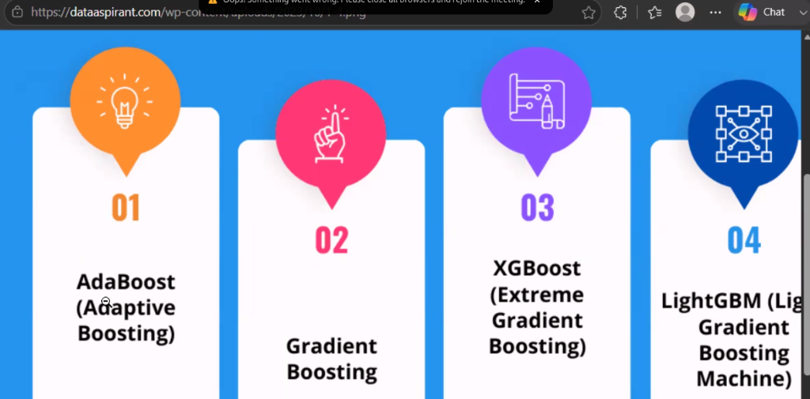

#### AdaBoost (Adaptive Boosting)
*   **Mechanism**: Adjusts weights of samples. Data points misclassified by the previous estimator are given higher weights, forcing the next estimator to focus on these harder cases.

#### Gradient Boosting Machine (GBM)
*   **Mechanism**: Instead of adjusting weights, GBM trains new models to fit the **residuals** (actual - predicted values) of the previous model using a gradient descent approach on a specified loss function.

#### XGBoost (Extreme Gradient Boosting)
*   **Mechanism**: An advanced, highly optimized GBDT algorithm that features:
    *   **Regularization**: L1 and L2 regularization to control model complexity and prevent overfitting.
    *   **Parallel Processing**: Fast execution by scanning features in parallel to determine the best splits.
    *   **Handling Missing Values**: Learns a default direction for missing values.

```python
import xgboost as xgb
xgb_model = xgb.XGBClassifier(n_estimators=100, learning_rate=0.1, max_depth=5, random_state=42)
# xgb_model.fit(X_train, y_train)
```

---

## 9. Practical Machine Learning Workflow

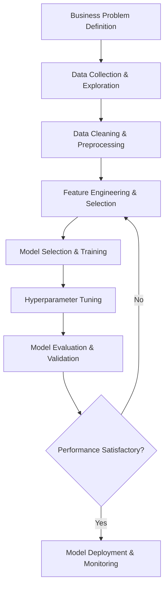
```mermaid
flowchart TD
    A[Business Problem Definition] --> B[Data Collection & Exploration]
    B --> C[Data Cleaning & Preprocessing]
    C --> D[Feature Engineering & Selection]
    D --> E[Model Selection & Training]
    E --> F[Hyperparameter Tuning]
    F --> G[Model Evaluation & Validation]
    G --> H{Performance Satisfactory?}
    H -- No --> D
    H -- Yes --> I[Model Deployment & Monitoring]
```

---

## 10. Code Snippets & Cheatsheets

### Python Baseline Model Template
```python
import numpy as np
import pandas as pd
from sklearn.model_selection import train_test_split
from sklearn.preprocessing import StandardScaler
from sklearn.ensemble import RandomForestClassifier
from sklearn.metrics import classification_report, roc_auc_score

# 1. Load Data
# df = pd.read_csv("data.csv")

# 2. Split Features & Target
# X = df.drop(columns=["target"])
# y = df["target"]

# 3. Train-Test Split
# X_train, X_test, y_train, y_test = train_test_split(X, y, test_size=0.2, random_state=42, stratify=y)

# 4. Preprocessing & Modeling Pipeline
# scaler = StandardScaler()
# X_train_scaled = scaler.fit_transform(X_train)
# X_test_scaled = scaler.transform(X_test)

# model = RandomForestClassifier(n_estimators=100, random_state=42)
# model.fit(X_train_scaled, y_train)

# 5. Evaluation
# y_pred = model.predict(X_test_scaled)
# print(classification_report(y_test, y_pred))
```

---

## 11. Reference Links & External Learning Resources

| Resource Name | Website URL | Description & Key Focus |
| :--- | :--- | :--- |
| **Deep Learning with Python** | [deeplearningwithpython.io](https://deeplearningwithpython.io) | Official website for François Chollet's foundational book on deep learning concepts, representation transformations, and Keras practices. |
| **Scikit-learn** | [scikit-learn.org](https://scikit-learn.org) | Official documentation, tutorials, user guides, and API specifications for classical Machine Learning algorithms in Python. |
| **Scikit-Learn Clustering Comparison** | [sklearn.org/clustering](https://scikit-learn.org/stable/auto_examples/cluster/plot_cluster_comparison.html) | Comparison of different clustering algorithms on toy 2D datasets, illustrating their shapes, boundaries, and speeds. |
| **Scikit-Learn Clustering Comparison Image** | [sklearn.org/images](https://scikit-learn.org/stable/_images/sphx_glr_plot_cluster_comparison_001.png) | Visual plot showing spatial outputs of MiniBatchKMeans, DBSCAN, OPTICS, and GMM on concentric rings and moon shapes. |
| **TensorFlow** | [tensorflow.org](https://www.tensorflow.org) | Google's official platform, tutorials, API docs, and deployment ecosystem (TF Lite, TF Serving, Keras) for deep learning. |
| **PyTorch** | [pytorch.org](https://pytorch.org) | Meta / PyTorch Foundation official documentation, tutorials, PyTorch Hub, dynamic graph autograd reference, and deep learning framework ecosystem. |
| **Keras API** | [keras.io](https://keras.io) | Official portal for Keras 3 multi-backend deep learning API supporting TensorFlow, PyTorch, and JAX. |
| **SciPy Scientific Computing** | [scipy.org](https://scipy.org) | Official portal for scientific computing, numerical optimization, integration, and statistics in Python. |
| **DeepLearning.AI** | [deeplearning.ai](https://www.deeplearning.ai) | Andrew Ng's education platform featuring comprehensive courses on ML fundamentals, Deep Learning specialization, and LLMs. |
| **Hugging Face Hub & Docs** | [huggingface.co](https://huggingface.co) | Open-source platform for pre-trained Transformers, LLMs, datasets, and model evaluations. |
| **UCI Pima Indians Diabetes Dataset** | [UCI Archive](https://archive.ics.uci.edu/datasets/?search=pima+dataset) | Classic baseline binary classification dataset for training ML models to predict diabetes. |
| **Vecstack Package** | [vecstack PyPI](https://pypi.org/project/vecstack/) | A Python library for Stacking (Stacked Generalization) that enables stacking ensemble modeling in Scikit-Learn. |

---

*(This document is set up as your central Machine Learning reference notebook. Future notes, algorithms, math proofs, and code examples will be continuously updated here!)*
