# 🤖 Machine Learning: Complete Master Guide & Project Reference

Welcome to the **Complete Master Guide for Machine Learning** (`4.IHFC AIML: Machine Learning`). This document serves as an exhaustive, dual-perspective reference for both **Technical Engineers / Data Scientists** (mathematical equations, scikit-learn code snippets, optimization metrics, algorithm internals) and **Non-Technical Business Stakeholders** (layman real-world analogies, intuitive business rules, strategic decision-making frameworks).

This guide synthesizes all 7 course lessons, instructor slides, Jupyter notebooks, knowledge checks, and 4 incremental capstone projects into a single unified master blueprint.

---

## 📂 Master Table of Contents

- [🤖 Machine Learning: Complete Master Guide \& Project Reference](#-machine-learning-complete-master-guide--project-reference)
  - [📂 Master Table of Contents](#-master-table-of-contents)
  - [0. Master Industry Terminology \& Glossary](#0-master-industry-terminology--glossary)
  - [1. Course Overview \& Machine Learning Fundamentals (Lessons 1 \& 2)](#1-course-overview--machine-learning-fundamentals-lessons-1--2)
    - [1.1 What is Machine Learning?](#11-what-is-machine-learning)
    - [1.2 Classical Programming vs. Machine Learning Paradigm](#12-classical-programming-vs-machine-learning-paradigm)
    - [1.3 Traditional Machine Learning vs. Deep Learning (Andrew Ng Scale Law)](#13-traditional-machine-learning-vs-deep-learning-andrew-ng-scale-law)
    - [1.4 AI vs. ML vs. Deep Learning Hierarchy](#14-ai-vs-ml-vs-deep-learning-hierarchy)
    - [1.5 Standard 6-Step Machine Learning Execution Blueprint](#15-standard-6-step-machine-learning-execution-blueprint)
  - [2. Lesson 3 — Supervised Learning: Regression \& Applications](#2-lesson-3--supervised-learning-regression--applications)
    - [2.1 Technical \& Layman Definition of Regression](#21-technical--layman-definition-of-regression)
    - [2.2 Simple \& Multiple Linear Regression (OLS)](#22-simple--multiple-linear-regression-ols)
    - [2.3 Evaluation Metrics for Regression](#23-evaluation-metrics-for-regression)
    - [2.4 Multicollinearity \& Variance Inflation Factor (VIF)](#24-multicollinearity--variance-inflation-factor-vif)
    - [2.5 Regularization Techniques (Ridge, Lasso, Polynomial)](#25-regularization-techniques-ridge-lasso-polynomial)
    - [2.6 Notebook \& Dataset Summary (Lesson 3)](#26-notebook--dataset-summary-lesson-3)
  - [3. Lesson 4 — Supervised Learning: Classification \& Applications](#3-lesson-4--supervised-learning-classification--applications)
    - [3.1 Technical \& Layman Definition of Classification](#31-technical--layman-definition-of-classification)
    - [3.2 Logistic Regression \& Sigmoid Activation](#32-logistic-regression--sigmoid-activation)
    - [3.3 Naive Bayes Classifier (Bayesian Probability)](#33-naive-bayes-classifier-bayesian-probability)
    - [3.4 K-Nearest Neighbors (KNN Classifier)](#34-k-nearest-neighbors-knn-classifier)
    - [3.5 Decision Trees (Entropy \& Gini Impurity)](#35-decision-trees-entropy--gini-impurity)
    - [3.6 Support Vector Machines (SVM \& Kernel Trick)](#36-support-vector-machines-svm--kernel-trick)
    - [3.7 Classification Performance Metrics (Confusion Matrix \& ROC-AUC)](#37-classification-performance-metrics-confusion-matrix--roc-auc)
    - [3.8 Handling Imbalanced Datasets (SMOTE \& Resampling)](#38-handling-imbalanced-datasets-smote--resampling)
    - [3.9 Notebook \& Dataset Summary (Lesson 4)](#39-notebook--dataset-summary-lesson-4)
  - [4. Model Generalization, Bias-Variance Tradeoff \& Regularization](#4-model-generalization-bias-variance-tradeoff--regularization)
    - [4.1 Bias-Variance Tradeoff Decomposition](#41-bias-variance-tradeoff-decomposition)
    - [4.2 Cross-Validation \& Hyperparameter Tuning](#42-cross-validation--hyperparameter-tuning)
  - [5. Lesson 5 — Ensemble Learning](#5-lesson-5--ensemble-learning)
    - [5.1 Technical \& Layman Definition of Ensemble Learning](#51-technical--layman-definition-of-ensemble-learning)
    - [5.2 Sequential vs. Parallel Ensemble Architectures](#52-sequential-vs-parallel-ensemble-architectures)
    - [5.3 Bagging (Bootstrap Aggregation) \& Random Forests](#53-bagging-bootstrap-aggregation--random-forests)
    - [5.4 Boosting Algorithms (AdaBoost, Gradient Boosting, XGBoost)](#54-boosting-algorithms-adaboost-gradient-boosting-xgboost)
    - [5.5 Simple Voting, Stacking, and Blending Ensembles](#55-simple-voting-stacking-and-blending-ensembles)
    - [5.6 Notebook \& Dataset Summary (Lesson 5)](#56-notebook--dataset-summary-lesson-5)
  - [6. Lesson 6 — Unsupervised Learning Algorithms](#6-lesson-6--unsupervised-learning-algorithms)
    - [6.1 Technical \& Layman Definition of Unsupervised Learning](#61-technical--layman-definition-of-unsupervised-learning)
    - [6.2 Clustering Techniques (K-Means \& Hierarchical)](#62-clustering-techniques-k-means--hierarchical)
    - [6.3 Dimensionality Reduction Techniques (PCA, ICA, t-SNE)](#63-dimensionality-reduction-techniques-pca-ica-t-sne)
    - [6.4 Association Rule Mining (Market Basket Analysis \& Apriori)](#64-association-rule-mining-market-basket-analysis--apriori)
    - [6.5 Notebook \& Dataset Summary (Lesson 6)](#65-notebook--dataset-summary-lesson-6)
  - [7. Lesson 7 — Recommendation Systems](#7-lesson-7--recommendation-systems)
    - [7.1 Technical \& Layman Definition of Recommender Systems](#71-technical--layman-definition-of-recommender-systems)
    - [7.2 Collaborative Filtering (User-Based vs. Item-Based)](#72-collaborative-filtering-user-based-vs-item-based)
    - [7.3 Model-Based Collaborative Filtering (SVD \& NMF Matrix Factorization)](#73-model-based-collaborative-filtering-svd--nmf-matrix-factorization)
    - [7.4 Content-Based Filtering \& Hybrid Systems](#74-content-based-filtering--hybrid-systems)
    - [7.5 Notebook \& Dataset Summary (Lesson 7)](#75-notebook--dataset-summary-lesson-7)
  - [8. Incremental Capstone Projects Breakdown (Aura Analytics Platform)](#8-incremental-capstone-projects-breakdown-aura-analytics-platform)
    - [8.1 Capstone Session 5 — Bike-Sharing Demand Forecasting (Regression)](#81-capstone-session-5--bike-sharing-demand-forecasting-regression)
    - [8.2 Capstone Session 6 — Adult Census Income Classification (Imbalanced Classification)](#82-capstone-session-6--adult-census-income-classification-imbalanced-classification)
    - [8.3 Capstone Session 7 — Credit Card User Customer Segmentation (PCA + K-Means)](#83-capstone-session-7--credit-card-user-customer-segmentation-pca--k-means)
    - [8.4 Capstone Session 8 — Movie Recommendation Engine (Pearson CF \& Surprise SVD/NMF)](#84-capstone-session-8--movie-recommendation-engine-pearson-cf--surprise-svdnmf)
  - [9. Production Python Code Templates \& End-to-End Workflows](#9-production-python-code-templates--end-to-end-workflows)
    - [9.1 Complete Regression Pipeline](#91-complete-regression-pipeline)
    - [9.2 Complete Imbalanced Classification Pipeline (with SMOTE)](#92-complete-imbalanced-classification-pipeline-with-smote)
    - [9.3 Complete Clustering \& PCA Pipeline](#93-complete-clustering--pca-pipeline)
    - [9.4 Complete Recommendation System Pipeline](#94-complete-recommendation-system-pipeline)
  - [10. Reference Links, Papers, Documentation \& Learning Resources](#10-reference-links-papers-documentation--learning-resources)

---

## 0. Master Industry Terminology & Glossary

| Term | Technical Definition | Layman Analogy / Non-Technical Explanation |
| :--- | :--- | :--- |
| **Machine Learning (ML)** | Algorithms that learn mathematical mappings $f(X) \to y$ directly from historical data to optimize a performance metric without hardcoded rules. | Teaching a dog tricks by giving treats when it gets it right, rather than physically moving its legs every time. |
| **Supervised Learning** | Training a model using labeled data pairs $(X, y)$ where the target outcome $y$ is explicitly known. | A student studying with an answer key at the back of the textbook. |
| **Unsupervised Learning** | Finding inherent structural patterns, groupings, or representations in unlabeled data $X$. | Sorting a pile of mixed coins into groups purely by size and color without knowing their names. |
| **Regression** | Supervised learning task where the target output $y$ is a continuous numerical variable ($\mathbb{R}$). | Estimating the exact selling price of a house based on square footage, location, and bedrooms. |
| **Classification** | Supervised learning task where the target output $y$ is a discrete class label or category. | Deciding whether an incoming email is "Spam" or "Not Spam" (Inbox). |
| **Overfitting (High Variance)** | Model captures random noise and training-specific fluctuations, failing to generalize to unseen test data. | A student who memorizes exact textbook question numbers instead of learning the underlying math concepts. |
| **Underfitting (High Bias)** | Model is overly simple and fails to capture the underlying relationship between features and target. | Trying to predict house prices using only the color of the front door. |
| **Bias-Variance Tradeoff** | Balancing systematic error (bias) and sensitivity to dataset variations (variance) to minimize test error. | Walking a tightrope between being too rigid (close-minded) and too reactive (gullible). |
| **OLS (Ordinary Least Squares)** | Optimization method in linear regression that minimizes the Sum of Squared Residuals $\sum (y_i - \hat{y}_i)^2$. | Drawing a straight line through a cloud of dots so the total vertical distance to all dots combined is as small as possible. |
| **Multicollinearity & VIF** | High correlation between independent features; measured by Variance Inflation Factor $VIF = \frac{1}{1 - R_j^2}$. | Having two weather forecasters on stage who both get their data from the exact same thermometer; adding the second forecaster gives zero new info. |
| **Logistic Regression & Sigmoid** | Classification model mapping linear log-odds to probabilities via $\sigma(z) = \frac{1}{1 + e^{-z}} \in [0, 1]$. | Squeezing any number from negative infinity to positive infinity into a clean 0% to 100% chance gauge. |
| **Confusion Matrix** | $2 \times 2$ matrix summarizing True Positives (TP), False Positives (FP), True Negatives (TN), and False Negatives (FN). | A medical audit table showing how many sick patients were correctly diagnosed vs. misdiagnosed. |
| **ROC-AUC** | Plot of True Positive Rate vs. False Positive Rate; Area Under Curve measures class separation quality. | A score card measuring how good a security guard is at catching thieves without constantly raising false alarms. |
| **SMOTE** | Synthetic Minority Over-sampling Technique generating synthetic instances along line segments joining nearest neighbors. | Creating realistic mock practice exams for rare medical conditions so a student gets enough practice. |
| **Bagging (Bootstrap Aggregating)** | Parallel ensemble technique generating bootstrap subsets and aggregating predictions (e.g., Random Forest). | Asking 100 independent experts for their vote and taking the majority decision. |
| **Boosting** | Sequential ensemble technique where weak learners sequentially focus on errors made by preceding models (e.g., XGBoost). | A sports team where each new player hired specifically compensates for the weaknesses of the previous players. |
| **K-Means Clustering** | Iteratively partitioning $N$ data points into $K$ clusters by minimizing within-cluster variance (WCSS / Inertia). | Grouping supermarket shoppers into 3 customer segments (bargain hunters, impulse buyers, VIPs) based on shopping cart items. |
| **PCA (Principal Component Analysis)** | Linear feature extraction projecting data onto orthogonal axes of maximum variance to reduce dimensions. | Turning a 3D statue into a high-contrast 2D shadow that retains the main outline and features of the statue. |
| **Collaborative Filtering** | Recommendation technique making predictions based on historical user interactions and similar user behaviors. | "People who liked *Inception* also loved *Interstellar*, so you will probably like it too!" |
| **Matrix Factorization (SVD)** | Decomposing sparse User-Item rating matrix $R \approx U \cdot \Sigma \cdot V^T$ into latent user and item factor matrices. | Breaking down a movie preference into hidden taste vectors (e.g., 80% Action preference, 20% Comedy preference). |

---

## 1. Course Overview & Machine Learning Fundamentals (Lessons 1 & 2)

### 1.1 What is Machine Learning?

Machine Learning (ML) is the branch of Artificial Intelligence concerned with constructing algorithms that improve automatically through empirical experience ($E$) on specific tasks ($T$) measured by performance metric ($P$).

* **Arthur Samuel (IBM, 1959)**: Coined the term "Machine Learning" when developing a checkers program that learned to play better than humans by playing against itself.
  > *"Machine Learning is the field of study that gives computers the ability to learn without being explicitly programmed."*
* **Tom Mitchell (Carnegie Mellon, 1997)**: Formulated the formal mathematical definition:
  > *"A computer program is said to learn from experience $E$ with respect to some class of tasks $T$ and performance measure $P$, if its performance at tasks in $T$, as measured by $P$, improves with experience $E$."*

### 1.2 Classical Programming vs. Machine Learning Paradigm

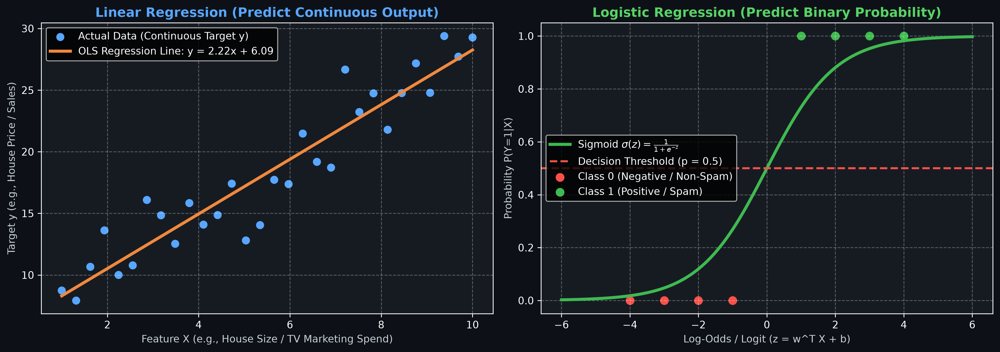

```
Classical Software Engineering (Software 1.0):
┌───────────┐
│   Rules   │──┐
└───────────┘  │    ┌───────────────────────────┐
               ├────► Classical Program / Code  ├────► Output Answers
┌───────────┐  │    └───────────────────────────┘
│   Data    │──┘
└───────────┘

Machine Learning Paradigm (Software 2.0):
┌───────────┐
│   Data    │──┐
└───────────┘  │    ┌───────────────────────────┐
               ├────► Machine Learning Engine   ├────► Learned Rules (Model Weights f(X))
┌───────────┐  │    └───────────────────────────┘
│  Answers  │──┘
└───────────┘
```

* **Software 1.0 (Classical)**: Humans manually code explicit rules (e.g., nested `if-else` blocks). If an edge case changes, humans must update the code.
* **Software 2.0 (Machine Learning)**: Humans supply historical input features ($X$) and correct ground-truth answers ($y$). The machine learning model infers the underlying relationship function $f(X) \approx y$.

### 1.3 Traditional Machine Learning vs. Deep Learning (Andrew Ng Scale Law)

Pioneering AI researcher **Andrew Ng** highlighted why the AI industry transitioned from traditional statistical ML to Deep Learning:

```
  Performance
       ▲
       │                                     /  Large Neural Nets & Transformers (LLMs)
       │                                    /
       │                                   /  Medium Neural Nets
       │                                  /
       │  -------------------------------/   Small Neural Nets
       │  ------------------------------/    Traditional ML (SVM, Random Forest, Logistic Reg)
       │  ─────────────────────────────/     (Performance plateaus as data scales)
       │
       └─────────────────────────────────────────────────────────────► Amount of Data & Compute
```

1. **Traditional ML Bottleneck**: Algorithms like Support Vector Machines, Decision Trees, and Logistic Regression hit a **performance ceiling**. Beyond a certain dataset size, feeding more data yields zero accuracy improvements.
2. **Deep Learning & Transformer Scaling**: Deep Neural Networks scale monotonically with respect to compute, model parameters, and data volume ($P \propto \text{Data} \times \text{Params} \times \text{Compute}$).

### 1.4 AI vs. ML vs. Deep Learning Hierarchy

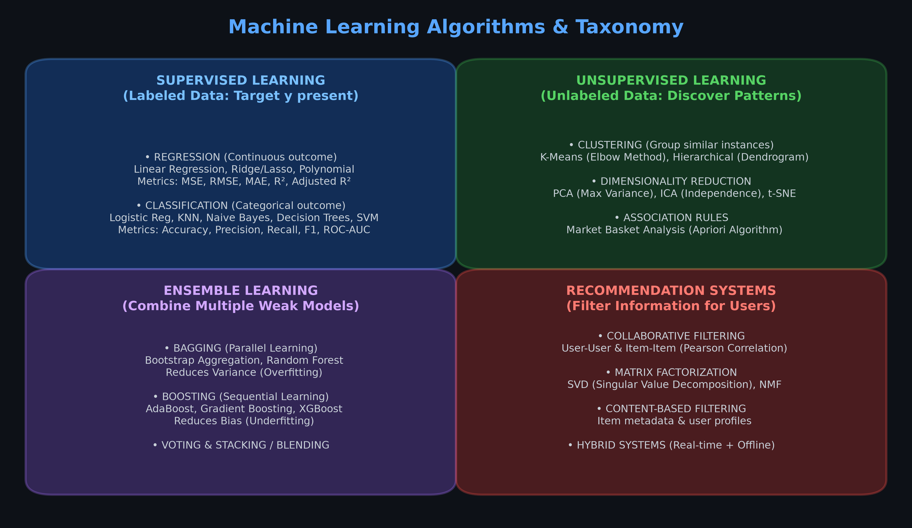

* **Artificial Intelligence (AI)**: Any system that mimics human intelligence, reasoning, or decision-making (includes expert systems, search engines, rule engines, ML).
* **Machine Learning (ML)**: Statistical methods that learn patterns directly from data (Supervised, Unsupervised, Ensemble, Reinforcement Learning).
* **Deep Learning (DL)**: Subfield of ML utilizing multi-layered artificial neural networks (CNNs, RNNs, Transformers, Generative AI).

### 1.5 Standard 6-Step Machine Learning Execution Blueprint

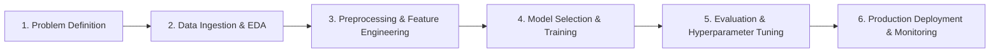

1. **Problem Definition**: Frame business problem into ML domain (Regression, Classification, Clustering, Recommendation). Define metric $P$ (e.g., RMSE, F1-Score, ROC-AUC).
2. **Data Ingestion & Exploratory Data Analysis (EDA)**: Inspect shape, data types, distributions, correlations, missing values, and outliers.
3. **Data Preprocessing & Feature Engineering**: Missing value imputation, outlier treatment, categorical encoding (One-Hot / Label), feature scaling (`StandardScaler` / `MinMaxScaler`), handling class imbalance (SMOTE).
4. **Model Selection & Training**: Benchmark linear models, tree-based models, and ensemble methods on train split ($X_{train}, y_{train}$).
5. **Evaluation & Tuning**: Cross-validation ($K$-Fold), hyperparameter search (`GridSearchCV` / `RandomizedSearchCV`), error diagnosis (Bias vs. Variance).
6. **Deployment & Monitoring**: Export trained pipeline model (`joblib` / `pickle`), integrate into API backend (FastAPI / Flask), monitor feature drift and concept drift in production.

---

## 2. Lesson 3 — Supervised Learning: Regression & Applications

### 2.1 Technical & Layman Definition of Regression

* **Technical Definition**: A supervised learning paradigm where the objective is to estimate a functional mapping $f: \mathbb{R}^d \to \mathbb{R}$ that maps continuous feature vector $X$ to a continuous quantitative scalar target $y \in \mathbb{R}$.
* **Layman Analogy**: Imagine trying to guess the weight of a watermelon based on its diameter. Diameter is the feature ($X$), weight is the numerical answer ($y$). Because weight can be any number (e.g., 4.2 kg, 4.25 kg, 5.1 kg), it is a **regression task**.

### 2.2 Simple & Multiple Linear Regression (OLS)


#### Mathematical Formulation
* **Simple Linear Regression** (1 predictor $x$):
  $$\hat{y} = \beta_0 + \beta_1 x$$
* **Multiple Linear Regression** ($p$ predictors $x_1, x_2, \dots, x_p$):
  $$\hat{y} = \beta_0 + \beta_1 x_1 + \beta_2 x_2 + \dots + \beta_p x_p = X \beta$$

#### Optimization: Ordinary Least Squares (OLS)
OLS minimizes the **Residual Sum of Squares (RSS)**:
$$RSS(\beta) = \sum_{i=1}^{N} (y_i - \hat{y}_i)^2 = \sum_{i=1}^{N} \left(y_i - (\beta_0 + \sum_{j=1}^{p} \beta_j x_{ij})\right)^2$$

In matrix vector notation:
$$\hat{\beta} = (X^T X)^{-1} X^T y$$

### 2.3 Evaluation Metrics for Regression

1. **Mean Absolute Error (MAE)**: Average absolute magnitude of errors (robust to outliers).
   $$MAE = \frac{1}{N} \sum_{i=1}^{N} |y_i - \hat{y}_i|$$
2. **Mean Squared Error (MSE)**: Average squared distance (penalizes large errors heavily).
   $$MSE = \frac{1}{N} \sum_{i=1}^{N} (y_i - \hat{y}_i)^2$$
3. **Root Mean Squared Error (RMSE)**: Square root of MSE (interpretable in original target units).
   $$RMSE = \sqrt{\frac{1}{N} \sum_{i=1}^{N} (y_i - \hat{y}_i)^2}$$
4. **$R^2$ Score (Coefficient of Determination)**: Proportion of target variance explained by the model ($R^2 \in [-\infty, 1]$).
   $$R^2 = 1 - \frac{SS_{res}}{SS_{tot}} = 1 - \frac{\sum (y_i - \hat{y}_i)^2}{\sum (y_i - \bar{y})^2}$$
5. **Adjusted $R^2$**: Penalizes addition of non-informative noise features:
   $$R^2_{adj} = 1 - \left[ \frac{(1 - R^2)(N - 1)}{N - p - 1} \right]$$

### 2.4 Multicollinearity & Variance Inflation Factor (VIF)

* **Multicollinearity**: High inter-correlation among independent variables $X$, making matrix $(X^T X)$ nearly singular and coefficient estimates unstable.
* **Variance Inflation Factor (VIF)**: Measures how much variance of an estimated regression coefficient is inflated by correlation among predictors:
  $$VIF_j = \frac{1}{1 - R_j^2}$$
  *(where $R_j^2$ is the $R^2$ score from regressing feature $x_j$ against all other independent features).*
* **Decision Rule**:
  * $VIF = 1$: No correlation.
  * $VIF \ge 5 \text{ or } 10$: High multicollinearity; drop or combine feature $x_j$.

### 2.5 Regularization Techniques (Ridge, Lasso, Polynomial)

1. **Ridge Regression ($L_2$ Regularization)**:
   Shrinks feature coefficients towards zero by adding squared norm penalty:
   $$\mathcal{L}_{Ridge} = \sum_{i=1}^{N} (y_i - \hat{y}_i)^2 + \lambda \sum_{j=1}^{p} \beta_j^2$$
   * **Use Case**: Handles multicollinearity; retains all features with small weights.
2. **Lasso Regression ($L_1$ Regularization)**:
   Shrinks coefficients and forces irrelevant weights strictly to **zero** (Automatic Feature Selection):
   $$\mathcal{L}_{Lasso} = \sum_{i=1}^{N} (y_i - \hat{y}_i)^2 + \lambda \sum_{j=1}^{p} |\beta_j|$$
   * **Use Case**: Sparse feature spaces; eliminates noisy variables.
3. **Polynomial Regression**:
   Models non-linear curves by extending features to $d$-th power ($x^1, x^2, \dots, x^d$):
   $$\hat{y} = \beta_0 + \beta_1 x + \beta_2 x^2 + \dots + \beta_d x^d$$

### 2.6 Notebook & Dataset Summary (Lesson 3)

* `3.1_Supervised_Learning.ipynb`: Overview of supervised framework, target mapping, feature matrices.
* `3.2_Supervised_Learning_Regression_and_Its_Applications.ipynb`: Hands-on regression modeling on:
  * `tvmarketing.csv`: Simple linear regression (TV advertising spend vs. product sales).
  * `housing_with_ocean_proximity.csv` / `housing.csv`: California housing prices (median income, rooms, ocean proximity categorical encoding).
  * `position_salaries.csv`: Polynomial regression for salary estimation vs. job level.
  * `Hitters.csv` & `diabetes_dataset.csv`: Ridge & Lasso regularization benchmarking.

---

## 3. Lesson 4 — Supervised Learning: Classification & Applications

### 3.1 Technical & Layman Definition of Classification

* **Technical Definition**: Estimating a discrete mapping $f: \mathbb{R}^d \to \{C_1, C_2, \dots, C_K\}$ assigning input vector $X$ to one of $K$ categorical classes.
* **Layman Analogy**: Sorting mail into distinct bins marked "Bills", "Personal Letters", and "Junk Mail".

### 3.2 Logistic Regression & Sigmoid Activation

#### Mathematical Formulation
Logistic regression models the **log-odds** (logit) of class 1 as a linear combination of inputs:
$$\log\left(\frac{P(Y=1|X)}{1 - P(Y=1|X)}\right) = z = \beta_0 + \beta_1 x_1 + \dots + \beta_p x_p$$

Applying the **Sigmoid Function** maps real values $z \in (-\infty, \infty)$ into valid probabilities $p \in (0, 1)$:
$$\sigma(z) = \frac{1}{1 + e^{-z}} = \frac{e^z}{1 + e^z}$$

#### Binary Cross-Entropy Loss (Log Loss)
$$\mathcal{L}(\beta) = -\frac{1}{N} \sum_{i=1}^{N} \left[ y_i \log(\hat{p}_i) + (1 - y_i) \log(1 - \hat{p}_i) \right]$$

### 3.3 Naive Bayes Classifier (Bayesian Probability)

Based on **Bayes' Theorem** with the "Naive" assumption that all features $x_1, x_2, \dots, x_p$ are conditionally independent given class $Y$:
$$P(Y=c | x_1, \dots, x_p) = \frac{P(Y=c) \prod_{j=1}^{p} P(x_j | Y=c)}{P(x_1, \dots, x_p)}$$

* **Gaussian Naive Bayes**: Continuous features assuming normal distribution $N(\mu_c, \sigma_c^2)$.
* **Multinomial Naive Bayes**: Discrete word frequencies / text counts.
* **Bernoulli Naive Bayes**: Binary presence/absence features.

### 3.4 K-Nearest Neighbors (KNN Classifier)

Instance-based non-parametric classifier. For an unlabelled query point $x_0$:
1. Calculate distance (Euclidean $d(x,y) = \sqrt{\sum (x_i - y_i)^2}$ or Manhattan $d(x,y) = \sum |x_i - y_i|$) to all training points.
2. Select $k$ nearest neighboring data points.
3. Assign query point $x_0$ to majority class among $k$ neighbors.

### 3.5 Decision Trees (Entropy & Gini Impurity)

Splits feature space into hyper-rectangular regions by choosing splits that maximize impurity reduction.

#### Impurity Metrics
1. **Entropy**:
   $$H(S) = -\sum_{i=1}^{K} p_i \log_2(p_i)$$
2. **Gini Impurity**:
   $$Gini(S) = 1 - \sum_{i=1}^{K} p_i^2$$
3. **Information Gain**:
   $$IG(S, A) = H(S) - \sum_{v \in Values(A)} \frac{|S_v|}{|S|} H(S_v)$$

### 3.6 Support Vector Machines (SVM & Kernel Trick)

Finds the optimal separating hyperplane that maximizes the margin $M = \frac{2}{\|\mathbf{w}\|}$ between positive and negative support vectors.

```
       Margin M
     ◄──────────►
   ●   ●  │  ▲
 ●   ●    │  │  Support Vector
──────────┼──┼──────────────── Hyperplane: w^T X + b = 0
     ○    │  │  Support Vector
   ○   ○  │  ▼
```

* **Kernel Trick**: Computes inner products in higher-dimensional Hilbert space without explicitly transforming data:
  * Linear Kernel: $K(x, z) = x^T z$
  * RBF (Radial Basis Function) Kernel: $K(x, z) = \exp(-\gamma \|x - z\|^2)$

### 3.7 Classification Performance Metrics (Confusion Matrix & ROC-AUC)

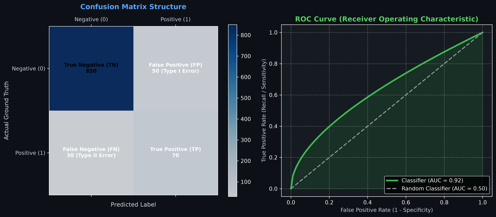

#### Confusion Matrix Structure
| | Predicted Negative (0) | Predicted Positive (1) |
| :--- | :--- | :--- |
| **Actual Negative (0)** | **True Negative (TN)** | **False Positive (FP)** (Type I Error) |
| **Actual Positive (1)** | **False Negative (FN)** (Type II Error) | **True Positive (TP)** |

#### Key Metric Formulas
$$\text{Accuracy} = \frac{TP + TN}{TP + TN + FP + FN}$$
$$\text{Precision} = \frac{TP}{TP + FP} \quad (\text{Quality of positive calls})$$
$$\text{Recall (Sensitivity)} = \frac{TP}{TP + FN} \quad (\text{Quantity of actual positives caught})$$
$$\text{F1-Score} = 2 \times \frac{\text{Precision} \times \text{Recall}}{\text{Precision} + \text{Recall}} \quad (\text{Harmonic Mean})$$

### 3.8 Handling Imbalanced Datasets (SMOTE & Resampling)

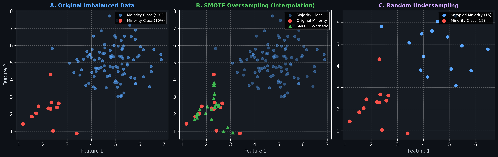

In severe class imbalance (e.g., Credit Card Fraud where 99.8% is non-fraud and 0.2% is fraud), standard models predict 100% non-fraud and achieve 99.8% dummy accuracy.

* **SMOTE (Synthetic Minority Over-sampling Technique)**: Selects minority class instance $x_i$, finds $k$ nearest minority neighbors, and synthesizes synthetic instances along the line segment:
  $$x_{new} = x_i + \lambda (x_{neighbor} - x_i), \quad \lambda \sim U(0, 1)$$
* **Random Undersampling**: Randomly discards majority class samples to match minority class count.

### 3.9 Notebook & Dataset Summary (Lesson 4)

* `4.1_Classification_and_Its_Applications_Part_1.ipynb`: Logistic Regression theory and binary classification on `Breast_cancer_dataset.csv`.
* `4.2_Classification_and_Its_Applications_Part_2.ipynb`: Multi-class classification algorithms (Naive Bayes, KNN, Decision Trees) benchmarking on `online_gaming_behavior_dataset.csv`.
* `4.3_Classification_and_Its_Applications_Part_3.ipynb`: Imbalanced classification handling using SMOTE, Random Oversampler, and Undersampler on `creditcard.csv`.

---

## 4. Model Generalization, Bias-Variance Tradeoff & Regularization

### 4.1 Bias-Variance Tradeoff Decomposition

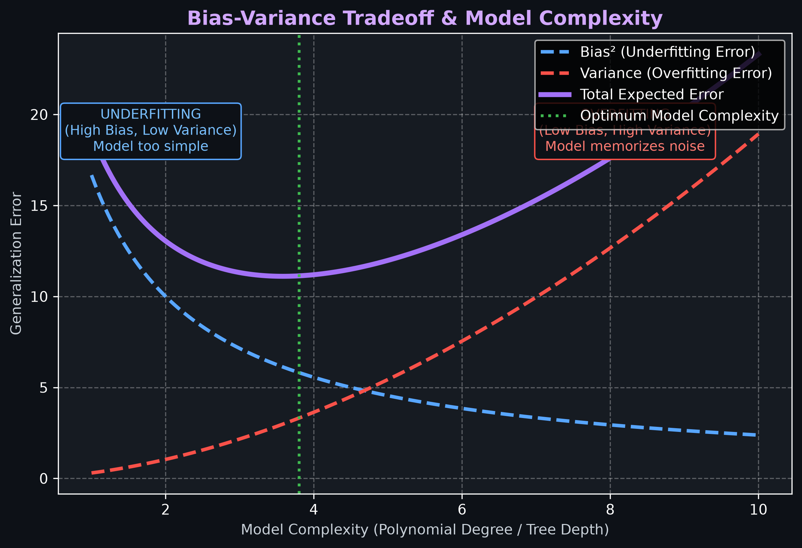

Expected generalization error on unseen test data breaks down into three additive components:
$$\text{Expected Test Error} = \text{Bias}^2 + \text{Variance} + \text{Irreducible Error } \sigma^2$$

1. **Bias**: Error introduced by approximating a complex real-world problem with an overly simple model (Underfitting).
2. **Variance**: Error introduced by model sensitivity to small fluctuations in training data (Overfitting).
3. **Irreducible Error ($\sigma^2$)**: Inherent statistical noise in data generation.

### 4.2 Cross-Validation & Hyperparameter Tuning

```
K-Fold Cross-Validation (K = 5):
Fold 1: [ Test  | Train | Train | Train | Train ] ──► Metric 1
Fold 2: [ Train | Test  | Train | Train | Train ] ──► Metric 2
Fold 3: [ Train | Train | Test  | Train | Train ] ──► Metric 3
Fold 4: [ Train | Train | Train | Test  | Train ] ──► Metric 4
Fold 5: [ Train | Train | Train | Train | Test  ] ──► Metric 5
                                                    └──► Mean Validation Score
```

* **Stratified $K$-Fold Cross-Validation**: Ensures each fold preserves original class proportions (essential for imbalanced classification).
* **GridSearchCV**: Exhaustive search over specified hyperparameter grid values.
* **RandomizedSearchCV**: Samples fixed number of hyperparameter combinations from probability distributions (faster for large search spaces).

---

## 5. Lesson 5 — Ensemble Learning

### 5.1 Technical & Layman Definition of Ensemble Learning

* **Technical Definition**: Combining predictions of multiple individual base estimators (weak learners) to form a unified composite model with lower generalization error.
* **Layman Analogy**: Instead of relying on 1 doctor's opinion, a patient consults a panel of 5 specialists (Cardiologist, Neurologist, General Physician) and takes the consensus diagnosis.

### 5.2 Sequential vs. Parallel Ensemble Architectures

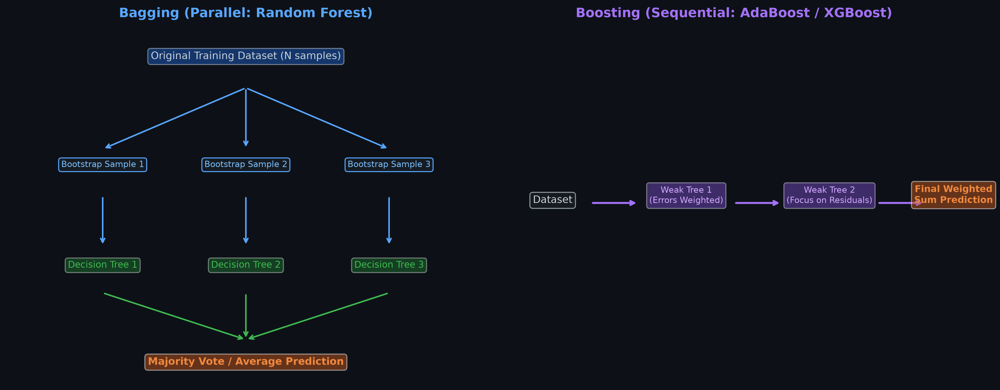

| Dimension | Parallel Ensembles (Bagging) | Sequential Ensembles (Boosting) |
| :--- | :--- | :--- |
| **Base Learner Generation** | Generated independently in parallel. | Generated sequentially in series. |
| **Data Sampling** | Random bootstrap samples (with replacement). | Re-weighted samples focusing on prior errors. |
| **Primary Error Reduced** | **Variance** (eliminates overfitting). | **Bias** (converts weak models into strong). |
| **Representative Model** | Random Forest | AdaBoost, Gradient Boosting, XGBoost |

### 5.3 Bagging (Bootstrap Aggregation) & Random Forests

#### Bagging Principle
1. Generate $B$ bootstrap datasets $D_1, D_2, \dots, D_B$ by sampling $N$ observations with replacement from training dataset $D$.
2. Train base estimator $\hat{f}^b(x)$ independently on each bootstrap dataset.
3. Aggregate predictions:
   * **Regression**: $\hat{f}_{bag}(x) = \frac{1}{B} \sum_{b=1}^{B} \hat{f}^b(x)$
   * **Classification**: $\hat{f}_{bag}(x) = \text{MajorityVote}\left(\{\hat{f}^b(x)\}_{b=1}^B\right)$

#### Random Forest Enhancement
Random Forest adds **Feature Subspace Sampling** (Random Subspace Method) at every node split: instead of searching across all $p$ features, it considers a random subset $m = \sqrt{p}$ features. This **decorrelates** individual decision trees.

### 5.4 Boosting Algorithms (AdaBoost, Gradient Boosting, XGBoost)

1. **AdaBoost (Adaptive Boosting)**:
   Assigns sample weights $w_i$. After each weak tree is trained, misclassified samples receive increased weights so subsequent trees focus on hard-to-classify samples.
2. **Gradient Boosting Machine (GBM)**:
   Sequentially fits new base trees to pseudo-residuals (negative gradient of loss function):
   $$r_{im} = -\left[ \frac{\partial \mathcal{L}(y_i, f(x_i))}{\partial f(x_i)} \right]_{f(x) = f_{m-1}(x)}$$
3. **XGBoost (Extreme Gradient Boosting)**:
   Optimizes second-order Taylor expansion of loss function with $L_1$ and $L_2$ tree complexity regularization:
   $$\mathcal{L}^{(t)} \approx \sum_{i=1}^{N} \left[ g_i f_t(x_i) + \frac{1}{2} h_i f_t^2(x_i) \right] + \gamma T + \frac{1}{2} \lambda \sum_{j=1}^{T} w_j^2$$

### 5.5 Simple Voting, Stacking, and Blending Ensembles

* **Hard Voting**: Takes mode of predictions across base classifiers.
* **Soft Voting**: Computes average predicted class probabilities across base classifiers.
* **Stacking (Stacked Generalization)**: Trains heterogeneous base models (e.g., SVM, KNN, Random Forest) and uses their out-of-fold predictions as input features to train a meta-learner (e.g., Logistic Regression).

### 5.6 Notebook & Dataset Summary (Lesson 5)

* `5.1_Ensemble_Learning.ipynb`: Hands-on implementation of Bagging, Random Forest, AdaBoost, Gradient Boosting, XGBoost, Voting Classifiers, and Stacking meta-models.

---

## 6. Lesson 6 — Unsupervised Learning Algorithms

### 6.1 Technical & Layman Definition of Unsupervised Learning

* **Technical Definition**: Extracting structural patterns, underlying probability density functions, or intrinsic dimensional representations from unlabeled data matrix $X \in \mathbb{R}^{N \times p}$.
* **Layman Analogy**: Dropping a tourist in an unmapped city without a guide. The tourist notices that people wearing suits gather in financial districts, while people with beach towels gather near the coastline.

### 6.2 Clustering Techniques (K-Means & Hierarchical)

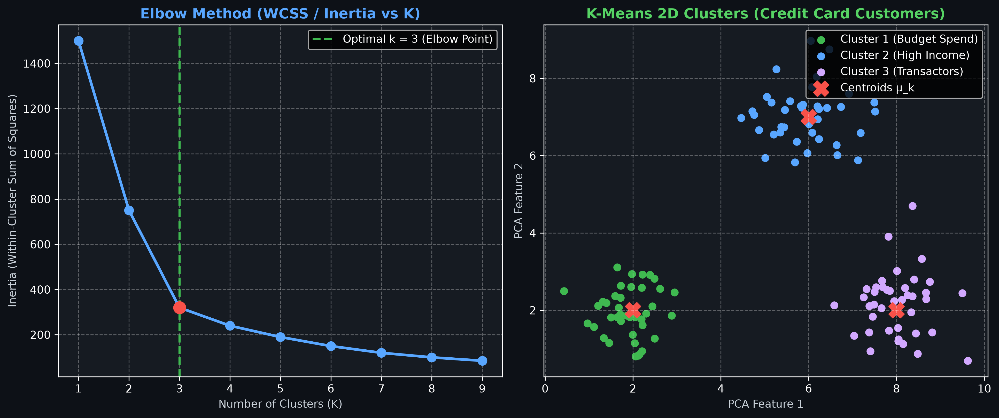

#### K-Means Clustering Algorithm
Partitions data into $K$ disjoint clusters $C = \{C_1, C_2, \dots, C_K\}$ centered at centroids $\mu_1, \dots, \mu_K$ by minimizing **Within-Cluster Sum of Squares (WCSS / Inertia)**:
$$J(C) = \sum_{k=1}^{K} \sum_{x_i \in C_k} \| x_i - \mu_k \|^2$$

1. **Elbow Method**: Plots Inertia vs. $K$; optimal $K$ is selected at the point of diminishing returns (elbow bend).
2. **Silhouette Score**: Measures cluster cohesion vs. separation ($s(i) \in [-1, 1]$):
   $$s(i) = \frac{b(i) - a(i)}{\max(a(i), b(i))}$$

#### Hierarchical Agglomerative Clustering
Bottom-up clustering building a tree structure called a **Dendrogram**.
1. Start with every observation as an isolated cluster ($N$ clusters).
2. Compute pairwise distance matrix using Linkage Criterion:
   * **Ward's Linkage**: Minimizes variance of merged clusters.
   * **Complete Linkage**: Maximum distance between cluster points.
   * **Average Linkage**: Average pairwise distance.
3. Iteratively merge nearest pair of clusters until 1 root cluster remains.

### 6.3 Dimensionality Reduction Techniques (PCA, ICA, t-SNE)

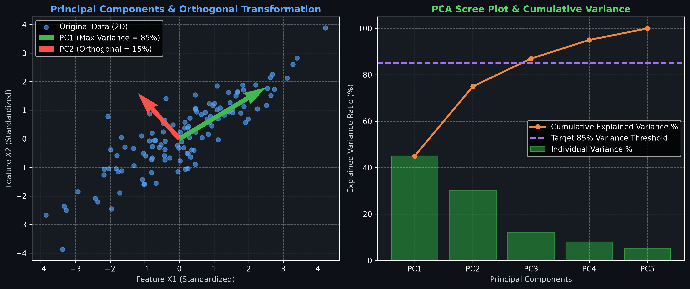

#### Principal Component Analysis (PCA)
Linear transformation projecting $p$-dimensional features into $k$-dimensional orthogonal components ($k \ll p$) maximizing sample variance.

1. Standardize data: $Z = \frac{X - \mu}{\sigma}$.
2. Compute Covariance Matrix: $\Sigma = \frac{1}{N-1} Z^T Z$.
3. Compute Eigenvalues $\lambda_i$ and Eigenvectors $v_i$ via Eigendecomposition: $\Sigma v_i = \lambda_i v_i$.
4. Sort eigenvectors by descending eigenvalue order; select top $k$ components covering target variance (e.g., 85%).

#### Independent Component Analysis (ICA)
Decomposes multivariate signals into statistically independent non-Gaussian source components.
* **Classic Problem**: Blind Source Separation (Cocktail Party Problem — separating individual voices from multiple mixed microphone recordings).

### 6.4 Association Rule Mining (Market Basket Analysis & Apriori)

Identifies frequent itemsets and co-occurrence patterns in transaction datasets.

1. **Support**: Fraction of transactions containing items $A$ and $B$:
   $$\text{Support}(A \to B) = \frac{P(A \cap B)}{N}$$
2. **Confidence**: Conditional probability of buying $B$ given $A$:
   $$\text{Confidence}(A \to B) = \frac{P(A \cap B)}{P(A)}$$
3. **Lift**: Strength of rule relative to random chance:
   $$\text{Lift}(A \to B) = \frac{\text{Confidence}(A \to B)}{P(B)} = \frac{P(A \cap B)}{P(A) \cdot P(B)}$$
   * $\text{Lift} > 1$: Strong positive co-purchasing association.

### 6.5 Notebook & Dataset Summary (Lesson 6)

* `6.01_Unsupervised_Learning_Algorithms.ipynb` & `6.1_Unsupervised_Learning_Algorithms.ipynb`: K-Means clustering, Elbow method, Silhouette analysis, Hierarchical dendrograms on `Mall_customers.csv` and `Market_Basket_Optimisation.csv`.
* `6.02_Unsupervised_Learning_Algorithms.ipynb` & `6.2_Unsupervised_Learning_Algorithms.ipynb`: Feature selection vs. feature extraction, PCA variance optimization, Scree plots on `credit_card_fraud.csv`, `diabetes.csv`, and `mnist.csv`.

---

## 7. Lesson 7 — Recommendation Systems

### 7.1 Technical & Layman Definition of Recommender Systems

* **Technical Definition**: Information filtering algorithms predicting utility rating $\hat{r}_{u,i}$ or ranking preference order of items $i \in I$ for user $u \in U$.
* **Layman Analogy**: A digital librarian who knows your entire reading history, compares it with millions of other readers, and hands you your next favorite book.

### 7.2 Collaborative Filtering (User-Based vs. Item-Based)

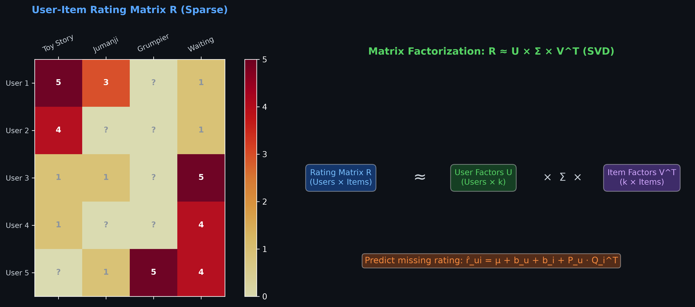

#### 1. User-User Collaborative Filtering
Recommends items enjoyed by users with similar rating histories.
* Calculate Similarity (Pearson Correlation Coefficient):
  $$w_{u,v} = \frac{\sum_{i \in I_{uv}} (r_{u,i} - \bar{r}_u)(r_{v,i} - \bar{r}_v)}{\sqrt{\sum (r_{u,i} - \bar{r}_u)^2} \sqrt{\sum (r_{v,i} - \bar{r}_v)^2}}$$
* Predict unknown rating:
  $$\hat{r}_{u,i} = \bar{r}_u + \frac{\sum_{v \in N_k(u)} w_{u,v} (r_{v,i} - \bar{r}_v)}{\sum_{v \in N_k(u)} |w_{u,v}|}$$

#### 2. Item-Item Collaborative Filtering
Recommends items that are statistically similar to items user $u$ rated highly in the past.
* Similarity computed across item columns rather than user rows.

### 7.3 Model-Based Collaborative Filtering (SVD & NMF Matrix Factorization)

Decomposes large sparse User-Item rating matrix $R \in \mathbb{R}^{|U| \times |I|}$ into low-rank latent factor matrices:
$$R \approx U \cdot \Sigma \cdot V^T$$

* **Singular Value Decomposition (SVD)**:
  Predicts rating: $\hat{r}_{u,i} = \mu + b_u + b_i + P_u \cdot Q_i^T$
  Minimizes regularized MSE:
  $$\mathcal{L} = \sum_{(u,i) \in R_{train}} (r_{u,i} - (\mu + b_u + b_i + P_u Q_i^T))^2 + \lambda (b_u^2 + b_i^2 + \|P_u\|^2 + \|Q_i\|^2)$$
* **Non-Negative Matrix Factorization (NMF)**: Enforces non-negative factor constraints ($P_u \ge 0, Q_i \ge 0$), yielding interpretable non-additive components.

### 7.4 Content-Based Filtering & Hybrid Systems

* **Content-Based Filtering**: Matches item metadata (genres, actors, descriptions converted to TF-IDF vectors) with target user's preference profile using Cosine Similarity.
* **Hybrid Recommender Engines**: Combines Collaborative Filtering and Content-Based models (e.g., Weighted Average, Stacking) to solve the **Cold Start Problem** for new items or new users.

### 7.5 Notebook & Dataset Summary (Lesson 7)

* `7.01_Recommendation_Systems.ipynb` & `7.1_Recommendation_Systems.ipynb`: Building User-Item pivot tables, Pearson similarity filtering, and model-based filtering (`KNNBasic`, `SVD`, `NMF` via Surprise library) on `movies.csv`, `ratings.csv`, and `anime.csv`.

---

## 8. Incremental Capstone Projects Breakdown (Aura Analytics Platform)

The Incremental Capstone Project revolves around **Aura**—an intelligent business analytics platform built for omnichannel marketing, customer acquisition, bike-sharing operators, realtors, credit card agencies, and startups.

```
┌────────────────────────────────────────────────────────────────────────┐
│                      AURA BUSINESS ANALYTICS PLATFORM                  │
├───────────────────┬───────────────────┬────────────────┬───────────────┤
│ Bike Rentals      │ Realtor Assoc.    │ Credit Card    │ Startups      │
│ (Demand Forecast) │ (Income Classify) │ (Segmentation) │ (Recommender) │
└───────────────────┴───────────────────┴────────────────┴───────────────┘
```

---

### 8.1 Capstone Session 5 — Bike-Sharing Demand Forecasting (Regression)

* **Business Objective**: Predict total daily bike sharing rental counts (`cnt`) to help urban mobility operators optimize bike fleet deployment and rebalancing logistics.
* **Dataset**: `FloridaBikeRentals.csv` (Features: `season`, `yr`, `mnth`, `holiday`, `weekday`, `workingday`, `weathersit`, `temp`, `atemp`, `hum`, `windspeed`, `casual`, `registered`, `cnt`).

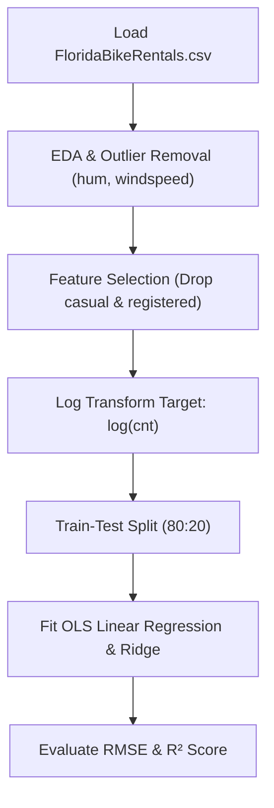

#### Step-by-Step Execution Workflow
1. **EDA & Outlier Treatment**: Inspect correlations; drop `casual` and `registered` columns since `cnt = casual + registered` (prevents data leakage). Filter out invalid zero-humidity or extreme windspeed outliers.
2. **Feature Preprocessing**: Log-transform target variable `y = np.log1p(df['cnt'])` to handle positive skewness.
3. **Train-Test Split**: 80% Training, 20% Testing with `random_state=42`.
4. **Model Benchmarking**: Fit Linear Regression, Ridge ($L_2$), and Random Forest Regressor.
5. **Key Business Insights**: Temperature (`temp`), weather situation (`weathersit`), and year (`yr`) are the strongest positive predictors of rental demand.

---

### 8.2 Capstone Session 6 — Adult Census Income Classification (Imbalanced Classification)

* **Business Objective**: Classify whether an individual earns $>50\text{K}$ annually (`income`) to assist financial firms and realtors in targeting high-net-worth customer segments.
* **Dataset**: `adultcensusincome.csv` (Features: `age`, `workclass`, `education`, `marital-status`, `occupation`, `relationship`, `race`, `sex`, `capital-gain`, `capital-loss`, `hours-per-week`, `native-country`, `income`).

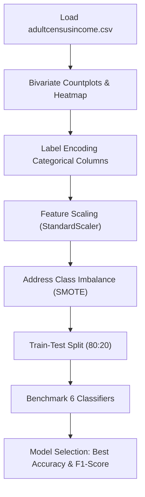

#### Step-by-Step Execution Workflow
1. **Bivariate Analysis**: Plot distribution of income across age, education, marital status, and gender. Correlation heatmap reveals strong correlation between income, capital gain, education level, and age.
2. **Data Preprocessing**:
   * Apply `LabelEncoder` to all categorical columns.
   * Separate independent features $X$ and dependent target $y = \text{income}$.
   * Apply `StandardScaler` to continuous numerical features.
   * Apply `SMOTE` oversampling to handle severe class imbalance between $\le 50\text{K}$ and $>50\text{K}$.
3. **Train-Test Split**: 80% train, 20% test split (`random_state=42`).
4. **Multi-Model Benchmark**: Train Logistic Regression, KNN Classifier, SVM Classifier, Naive Bayes Classifier, Decision Tree Classifier, and Random Forest Classifier.
5. **Model Evaluation**: Compare Accuracy and F1-Score across all 6 models. Random Forest Classifier achieves top performance ($F1 > 0.86$).

---

### 8.3 Capstone Session 7 — Credit Card User Customer Segmentation (PCA + K-Means)

* **Business Objective**: Segment credit card holders into distinct behavioral personas to enable targeted credit card offers, line adjustments, and risk management.
* **Dataset**: `CC GENERAL.csv` (18 behavioral variables including `BALANCE`, `PURCHASES`, `ONEOFF_PURCHASES`, `CASH_ADVANCE`, `CREDIT_LIMIT`, `PAYMENTS`, `TENURE`).

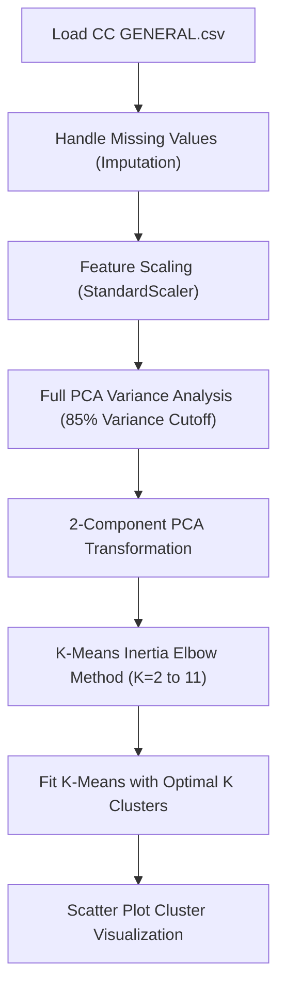

#### Step-by-Step Execution Workflow
1. **Null Imputation**: Fill missing values in `MINIMUM_PAYMENTS` and `CREDIT_LIMIT` with column medians.
2. **Feature Scaling**: Standardize all numerical variables using `StandardScaler`.
3. **PCA Dimension Reduction**:
   * Fit full PCA across all columns. Plot Cumulative Explained Variance vs. Number of Components to identify the number of components needed for **85% variance**.
   * Transform dataset into 2 principal components ($PC_1, PC_2$) for 2D visual cluster analysis.
   * Inspect covariance matrix using `pca.get_covariance()` to identify top feature covariances.
4. **K-Means Clustering**:
   * Run K-Means across $K = 2$ to $11$. Plot Inertia (WCSS) vs. $K$ (Elbow Curve).
   * Identify optimal cluster count at elbow bend.
   * Fit final K-Means model on $PC_1, PC_2$ transformed data.
5. **Cluster Persona Insights**:
   * *Cluster 1 (Transactors)*: High purchase frequency, low cash advance.
   * *Cluster 2 (Cash-Advancers)*: High cash advance transactions, low purchase count.
   * *Cluster 3 (Budget Users)*: Low balance, low activity.

---

### 8.4 Capstone Session 8 — Movie Recommendation Engine (Pearson CF & Surprise SVD/NMF)

* **Business Objective**: Build a personalized movie recommendation engine to maximize user content engagement on streaming media platforms.
* **Datasets**: `movies.csv` (`movieId`, `title`, `genres`) and `ratings.csv` (`userId`, `movieId`, `rating`, `timestamp`).

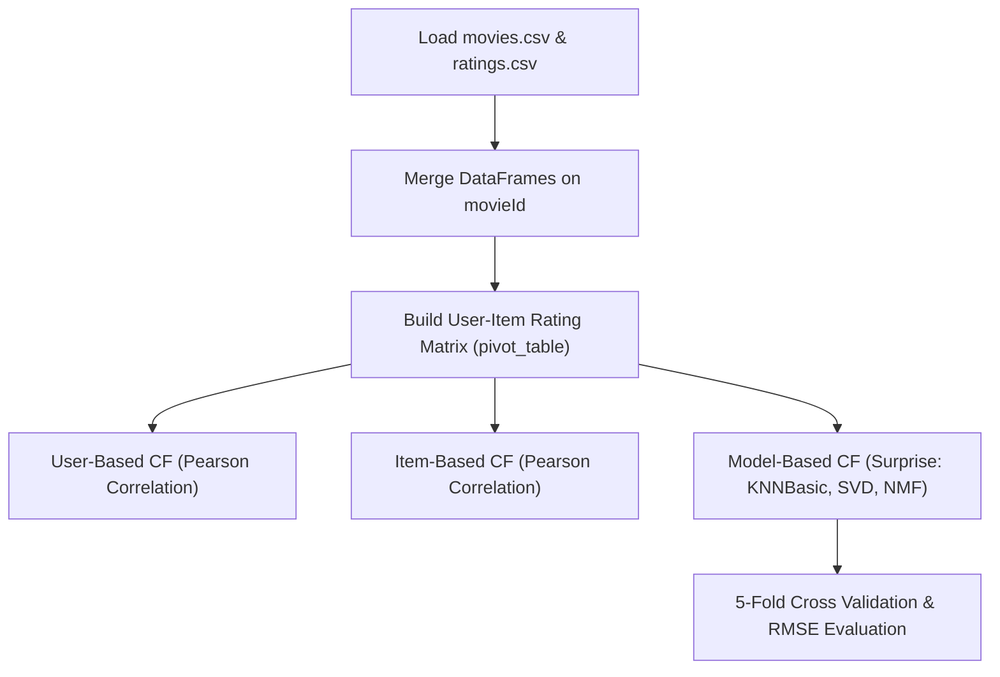

#### Step-by-Step Execution Workflow
1. **Data Ingestion & Pivot Table**: Merge `movies.csv` and `ratings.csv` on `movieId`. Construct User-Item rating matrix using `pd.pivot_table(index='userId', columns='title', values='rating')`.
2. **User-Based Collaborative Filtering**:
   * Fill row-wise NaNs with corresponding user mean rating.
   * Calculate Pearson correlation matrix across all users.
   * Filter top 50 users most correlated to target User 1.
   * Predict rating for User 1 on `movieId=32` using weighted average formula:
     $$\hat{r}_{u1, i32} = \frac{\sum (w_{u1, v} \cdot r_{v, i32})}{\sum w_{u1, v}}$$
3. **Item-Based Collaborative Filtering**:
   * Fill column-wise NaNs with movie mean ratings.
   * Calculate Pearson correlation across movies.
   * Extract correlation vector for movie *"Jurassic Park (1993)"* and identify top 10 most similar movies.
4. **Model-Based Collaborative Filtering (Surprise Library)**:
   * Benchmark `KNNBasic` with Mean Squared Distance Similarity (`msd`, $k=20$).
   * Benchmark Matrix Factorization: `SVD` (Singular Value Decomposition) and `NMF` (Non-Negative Matrix Factorization).
   * Evaluate models using 5-Fold Cross Validation (`cross_validate(measures=['RMSE'], cv=5)`). SVD achieves lowest RMSE ($\approx 0.87$).

---

## 9. Production Python Code Templates & End-to-End Workflows

### 9.1 Complete Regression Pipeline

```python
import numpy as np
import pandas as pd
from sklearn.model_selection import train_test_split, GridSearchCV
from sklearn.preprocessing import StandardScaler
from sklearn.linear_model import Ridge
from sklearn.ensemble import RandomForestRegressor
from sklearn.metrics import mean_squared_error, mean_absolute_error, r2_score

# 1. Load Data
df = pd.read_csv('4.IHFC AIML: Machine Learning/ReferanceMaterials/Instructor_Slides_and_Notebooks/Lesson_03_Supervised_Learning_ Regression_and_its_Application/Dataset/tvmarketing.csv')
X = df[['TV']]
y = df['Sales']

# 2. Train-Test Split
X_train, X_test, y_train, y_test = train_test_split(X, y, test_size=0.2, random_state=42)

# 3. Scaling & Modeling
scaler = StandardScaler()
X_train_scaled = scaler.fit_transform(X_train)
X_test_scaled = scaler.transform(X_test)

# 4. Fit Model & Evaluate
model = RandomForestRegressor(n_estimators=100, random_state=42)
model.fit(X_train_scaled, y_train)

y_pred = model.predict(X_test_scaled)
print(f"Regression MAE  : {mean_absolute_error(y_test, y_pred):.4f}")
print(f"Regression RMSE : {np.sqrt(mean_squared_error(y_test, y_pred)):.4f}")
print(f"Regression R²   : {r2_score(y_test, y_pred):.4f}")
```

### 9.2 Complete Imbalanced Classification Pipeline (with SMOTE)

```python
import pandas as pd
from sklearn.model_selection import train_test_split
from sklearn.preprocessing import StandardScaler
from imblearn.over_sampling import SMOTE
from sklearn.ensemble import RandomForestClassifier
from sklearn.metrics import classification_report, roc_auc_score, confusion_matrix

# 1. Load & Split
df = pd.read_csv('4.IHFC AIML: Machine Learning/ReferanceMaterials/Instructor_Slides_and_Notebooks/Lesson_04_Supervised_Learning_ Classification_and_its_Application/Dataset/creditcard.csv')
X = df.drop(columns=['Class'])
y = df['Class']

X_train, X_test, y_train, y_test = train_test_split(X, y, test_size=0.2, random_state=42, stratify=y)

# 2. Scale & Apply SMOTE on Train Set Only
scaler = StandardScaler()
X_train_scaled = scaler.fit_transform(X_train)
X_test_scaled = scaler.transform(X_test)

smote = SMOTE(random_state=42)
X_train_res, y_train_res = smote.fit_resample(X_train_scaled, y_train)

# 3. Train & Evaluate
clf = RandomForestClassifier(n_estimators=100, random_state=42)
clf.fit(X_train_res, y_train_res)

y_pred = clf.predict(X_test_scaled)
y_proba = clf.predict_proba(X_test_scaled)[:, 1]

print("Confusion Matrix:\n", confusion_matrix(y_test, y_pred))
print("\nClassification Report:\n", classification_report(y_test, y_pred))
print(f"ROC-AUC Score: {roc_auc_score(y_test, y_proba):.4f}")
```

### 9.3 Complete Clustering & PCA Pipeline

```python
import pandas as pd
import numpy as np
import matplotlib.pyplot as plt
from sklearn.preprocessing import StandardScaler
from sklearn.decomposition import PCA
from sklearn.cluster import KMeans

# 1. Load Data
df = pd.read_csv('4.IHFC AIML: Machine Learning/ReferanceMaterials/Instructor_Slides_and_Notebooks/Lesson_06_Unsupervised_Learning_Algorithms/Dataset/Mall_customers.csv')
X = df[['Annual Income (k$)', 'Spending Score (1-100)']]

# 2. Scale Data
scaler = StandardScaler()
X_scaled = scaler.fit_transform(X)

# 3. PCA Transformation
pca = PCA(n_components=2)
X_pca = pca.fit_transform(X_scaled)
print("Explained Variance Ratio:", pca.explained_variance_ratio_)

# 4. K-Means Clustering
kmeans = KMeans(n_clusters=5, random_state=42, n_init=10)
labels = kmeans.fit_predict(X_pca)

print("Cluster Centroids (PCA Space):\n", kmeans.cluster_centers_)
```

### 9.4 Complete Recommendation System Pipeline

```python
import pandas as pd
from surprise import Dataset, Reader, SVD, KNNBasic, NMF
from surprise.model_selection import cross_validate

# 1. Load Rating Data
ratings = pd.read_csv('4.IHFC AIML: Machine Learning/ReferanceMaterials/Instructor_Slides_and_Notebooks/Lesson_07_Recommendation_Systems/Dataset/ratings.csv')

# 2. Define Surprise Dataset Format
reader = Reader(rating_scale=(0.5, 5.0))
data = Dataset.load_from_df(ratings[['userId', 'movieId', 'rating']], reader)

# 3. Cross Validate SVD & NMF Models
svd = SVD(random_state=42)
svd_results = cross_validate(svd, data, measures=['RMSE', 'MAE'], cv=5, verbose=True)

nmf = NMF(random_state=42)
nmf_results = cross_validate(nmf, data, measures=['RMSE', 'MAE'], cv=5, verbose=True)

print(f"SVD Mean RMSE: {svd_results['test_rmse'].mean():.4f}")
print(f"NMF Mean RMSE: {nmf_results['test_rmse'].mean():.4f}")
```

---

## 10. Reference Links, Papers, Documentation & Learning Resources

### Official Library Documentation
* 📘 [Scikit-Learn User Guide & API Documentation](https://scikit-learn.org/stable/user_guide.html)
* 📙 [Surprise Library Documentation for Recommender Systems](https://surprise.readthedocs.io/en/stable/)
* 📗 [Imbalanced-Learn (SMOTE) Official Guide](https://imbalanced-learn.org/stable/)
* 📕 [XGBoost (Extreme Gradient Boosting) Documentation](https://xgboost.readthedocs.io/)
* 📓 [LightGBM Official Documentation](https://lightgbm.readthedocs.io/)

### Seminal Research Papers & Foundational References
* 📜 [Arthur Samuel (1959) — *Some Studies in Machine Learning Using the Game of Checkers*](https://ieeexplore.ieee.org/document/5392560)
* 📜 [Leo Breiman (2001) — *Random Forests* (Machine Learning Journal)](https://link.springer.com/article/10.1023/A:1010933404324)
* 📜 [Tianqi Chen & Carlos Guestrin (2016) — *XGBoost: A Scalable Tree Boosting System* (KDD)](https://arxiv.org/abs/1603.02754)
* 📜 [Nitesh Chawla et al. (2002) — *SMOTE: Synthetic Minority Over-sampling Technique* (JAIR)](https://arxiv.org/abs/1106.1813)
* 📜 [Vaswani et al. (2017) — *Attention Is All You Need* (NIPS / Google Brain)](https://arxiv.org/abs/1706.03762)

---
*Created as part of the IHFC AIML Machine Learning Master Series. All infographic charts are stored in the relative [`images/`](images/) directory.*
