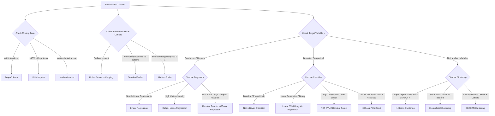
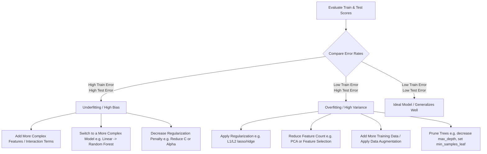

# 🛠️ Data-to-Model: Step-by-Step Machine Learning Pipeline

This guide outlines the standard chronological pipeline for building and evaluating a machine learning model, starting from raw data setup to final model evaluation, broken down into detailed subcategories for deep comprehension.

---

## 🧭 Decision Matrix & Strategy: When to Use What

This decision matrix provides the logical reasoning behind choosing specific preprocessing steps, algorithms, and evaluation diagnostics depending on your dataset characteristics.

### 🗺️ ML Pipeline Decision Tree (Data to Model Selection)



---

### 🧠 Preprocessing & Wrangling Logical Reasoning

| Step | Technique | Best Suited For | Logical Reasoning & Warning |
| :--- | :--- | :--- | :--- |
| **Imputation** | **Median Imputation** | Skewed continuous features with missing values. | Median is robust to outliers, unlike Mean, preventing distortion of the feature center. |
| | **KNN Imputer** | Datasets where missing values depend on other features. | Uses multivariate similarity to fill missing spots; computationally expensive on huge datasets. |
| **Scaling** | **Standardization (Z-Score)** | SVM, Logistic Regression, KNN, K-Means, PCA, Neural Networks. | Transforms features to $\mu=0, \sigma=1$. Essential for distance/variance-based algorithms. |
| | **Min-Max Scaling** | Neural networks (image pixels), Bounded range outputs. | Compresses values strictly between $[0, 1]$. Highly sensitive to outliers (compresses normal data into a tiny band). |
| | **Robust Scaler** | Datasets with persistent outliers. | Uses Median and IQR instead of Mean and Std; outliers will not influence the scale center. |
| **Encoding** | **One-Hot Encoding** | Nominal categories (e.g. Color: Red, Blue). | Creates independent binary columns. Do NOT use on tree-based models with high cardinality (causes sparse trees). |
| | **Ordinal Encoding** | Ordinal categories (e.g. Size: S, M, L). | Preserves natural ordering. Avoid on nominal data as it forces an artificial scale relationship. |

---

### 🤖 Model Selection Logical Reasoning

| Problem Type | Model | Best Suited For | Strengths & Weaknesses |
| :--- | :--- | :--- | :--- |
| **Regression** | **Linear Regression (OLS)** | Simple, interpretable baselines with linear relationships. | Fast and explainable. Fails completely on non-linear data and is highly sensitive to multicollinearity. |
| | **Ridge / Lasso** | Multi-feature datasets with risk of overfitting. | Lasso drives coefficients to exactly 0 (auto-feature selection). Ridge handles high multicollinearity. |
| | **Random Forest Regressor** | Non-linear relationships, multi-type features. | Handles missing data and outliers. Hard to extrapolate outside the training bounds. |
| **Classification**| **Logistic Regression** | Linear binary boundaries, baseline classification. | Simple, outputs probability scores. Fails on complex non-linear patterns. |
| | **Naive Bayes** | High-dimensional text data, spam filtering. | Extremely fast. Suffers from the "naive" feature independence assumption. |
| | **Support Vector Machine** | Clean margins, high-dimensional spaces. | Excellent in high dimensions using the Kernel Trick. Computationally slow on large sample sizes. |
| | **Random Forest / XGBoost** | Tabular data, maximizing accuracy. | State-of-the-art for tables. Requires hyperparameter tuning to prevent overfitting. |
| **Clustering** | **K-Means** | Spherical, even-sized clusters with known $K$. | Fast and scales well. Fails on non-spherical clusters (e.g. nested rings) and is sensitive to initialization. |
| | **Hierarchical** | Nested taxonomies, dendrogram inspection. | No need to pre-specify $K$. Computationally slow: $O(N^3)$ complexity. |
| | **DBSCAN** | Arbitrary shapes, noise filtering. | Robust to outliers; automatically detects number of clusters. Fails in varying density regions. |

---

### 📈 Accuracy Improvement Playbook: Underfitting vs. Overfitting



---

## 📂 Table of Contents
0. [🧭 Decision Matrix & Strategy: When to Use What](#-decision-matrix--strategy-when-to-use-what)
00. [🗺️ Pipeline Mapping: High-Level Phases vs. Low-Level Steps](#️-pipeline-mapping-high-level-phases-vs-low-level-steps)
1. [Step 1: Environment Setup & Library Installation](#step-1-environment-setup--library-installation)
    * [1.1 Package Management (pip vs. conda)](#11-package-management-pip-vs-conda)
    * [1.2 Virtual Environments Setup](#12-virtual-environments-setup)
    * [1.3 Hardware Acceleration Setup (GPUs)](#13-hardware-acceleration-setup-gpus)
2. [Step 2: Importing Libraries](#step-2-importing-libraries)
    * [2.1 Data Manipulation & Math](#21-data-manipulation--math)
    * [2.2 Data Visualization](#22-data-visualization)
    * [2.3 Preprocessing & Pipelines](#23-preprocessing--pipelines)
    * [2.4 Machine Learning Algorithms](#24-machine-learning-algorithms)
3. [Step 3: Data Acquisition](#step-3-data-acquisition)
    * [3.1 Local File Reading (CSV, Excel, JSON)](#31-local-file-reading-csv-excel-json)
    * [3.2 SQL Database Connection](#32-sql-database-connection)
    * [3.3 Web APIs and Remote Storage](#33-web-apis-and-remote-storage)
4. [Step 4: Exploratory Data Analysis (EDA)](#step-4-exploratory-data-analysis-eda)
    * [4.1 Metadata & Structural Inspection](#41-metadata--structural-inspection)
    * [4.2 Descriptive Summary Statistics](#42-descriptive-summary-statistics)
    * [4.3 Univariate Analysis (Single Variable)](#43-univariate-analysis-single-variable)
    * [4.4 Bivariate Analysis (Two Variables)](#44-bivariate-analysis-two-variables)
    * [4.5 Multivariate Analysis (Multi-Variable Interactions)](#45-multivariate-analysis-multi-variable-interactions)
    * [4.6 🧠 Logical Reasoning: EDA & Multicollinearity Strategy](#46--logical-reasoning-eda--multicollinearity-strategy)
5. [Step 5: Data Cleaning & Wrangling](#step-5-data-cleaning--wrangling)
    * [5.1 Missing Value Treatment (Imputation)](#51-missing-value-treatment-imputation)
    * [5.2 Outlier Detection & Treatment](#52-outlier-detection--treatment)
    * [5.3 Duplicate and Trivial Columns Removal](#53-duplicate-and-trivial-columns-removal)
    * [5.4 Structural Errors & Inconsistent Casing](#54-structural-errors--inconsistent-casing)
    * [5.5 String to Numeric Conversion & Format Cleaning](#55-string-to-numeric-conversion--format-cleaning)
    * [5.6 Value Mapping & Garbage Codes Resolution](#56-value-mapping--garbage-codes-resolution)
    * [5.7 Data Type Casting](#57-data-type-casting)
    * [5.8 🧠 Logical Reasoning: Data Cleaning & Wrangling Decisions](#58--logical-reasoning-data-cleaning--wrangling-decisions)
6. [Step 6: Feature Engineering & Preprocessing](#step-6-feature-engineering--preprocessing)
    * [6.1 Numeric Feature Scaling](#61-numeric-feature-scaling)
    * [6.2 Categorical Feature Encoding](#62-categorical-feature-encoding)
    * [6.3 Feature Interaction & Transformation](#63-feature-interaction--transformation)
    * [6.4 Dimensionality Reduction](#64-dimensionality-reduction)
    * [6.5 🧠 Logical Reasoning: Scaling & Encoding Decisions](#65--logical-reasoning-scaling--encoding-decisions)
7. [Step 7: Data Partitioning (Train-Test Split)](#step-7-data-partitioning-train-test-split)
    * [7.1 Random Partitioning](#71-random-partitioning)
    * [7.2 Stratified Partitioning (Class Balance)](#72-stratified-partitioning-class-balance)
    * [7.3 Cross-Validation Folds](#73-cross-validation-folds)
    * [7.4 🧠 Logical Reasoning: Partitioning & Stratification Rules](#74--logical-reasoning-partitioning--stratification-rules)
8. [Step 8: Model Training](#step-8-model-training)
    * [8.1 Baseline Estimator Selection](#81-baseline-estimator-selection)
    * [8.2 Building Preprocessing & Modeling Pipelines](#82-building-preprocessing--modeling-pipelines)
    * [8.3 Model Fitting](#83-model-fitting)
    * [8.4 🧠 Logical Reasoning: Pipeline Design & Data Leakage Prevention](#84--logical-reasoning-pipeline-design--data-leakage-prevention)
9. [Step 9: Hyperparameter Tuning](#step-9-hyperparameter-tuning)
    * [9.1 Grid Search CV (Exhaustive Search)](#91-grid-search-cv-exhaustive-search)
    * [9.2 Randomized Search CV (Resource Efficient)](#92-randomized-search-cv-resource-efficient)
    * [9.3 🧠 Logical Reasoning: Parameter vs. Hyperparameter Tuning](#93--logical-reasoning-parameter-vs-hyperparameter-tuning)
10. [Step 10: Model Evaluation & Validation](#step-10-model-evaluation--validation)
    * [10.1 Classification Metrics](#101-classification-metrics)
    * [10.2 Regression Metrics](#102-regression-metrics)
    * [10.3 Diagnostic Plotting (ROC, Residuals)](#103-diagnostic-plotting-roc-residuals)
    * [10.4 🧠 Logical Reasoning: Evaluation Metrics & Diagnostic Plots](#104--logical-reasoning-evaluation-metrics--diagnostic-plots)

---

## 🗺️ Pipeline Mapping: High-Level Phases vs. Low-Level Steps

This mapping links the **High-Level Phases** of a machine learning project to the **Low-Level Steps** executed in code, providing a clear taxonomy of where each technical task belongs.

### 📊 Phase-to-Step Mapping Matrix

| High-Level Phase | Phase Purpose | Covered Low-Level Steps |
| :--- | :--- | :--- |
| **Phase I: Environment & Ingestion** | Setting up the infrastructure, importing libraries, and fetching data. | **Step 1**: Environment Setup & Installation <br> **Step 2**: Importing Libraries <br> **Step 3**: Data Acquisition |
| **Phase II: Data Diagnostics & Wrangling** | Inspecting data distributions, summary statistics, and cleaning anomalies. | **Step 4**: Exploratory Data Analysis (EDA) <br> **Step 5**: Data Cleaning & Wrangling |
| **Phase III: Feature Preparation & Partition** | Preprocessing features (scaling/encoding) and splitting training blocks. | **Step 6**: Feature Preprocessing & Scaling <br> **Step 7**: Data Partitioning (Train-Test Split) |
| **Phase IV: Algorithmic Training & Tuning** | Modeling baseline estimators and searching optimal hyperparameters. | **Step 8**: Model Training & Pipeline Setup <br> **Step 9**: Hyperparameter Tuning (Grid/Random Search) |
| **Phase V: Model Evaluation & Diagnosis** | Assessing test generalization error and diagnostic residual checking. | **Step 10**: Model Evaluation & Diagnostic Plots |

### 🗺️ Visual Architecture of the ML Pipeline

```mermaid
graph TD
    subgraph Phase I: Environment & Ingestion
        S1[Step 1: Environment Setup] --> S2[Step 2: Importing Libraries]
        S2 --> S3[Step 3: Data Acquisition]
    end

    subgraph Phase II: Data Diagnostics & Wrangling
        S3 --> S4[Step 4: EDA]
        S4 --> S5[Step 5: Cleaning & Wrangling]
    end

    subgraph Phase III: Feature Preparation & Partition
        S5 --> S6[Step 6: Preprocessing & Scaling]
        S6 --> S7[Step 7: Train-Test Split]
    end

    subgraph Phase IV: Algorithmic Training & Tuning
        S7 --> S8[Step 8: Model Training]
        S8 --> S9[Step 9: Hyperparameter Tuning]
    end

    subgraph Phase V: Model Evaluation & Diagnosis
        S9 --> S10[Step 10: Model Evaluation]
    end

    style Phase I: Environment & Ingestion fill:#f9f,stroke:#333,stroke-width:2px
    style Phase II: Data Diagnostics & Wrangling fill:#bbf,stroke:#333,stroke-width:2px
    style Phase III: Feature Preparation & Partition fill:#dfd,stroke:#333,stroke-width:2px
    style Phase IV: Algorithmic Training & Tuning fill:#fdd,stroke:#333,stroke-width:2px
    style Phase V: Model Evaluation & Diagnosis fill:#ffd,stroke:#333,stroke-width:2px
```

---

## Step 1: Environment Setup & Library Installation

### 1.1 Package Management (pip vs. conda)
*   **pip**: Standard Python package manager, installs directly from PyPI.
*   **conda**: Environment manager that handles non-python libraries (e.g. C/C++ compiler binaries, CUDA Toolkits). Recommended for scientific computing.

### 1.2 Virtual Environments Setup
Always isolate project dependencies using a virtual environment to prevent version conflicts:
```bash
# Using venv (Python standard)
python -m venv ml_env
source ml_env/bin/activate  # On Windows: ml_env\Scripts\activate

# Using conda
conda create -n ml_env python=3.10 -y
conda activate ml_env
```

### 1.3 Hardware Acceleration Setup (GPUs)
For training deep neural networks or GPU-accelerated classical ML (like XGBoost/LightGBM with CUDA):
```bash
# Check if CUDA-compatible GPU is detected
nvidia-smi

# Install GPU-supported frameworks
pip install torch torchvision --index-url https://download.pytorch.org/whl/cu118
pip install tensorflow-gpu
```

---

## Step 2: Importing Libraries

### 2.1 Data Manipulation & Math
```python
import numpy as np       # Vectorized math operations and multidimensional arrays
import pandas as pd      # DataFrames for loading, filtering, and indexing tabular data
```

### 2.2 Data Visualization
```python
import matplotlib.pyplot as plt   # Foundation plotting engine
import seaborn as sns            # Statistical graphs built on top of Matplotlib
```

### 2.3 Preprocessing & Pipelines
```python
from sklearn.model_selection import train_test_split, GridSearchCV, RandomizedSearchCV
from sklearn.preprocessing import StandardScaler, MinMaxScaler, OneHotEncoder, OrdinalEncoder
from sklearn.impute import SimpleImputer, KNNImputer
from sklearn.compose import ColumnTransformer
from sklearn.pipeline import Pipeline
```

### 2.4 Machine Learning Algorithms
```python
# Supervised Classifiers and Regressors
from sklearn.linear_model import LogisticRegression, Ridge, Lasso
from sklearn.svm import SVC
from sklearn.tree import DecisionTreeClassifier
from sklearn.ensemble import RandomForestClassifier, RandomForestRegressor
import xgboost as xgb
```

---

## Step 3: Data Acquisition

### 3.1 Local File Reading (CSV, Excel, JSON)
```python
# Read CSV
df_csv = pd.read_csv("dataset.csv")

# Read Excel
df_xlsx = pd.read_excel("dataset.xlsx", sheet_name="Sheet1")

# Read JSON
df_json = pd.read_json("dataset.json")
```

### 3.2 SQL Database Connection
Retrieve records directly from a relational database:
```python
from sqlalchemy import create_engine

# Setup local database connection engine
engine = create_engine("sqlite:///my_database.db")
df_sql = pd.read_sql("SELECT * FROM users WHERE status = 'active'", con=engine)
```

### 3.3 Web APIs and Remote Storage
```python
# Fetch from REST API
import requests
response = requests.get("https://api.example.com/data")
df_api = pd.DataFrame(response.json())

# Fetch from S3 bucket (using boto3 or s3fs)
# df_s3 = pd.read_csv("s3://my-bucket/data.csv")
```

---

## Step 4: Exploratory Data Analysis (EDA)

### 4.1 Metadata & Structural Inspection
Check dimensions, column data types, memory usage, and inspect sample values to understand the structural boundaries:
```python
print(df.shape)  # Returns (rows, columns)
df.info()        # Displays data types, non-null counts, and memory footprint
df.head(5)       # View first 5 rows
```

### 4.2 Descriptive Summary Statistics
```python
# General numeric statistics (mean, median, quantiles)
df.describe()

# Count unique items in categorical columns
df['country'].value_counts()
```

### 4.3 Univariate Analysis (Single Variable)
Analyze variables individually to inspect shapes, skewness, and out-of-bounds metrics:
```python
# Numerical feature distribution (Histograms with Density Curve)
sns.histplot(df['Age'], kde=True)
plt.title("Age Distribution")
plt.show()

# Categorical column value spreads
sns.countplot(x='TargetClass', data=df)
plt.title("Target Class Distribution")
plt.show()
```

### 4.4 Bivariate Analysis (Two Variables)
Analyze correlations and patterns between variables:
```python
# Numerical vs. Numerical: Scatter plot to check for linear/non-linear relations
sns.scatterplot(x='Age', y='Income', data=df)
plt.show()

# Categorical vs. Numerical: Box Plot to compare distributions across categories
sns.boxplot(x='TargetClass', y='Income', data=df)
plt.show()

# Categorical vs. Categorical: Cross-tabulation bar chart
pd.crosstab(df['Gender'], df['TargetClass']).plot(kind='bar')
plt.show()
```

### 4.5 Multivariate Analysis (Multi-Variable Interactions)
Analyze multiple variables simultaneously to detect patterns and multicollinearity:
```python
# Pairplot: Visualizes grid of scatter plots and histograms for all features
sns.pairplot(df, hue='TargetClass')
plt.show()

# Correlation Matrix Heatmap
plt.figure(figsize=(10,8))
sns.heatmap(df.corr(), annot=True, cmap='coolwarm', fmt=".2f")
plt.title("Correlation Matrix")
plt.show()
```

### 4.6 🧠 Logical Reasoning: EDA & Multicollinearity Strategy
*   **Structural Parsing**: If columns are stored as object types instead of category or numeric, it indicates raw formatting issues (e.g., currency symbols, commas) that must be cleaned in Step 5 before preprocessing.
*   **Skewness Check**: Check the difference between Mean and Median (50% quantile). A large difference indicates skewness (a right-skewed variable has Mean > Median), highlighting the need for log transformation in Step 6.
*   **Imbalance Audit**: Checking the target class count reveals if you have an **imbalanced dataset**. If the minority class is < 10% of the dataset, you must use stratified partitioning (Step 7) and prioritize F1-Score or ROC-AUC over simple Accuracy (Step 10).
*   **Linearity/Complexity Inspection**: Plotting Feature vs. Target determines the nature of the relationship. A straight-line scatter plot warrants a simple Linear/Logistic Regression, while highly curved or clustered points indicate a need for non-linear models (Decision Trees, SVM with RBF kernel) or polynomial expansions.
*   **Multicollinearity Detection**: Heatmaps are critical for detecting **multicollinearity** (features that are highly correlated with each other, e.g., $r > 0.8$). If two features are highly collinear, it destabilizes linear models (coefficients fluctuate wildly). You must drop one of the collinear features, apply PCA (Step 6), or use regularized models like Ridge (Step 8).

---

## Step 5: Data Cleaning & Wrangling

### 5.1 Missing Value Treatment (Imputation)
```python
# Option A: Simple Median Imputation
# [Reasoning Detail: See Step 5.8 for Median vs. Mean]
df['Age'] = df['Age'].fillna(df['Age'].median())

# Option B: Advanced KNN Imputation
# [Reasoning Detail: See Step 5.8 for KNN rules]
imputer = KNNImputer(n_neighbors=5)
df_imputed = pd.DataFrame(imputer.fit_transform(df), columns=df.columns)
```

### 5.2 Outlier Detection & Treatment
Identify values that lie beyond typical bounds:
```python
# IQR Bounds Calculation
Q1 = df['Income'].quantile(0.25)
Q3 = df['Income'].quantile(0.75)
IQR = Q3 - Q1
lower_limit = Q1 - 1.5 * IQR
upper_limit = Q3 + 1.5 * IQR

# Remove Outliers
df_clean = df[(df['Income'] >= lower_limit) & (df['Income'] <= upper_limit)]

# Alternatively: Cap/Clip Outliers (Winsorize)
# [Reasoning Detail: See Step 5.8]
df['Income'] = df['Income'].clip(lower=lower_limit, upper=upper_limit)
```

### 5.3 Duplicate and Trivial Columns Removal
```python
# Drop exact duplicated records
df = df.drop_duplicates()

# Drop ID columns that contain no statistical signal
# [Reasoning Detail: See Step 5.8]
df = df.drop(columns=['TransactionID', 'UserID'])
```

### 5.4 Structural Errors & Inconsistent Casing
Clean misspelled strings, whitespace issues, or casing inconsistencies to prevent artificial unique groups:
```python
# Strip whitespaces and force uniform lowercase
df['Country'] = df['Country'].str.strip().str.lower()

# Map and standardize inconsistent spellings
# [Reasoning Detail: See Step 5.8]
spelling_map = {
    'usa': 'united states',
    'us': 'united states',
    'u.s.a.': 'united states',
    'uk': 'united kingdom',
    'u.k.': 'united kingdom'
}
df['Country'] = df['Country'].replace(spelling_map)
```

### 5.5 String to Numeric Conversion & Format Cleaning
Clean raw object columns containing numbers with text symbols so they can be cast to correct numeric formats:
```python
# Strip currency symbols and commas, then convert to float
# [Reasoning Detail: See Step 5.8]
df['Income'] = df['Income'].astype(str).str.replace('$', '').str.replace(',', '')
df['Income'] = pd.to_numeric(df['Income'], errors='coerce')
```

### 5.6 Value Mapping & Garbage Codes Resolution
Replace arbitrary dummy values (e.g. `?`, `-999`) with proper null flags so that estimators can process them cleanly:
```python
# Replace common placeholder strings with numpy NaN
# [Reasoning Detail: See Step 5.8]
df = df.replace(['?', '-999', 'N/A', 'nan'], np.nan)
```

### 5.7 Data Type Casting
Ensure correct column types to optimize memory and align with pipeline expectations:
```python
# Cast object columns to categorical type
# [Reasoning Detail: See Step 5.8]
df['Country'] = df['Country'].astype('category')

# Cast boolean flags
df['HasCreditCard'] = df['HasCreditCard'].astype(bool)
```

### 5.8 🧠 Logical Reasoning: Data Cleaning & Wrangling Decisions
*   **Mean Imputation**: Only valid if the feature follows a perfect normal distribution.
*   **Median Imputation**: Preferred for skewed features because the median is robust to outliers and will not shift the feature center incorrectly.
*   **KNN Imputation**: Preferred when missing values have a logical relationship with other features (e.g., missing Income is estimated using similar Age and Education). *Note: Scale your data before KNN Imputation because distance calculations are scale-sensitive.*
*   **IQR Bound Method**: Non-parametric; it makes no assumptions about data normality and is preferred for skewed features.
*   **Z-Score Method**: ($\ge 3$ standard deviations) assumes a normal distribution.
*   **Outlier Treatment**: If outliers are data-entry errors, drop them. If they are genuine extreme values (e.g., high-income earners), cap/clip them (Winsorization) to keep the sample size intact without biasing the model.
*   **Unique IDs**: Unique IDs have 100% cardinality. They provide no generalization capability and cause decision trees to overfit heavily by creating trivial branches for individual rows.
*   **Casing & Spellings**: String comparison is exact. For example, "USA" and "usa" are treated as two distinct categories, reducing model generalization. Forcing lowercase and mapping spellings resolves this structural error.
*   **Format Stripping**: Raw files often store prices as `$1,200` (string object type). Standardizers and estimators cannot run math on strings; stripping non-numeric symbols and casting to float/int is mandatory.
*   **Placeholder Value Mapping**: Raw databases often represent missing values as `-999`, `?` or `N/A`. Estimators treat `-999` as a valid extreme negative number, which completely distorts statistical statistics like Mean and Median. Mapping placeholders to `np.nan` ensures proper null-imputation pipelines.
*   **Category Casting**: Converting high-cardinality string columns to category type drastically reduces memory usage (storing integers instead of repeated strings) and allows algorithms like LightGBM to natively split categorical parameters.

---

## Step 6: Feature Engineering & Preprocessing

### 6.1 Numeric Feature Scaling
*   **Standardization (Z-Score)**:
    $$x' = \frac{x - \mu}{\sigma}$$
*   **Min-Max Scaling**:
    $$x' = \frac{x - x_{\text{min}}}{x_{\text{max}} - x_{\text{min}}}$$

### 6.2 Categorical Feature Encoding
*   **One-Hot Encoding**: Creates binary columns for categories. Best for nominal data (no order). *Rule: Use `drop='first'` to avoid multicollinearity (the dummy variable trap) in linear models.*
*   **Ordinal Encoding**: Maps sorted categories to numbers. Best for ordinal data (order matters).

```python
# Preprocessing Pipeline Setup
from sklearn.compose import ColumnTransformer

numeric_cols = ['Age', 'Income']
categorical_cols = ['Country', 'Gender']

# Preprocessor handles scaling and encoding in one pass
# [Reasoning Detail: See Step 6.5]
preprocessor = ColumnTransformer(
    transformers=[
        ('num', StandardScaler(), numeric_cols),
        ('cat', OneHotEncoder(drop='first', handle_unknown='ignore'), categorical_cols)
    ]
)
```

### 6.3 Feature Interaction & Transformation
```python
# Log-transform highly skewed feature to stabilize variance
# [Reasoning Detail: See Step 6.5]
df['Log_Income'] = np.log1p(df['Income'])
```

### 6.4 Dimensionality Reduction
```python
from sklearn.decomposition import PCA
# Project features into 2 primary orthogonal components
# [Reasoning Detail: See Step 6.5]
pca = PCA(n_components=2)
X_pca = pca.fit_transform(X_scaled)
```

### 6.5 🧠 Logical Reasoning: Scaling & Encoding Decisions
*   **Standardization**: Mandatory for algorithms that calculate distances (KNN, SVM, K-Means), project variances (PCA), or use gradient descent (Logistic Regression, Neural Networks).
*   **Min-Max Scaling**: Preferred when features must be bounded within a fixed range $[0, 1]$ (e.g., image pixel values for CNNs).
*   **Tree-Based Scale-Invariance**: Tree-based models (Decision Trees, Random Forest, XGBoost) are scale-invariant and do **not** require scaling.
*   **One-Hot Encoding vs. Cardinality**: Do not use One-Hot Encoding on categorical features with extremely high cardinality (e.g. ZIP code with 1000 categories) on tree-based models, as it creates sparse features and shallow, inefficient splits.
*   **Log-transformation**: Stabilizes variance and pulls extreme outliers closer, making right-skewed targets suitable for linear model training.
*   **PCA Variance Projection**: Use PCA when you have a high feature count causing the "curse of dimensionality". PCA transforms collinear variables into independent orthogonal components, reducing dimensions while preserving maximum variance.

---

## Step 7: Data Partitioning (Train-Test Split)

### 7.1 Random Partitioning
Used when dataset classes are well-balanced and data points are independent:
```python
X = df.drop(columns=['target'])
y = df['target']
X_train, X_test, y_train, y_test = train_test_split(X, y, test_size=0.2, random_state=42)
```

### 7.2 Stratified Partitioning (Class Balance)
```python
# Stratifying split ensures equal representation of y classes
# [Reasoning Detail: See Step 7.4]
X_train, X_test, y_train, y_test = train_test_split(
    X, y, test_size=0.2, random_state=42, stratify=y
)
```

### 7.3 Cross-Validation Folds
Instead of evaluating on a single test partition, the training set is partitioned into $K$ folds to ensure cross-validation stability during tuning.

### 7.4 🧠 Logical Reasoning: Partitioning & Stratification Rules
*   **Stratification Rule**: If your target class is imbalanced (e.g. 95% negative, 5% positive), a standard random split might accidentally put all positive cases in the test set, leaving the model with no positive examples to train on. Stratification forces the split to preserve the 95:5 ratio in both training and test sets.
*   **Time Series Splitting Constraint**: For sequential or time series data, standard random or stratified train-test splits are **strictly prohibited** because they cause lookahead bias (predicting the past using future data). You must use a chronological cutoff or Scikit-Learn's `TimeSeriesSplit`.

---

## Step 8: Model Training

### 8.1 Baseline Estimator Selection
Select an algorithm suited for the task:
*   *Classification*: Logistic Regression (simplest), Decision Trees, Random Forests, XGBoost.
*   *Regression*: Ridge Regression, Random Forest Regressor, Gradient Boosting Regressor.

### 8.2 Building Preprocessing & Modeling Pipelines
```python
# Pipeline encapsulates scaler and estimator to prevent leakage
# [Reasoning Detail: See Step 8.4]
pipeline = Pipeline([
    ('preprocessor', preprocessor),
    ('classifier', RandomForestClassifier(random_state=42))
])
```

### 8.3 Model Fitting
```python
pipeline.fit(X_train, y_train)
```

### 8.4 🧠 Logical Reasoning: Pipeline Design & Data Leakage Prevention
*   **Data Leakage Prevention**: Wrapping preprocessing and training into a `Pipeline` prevents **data leakage**. If you scale the whole dataset before splitting, the test set's mean and std leak into the training process, leading to overly optimistic cross-validation scores that fail on genuine unseen data in production.

---

## Step 9: Hyperparameter Tuning

### 9.1 Grid Search CV (Exhaustive Search)
```python
param_grid = {
    'classifier__n_estimators': [100, 200],
    'classifier__max_depth': [5, 10, None],
    'classifier__min_samples_split': [2, 5]
}

# Exhaustive grid search
# [Reasoning Detail: See Step 9.3]
grid_search = GridSearchCV(pipeline, param_grid, cv=5, scoring='f1', n_jobs=-1)
grid_search.fit(X_train, y_train)

print(f"Best Parameters: {grid_search.best_params_}")
best_model = grid_search.best_estimator_
```

### 9.2 Randomized Search CV (Resource Efficient)
```python
from scipy.stats import randint

param_dist = {
    'classifier__n_estimators': randint(50, 500),
    'classifier__max_depth': [3, 5, 10, 20, None],
    'classifier__min_samples_split': randint(2, 10)
}

# Randomized parameter sampling
# [Reasoning Detail: See Step 9.3]
random_search = RandomizedSearchCV(pipeline, param_dist, n_iter=10, cv=5, scoring='f1', random_state=42, n_jobs=-1)
random_search.fit(X_train, y_train)
best_model = random_search.best_estimator_
```

### 9.3 🧠 Logical Reasoning: Parameter vs. Hyperparameter Tuning
*   **Model Parameters**: Coefficients/Weights ($\mathbf{w}, b$) learned directly from data during the `.fit()` process.
*   **Hyperparameters**: Settings configured *before* training begins (`n_estimators`, `max_depth`, `learning_rate`).
*   **Search Strategy**: Use `GridSearchCV` for small grids. Use `RandomizedSearchCV` for high-dimensional grids to find optimal parameter values within a fixed budget of iterations.

---

## Step 10: Model Evaluation & Validation

### 10.1 Classification Metrics
```python
from sklearn.metrics import classification_report, confusion_matrix, roc_auc_score

y_pred = best_model.predict(X_test)
y_pred_proba = best_model.predict_proba(X_test)[:, 1]

print(classification_report(y_test, y_pred))
print("Confusion Matrix:\n", confusion_matrix(y_test, y_pred))
print("ROC AUC Score:", roc_auc_score(y_test, y_pred_proba))
```

### 10.2 Regression Metrics
```python
from sklearn.metrics import mean_absolute_error, mean_squared_error, r2_score

mae = mean_absolute_error(y_test, y_pred)
mse = mean_squared_error(y_test, y_pred)
rmse = np.sqrt(mse)
r2 = r2_score(y_test, y_pred)

print(f"MAE: {mae:.2f}")
print(f"RMSE: {rmse:.2f}")
print(f"R-squared: {r2:.4f}")
```

### 10.3 Diagnostic Plotting (ROC, Residuals)
```python
from sklearn.metrics import RocCurveDisplay
RocCurveDisplay.from_estimator(best_model, X_test, y_test)
plt.title("ROC Curve")
plt.show()
```

### 10.4 🧠 Logical Reasoning: Evaluation Metrics & Diagnostic Plots
*   **Accuracy Paradox**: Simple accuracy is highly misleading for imbalanced classes.
*   **Precision** ($\frac{TP}{TP+FP}$): Optimize when the cost of a **False Positive** is high (e.g., classifying a good email as spam, or flagging a safe transaction as fraud).
*   **Recall** ($\frac{TP}{TP+FN}$): Optimize when the cost of a **False Negative** is high (e.g., missing a cancer diagnosis, or failing to detect a critical engine failure).
*   **F1-Score**: The harmonic mean of Precision and Recall. Best for balanced optimization.
*   **MAE (Mean Absolute Error)**: Average absolute errors. Highly robust to outliers.
*   **RMSE (Root Mean Squared Error)**: Penalizes larger errors heavily because squaring magnifies outliers.
*   **Residual Diagnostics**: Plotting residuals ($y - \hat{y}$) against predicted values is crucial for regression models. If you see a patterned shape (like a U-curve), it means your model is underfitting (high bias), indicating a need to add non-linear/polynomial features. If errors are random, the model satisfies homoscedasticity.

---
