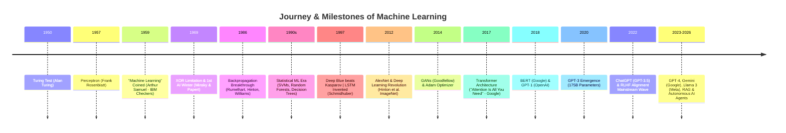
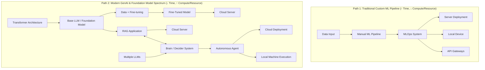
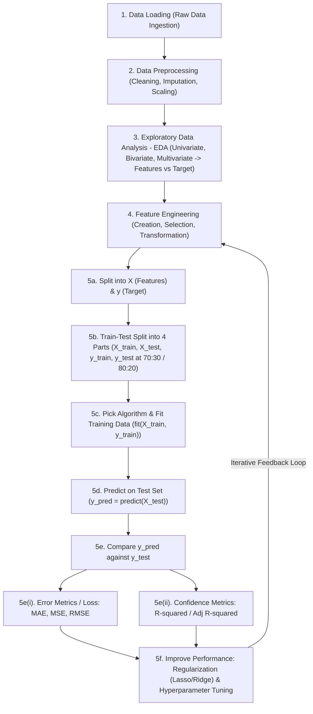
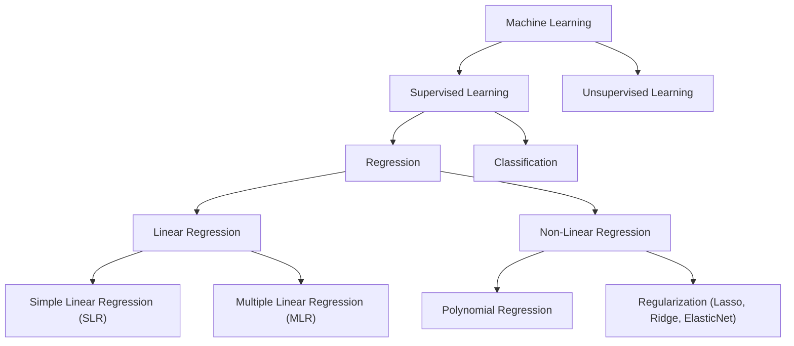
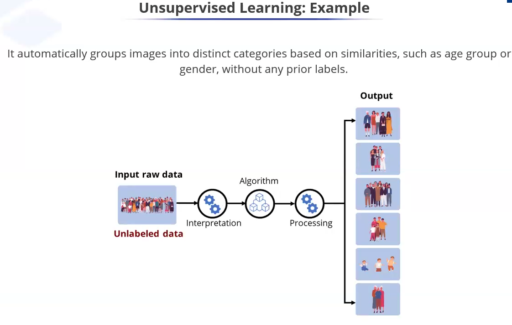
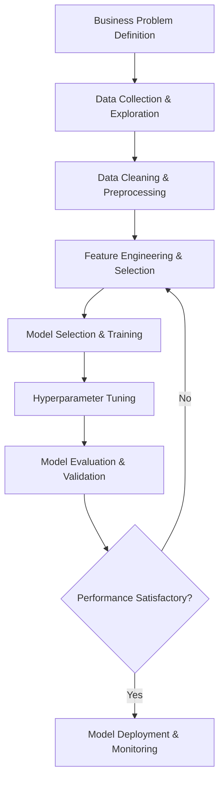

# Machine Learning — Complete Class Notes & Concepts

Welcome to **`ClassnoteMachineLearning.md`**! This document serves as a comprehensive, structured repository for Machine Learning notes, theoretical foundations, mathematical formulations, code implementations, and practical workflows.

---

## 📂 Table of Contents
0. [Key Industry Terminology](#0-key-industry-terminology)
1. [Overview & Machine Learning Fundamentals](#1-overview--machine-learning-fundamentals)
   - [1.0 Historical Evolution & Journey](#10-the-historical-evolution--journey-of-machine-learning)
   - [1.1 Hierarchy (AI, ML, DL)](#11-hierarchy-of-artificial-intelligence-machine-learning--deep-learning)
   - [1.2 Classical Programming vs. Machine Learning Paradigm](#12-classical-programming-vs-machine-learning-paradigm)
   - [1.3 Modern AI Architectural Spectrum & Learning Path](#13-modern-ai-industry-architectural-spectrum--learning-path)
   - [1.4 Core ML & Deep Learning Libraries Ecosystem](#14-core-ml--deep-learning-libraries-ecosystem)
2. [Supervised Learning](#2-supervised-learning)
   - [2.0 Standard 6-Step Execution Blueprint](#20-standard-6-step-execution-blueprint-for-any-supervised-ml-model)
   - [2.1 Regression Analysis & Applications](#21-regression-analysis--applications)
   - [2.2 Classification Models & Thresholding](#classification-models)
3. [Unsupervised Learning](#3-unsupervised-learning)
   - [Clustering](#clustering)
   - [Dimensionality Reduction](#dimensionality-reduction)
4. [Feature Engineering & Data Preprocessing](#4-feature-engineering--data-preprocessing)
5. [Model Evaluation & Validation](#5-model-evaluation--validation)
6. [Bias-Variance Tradeoff & Regularization](#6-bias-variance-tradeoff--regularization)
7. [Ensemble Techniques](#7-ensemble-techniques)
8. [Practical Machine Learning Workflow](#8-practical-machine-learning-workflow)
9. [Code Snippets & Cheatsheets](#9-code-snippets--cheatsheets)
10. [Reference Links & External Learning Resources](#10-reference-links--external-learning-resources)

---

## 0. Key Industry Terminology

| Term | 1 to 2 Line Definition / Description |
| :--- | :--- |
| **ML (Machine Learning)** | A branch of Artificial Intelligence where algorithms learn statistical patterns from data to make predictions or decisions automatically without being explicitly programmed. |
| **MLOps (Machine Learning Operations)** | The engineering practice of automating and managing the entire ML lifecycle—including data pipelines, CI/CD deployment, continuous monitoring, and model governance in production. |
| **Generative AI (GenAI)** | A category of AI models trained on vast datasets to create brand new content (such as text, images, code, audio, and video) rather than just categorizing existing data. |
| **LLM (Large Language Model)** | A deep neural network (typically Transformer-based) trained on massive text corpora with billions of parameters to understand, summarize, translate, and generate human language. |
| **Base Model (Foundation Model)** | A large-scale neural network pre-trained on broad data that serves as a general foundation, designed to be fine-tuned or adapted for specific downstream tasks. |
| **Base LLM** | A raw Large Language Model trained strictly to complete text by predicting the next token, before any instruction-tuning (IT) or Reinforcement Learning from Human Feedback (RLHF) is applied. |
| **RAG (Retrieval-Augmented Generation)** | An architecture framework that enhances LLM responses by retrieving relevant facts/documents from external databases or vector stores before generating answers, preventing hallucinations. |
| **MCP (Model Context Protocol)** | An open standard protocol that enables AI models and agents to securely connect to external tools, databases, local file systems, and API services through a standardized interface. |
| **MultiAgent (Multi-Agent System)** | An architectural framework where multiple specialized AI agents collaborate, divide complex workflows, share context, and coordinate tool execution to accomplish tasks beyond single-agent capabilities. |
| **Transformer** | A breakthrough neural network architecture relying on self-attention mechanisms to process sequential data in parallel, serving as the core foundation for modern LLMs and Generative AI. |
| **OLS (Ordinary Least Squares)** | A foundational linear regression optimization method that calculates model coefficients ($\beta$) by minimizing the sum of squared differences (residuals) between actual and predicted target values. |

---

## 1. Overview & Machine Learning Fundamentals

### 1.0 The Historical Evolution & Journey of Machine Learning

#### 🏛️ The Coining of "Machine Learning" (Arthur Samuel, 1959)
* **Arthur Samuel** (an IBM computer scientist and pioneer in computer gaming) coined the term **"Machine Learning"** in **1959**.
* He demonstrated this by creating a self-learning **Checkers program** on the IBM 704 computer. The program played thousands of games against itself, calculated board positions, and gradually learned to beat human players.
* **Arthur Samuel's Classic Definition**:
  > *"Machine Learning is the field of study that gives computers the ability to learn without being explicitly programmed."*

---

#### 📈 Andrew Ng's Scale Paradigm: Traditional ML vs. Deep Learning

Pioneering AI educator **Andrew Ng** illustrated a fundamental law of AI scalability that explains why the industry shifted from traditional ML to Deep Learning and LLMs:

```
  Model Performance
         ▲
         │                                       /  Large Neural Nets / Transformers (LLMs)
         │                                      /
         │                                     /   Medium Neural Nets
         │                                    /
         │  ---------------------------------/     Small Neural Nets
         │  --------------------------------/      Traditional ML (SVMs, Random Forests, Logistic Reg)
         │  ───────────────────────────────/       (Performance plateaus as data volume increases)
         │
         └─────────────────────────────────────────────────────────────────► Amount of Data / Compute
```

* **Traditional ML Bottleneck**: Algorithms like Support Vector Machines (SVMs), Logistic Regression, and Decision Trees hit a **performance plateau**. Adding millions of extra data points yields diminishing returns.
* **Deep Learning & LLM Scaling Law**: Large Neural Networks (Deep Learning and Transformers) scale continuously—the more data and compute you feed them, the better their performance becomes ($P \propto \text{Data} \times \text{Parameters} \times \text{Compute}$).

---

#### ⏳ Complete Chronological Timeline of Machine Learning & AI



| Era / Year | Milestone / Breakthrough | Significance & Impact |
| :--- | :--- | :--- |
| **1950** | **Turing Test (Alan Turing)** | Introduced the concept of machine intelligence testing ("Can machines think?"). |
| **1957** | **Perceptron (Frank Rosenblatt)** | First hardware implementation of an artificial single-layer neural network. |
| **1959** | **Arthur Samuel Coined "Machine Learning"** | Demonstrated self-learning software using an IBM Checkers program. |
| **1969** | **Minsky & Papert's "Perceptrons" Book** | Proved single-layer perceptrons couldn't solve XOR; triggered the 1st "AI Winter". |
| **1986** | **Backpropagation Algorithm** | Popularized by Geoffrey Hinton et al., enabling efficient training of multi-layer neural networks. |
| **1990s** | **Statistical Machine Learning Era** | Vapnik's Support Vector Machines (SVM) and Breiman's Random Forests dominated industry applications. |
| **1997** | **Deep Blue & LSTM Networks** | IBM's Deep Blue beat chess champion Kasparov; Hochreiter & Schmidhuber introduced LSTMs. |
| **2012** | **AlexNet (ImageNet Victory)** | GPU-accelerated deep CNN smashed vision benchmarks; kicked off the **Deep Learning Revolution**. |
| **2017** | **Transformer Architecture (Google)** | Paper *"Attention Is All You Need"* replaced RNNs/LSTMs with parallel self-attention mechanisms. |
| **2018 - 2020** | **BERT & GPT Series (OpenAI/Google)** | Self-supervised pre-training at scale; GPT-3 demonstrated zero-shot and few-shot language capabilities. |
| **2022** | **ChatGPT & RLHF Alignment** | Reinforcement Learning from Human Feedback (RLHF) made conversational GenAI accessible globally. |
| **2023 - 2026+** | **Multimodal LLMs & AI Agents** | GPT-4, Gemini, Claude, Llama 3, RAG systems, and autonomous multi-agent tool execution. |

---

### 1.1 Hierarchy of Artificial Intelligence, Machine Learning & Deep Learning


```
┌──────────────────────────────────────────────────────────────────────────┐
│ ARTIFICIAL INTELLIGENCE (AI)                                             │
│  Systems or machines mimicking human intelligence to perform tasks       │
│  ┌────────────────────────────────────────────────────────────────────┐  │
│  │ MACHINE LEARNING (ML)                                              │  │
│  │  Algorithms learning statistical patterns from data automatically │  │
│  │  ┌──────────────────────────────────────────────────────────────┐  │  │
│  │  │ DEEP LEARNING (DL)                                           │  │  │
│  │  │  Multi-layer neural networks (Transformers, CNNs, RNNs)     │  │  │
│  │  └──────────────────────────────────────────────────────────────┘  │  │
│  └────────────────────────────────────────────────────────────────────┘  │
└──────────────────────────────────────────────────────────────────────────┘
```

* **Artificial Intelligence (AI)**: The broader field of creating intelligent systems capable of reasoning, problem-solving, and decision-making.
* **Machine Learning (ML)**: A sub-field of AI focused on learning mapping functions $f(X) \to y$ from data without explicit hardcoded rules.
* **Deep Learning (DL)**: A sub-field of ML based on deep artificial neural networks capable of learning hierarchical feature representations directly from raw unstructured data.

---

### 1.2 Classical Programming vs. Machine Learning Paradigm


```
Classical Programming Paradigm (Software 1.0):
┌───────────┐
│   Rules   │──┐
└───────────┘  │    ┌──────────────────────┐
               ├────► Classical Programming ├────► Answers
┌───────────┐  │    └──────────────────────┘
│   Data    │──┘
└───────────┘

Machine Learning Paradigm (Software 2.0):
┌───────────┐
│   Data    │──┐
└───────────┘  │    ┌──────────────────────┐
               ├────►   Machine Learning   ├────► Rules (Trained Model)
┌───────────┐  │    └──────────────────────┘
│  Answers  │──┘
└───────────┘
```

#### Detailed Breakdown & Comparison

| Dimension | Classical Programming (Software 1.0) | Machine Learning Paradigm (Software 2.0) |
| :--- | :--- | :--- |
| **Input Ingredients** | Human-written **Rules** (if-else logic, explicit math formulas) $+$ Input **Data**. | Historical **Data** (features $X$) $+$ Ground-truth **Answers** (labels $y$). |
| **Output Result** | Computed **Answers** (calculated output values). | Learned **Rules** (trained model function $f(X) \to y$, parameters $\theta$). |
| **Who Writes the Rules?** | Human programmers explicitly code every single condition and edge case. | The ML algorithm automatically extracts and learns rules by analyzing patterns. |
| **Handling Complexity** | Becomes brittle and unmaintainable for complex tasks (e.g. face recognition, sentiment analysis). | Excels at high-dimensional, unstructured, complex problems (images, audio, text, sensor data). |
| **Analogy** | Following a rigid, hardcoded baking recipe to make a cake. | Feeding a chef 1,000 cakes and raw ingredients so the chef deduces the recipes. |

* **Technical Definition (Tom Mitchell, 1997)**: A computer program is said to learn from experience **E** with respect to some class of tasks **T** and performance measure **P**, if its performance at tasks in **T**, as measured by **P**, improves with experience **E**.

---

#### 💡 How Machine Learning Works: Representation Learning & Coordinate Transformations


```
Step 1: Raw Data                    Step 2: Coordinate Change              Step 3: Better Representation
(Entangled in original space)       (Mathematical transformation)          (Linearly separable at x = 0)
        y │                                y │                                    y │
          │  ●   ●                           │ \  ●   ●                             │  │
       ○  │    ●   ●                      ○  │  \   ●   ●                        ○   │  │ ●   ●
     ○  ○ │  ●                              ○  ○ │   \  ●                        ○  ○  │  │   ●   ●
       ○  │    ●                              ○  │ \  \   ●                        ○   │  │ ●
          │  ●                                   │  \  \                         ───┼──┼──────────► x
   ───────┼──────────► x                  ───────┼───\──\───► x                     │  │ ●
          │                                      │    \  \                          │  │   ●
```

##### The Core Mechanism of Machine Learning:
* **Machine Learning is Searching for Useful Representations**: Machine Learning algorithms do not just "memorize" data; they apply **geometric transformations** (rotations, scaling, projections, activations) to project raw input data into a new coordinate space where the underlying pattern or decision boundary becomes simple and linearly separable.
* **Classical ML vs. Deep Learning Representation**:
  * **Classical ML**: Relies on engineers to manually engineer coordinate transformations (e.g. PCA, SVM kernel trick, polynomial projections).
  * **Deep Learning**: Automatically learns complex multi-layered coordinate transformations sequentially across neural network layers.

---

### 1.3 Modern AI Industry Architectural Spectrum & Learning Path




#### Comparison of Architectural Trade-offs
| Spectrum / Approach | Time to Value ($\text{Time}$) | Resource & Compute Requirements ($\text{Resources}$) | Infrastructure & Deployment | Primary Use Cases |
| :--- | :--- | :--- | :--- | :--- |
| **Traditional Custom ML** | **Higher Time ($\uparrow$)**: Requires manual feature engineering, custom training & tuning. | **Lower Resources ($\downarrow$)**: Runs efficiently on standard CPUs / lightweight servers. | Deployed via MLOps pipelines to Local, Server, or API Gateways. | Structured tabular data, Fraud scoring, Churn prediction, Sensor metrics. |
| **Foundation Models / GenAI** | **Lower Time ($\downarrow$)**: Pre-trained Base LLMs provide immediate out-of-the-box capabilities. | **Higher Resources ($\uparrow$)**: Requires GPU clusters, high memory, and token budget. | Deployed on Cloud Servers, Vector DBs (RAG), and Autonomous Agent Runtimes. | Text generation, Document Q&A (RAG), Code synthesis, Multi-Agent decision-making. |

---

### Primary Types of Machine Learning

```
                               ┌───────────────────────────┐
                               │ Machine Learning Types    │
                               └─────────────┬─────────────┘
                                             │
       ┌──────────────────────┬──────────────┴───────────────┬──────────────────────┐
       ▼                      ▼                              ▼                      ▼
┌──────────────┐       ┌──────────────┐              ┌──────────────┐       ┌──────────────┐
│ 1.Supervised │       │2.Unsupervised│              │3.Semi-Superv.│       │4.Reinforcement│
│   Learning   │       │   Learning   │              │   Learning   │       │   Learning   │
└──────┬───────┘       └──────────────┘              └──────────────┘       └──────┬───────┘
       │ (Labeled Data)  (Unlabeled Data)             (Small Labeled +             │ (Environment &
       ├───────────────┐                              Large Unlabeled)             │  Feedback Loop)
       ▼               ▼                                                           ▼
┌─────────────┐ ┌──────────────┐                                            ┌──────────────┐
│ Regression  │ │Classification│                                            │  Recurrent   │
│ (Continuous)│ │ (Categories) │                                            │Feedback Loop │
└─────────────┘ └──────────────┘                                            └──────────────┘
       ▲               ▲
       └───────┬───────┘
               │ (Meta-Technique)
        ┌──────────────┐
        │   Ensemble   │
        │   Learning   │
        └──────────────┘
```

| # | Type / Paradigm | Data & Signal Source | Learning Mechanism & Objective | Key Examples & Use Cases |
| :--- | :--- | :--- | :--- | :--- |
| **1** | **Supervised Learning** | Fully Labeled dataset $(X, y)$ | Learns an explicit mapping function $f(X) \to y$ from known input-output pairs. | Spam detection, House pricing, Credit scoring |
| **2** | **Unsupervised Learning** | Unlabeled dataset $(X)$ | Discovers intrinsic patterns, clusters, hidden structures, or reduced representations without targets. | Customer segmentation, Anomaly detection, PCA |
| **3** | **Semi-Supervised Learning** | Small labeled dataset $+$ large volume of unlabeled data | Leverages unlabeled data distribution to improve learning accuracy when labeling is expensive. | Medical image diagnosis, Protein annotation, Web categorization |
| **4** | **Reinforcement Learning** | Environment, Agent, States ($S$), Actions ($A$), and Reward signals ($R$) | Learns an optimal policy $\pi(s)$ via **feedback loops** (trial-and-error) to maximize long-term cumulative reward. | Robotics, Autonomous vehicles, Game AI (Chess/Go), RLHF (LLM alignment) |

---

### Core Sub-Types & Model Combinations

1. **Regression (Sub-type)**: Output is a continuous numerical value (e.g., salary, price, temperature).
2. **Classification (Sub-type)**: Maps continuous inputs/probabilities into discrete groups/categories (e.g., $0$ vs $1$, Cat vs Dog).
3. **Ensemble Learning (Meta-type / Multi-model Synergy)**: A powerful approach where **multiple models work together** to produce a single, superior prediction:
   * **Bagging (Parallel)**: Trains multiple models independently on different data subsets and averages their votes (e.g., Random Forest).
   * **Boosting (Sequential)**: Trains models in series, where each new model focuses on correcting the errors/feedback of previous models (e.g., XGBoost, LightGBM).
   * **Stacking (Heterogeneous)**: Combines predictions of completely different model types using a meta-model.

---

### 1.4 Core ML & Deep Learning Libraries Ecosystem

| Library | Backed / Created By | Primary Domain & Focus | Key Capabilities & Features | Typical Import & Usage |
| :--- | :--- | :--- | :--- | :--- |
| **SciPy** | SciPy / NumFOCUS Community | Scientific Computing & Advanced Math | Advanced numerical integration, optimization (`scipy.optimize`), hypothesis testing & probability (`scipy.stats`), linear algebra, and signal processing. | `import scipy as sp`<br>`from scipy import stats, optimize` |
| **Scikit-learn (`scikit`)** | INRIA / Open-Source Community | Traditional Machine Learning | Industry-standard toolkit for classical ML: classification, regression, clustering, feature scaling (`StandardScaler`), model selection, and pipelines. | `import sklearn`<br>`from sklearn.ensemble import RandomForestClassifier` |
| **TensorFlow** | **Google** (Google Brain / DeepMind) | Industrial & Enterprise Deep Learning | End-to-end production DL framework with Keras API, static graph compilation, mobile/edge deployment (TF Lite), and TF Serving for high-throughput production. | `import tensorflow as tf`<br>`from tensorflow import keras` |
| **PyTorch** | **Meta** (FAIR / PyTorch Foundation) | Research & Generative AI Deep Learning | Dynamic computational graphs (`autograd`), highly pythonic syntax, dominant ecosystem for Transformers, LLMs (Hugging Face), and modern GenAI research. | `import torch`<br>`import torch.nn as nn` |
| **Keras** | François Chollet / **Google** & Community | High-Level Deep Learning API | User-friendly, high-level API designed for fast experimentation. Keras 3 functions as a multi-backend API supporting **TensorFlow**, **PyTorch**, and **JAX** seamlessly. | `import keras`<br>`from keras import layers, models` |

---

## 2. Supervised Learning


> **Key Rule**: A supervised learning method uses labeled data to predict outcomes guided by specific input-output pairs. Here, both inputs and outputs are known.

Supervised Learning is divided into two primary categories based on the nature of the target variable $y$: **Regression** and **Classification**.

---

### 2.0 Complete End-to-End Supervised Machine Learning Pipeline


Every real-world Machine Learning project follows an iterative 5-phase end-to-end lifecycle, encompassing crucial **Pre-Preprocessing Steps** before model training:



#### Detailed Phase-by-Phase Implementation Blueprint

| Phase # | Pipeline Step Name | Analytical Objective & Operational Details | Code & Library Reference |
| :--- | :--- | :--- | :--- |
| **Phase 1** | **1. Data Loading** | Ingest raw data from CSV, SQL databases, or APIs into structured DataFrames. | `import pandas as pd`<br>`df = pd.read_csv("data.csv")` |
| **Phase 2** | **2. Data Preprocessing** | Handle missing values (`SimpleImputer`), treat outliers, scale numbers (`StandardScaler`), and encode categories (`OneHotEncoder`). | `from sklearn.impute import SimpleImputer`<br>`from sklearn.preprocessing import StandardScaler` |
| **Phase 3** | **3. Exploratory Data Analysis (EDA)** | Perform **Univariate**, **Bivariate**, and **Multivariate** analysis to discover correlations between Features $\leftrightarrow$ Target ($y$). | `import seaborn as sns`<br>`sns.pairplot(df)`<br>`df.corr()` |
| **Phase 4** | **4. Feature Engineering** | Create new domain features, drop collinear attributes, apply polynomial expansions, or apply PCA. | `df['feature_ratio'] = df['f1'] / df['f2']` |
| **Phase 5a** | **5a. Feature & Target Separation ($X, y$)** | Split DataFrame into feature matrix $X$ (independent variables) and target vector $y$ (outcome). | `X = df.drop(columns=['target'])`<br>`y = df['target']` |
| **Phase 5b** | **5b. Train-Test Splitting (4 Parts)** | Partition $X$ and $y$ into 4 parts ($X_{train}, X_{test}, y_{train}, y_{test}$) at **80:20** or **70:30** ratio with fixed `random_state`. | `from sklearn.model_selection import train_test_split`<br>`X_train, X_test, y_train, y_test = train_test_split(X, y, test_size=0.2, random_state=42)` |
| **Phase 5c** | **5c. Algorithm Fitting (`fit`)** | Select model family (e.g., `LinearRegression`, `RandomForest`) and fit parameters on $X_{train}, y_{train}$. | `model = LinearRegression()`<br>`model.fit(X_train, y_train)` |
| **Phase 5d** | **5d. Predictions (`predict`)** | Feed unseen test features $X_{test}$ into the fitted model to generate test predictions $\hat{y}_{pred}$. | `y_pred = model.predict(X_test)` |
| **Phase 5e** | **5e. Result Comparison & Metrics** | Statistically evaluate $\hat{y}_{pred}$ against true $y_{test}$:<br>*(i) Error/Loss*: MAE, MSE, RMSE<br>*(ii) Confidence*: $R^2$ / Adjusted $R^2$ | `from sklearn.metrics import mean_squared_error, r2_score`<br>`mse = mean_squared_error(y_test, y_pred)`<br>`r2 = r2_score(y_test, y_pred)` |
| **Phase 5f** | **5f. Optimization & Feedback Loop** | Tune hyperparameters (`GridSearchCV`), apply **Regularization** (Lasso, Ridge, ElasticNet), and iterate back to **Phase 4 (Feature Engineering)**. | `from sklearn.linear_model import Ridge`<br>`from sklearn.model_selection import GridSearchCV` |

---

### 💡 Core Distinction: Regression vs. Classification

```
                          ┌──────────────────────────┐
                          │   Supervised Learning    │
                          └────────────┬─────────────┘
                                       │
            ┌──────────────────────────┴──────────────────────────┐
            ▼                                                     ▼
  ┌───────────────────┐                                 ┌───────────────────┐
  │    REGRESSION     │                                 │  CLASSIFICATION   │
  │ Continuous Output │                                 │ Categorical/Group │
  │  y ∈ (-∞, +∞)     │                                 │     y ∈ {0, 1}    │
  └───────────────────┘                                 └───────────────────┘
   Predicts a quantity                                   Predicts a category
   (e.g., $450,000, 36.6°C)                             (e.g., 0: Safe, 1: Spam)
```

#### Detailed Comparison Table
| Feature / Dimension | Regression Models | Classification Models |
| :--- | :--- | :--- |
| **Output Type** | Continuous numerical value ($y \in \mathbb{R}$) | Discrete label / category ($y \in \{0, 1\}$ or $\{C_1, C_2, \dots, C_K\}$) |
| **Primary Goal** | Estimate a quantity or value on a continuous scale. | Group data points into predefined categories. |
| **Decision Mechanism** | Direct numerical output based on features. | Probability estimation + **Thresholding** (e.g., if $P(y=1) \ge 0.5 \implies 1$). |
| **Common Loss Functions** | Mean Squared Error (MSE), Mean Absolute Error (MAE), RMSE | Binary Cross-Entropy (Log Loss), Categorical Cross-Entropy |
| **Example Questions** | *"What will be the price of this house?"* <br> *"What will tomorrow's temperature be?"* | *"Is this email spam (1) or inbox (0)?"* <br> *"Is this transaction fraudulent (1) or legitimate (0)?"* |

---

### How Classification Converts Numbers into Groups (0 and 1)

Classification often works internally by predicting a **continuous probability score** between $0$ and $1$, and then applying a **decision threshold** to assign a discrete group label:

1. **Raw Numerical Output ($z$)**: The model computes a linear combination of input features:
   $$z = \theta_0 + \theta_1 x_1 + \theta_2 x_2 + \dots + \theta_n x_n = \theta^T X$$
2. **Probability Mapping (Sigmoid Activation)**: The raw score $z$ (which can be any real number from $-\infty$ to $+\infty$) is squeezed into a probability range $[0, 1]$:
   $$\hat{p} = \sigma(z) = \frac{1}{1 + e^{-z}}$$
3. **Thresholding (Converting into Groups 0 or 1)**:
   $$\hat{y} = \begin{cases} 1 & \text{if } \hat{p} \ge \text{Threshold } (e.g., 0.5) \quad \Rightarrow \text{Group 1 (Positive Class)} \\ 0 & \text{if } \hat{p} < \text{Threshold } (e.g., 0.5) \quad \Rightarrow \text{Group 0 (Negative Class)} \end{cases}$$

---

### 2.1 Regression Analysis & Applications

#### 🌳 Machine Learning & Regression Taxonomy Tree




---

#### 🌐 Industry Use Cases of Regression
| Industry Domain | Real-World Application & Objective | Input Features ($X$) | Target Variable ($y$) |
| :--- | :--- | :--- | :--- |
| **Real Estate** | Property price valuation and market appraisal. | Square footage, location, bedrooms, age, proximity to transit | House Sale Price ($) |
| **Retail & E-commerce** | Demand forecasting and inventory planning. | Promotional spend, historical sales, season, price discount | Product Demand Units |
| **Healthcare** | Patient disease progression & hospital stay length. | Age, BMI, blood pressure, dosage, biomarker levels | Recovery Time (Days) |
| **Marketing** | Campaign effectiveness and ROI estimation. | Ad spend (TV, Social, Search), target demographic size | Expected Revenue ($) |
| **Energy / Oil & Gas** | Surface & subsurface global production forecasting. | Pressure, flow rate, temperature, well depth | Daily Oil Production (Barrels) |

---

#### 📐 Linear Regression Foundations

##### 1. Simple Linear Regression (Single Feature)
* **Equation**: 
  $$y = \beta_0 + \beta_1 x + \epsilon$$
  *(where $\beta_0$ is the intercept, $\beta_1$ is the slope, and $\epsilon \sim \mathcal{N}(0, \sigma^2)$ is random error).*
* **Ordinary Least Squares (OLS) Closed-Form Solution**:
  $$\beta_1 = \frac{\sum_{i=1}^n (x_i - \bar{x})(y_i - \bar{y})}{\sum_{i=1}^n (x_i - \bar{x})^2}, \quad \beta_0 = \bar{y} - \beta_1 \bar{x}$$

##### 2. Multiple Linear Regression (Multiple Features)
* **Equation**:
  $$\hat{y} = \beta_0 + \beta_1 x_1 + \beta_2 x_2 + \dots + \beta_p x_p = X \beta$$
* **Normal Equation (Matrix Closed-Form Solution)**:
  $$\hat{\beta} = (X^T X)^{-1} X^T y$$

##### ⚠️ 5 Critical Assumptions of Linear Regression
1. **Linearity**: The relationship between features $X$ and target $y$ is additive and linear.
2. **Independence of Errors**: Residuals $e_i = y_i - \hat{y}_i$ are uncorrelated (no autocorrelation).
3. **Homoscedasticity**: The variance of errors is constant across all predicted values ($\text{Var}(e_i) = \sigma^2$).
4. **Normality of Residuals**: The residual errors follow a normal distribution ($\epsilon \sim \mathcal{N}(0, \sigma^2)$).
5. **No Multicollinearity**: Input features are not highly linearly correlated with each other ($\text{VIF} < 5$).

---

#### 📈 Non-Linear Regression: Polynomial Regression

When data exhibits a non-linear curvature, we expand input features into higher-degree polynomial terms:

$$y = \beta_0 + \beta_1 x + \beta_2 x^2 + \beta_3 x^3 + \dots + \beta_d x^d + \epsilon$$

```python
from sklearn.preprocessing import PolynomialFeatures
from sklearn.linear_model import LinearRegression
from sklearn.pipeline import make_pipeline

# 2nd Degree Polynomial Model
poly_model = make_pipeline(PolynomialFeatures(degree=2), LinearRegression())
# poly_model.fit(X_train, y_train)
```

---

#### 📊 Regression Performance Metrics

| Metric | Mathematical Formula | Key Characteristics & Interpretation |
| :--- | :--- | :--- |
| **MSE** *(Mean Squared Error)* | $\frac{1}{n} \sum_{i=1}^n (y_i - \hat{y}_i)^2$ | Heavily penalizes large outlier errors due to squaring term. |
| **RMSE** *(Root Mean Squared Error)* | $\sqrt{\frac{1}{n} \sum_{i=1}^n (y_i - \hat{y}_i)^2}$ | Interpretable in the exact same units as target variable $y$. |
| **MAE** *(Mean Absolute Error)* | $\frac{1}{n} \sum_{i=1}^n \|y_i - \hat{y}_i\|$ | Robust to outliers (linear penalty for deviations). |
| **$R^2$** *(Coefficient of Determination)* | $1 - \frac{\sum (y_i - \hat{y}_i)^2}{\sum (y_i - \bar{y})^2}$ | Measures proportion of target variance explained by features ($0 \le R^2 \le 1$). |
| **Adjusted $R^2$** | $1 - \left[ \frac{(1 - R^2)(n - 1)}{n - p - 1} \right]$ | Adjusts $R^2$ by penalizing the addition of irrelevant/noise features ($p$). |

---

#### 🛡️ Regularization Techniques (L1, L2 & ElasticNet)

Regularization prevents **Overfitting** (High Variance) by adding a penalty term to the MSE loss function to constrain model coefficients ($\beta$).

```
                      Loss = MSE + Penalty(β)
```

##### 1. Lasso Regression (L1 Penalty)
* **Objective Function**:
  $$J(\beta) = \frac{1}{2n} \sum_{i=1}^n (y_i - X_i \beta)^2 + \alpha \sum_{j=1}^p |\beta_j|$$
* **Key Characteristic**: Performs **Automatic Feature Selection** by driving irrelevant feature coefficients to **exact zero** ($\beta_j = 0$).

##### 2. Ridge Regression (L2 Penalty)
* **Objective Function**:
  $$J(\beta) = \frac{1}{2n} \sum_{i=1}^n (y_i - X_i \beta)^2 + \alpha \sum_{j=1}^p \beta_j^2$$
* **Key Characteristic**: Shrinks coefficients towards zero, effectively mitigating **Multicollinearity** and preventing any single feature from dominating.

##### 3. ElasticNet Regression (L1 + L2 Hybrid)
* **Objective Function**:
  $$J(\beta) = \text{MSE} + \alpha \left[ l_1\text{-ratio} \sum_{j=1}^p |\beta_j| + \frac{1 - l_1\text{-ratio}}{2} \sum_{j=1}^p \beta_j^2 \right]$$
* **Key Characteristic**: Combines Lasso's sparsity/feature selection with Ridge's stability when handling correlated feature groups.

---

#### ⚙️ End-to-End Production Pipeline (Scikit-Learn `Pipeline` & `ColumnTransformer`)

Using Scikit-Learn `Pipeline` guarantees that missing value imputation (`SimpleImputer`), feature scaling (`StandardScaler`), categorical encoding (`OneHotEncoder`), and model fitting occur inside cross-validation folds without **Data Leakage**:

```python
import numpy as np
import pandas as pd
from sklearn.compose import ColumnTransformer
from sklearn.pipeline import Pipeline
from sklearn.impute import SimpleImputer
from sklearn.preprocessing import StandardScaler, OneHotEncoder
from sklearn.linear_model import Ridge
from sklearn.model_selection import GridSearchCV, train_test_split

# 1. Define Numeric & Categorical Columns
num_cols = ["housing_median_age", "total_rooms", "median_income"]
cat_cols = ["ocean_proximity"]

# 2. Build Preprocessing Pipelines
num_pipeline = Pipeline([
    ("imputer", SimpleImputer(strategy="median")),
    ("scaler", StandardScaler())
])

cat_pipeline = Pipeline([
    ("imputer", SimpleImputer(strategy="most_frequent")),
    ("encoder", OneHotEncoder(handle_unknown="ignore"))
])

# 3. Combine Preprocessors
preprocessor = ColumnTransformer([
    ("num", num_pipeline, num_cols),
    ("cat", cat_pipeline, cat_cols)
])

# 4. Create Full Execution Pipeline with Ridge Model
full_pipeline = Pipeline([
    ("preprocessing", preprocessor),
    ("regressor", Ridge())
])

# 5. Hyperparameter Tuning with GridSearchCV
param_grid = {
    "regressor__alpha": [0.1, 1.0, 10.0, 100.0]
}

# grid_search = GridSearchCV(full_pipeline, param_grid, cv=5, scoring="r2")
# grid_search.fit(X_train, y_train)
```

---

### Classification Models
Predicting discrete class labels $y \in \{0, 1, \dots, K-1\}$.

#### Logistic Regression
* **Sigmoid Function**:
  $$\sigma(z) = \frac{1}{1 + e^{-z}}$$
* **Decision Boundary**: $\hat{p} \ge 0.5 \implies \hat{y} = 1$
* **Binary Cross-Entropy Loss**:
  $$J(\theta) = -\frac{1}{m} \sum_{i=1}^{m} \left[ y^{(i)} \log(\hat{y}^{(i)}) + (1 - y^{(i)}) \log(1 - \hat{y}^{(i)}) \right]$$

---

## 3. Unsupervised Learning



> **Key Concept**: Unsupervised Learning automatically groups raw unlabeled data into distinct categories or clusters based on inherent similarities (such as age group, demographic traits, or feature density) without any prior target labels.

---

### Clustering
#### K-Means Clustering
1. Initialize $K$ cluster centroids randomly.
2. **Assignment Step**: Assign each data point to the nearest centroid.
3. **Update Step**: Recompute the centroid of each cluster as the mean of all points assigned to it.
4. Repeat until centroids converge.

---

### Semi-Supervised Learning


> **Key Concept**: Semi-Supervised Learning combines a **small amount of labeled data** with a **large volume of unlabeled raw data**. The machine learning model uses the labeled points as anchors and leverages the structural distribution of the unlabeled data to infer labels across fine-grained target categories (e.g. Babies, Teens, Tweens, Adults, Youth, Senior citizens).

* **When to Use**: When acquiring target labels is extremely expensive, time-consuming, or requires domain expertise (e.g. medical image annotation, genome sequencing), but large amounts of raw unlabeled data are readily available.
* **Common Techniques**: Pseudo-Labeling, Label Propagation, Self-Training, Semi-Supervised VAEs / GANs.

---

## 4. Feature Engineering & Data Preprocessing

* **Scaling Techniques**:
  * **Standardization (Z-Score)**: $x' = \frac{x - \mu}{\sigma}$ (Mean = 0, Std = 1)
  * **Min-Max Scaling**: $x' = \frac{x - x_{min}}{x_{max} - x_{min}}$ (Bounds $[0, 1]$)
* **Categorical Encoding**:
  * **One-Hot Encoding**: For nominal categories without ordinal relationship.
  * **Ordinal Encoding**: For categories with inherent order (e.g., Low, Medium, High).

---

## 5. Model Evaluation & Validation

### Classification Metrics
| Metric | Formula | Interpretation |
| :--- | :--- | :--- |
| **Accuracy** | $\frac{TP + TN}{TP + TN + FP + FN}$ | Overall proportion of correct predictions. |
| **Precision** | $\frac{TP}{TP + FP}$ | Out of all predicted positives, how many were truly positive? (Low FP focus) |
| **Recall (Sensitivity)** | $\frac{TP}{TP + FN}$ | Out of all actual positives, how many did we catch? (Low FN focus) |
| **F1-Score** | $2 \cdot \frac{\text{Precision} \cdot \text{Recall}}{\text{Precision} + \text{Recall}}$ | Harmonic mean of Precision and Recall. |

---

## 6. Bias-Variance Tradeoff & Regularization

* **High Bias (Underfitting)**: Model is too simple, fails to capture underlying patterns.
* **High Variance (Overfitting)**: Model is too complex, fits noise in training data.
* **Regularization Techniques**:
  * **L1 Regularization (Lasso)**: Adds $\lambda \sum |\theta_j|$ penalty. Promotes sparsity (feature selection).
  * **L2 Regularization (Ridge)**: Adds $\lambda \sum \theta_j^2$ penalty. Shrinks coefficients towards zero.

---

## 7. Ensemble Techniques

* **Bagging (Bootstrap Aggregating)**: Trains parallel models on random bootstrap samples (e.g., Random Forest). Reduces variance.
* **Boosting**: Trains sequential models where each model corrects errors of previous models (e.g., XGBoost, LightGBM, AdaBoost). Reduces bias.
* **Stacking**: Combines predictions of diverse base models using a meta-learner.

---

## 8. Practical Machine Learning Workflow



---

## 9. Code Snippets & Cheatsheets

### Python Baseline Model Template
```python
import numpy as np
import pandas as pd
from sklearn.model_selection import train_test_split
from sklearn.preprocessing import StandardScaler
from sklearn.ensemble import RandomForestClassifier
from sklearn.metrics import classification_report, roc_auc_score

# 1. Load Data
# df = pd.read_csv("data.csv")

# 2. Split Features & Target
# X = df.drop(columns=["target"])
# y = df["target"]

# 3. Train-Test Split
# X_train, X_test, y_train, y_test = train_test_split(X, y, test_size=0.2, random_state=42, stratify=y)

# 4. Preprocessing & Modeling Pipeline
# scaler = StandardScaler()
# X_train_scaled = scaler.fit_transform(X_train)
# X_test_scaled = scaler.transform(X_test)

# model = RandomForestClassifier(n_estimators=100, random_state=42)
# model.fit(X_train_scaled, y_train)

# 5. Evaluation
# y_pred = model.predict(X_test_scaled)
# print(classification_report(y_test, y_pred))
```

---

## 10. Reference Links & External Learning Resources

| Resource Name | Website URL | Description & Key Focus |
| :--- | :--- | :--- |
| **Deep Learning with Python** | [deeplearningwithpython.io](https://deeplearningwithpython.io) | Official website for François Chollet's foundational book on deep learning concepts, representation transformations, and Keras practices. |
| **Scikit-learn** | [scikit-learn.org](https://scikit-learn.org) | Official documentation, tutorials, user guides, and API specifications for classical Machine Learning algorithms in Python. |
| **TensorFlow** | [tensorflow.org](https://www.tensorflow.org) | Google's official platform, tutorials, API docs, and deployment ecosystem (TF Lite, TF Serving, Keras) for deep learning. |
| **PyTorch** | [pytorch.org](https://pytorch.org) | Meta / PyTorch Foundation official documentation, tutorials, PyTorch Hub, dynamic graph autograd reference, and deep learning framework ecosystem. |
| **Keras API** | [keras.io](https://keras.io) | Official portal for Keras 3 multi-backend deep learning API supporting TensorFlow, PyTorch, and JAX. |
| **SciPy Scientific Computing** | [scipy.org](https://scipy.org) | Official portal for scientific computing, numerical optimization, integration, and statistics in Python. |
| **DeepLearning.AI** | [deeplearning.ai](https://www.deeplearning.ai) | Andrew Ng's education platform featuring comprehensive courses on ML fundamentals, Deep Learning specialization, and LLMs. |
| **Hugging Face Hub & Docs** | [huggingface.co](https://huggingface.co) | Open-source platform for pre-trained Transformers, LLMs, datasets, and model evaluations. |

---

*(This document is set up as your central Machine Learning reference notebook. Future notes, algorithms, math proofs, and code examples will be continuously updated here!)*
