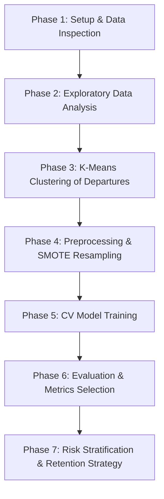

# Project Roadmap & Execution Plan: Employee Turnover Analytics

This document outlines the problem definition, requirements, steps to perform, high-level task list, and key areas to keep in mind for completing **Project 4.1: Employee Turnover Analytics** using prior evaluation data from Portobello Tech.

> [!NOTE]
> For a detailed, step-by-step educational guide explaining the mathematical formulas, library choices, and analysis methodology, see [project_explanation.md](file:///media/jignesh/Data/ihfc/IHFC-Leaning/Project%204.1%20Employee%20Turnover%20Analytics/project_explanation.md).

---

## 1. Problem Definition

### Context
Portobello Tech, an app innovator, wants to predict employee turnover (attrition) within the company. Periodically, they evaluate employees' work details, including the number of projects they worked on, average monthly working hours, time spent in the company, promotions in the last five years, and salary level.
The dataset captures the work style and satisfaction of employees. The objective is to analyze this data to identify patterns in employee behavior, group employees who left using cluster analysis, address data imbalance, train predictive ML models, and suggest targeted retention strategies.

### Specific Tasks
1. Perform initial data quality checks and identify any missing values.
2. Perform Exploratory Data Analysis (EDA) to understand what factors contribute most to employee turnover.
3. Conduct cluster analysis on employees who left based on their job satisfaction and last evaluation.
4. Handle the class imbalance in the target column (`left`) using the SMOTE (Synthetic Minority Over-sampling Technique) upsampling method.
5. Preprocess categorical features using one-hot encoding (`pd.get_dummies()`) and split data into training/test sets (80:20 stratified split).
6. Train and evaluate three models using 5-fold cross-validation: Logistic Regression, Random Forest Classifier, and Gradient Boosting Classifier.
7. Identify the best-performing model, plot ROC/AUC curves, and construct confusion matrices.
8. Propose data-driven employee retention strategies based on predicted probability risk zones.

---

### Data Dictionary

| Variable | Type | Description |
| :--- | :--- | :--- |
| **satisfaction_level** | Numeric (Float) | Satisfaction level of the employee at the job (ranges from 0.0 to 1.0). |
| **last_evaluation** | Numeric (Float) | Performance rating received by the employee at their last evaluation (ranges from 0.0 to 1.0). |
| **number_project** | Numeric (Integer) | The number of projects the employee is currently or has been involved in. |
| **average_montly_hours** | Numeric (Integer) | Average number of hours spent by the employee at the office per month. |
| **time_spend_company** | Numeric (Integer) | Number of years spent by the employee in the company. |
| **Work_accident** | Binary (0/1) | Whether the employee had a work accident (0 = No accident, 1 = Had an accident). |
| **left** | Binary (0/1) | Target variable: Whether the employee left the company (0 = Stayed, 1 = Left). |
| **promotion_last_5years**| Binary (0/1) | Whether the employee was promoted in the last 5 years (0 = Not promoted, 1 = Promoted). |
| **sales** | Categorical | The department to which the employee belongs (e.g., sales, technical, support, hr, IT, etc.). |
| **salary** | Categorical | The salary group of the employee ('low', 'medium', 'high'). |

---

### Sample Data

Below is a snapshot of the first few records in `HR_comma_sep.csv`:

| | satisfaction_level | last_evaluation | number_project | average_montly_hours | time_spend_company | Work_accident | left | promotion_last_5years | sales | salary |
| :--- | :--- | :--- | :--- | :--- | :--- | :--- | :--- | :--- | :--- | :--- |
| **0** | 0.38 | 0.53 | 2 | 157 | 3 | 0 | 1 | 0 | sales | low |
| **1** | 0.80 | 0.86 | 5 | 262 | 6 | 0 | 1 | 0 | sales | medium |
| **2** | 0.11 | 0.88 | 7 | 272 | 4 | 0 | 1 | 0 | sales | medium |
| **3** | 0.72 | 0.87 | 5 | 223 | 5 | 0 | 1 | 0 | sales | low |
| **4** | 0.37 | 0.52 | 2 | 159 | 3 | 0 | 1 | 0 | sales | low |

---

## 2. Requirements & Steps to Perform

### Step 1: Data Quality Check & Missing Values
* Load `HR_comma_sep.csv` and inspect columns, shape, and null counts (`isna().sum()`).
* Handle missing values if any are detected.

### Step 2: Exploratory Data Analysis (EDA)
* **Correlation Heatmap**: Generate a correlation matrix of all numeric columns to identify linear associations.
* **Distribution Analysis**: Draw kernel density estimates (KDE) or distribution plots for `satisfaction_level`, `last_evaluation`, and `average_montly_hours`.
* **Project Count Bar Plot**: Group by `number_project` and display a bar count plot with `left` as the hue. Document the relationship between workload (project count) and employee turnover.

### Step 3: K-Means Clustering of Employees Who Left
* Filter the dataset for employees who left (`left == 1`).
* Use `satisfaction_level` and `last_evaluation` as clustering features.
* Apply **K-Means Clustering** with **$K=3$** to group these employees.
* Profile the 3 clusters (e.g., highly evaluated but dissatisfied, lowly evaluated and dissatisfied, highly satisfied and highly evaluated but still left) and write descriptions for each group.

### Step 4: Data Preprocessing & Class Imbalance (SMOTE)
* **Categorical Encoding**: Identify categorical columns (`sales`, `salary`) and apply one-hot encoding (`pd.get_dummies()`).
* **Stratified Train-Test Split**: Split the encoded data into an 80:20 train-test ratio, using a stratified split on the `left` column to ensure matching class ratios. Set `random_state=123`.
* **SMOTE Upsampling**: Apply the Synthetic Minority Over-sampling Technique (SMOTE) on the training set to address class imbalance (since more employees stay than leave).

### Step 5: Model Training & 5-Fold Cross-Validation
* Train three models:
  1. **Logistic Regression**
  2. **Random Forest Classifier**
  3. **Gradient Boosting Classifier**
* Perform 5-fold cross-validation and print average classification reports (Precision, Recall, F1-Score) for each model.

### Step 6: Model Evaluation & Metrics
* **ROC/AUC Curves**: Compute ROC/AUC scores and plot combined ROC curves for the three models on the test set.
* **Confusion Matrices**: Generate confusion matrices for all models.
* **Metric Selection Justification**: Discuss the business trade-off between **Precision** and **Recall** in the context of employee retention. Argue why **Recall** is critical for finding flight-risk employees.

### Step 7: Retention Zones & Strategy Mapping
* Predict the probability of turnover for the test set using the best-performing model.
* Categorize employees into four risk zones:
  * **Safe Zone (Green)**: Probability $< 20\%$
  * **Low-Risk Zone (Yellow)**: $20\% \le$ Probability $< 60\%$
  * **Medium-Risk Zone (Orange)**: $60\% \le$ Probability $< 90\%$
  * **High-Risk Zone (Red)**: Probability $\ge 90\%$
* Propose tailored retention strategies for employees falling into each risk zone.

---

## 3. Project Roadmap (Phases of Development)

---

## 4. High-Level Task List

| Task ID | Task Category | Description | Deliverables |
| :--- | :--- | :--- | :--- |
| **T1.1** | Setup | Check environment and install required libraries | `requirements.txt` |
| **T1.2** | Notebook | Initialize the submission Jupyter Notebook | `employee_turnover_analytics.ipynb` |
| **T2.1** | Loading | Load the dataset and run basic data quality checks | Shape & Info in notebook |
| **T3.1** | EDA - Heatmap | Compute and plot correlation matrix heatmap of numeric features | Seaborn heatmap |
| **T3.2** | EDA - Dist | Plot distributions of satisfaction, evaluation, and monthly hours | Distribution plots |
| **T3.3** | EDA - Project | Plot employee project count bar chart with hue='left' | Bar chart & written inferences |
| **T4.1** | Clustering | Segment employees who left using K-Means ($K=3$) | Cluster assignments |
| **T4.2** | Profiling | Compute cluster centers and define/name the cohorts | Written cohort profiles |
| **T5.1** | Preprocessing | Apply one-hot encoding and perform stratified train-test split | Preprocessed arrays |
| **T5.2** | SMOTE | Apply SMOTE to training partition | Upsampled dataset |
| **T6.1** | Training | Fit Logistic Regression, Random Forest, & Gradient Boosting | 3 trained ML models |
| **T6.2** | Cross-Val | Apply 5-fold cross-validation and print classification reports | Performance metrics |
| **T7.1** | ROC Curve | Plot ROC curves and compute AUC scores for all models | ROC curve comparison plot |
| **T7.2** | Confusion | Plot confusion matrices and write Recall vs. Precision discussion | Confusion matrix grids |
| **T7.3** | Retention | Assign test employees to 4 risk zones and define action strategies | Stratified zone counts & recommendations |

