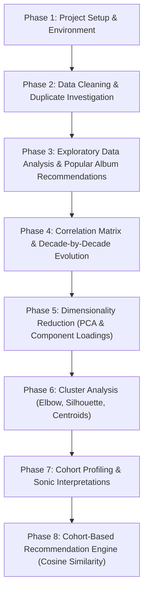

# Project Roadmap & Execution Plan: Creating Cohorts of Songs

This document outlines the original problem definition, requirements, steps to perform, high-level task list, and key areas to keep in mind for completing **Project 4.2: Creating Cohorts of Songs** using Spotify API data for the Rolling Stones.

> [!NOTE]
> For a detailed, step-by-step educational guide explaining the mathematical formulas, library choices, and analysis methodology, see [project_explanation.md](file:///media/jignesh/Data/ihfc/IHFC-Leaning/Project%204.2%20Creating%20Cohorts%20of%20Song/project_explanation.md).

---

## 1. Problem Definition

### Context
Customers expect specialized, personalized treatment whether shopping or streaming music. To maintain customer engagement, streaming services must provide relevant recommendations. Spotify aims to cluster the Rolling Stones' songs into cohorts based on their musical characteristics (audio features) so they can recommend similar songs to listeners.

### Specific Tasks
1. **Data Inspection & Cleaning:** Examine duplicates (database IDs vs. catalog song title re-issues), handle missing values, and inspect audio feature distributions and outliers.
2. **Popular Album Recommendation:** Recommend the top two albums based on the count of popular songs ($\\ge 75$th percentile).
3. **Feature Distribution & Correlation Analysis:** Analyze audio feature distributions and examine the relationship between song popularity and audio factors.
4. **Temporal Correlation Evolution:** Explore how the correlation between popularity and audio features has evolved across the decades (1960s to 2020s).
5. **Dimensionality Reduction (PCA):** Apply PCA to high-dimensional audio features, examine explained variance ratios, and interpret component loadings (PC1 and PC2).
6. **Cluster Analysis (K-Means):** Use the Elbow Method (WCSS) and Silhouette Analysis to identify the optimal number of clusters ($K=3$), and visualize cohorts with cluster centroids in 2D PCA space.
7. **Cohort Profiling:** Profile and name each song cohort based on unscaled feature averages, standardized Z-score deviations, and representative iconic songs.
8. **Cohort-Based Recommendation Engine (Lesson 07 Integration):** Build a content-based recommendation engine that filters by cohort and ranks songs using **Cosine Similarity**, with catalog title deduplication.

*Data Source: `rolling_stones_spotify.csv` (1,610 tracks, 17 columns)*

### Data Dictionary

| Variable | Description |
| :--- | :--- |
| **name** | The name of the song. |
| **album** | The name of the album. |
| **release_date** | The release date of the album (YYYY-MM-DD format). |
| **track_number** | The order of the song on the album. |
| **id** | The unique Spotify ID for the song. |
| **uri** | The Spotify URI for the song. |
| **acousticness** | A confidence measure from 0.0 to 1.0 of whether the track is acoustic (1.0 = highly acoustic). |
| **danceability** | Describes how suitable a track is for dancing based on tempo, rhythm stability, beat strength, and regularity (0.0 to 1.0). |
| **energy** | A measure from 0.0 to 1.0 representing perceptual intensity and activity (fast, loud, noisy). |
| **instrumentalness** | Predicts whether a track contains no vocals. Values above 0.5 represent instrumental tracks. |
| **liveness** | Detects the presence of an audience in the recording (values above 0.8 indicate live performance). |
| **loudness** | The overall loudness of a track in decibels (dB), averaged across the track (-60 to 0 dB). |
| **speechiness** | Detects spoken words (above 0.66 = spoken word, 0.33 to 0.66 = mixed/rap, below 0.33 = music). |
| **tempo** | The overall estimated tempo of a track in beats per minute (BPM). |
| **valence** | A measure from 0.0 to 1.0 describing musical positivity (cheerful, happy, euphoric vs. sad, angry). |
| **popularity** | The popularity score of the song on Spotify (0 to 100). |
| **duration_ms** | The duration of the track in milliseconds. |

---

## 2. Requirements & Steps to Perform

### Step 1: Initial Data Inspection & Cleaning
* **Metadata & Missingness:** Inspect data types, nulls (`df.isna().sum()`), and dataset dimensions ($1,610 \\times 17$).
* **Duplicate Analysis:** Distinguish between unique Spotify IDs (0 duplicates) and duplicate track titles (656 tracks with identical song titles appearing across original studio albums, 2009/2010 remasters, Deluxe bonus discs, and live concert recordings).
* **Feature Separation & Scaling:** Isolate the 9 core audio features (`acousticness`, `danceability`, `energy`, `instrumentalness`, `liveness`, `loudness`, `speechiness`, `tempo`, `valence`) and apply Z-score standardization (`StandardScaler`).

### Step 2: Exploratory Data Analysis & Feature Engineering
* **Album Recommendation:** Calculate the 75th percentile of popularity ($27.0$) and recommend the top 2 albums by count of popular songs: **Honk (Deluxe)** (18 songs) and **Exile On Main Street (2010 Re-Mastered)** (18 songs).
* **Feature Distributions:** Visualize histograms and KDE curves for audio features to detect skewness and range characteristics.
* **Overall Correlation Matrix:** Map Pearson correlations between audio features, duration, and popularity.
* **Temporal Correlation Evolution:** Group tracks by decade (1960s–2020s) and examine how the correlation of each audio feature with popularity has shifted over time (e.g., 1960s acousticness $\\to$ 1970s danceability $\\to$ 1980s-2010s loudness).

### Step 3: Dimensionality Reduction (PCA)
* **Variance Preservation:** Compute explained variance ratios across all 9 principal components. Show that PC1 ($32.45\\%$) and PC2 ($17.94\\%$) capture $50.38\\%$ of total variance, and 5 components exceed $80\\%$.
* **Component Loadings Analysis:** Inspect eigenvectors for PC1, PC2, and PC3 to interpret their musical significance:
  * **PC1:** Raw Live Concert Energy vs. Controlled Studio Polish.
  * **PC2:** Valence, Groove, and Positivity vs. Mellow Acoustics.
* **2D Projection:** Scatter plot of the catalog projected onto PC1 and PC2.

### Step 4: Cluster Analysis
* **Optimal K Selection:** Compute Within-Cluster Sum of Squares (Inertia) and Silhouette Scores for $K=2..9$. Choose **$K=3$** to achieve the best balance between statistical compactness and distinct musical profiling.
* **K-Means Model:** Fit K-Means with $K=3$.
* **Centroid Visualization:** Transform cluster centroids into 2D PCA space and plot them as prominent reference anchors.

### Step 5: Cohort Profiling & Musical Descriptions
* **Feature Averages:** Calculate unscaled means and standardized Z-score deviations for each cohort.
* **Profile Definitions:**
  * **Cohort 0:** *High-Energy Live & Concert Recordings* (596 tracks / 37.0%) — High liveness ($0.821$) and energy ($0.924$).
  * **Cohort 1:** *Upbeat & Danceable Studio Rock Hits* (584 tracks / 36.3%) — High danceability ($0.564$), valence ($0.789$), and energy ($0.821$).
  * **Cohort 2:** *Acoustic, Melodic & Slow Ballads* (430 tracks / 26.7%) — High acousticness ($0.430$), moderate energy ($0.571$), and relaxed tempo ($115.1$ BPM).
* **Representative Tracks:** Identify iconic tracks from each cohort.

### Step 6: Cohort-Based Recommendation Engine (Lesson 07 Integration)
* **Business Objective:** Fulfill Spotify's goal of using song cohorts to generate personalized song recommendations.
* **Two-Stage Architecture:**
  * *Stage 1 (Cohort Retrieval):* Filter candidate tracks from the same cluster in $\\mathcal{O}(1)$ time.
  * *Stage 2 (Similarity Ranking):* Compute **Cosine Similarity** on standardized audio features within the cohort.
* **Catalog Deduplication:** Implement automatic title deduplication to return diverse song titles rather than multiple alternate masterings of the same track.
* **Interactive Demonstration:** Test queries for iconic songs (*Angie*, *Satisfaction*, *Street Fighting Man - Live*) and evaluate recommendation accuracy.

---

## 3. Project Roadmap

---

## 4. High-Level Task List

| Task ID | Category | Description | Deliverables |
| :--- | :--- | :--- | :--- |
| **T1.1** | Setup | Virtual environment, packages (`pandas`, `scikit-learn`, `seaborn`) | `.venv`, working environment |
| **T1.2** | Notebook | Initialize and configure Jupyter Notebook structure | `cohorts_of_songs.ipynb` |
| **T2.1** | Loading | Load dataset and check dimensions and data types | Metadata inspection outputs |
| **T2.2** | Cleaning | Check database nulls and inspect duplicate Spotify IDs | Completeness verification |
| **T2.3** | Deduplication | Analyze catalog song title duplicates across re-issues and live albums | Track title duplicate analysis |
| **T2.4** | Scaling | Isolate 9 audio features and apply `StandardScaler` | Standardized feature matrix $X_{\\text{scaled}}$ |
| **T3.1** | Albums | Determine 75th percentile popularity and recommend top 2 albums | Horizontal bar plot & top 2 albums |
| **T3.2** | Distributions | Plot histograms and KDE curves for all 9 audio features | $3 \\times 3$ distribution grid |
| **T3.3** | Correlation | Compute Pearson correlation matrix with popularity | Heatmap of feature correlations |
| **T3.4** | Evolution | Compute decade-by-decade correlations with popularity (1960s–2020s) | Correlation evolution heatmap |
| **T4.1** | PCA Variance | Compute explained variance ratios and plot cumulative curve | Cumulative variance line chart |
| **T4.2** | PCA Loadings | Calculate eigenvector loadings and plot heatmap for PC1, PC2, PC3 | Loadings heatmap & 2D scatter |
| **T5.1** | Optimal K | Calculate WCSS (Elbow) and Silhouette Scores for $K=2..9$ | Side-by-side metric curves |
| **T5.2** | K-Means | Fit K-Means ($K=3$) and project cluster centroids onto 2D PCA space | 2D scatter with centroid stars |
| **T6.1** | Profiling | Compute unscaled feature averages and standardized Z-score deviations | Dual heatmap comparison |
| **T6.2** | Naming | Define and name the 3 cohorts based on sonic profiles | Detailed cohort documentation |
| **T6.3** | Track Samples | Identify top popular songs representing each cohort | Sample track listings |
| **T7.1** | Engine | Implement `recommend_songs_from_cohort` using Cosine Similarity | Production recommendation function |
| **T7.2** | Dedup Engine | Implement title base-string deduplication in recommendation engine | Diverse recommendation filtering |
| **T7.3** | Validation | Test recommendation engine on ballads, rock hits, and live tracks | Interactive test outputs & evaluation |
