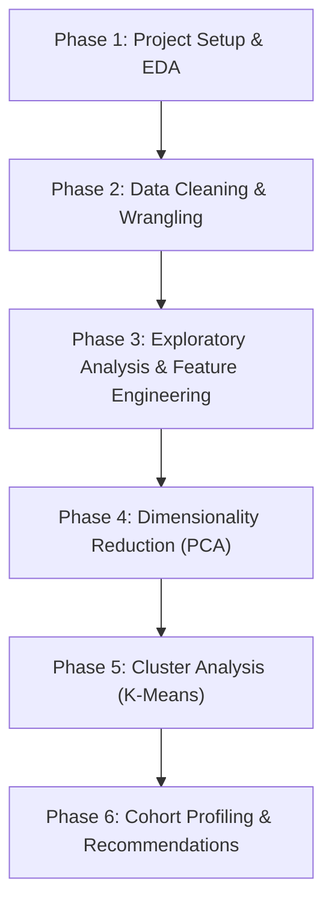

# Project Roadmap & Execution Plan: Creating Cohorts of Songs

This document outlines the original problem definition, requirements, steps to perform, high-level task list, and key areas to keep in mind for completing **Project 4.2: Creating Cohorts of Songs** using Spotify API data for the Rolling Stones.

> [!NOTE]
> For a detailed, step-by-step educational guide explaining the mathematical formulas, library choices, and analysis methodology, see [project_explanation.md](file:///media/jignesh/Data/ihfc/IHFC-Leaning/Project%204.2%20Creating%20Cohorts%20of%20Song/project_explanation.md).

---

## 1. Problem Definition

### Context
Customers expect specialized, personalized treatment whether shopping or streaming music. To maintain customer engagement, companies must provide relevant recommendations. Spotify aims to cluster the Rolling Stones' songs into cohorts based on their musical characteristics (audio features) so they can recommend similar songs to listeners.

### Specific Tasks
1. Perform initial data inspection, cleaning, and handle missing values, duplicates, and outliers.
2. Recommend the top two albums based on the count of popular songs.
3. Analyze individual features of songs to identify patterns and correlations.
4. Explore how song popularity and its correlation with audio features have evolved over time.
5. Apply dimensionality reduction (e.g., PCA) to high-dimensional audio features and analyze the results.
6. Conduct cluster analysis to group songs into cohorts, identifying the optimal cluster count and profiling each cohort.
*Data Source: `rolling_stones_spotify.csv`*

### Data Dictionary

| Variable | Description |
| :--- | :--- |
| **name** | The name of the song. |
| **album** | The name of the album. |
| **release_date** | The release date of the album (YYYY-MM-DD format). |
| **track_number** | The order of the song on the album. |
| **id** | The unique Spotify ID for the song. |
| **uri** | The Spotify URI for the song. |
| **acousticness** | A confidence measure from 0.0 to 1.0 of whether the track is acoustic. 1.0 represents high confidence the track is acoustic. |
| **danceability** | Describes how suitable a track is for dancing based on a combination of musical elements including tempo, rhythm stability, beat strength, and overall regularity (0.0 to 1.0). |
| **energy** | A measure from 0.0 to 1.0 representing perceptual intensity and activity (fast, loud, noisy). |
| **instrumentalness** | Predicts whether a track contains no vocals. Values above 0.5 represent instrumental tracks, approaching 1.0 for high confidence. |
| **liveness** | Detects the presence of an audience in the recording. Values above 0.8 provide a strong likelihood that the track is live. |
| **loudness** | The overall loudness of a track in decibels (dB), averaged across the entire track (typically between -60 and 0 dB). |
| **speechiness** | Detects the presence of spoken words. Values above 0.66 are spoken words, 0.33 to 0.66 are mixed (e.g. rap), and below 0.33 are music/non-speech. |
| **tempo** | The overall estimated tempo of a track in beats per minute (BPM). |
| **valence** | A measure from 0.0 to 1.0 describing the musical positivity (cheerful, happy, euphoric) vs. negativity (sad, depressed, angry). |
| **popularity** | The popularity score of the song on Spotify (0 to 100). |
| **duration_ms** | The duration of the track in milliseconds. |

### Sample Data

Below is a snapshot of the first few records in `rolling_stones_spotify.csv`:

| | name | album | release_date | track_number | id | uri | acousticness | danceability | energy | instrumentalness | liveness | loudness | speechiness | tempo | valence | popularity | duration_ms |
| ---: | :--- | :--- | :--- | ---: | :--- | :--- | ---: | ---: | ---: | ---: | ---: | ---: | ---: | ---: | ---: | ---: | ---: |
| **0** | Concert Intro Music - Live | Licked Live In NYC | 2022-06-10 | 1 | 2IEkywLJ4ykbhi1yRQvmsT | spotify:track:2IEkywLJ4ykbhi1yRQvmsT | 0.0824 | 0.463 | 0.993 | 0.996000 | 0.932 | -12.913 | 0.1100 | 118.001 | 0.0302 | 33 | 48640 |
| **1** | Street Fighting Man - Live | Licked Live In NYC | 2022-06-10 | 2 | 6GVgVJBKkGJoRfarYRvGTU | spotify:track:6GVgVJBKkGJoRfarYRvGTU | 0.4370 | 0.326 | 0.965 | 0.233000 | 0.961 | -4.803 | 0.0759 | 131.455 | 0.3180 | 34 | 253173 |
| **2** | Start Me Up - Live | Licked Live In NYC | 2022-06-10 | 3 | 1Lu761pZ0dBTGpzxaQoZNW | spotify:track:1Lu761pZ0dBTGpzxaQoZNW | 0.4160 | 0.386 | 0.969 | 0.400000 | 0.956 | -4.936 | 0.1150 | 130.066 | 0.3130 | 34 | 263160 |
| **3** | If You Can't Rock Me - Live | Licked Live In NYC | 2022-06-10 | 4 | 1agTQzOTUnGNggyckEqiDH | spotify:track:1agTQzOTUnGNggyckEqiDH | 0.5670 | 0.369 | 0.985 | 0.000107 | 0.895 | -5.535 | 0.1930 | 132.994 | 0.1470 | 32 | 305880 |

---

## 2. Requirements & Steps to Perform

### Step 1: Data Inspection & Cleaning
* **Initial Inspection**: Load the dataset, check dimensions, data types, and describe statistical distribution of variables.
* **Cleaning**: Identify and resolve duplicate songs (using `id` or name & album combination) and missing values.
* **Feature Scaling**: Standardize audio features using Z-score standardization (`StandardScaler`) so that distance-based clustering algorithms function correctly.

### Step 2: Exploratory Data Analysis (EDA) & Feature Engineering
* **Album Recommendation**: Determine the top two albums that should be recommended based on their count of popular songs.
* **Correlations & Feature Distribution**: Map the correlation matrix of audio features with popularity and visualize the distribution of song features.
* **Temporal Trend Analysis**: Extract release years from `release_date` and plot changes in popular features and popularity over time.
* **Dimensionality Reduction**: Execute PCA on standard audio features. Visualize the variance explained and explain why reducing dimensions is significant for clustering.

### Step 3: Cluster Analysis

#### A. Available Clustering Algorithms
* **K-Means Clustering**: Groups data points into $K$ distinct clusters by minimizing the distance between points and their cluster's center (centroid). It is fast, simple, and highly effective for partitioning data into clear, evenly-sized, and distinct groups.
* **Hierarchical Clustering**: Builds a tree-like hierarchy of clusters by repeatedly merging close data points (Agglomerative) or splitting larger groups (Divisive). It helps visualize nested relationships using a dendrogram without needing to choose the number of clusters in advance.
* **DBSCAN (Density-Based Clustering)**: Groups points together based on how closely packed they are, automatically identifying and isolating outliers as "noise." It is excellent at finding clusters of irregular shapes and does not require you to pre-define the number of clusters.
* **Gaussian Mixture Models (GMM)**: A probabilistic method that assumes data points are generated from a mixture of several bell-curve (Gaussian) distributions. It allows "soft clustering" where a song can belong to multiple cohorts with different probability percentages.

#### B. Selected Algorithm & Rationale
We select **K-Means Clustering** as the best algorithm for this problem statement. Song cohorts need to be distinct, simple partitions (e.g., separating "acoustic ballads" from "rock anthems") so that a recommendation engine can easily suggest songs from the same group. K-Means is highly efficient for this purpose, works perfectly with standardized audio features, and lets us use intuitive metrics like the **Elbow Method** and **Silhouette Score** to choose the optimal number of music cohorts.

#### C. Tasks to Perform
* **Find Optimal K**: Use the **Elbow Method** (WCSS) and **Silhouette Analysis** (Silhouette Scores) to decide the best number of clusters.
* **Run Clustering**: Fit a K-Means model with the chosen $K$.
* **Cohort Profiling**: Group by the cluster labels to find the average values of the audio features. Name and define each song cohort based on its sonic profile.

### Step 4: Report & Notebook Generation
* Develop the entire pipeline in a clean Jupyter Notebook (`cohorts_of_songs.ipynb`).
* Structure the notebook with clear Markdown headers, inline explanations, code blocks, and visual plots.

---

## 3. Project Roadmap (Phases of Development)

---

## 4. High-Level Task List

| Task ID | Task Category | Description | Deliverables |
| :--- | :--- | :--- | :--- |
| **T1.1** | Setup | Set up the Python virtual environment and install dependencies | `requirements.txt`, environment |
| **T1.2** | Notebook | Initialize the Jupyter Notebook | `cohorts_of_songs.ipynb` |
| **T2.1** | Loading | Load the dataset and display basic shape and summary stats | Metadata outputs in notebook |
| **T2.2** | Cleaning | Identify and drop duplicates, handle any missing values | Cleaned DataFrame |
| **T2.3** | Scaling | Apply standard scaling to numerical audio features | Standardized feature matrix |
| **T3.1** | Album Recom. | Identify and recommend the top 2 albums based on popular songs | Recommendation query & bar chart |
| **T3.2** | Correlation | Compute and plot correlation matrix between popularity and audio features | Seaborn heatmap |
| **T3.3** | Evolution | Extract release year and plot trends of features and popularity | Line / scatter plots |
| **T4.1** | PCA | Fit PCA model and plot cumulative explained variance | PCA variance curve |
| **T4.2** | Visualization | Plot the dataset in 2D using the first two principal components | 2D scatter plot of PCs |
| **T5.1** | Elbow Method | Compute WCSS for $K=1..10$ and plot the Elbow Curve | WCSS line chart |
| **T5.2** | Silhouette | Calculate Silhouette Scores for different values of $K$ | Silhouette score chart |
| **T5.3** | K-Means | Fit the K-Means clustering model using optimal $K$ | Cluster labels mapped to songs |
| **T6.1** | Profiling | Compute mean values of features for each cluster | Summary table of cohorts |
| **T6.2** | Naming | Define and name each cohort based on music profiles | Explanatory write-up |
