# IHFC Applied Data Science with Python — Core Concept Glossary & Use Cases

This document provides intuitive, technical, and applied explanations for key Data Science and Machine Learning concepts, complete with real-world scenarios.

---

## 📂 Table of Contents
1. [Core Statistical Measures](#1-core-statistical-measures)
2. [Data Analysis & Variables](#2-data-analysis--variables)
3. [Data Cleaning & Wrangling](#3-data-cleaning--wrangling)
4. [Feature Engineering & Preprocessing](#4-feature-engineering--preprocessing)
5. [Probability & Statistical Inference](#5-probability--statistical-inference)
6. [Mathematics, NumPy & Array Operations](#6-mathematics-numpy--array-operations)
7. [Core Libraries & Tools](#7-core-libraries--tools)
8. [Statistical Plots & Graphs](#8-statistical-plots--graphs)
9. [Reference Materials & External Resources](#9-reference-materials--external-resources)

---

## 1. Core Statistical Measures

### Descriptive Statistics vs. Inferential Statistics
*   **Layman Explanation**: 
    *   *Descriptive*: Describing a picture you are looking at (e.g., "This picture has 5 people, and their average height is 5'8\"").
    *   *Inferential*: Guessing what the rest of the photo album looks like based on that single picture (e.g., "Since the average height in this picture is 5'8\", the average height of everyone in the school is probably around 5'8\"").
*   **Technical Explanation**: Descriptive statistics summarize and organize characteristics of a dataset. Inferential statistics use probability theory and sample statistics to draw conclusions, test hypotheses, and make predictions about the larger population.
*   **Data Science Use Case**: Using descriptive statistics to build initial data profile summaries (like `df.describe()`), and inferential statistics to calculate confidence intervals and p-values.
*   **Machine Learning Use Case**: Descriptive statistics are used to baseline models (such as comparing MAE against standard deviation). Inferential statistics are used to compare model accuracies across cross-validation folds.
*   **Real-world Scenario**: A supermarket analyzes last month's customer purchase histories (Descriptive) to see which items were popular, and uses that sample to estimate demand for next month's inventory (Inferential).

#### Quick Comparison Table:
| Dimension | Descriptive Statistics | Inferential Statistics |
| :--- | :--- | :--- |
| **Main Goal** | Summarize and describe the data we have. | Make predictions/generalizations about a larger population. |
| **Data Scope** | Focused only on the collected sample dataset. | Extends findings from a sample to the entire population. |
| **Outputs** | Tables, graphs, charts, and summary numbers (mean, SD). | Probability estimates, hypothesis tests, and confidence levels. |
| **Key Tools** | Mean, Median, Mode, Range, Variance, Bar/Line charts. | t-tests, ANOVA, Chi-Square tests, Regression, p-values. |
| **Core Question** | *"What does our current dataset look like?"* | *"What does this sample tell us about the whole group?"* |

### Mean
*   **Layman Explanation**: The "fair share" or simple average. If you pool everyone's money together and divide it equally, this is what everyone gets.
*   **Technical Explanation**: The sum of all values divided by the total count. 
    *   **Population Mean ($\mu$)**: Calculated across the entire population of size $N$:
        $$\mu = \frac{1}{N} \sum_{i=1}^N x_i$$
    *   **Sample Mean ($\bar{x}$)**: Calculated across a representative sample of size $n$:
        $$\bar{x} = \frac{1}{n} \sum_{i=1}^n x_i$$
*   **Data Science Use Case**: Summarizing numerical data where there are no major outliers (e.g., average customer height).
*   **Machine Learning Use Case**: Used in distance-based clustering algorithms (like K-Means) to calculate cluster centroids.
*   **Real-world Scenario**: A manager calculates the average processing time of customer support tickets to evaluate if the team is meeting its SLA of 15 minutes per ticket.

### Median
*   **Layman Explanation**: The exact middle value. If you line up a group of people by height, the median is the height of the person standing directly in the center.
*   **Technical Explanation**: The value dividing the upper half of a sorted data sample from the lower half. 
    *   If $n$ is Odd:
        $$M = x_{\left(\frac{n+1}{2}\right)}$$
    *   If $n$ is Even:
        $$M = \frac{x_{\left(\frac{n}{2}\right)} + x_{\left(\frac{n}{2} + 1\right)}}{2}$$
*   **Data Science Use Case**: Used as a robust measure of central tendency when the dataset contains significant outliers or is highly skewed.
*   **Machine Learning Use Case**: Robust missing-value imputation for numerical columns containing significant outliers.
*   **Real-world Scenario**: Real estate websites display the median house price of a suburb (e.g., $850,000) rather than the mean. This prevents a single $20 million mansion sale from artificially making the suburb look unaffordable to typical buyers.

### Variance & Standard Deviation
*   **Layman Explanation**: A measure of spread. If everyone in a class scores exactly 75%, the spread is zero. If scores range from 10% to 100%, the spread (variance) is high. Standard deviation puts this spread back into the same units as the scores (e.g., "plus or minus 15 points").
*   **Technical Explanation**: 
    *   **Population Variance ($\sigma^2$) & Population Standard Deviation ($\sigma$)**:
        $$\sigma^2 = \frac{\sum_{i=1}^N (x_i - \mu)^2}{N}, \quad \sigma = \sqrt{\sigma^2}$$
    *   **Sample Variance ($S^2$) & Sample Standard Deviation ($S$)**: Uses Bessel's correction ($n-1$) to provide an unbiased estimator of population variance:
        $$S^2 = \frac{\sum_{i=1}^n (x_i - \bar{x})^2}{n-1}, \quad S = \sqrt{S^2}$$
*   **Data Science Use Case**: Measuring the volatility of variables (e.g. standard deviation of stock returns tells us how risky the asset is).
*   **Machine Learning Use Case**: Fundamental in feature scaling (Standardization). Subtracting the mean and dividing by the standard deviation converts features to the same scale.
*   **Real-world Scenario**: A quality control inspector on a soda bottling line measures the volume filled in bottles. Line A has a standard deviation of 1ml (very consistent), while Line B has a standard deviation of 15ml (highly inconsistent, leading to overflow or underfill).

### Range & Interquartile Range (IQR)
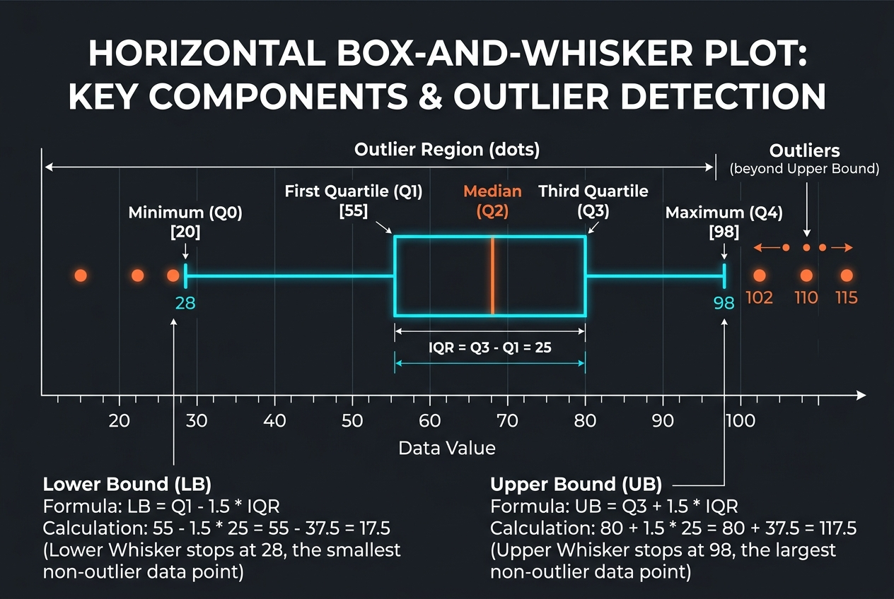

*   **Layman Explanation**:
    *   *Range*: The total distance between the highest and lowest scores.
    *   *IQR*: The distance between the middle-upper score and middle-lower score (representing where the middle 50% of people sit).
*   **Technical Explanation**:
    *   **Range**: Difference between Maximum ($Q_4$) and Minimum ($Q_0$) values:
        $$Range = Max - Min$$
    *   **IQR**: Difference between the 75th percentile ($Q_3$) and 25th percentile ($Q_1$):
        $$IQR = Q_3 - Q_1 \quad (where\ each\ quartile\ Q\ represents\ a\ 25\%\ slice\ of\ data)$$
    *   **Box Plot Outlier Bounds**:
        $$Lower\ Bound\ (LB) = Q_1 - 1.5 \times IQR$$
        $$Upper\ Bound\ (UB) = Q_3 + 1.5 \times IQR$$
        Any values falling below LB or above UB are flagged as outliers.
*   **Data Science Use Case**: Constructing box plots to visualize numeric distributions and identify outliers.
*   **Machine Learning Use Case**: Used in outlier filtering pipelines and robust scaling (RobustScaler uses IQR to scale features).
*   **Real-world Scenario**: A retailer examines the distribution of order delivery times. While the total range is 30 days (due to a few late orders), the IQR is only 2 days, showing that 50% of orders are delivered within a very tight window of 3 to 5 days.

### Skewness
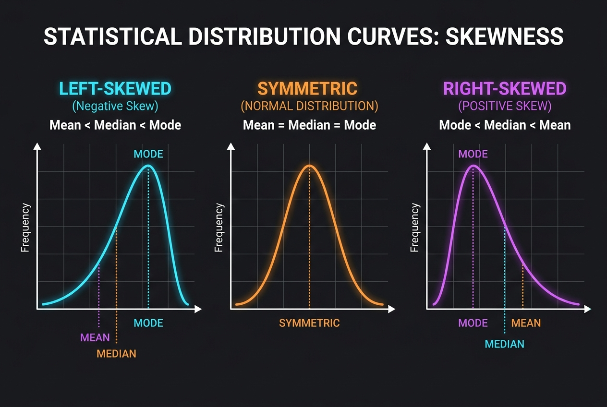

*   **Layman Explanation**: Measuring if a bell curve leans to one side. If a class has mostly high scores and a few very low scores, the tail stretches to the left (negatively skewed). If it has mostly low scores and a few very high scores, the tail stretches to the right (positively skewed).
*   **Technical Explanation**: A measure of the asymmetry of the probability distribution of a real-valued random variable about its mean. For univariate data $X_1, X_2, \dots, X_N$, it is given by:
    $$Skewness = \frac{\sum_{i=1}^N (x_i - \bar{x})^3}{(N - 1)s^3}$$
    *   **Positive Skewness**: Right-tailed, Mean > Median > Mode.
    *   **Negative Skewness**: Left-tailed, Mean < Median < Mode.
    *   **Zero Skewness**: Perfectly symmetric (e.g. normal distribution).
*   **Data Science Use Case**: Checking if a numerical variable's distribution is symmetrical or heavily skewed before performing correlation analyses.
*   **Machine Learning Use Case**: Preprocessing features by applying log transformations or Box-Cox transformations to reduce skewness, helping linear models perform better.
*   **Real-world Scenario**: A bank studies account transaction amounts. The distribution is highly positively skewed because the vast majority of transactions are small (under $50), while a tiny number of transactions are extremely large (thousands of dollars).

### Kurtosis
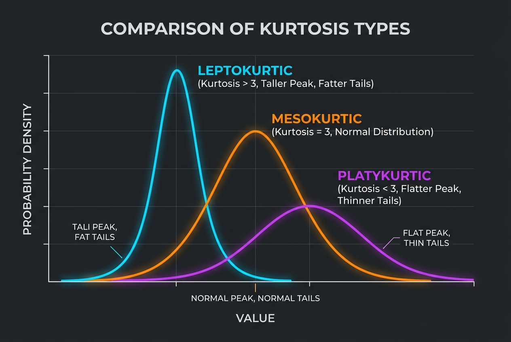

*   **Layman Explanation**: Measuring how "pointy" and "heavy-tailed" a distribution is. If a curve is extremely tall with fat, wide tails, it means outliers (rare, extreme events) are relatively common. If it's flat with thin tails, outliers are very rare.
*   **Technical Explanation**: A measure of the "tailedness" of the probability distribution. It describes the peak shape and tail weight relative to a normal distribution:
    *   **Mesokurtic**: Kurtosis = 3 (Normal distribution shape).
    *   **Leptokurtic**: Kurtosis > 3 (High peak, heavy tails; more extreme values/outliers).
    *   **Platykurtic**: Kurtosis < 3 (Flat peak, thin tails; fewer extreme values/outliers).
*   **Data Science Use Case**: Assessing the risk of extreme outliers or tail risks in financial or physical datasets.
*   **Machine Learning Use Case**: Evaluating model error distributions. If residuals have high kurtosis, it indicates the model makes very large prediction errors on a subset of data points.
*   **Real-world Scenario**: An investment manager analyzes the daily returns of two stocks. Stock A is Leptokurtic (Kurtosis > 3), meaning it has steady minor gains but is susceptible to sudden, massive single-day crashes (fat-tail events). Stock B is Mesokurtic (Kurtosis = 3), making its performance more stable.

---

## 2. Data Analysis & Variables

#### 📊 Foundational Disciplines & Roles

### Data Science
*   **Layman Explanation**: Using data to solve real-world puzzles. It's like being a detective who collects clues (data), analyzes patterns, and makes predictions to help businesses make smart choices.
*   **Technical Explanation**: An interdisciplinary field that combines scientific methods, programming algorithms, statistics, and domain expertise to extract knowledge and actionable insights from structured and unstructured data.
*   **Data Science Use Case**: An e-commerce company wants to reduce customer churn. A data scientist combines clickstream logs, demographic profiles, and transaction history to build a complete profile of customer behavior.
*   **Machine Learning Use Case**: Selecting, training, and validating predictive models (e.g., classification trees, neural networks) and deploying them to production pipelines.
*   **Real-world Scenario**: Netflix uses Data Science to analyze what genres you watch, when you watch, and what covers you click on to curate your homepage recommendations.

### Machine Learning (ML)
*   **Layman Explanation**: Teaching computers to learn from experience. Instead of writing a strict set of rules for the computer to follow, you show it examples, and it figures out the rules by itself.
*   **Technical Explanation**: A subset of artificial intelligence (AI) focused on building algorithms that learn patterns from training data to make predictions or decisions on unseen test data without being explicitly programmed.
*   **Data Science Use Case**: Creating a model that takes historical real estate transactions and uses them to automatically estimate the valuation of new home listings.
*   **Machine Learning Use Case**: Splitting datasets into train/validation/test sets, tuning model hyperparameters, calculating loss functions, and optimizing weights using gradient descent.
*   **Real-world Scenario**: Email providers use Machine Learning models trained on millions of emails flagged as "Spam" or "Inbox" to automatically filter your spam mail.

### Data Analysis / Data Analyst (DA)
*   **Layman Explanation**: Examining the past to understand what happened. A Data Analyst takes raw spreadsheets, cleans them up, creates charts, and writes reports to explain past trends to the business.
*   **Technical Explanation**: The process of inspecting, cleaning, transforming, and modeling historical data with the goal of discovering useful information, suggesting conclusions, and supporting descriptive or diagnostic decision-making.
*   **Data Science Use Case**: Querying databases to find the sales drop in the last quarter and building a Tableau dashboard to show sales by region.
*   **Machine Learning Use Case**: Creating and checking descriptive baselines (e.g., mean benchmark) to compare model accuracy performance.
*   **Real-world Scenario**: A retail store chain hires a Data Analyst to review last year's holiday sales data to determine which products sold out first, helping the inventory team prepare for next year.

### Business Analysis / Business Analyst (BA)
*   **Layman Explanation**: Bridging the gap between IT and business goals. A Business Analyst figures out what a company needs to improve (e.g., faster checkouts) and translates those needs into technical instructions for developers.
*   **Technical Explanation**: The practice of identifying business needs and determining solutions to business problems, focusing on process improvement, requirements gathering, and strategic business planning.
*   **Data Science Use Case**: Defining the business KPIs and success criteria (e.g., "reduce customer wait time by 20%") that a data science project must aim for.
*   **Machine Learning Use Case**: Evaluating the financial ROI of deploying an ML model versus continuing with manual operations.
*   **Real-world Scenario**: A BA interviews warehouse staff to map out the shipping process, identifies a bottleneck in label printing, and designs requirements for a new automated sorting system.

#### 🗂️ Core Data Classifications

### Numerical Data (Discrete & Continuous)
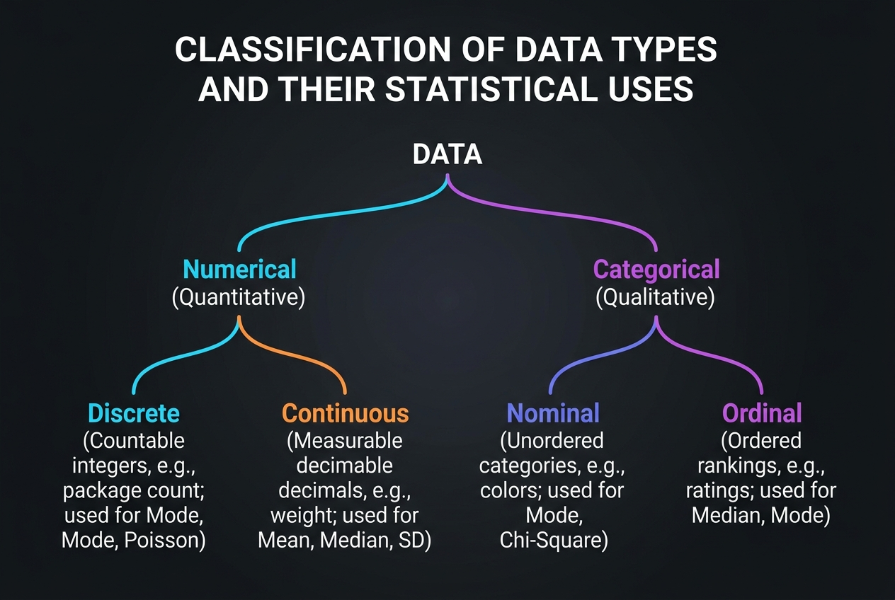

*   **Layman Explanation**: 
    *   *Discrete*: Countable whole numbers, like counting coins (e.g., "I have 3 apples"). You can't have 3.5 apples.
    *   *Continuous*: Measurable decimal numbers, like temperature or weight (e.g., "The temperature is 24.5 degrees").
*   **Technical Explanation**: Numerical data represents quantitative values. Discrete data is countable and takes specific integer values. Continuous data is measurable and can take any value within a range (represented as floats).
*   **Data Science Use Case**: Distinguishing discrete customer count columns from continuous income columns to choose the correct visualization and stats model.
*   **Machine Learning Use Case**: Selecting model architectures (e.g., Poisson regression for discrete counts vs. linear regression for continuous values).
*   **Real-world Scenario**: A shipping company records "Number of packages" (Discrete, e.g., 5 items) and "Package weight" (Continuous, e.g., 12.35 kg) for billing.

### Categorical Data (Nominal & Ordinal)
*   **Layman Explanation**: 
    *   *Nominal*: Labels without any natural ordering, like names or colors (e.g., "Apple, Banana, Orange").
    *   *Ordinal*: Labels with a clear order or hierarchy, like rank or sizes (e.g., "Small, Medium, Large").
*   **Technical Explanation**: Categorical data represents qualitative attributes. Nominal variables have no intrinsic order (e.g. state names). Ordinal variables have a meaningful ordered rank (e.g., satisfaction level).
*   **Data Science Use Case**: Deciding how to plot distributions (e.g., ordering categories in a bar chart by rank for ordinal data vs. sorting alphabetically for nominal data).
*   **Machine Learning Use Case**: Deciding on encoding schemes: One-Hot Encoding is used for nominal categories, while Ordinal/Integer Encoding is used for ordinal categories to preserve hierarchy.
*   **Real-world Scenario**: A surveyor asks customers for their "State of residence" (Nominal) and their "Level of education" (Ordinal: High School, Bachelor's, Master's).

#### 🎯 Variables & Modeling Roles

### Target Variable (Dependent Variable)
*   **Layman Explanation**: The "outcome" or "result" you want to guess or predict.
*   **Technical Explanation**: The variable ($Y$) whose value is modeled and predicted by one or more independent variables ($X$).
*   **Data Science Use Case**: Identifying the primary KPI, like whether a customer will churn (Yes/No) or how much revenue a new branch will generate.
*   **Machine Learning Use Case**: The labels used to calculate the loss function and train supervised ML models (e.g., the ground-truth values in y_train).
*   **Real-world Scenario**: A bank designs a credit scoring system. The Target Variable is whether a credit applicant will default on their loan payment in the next 12 months.

### Feature (Independent Variable)
*   **Layman Explanation**: The clues or inputs you use to make your guess.
*   **Technical Explanation**: An individual measurable property or characteristic ($X$) used as an input to predict or explain the target variable ($Y$).
*   **Data Science Use Case**: Exploring the data columns (like age, gender, past purchasing history) to see if they relate to customer behavior.
*   **Machine Learning Use Case**: The inputs fed into model training algorithms (e.g., the columns of the X_train matrix) to learn prediction patterns.
*   **Real-world Scenario**: When predicting house prices, the features include the number of bedrooms, square footage, zip code, distance to the nearest train station, and age of the building.

#### 🔍 Statistical Scopes of Analysis

### Univariate, Bivariate, and Multivariate Analysis
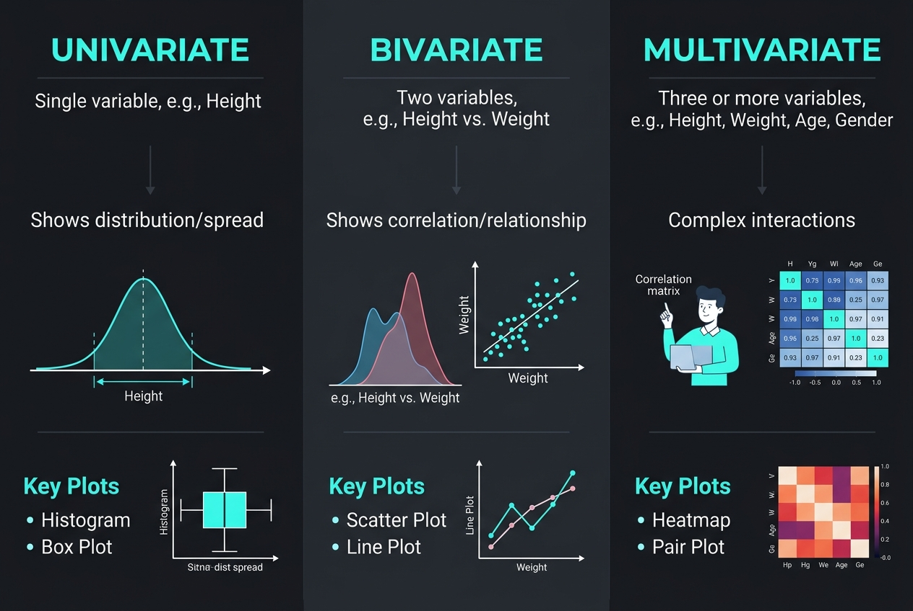

*   **Layman Explanation**: 
    *   *Univariate*: Looking at one thing (e.g., "How old are our customers?").
    *   *Bivariate*: Looking at two things together to see if they relate (e.g., "Do older customers spend more money?").
    *   *Multivariate*: Looking at many things together (e.g., "Do older, female customers living in Sydney spend more than younger, male customers in Hobart?").
*   **Technical Explanation**: 
    *   *Univariate*: Statistical analysis of a single variable's distribution ($f(x)$).
    *   *Bivariate*: Statistical analysis of joint probability distributions or correlations between two variables ($f(x, y)$).
    *   *Multivariate*: Analyzing relationship structures within a set of multiple variables ($f(x_1, x_2, \dots, x_n)$).
*   **Data Science Use Case**: Conducting Exploratory Data Analysis (EDA) step-by-step: starting with single-column histograms, moving to scatter plots of pairs, and finishing with heatmaps and pairplots.
*   **Machine Learning Use Case**: Informing feature selection. Removing features that do not correlate with the target (bivariate check) or identifying groups of features that represent redundant information (multicollinearity/multivariate check).
*   **Real-world Scenario**: An e-commerce analyst studies transaction data. They look at order sizes (Univariate), correlate order size with customer age (Bivariate), and finally build a model combining age, region, and browse-time to predict order size (Multivariate).

---

## 3. Data Cleaning & Wrangling

### Imputation
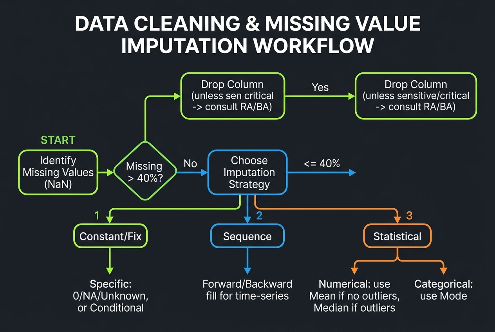

*   **Layman Explanation**: Filling in the blanks. If a database is missing a customer's age, you fill it in with a smart guess (like the average age of all other customers) instead of leaving it blank.
*   **Technical Explanation**: The process of replacing missing values (NaN, null) with substituted values based on statistics or modeling algorithms.
    *   **Imputation Thresholds**:
        *   **Missing Values > 40%**: The column is typically **Dropped** from the analysis (unless it is designated as a sensitive/critical column, in which case the Research Analyst (RA) or Business Analyst (BA) must be consulted).
        *   **Missing Values $\le$ 40%**: The missing values are **Filled / Imputed**.
    *   **Imputation Strategies**:
        *   *Fix*: Specific constant values (e.g., `0`, `"NA"`, `"Unknown"`) or Conditional (calculated based on values in another column).
        *   *Sequence / Random*: Back fill (bfill) or Front fill (ffill) commonly used in sequential or time-series data.
        *   *Statistical*:
            *   **Numerical Data**: Impute with **Mean** (if distribution is normal and has no outliers) or **Median** (if distribution contains significant outliers).
            *   **Categorical Data**: Impute with **Mode** (most frequent class).
            *   **DateTime Data**.

    *   **Decision Matrix (Which Method to Use When)**:
        | Scenario / Data Type | Recommended Action | Rationale |
        | :--- | :--- | :--- |
        | **Missing rate > 40%** | **Drop Column** | Too little signal to rebuild; dropping is safer (verify with RA/BA first if critical). |
        | **Time-Series / Sequence** | **Forward Fill (`ffill`) / Backward Fill (`bfill`)** | Preserves continuous trends by copying adjacent observations. |
        | **Numerical (Symmetrical, no outliers)** | **Mean Imputation** | Preserves the overall sum and mean when data is normally distributed. |
        | **Numerical (Skewed / Outliers present)** | **Median Imputation** | Robust to outliers; avoids pulling the centers towards extremes. |
        | **Categorical (Nominal or Ordinal)** | **Mode Imputation** | Replaces nulls with the most frequent category. |
        | **Structured / Contextual missingness** | **Constant value (e.g. "Unknown" or 0)** | Marks missing status explicitly (e.g., blank field for "spouses name" means "None"). |

*   **Data Science Use Case**: Querying a dataset's missing rate (e.g. `df.isnull().mean()`), dropping columns exceeding 40% nulls, and applying median imputation to skewed numeric columns.
*   **Machine Learning Use Case**: Preprocessing step inside pipelines (such as `SimpleImputer` in Scikit-learn) to ensure no NaN values are passed to models.
*   **Real-world Scenario**: A survey database shows that 5% of users left the "Salary" field empty. The analyst imputes these blank rows with the median salary of other respondents from the same region and job type.

### Outlier Detection & Treatment
*   **Layman Explanation**: Spotting the "odd ones out." In a group of normal income earners, a billionaire is an outlier. You must decide whether to keep, adjust, or remove them so they don't skew your final conclusions.
*   **Technical Explanation**: Identifying points that lie far from other observations, often defined mathematically as values outside $[Q1 - 1.5 \times IQR, Q3 + 1.5 \times IQR]$ (IQR method) or having an absolute Z-score $> 3$ (Z-Score method).
    *   **Common Outlier Detection Methods**:
        1. **IQR (Interquartile Range) Method**:
            *   *Formula*: Flags points outside $[Q_1 - 1.5 \times IQR, \ Q_3 + 1.5 \times IQR]$.
            *   *Best for*: Skewed numerical data or distributions that do not assume normality.
        2. **Z-Score Method**:
            *   *Formula*: Calculates standard score $Z = \frac{x - \mu}{\sigma}$. Points with $|Z| > 3$ are flagged as outliers.
            *   *Best for*: Symmetrical, normally distributed numerical data.
        3. **Visual Methods (EDA)**:
            *   *Box Plots*: Displays whiskers and single dots beyond bounds.
            *   *Scatter Plots*: Good for identifying relationships and outliers in bivariate/multivariate spaces.
        4. **Machine Learning / Algorithmic Methods**:
            *   *Isolation Forest*: An anomaly detection algorithm that partitions features to isolate outliers (highly effective for high-dimensional, multivariate outliers).
            *   *DBSCAN (Clustering)*: Unsupervised clustering where outliers are flagged as noise points (class `-1`).
            *   *Local Outlier Factor (LOF)*: Measures the local density deviation of a given data point relative to its neighbors.
*   **Data Science Use Case**: Finding fraud (fraudulent transactions look like outliers) or identifying data entry mistakes (like an age entered as 999).
*   **Machine Learning Use Case**: Protecting models. Outliers can severely distort models that minimize squared errors (like Linear Regression) by pulling the decision boundary towards themselves.
*   **Real-world Scenario**: A bank security system tracks customer ATM withdrawals. If a customer who normally withdraws $50 to $100 suddenly attempts a $10,000 withdrawal from another country, the outlier detection system flags the account for potential fraud.

---

## 4. Feature Engineering & Preprocessing

#### 💡 Feature Engineering Concepts

### Feature Engineering
*   **Layman Explanation**: Creating new, useful clues from raw data. For example, if you have a column with a customer's birthdate, you extract their "Age" or group them into "Generations" (like Gen Z or Millennials) because that makes it easier to spot patterns.
*   **Technical Explanation**: The process of selecting, manipulating, and transforming raw data features into new variables that better represent the underlying problem to improve model accuracy.
*   **Data Science Use Case**: Creating a "Price per Square Foot" metric from raw "Total Price" and "Square Footage" features to normalize home values across neighborhoods.
*   **Machine Learning Use Case**: Creating interaction terms, applying log transformations to skewed columns, and reducing feature dimensions to prevent overfitting and improve model convergence.
*   **Real-world Scenario**: A bank has transaction timestamps. They engineer a new feature: "Is_Weekend_Transaction?" (True/False) because fraud patterns are significantly different on Saturdays and Sundays.

#### 🔢 Categorical Data Encoding

### Data Encoding
*   **Layman Explanation**: Translating text labels into code numbers that a computer can read. For example, converting "Red", "Blue", and "Green" into numbers like 1, 2, and 3, or into Yes/No checklists.
*   **Technical Explanation**: The process of transforming categorical text features into numerical values (e.g., via One-Hot Encoding, Label Encoding, or Target Encoding) so they can be processed by mathematical algorithms.
*   **Data Science Use Case**: Converting customer satisfaction responses ("Low", "Medium", "High") into ordinal numbers (0, 1, 2) before studying correlations.
*   **Machine Learning Use Case**: Preprocessing categorical strings into numeric tensors to prevent dimensionality mismatches or matrix errors during model training.
*   **Real-world Scenario**: A flight booking engine encodes the categorical origin airports ("JFK", "LAX", "ORD") into binary columns (One-Hot Encoding) so a pricing prediction model can calculate the pricing impact of each airport.

#### 📏 Feature Scaling Techniques

### Normalization (Min-Max Scaling)
*   **Layman Explanation**: Shrinking values to fit on a scale from 0 to 1. E.g., converting exam scores out of 100 and out of 500 both into percentages from 0% to 100% so they can be compared directly.
*   **Technical Explanation**: Rescaling the range of features to scale the data in $[0, 1]$:
    $$X_{scaled} = \frac{X - X_{min}}{X_{max} - X_{min}}$$
*   **Data Science Use Case**: Comparing features that have different ranges (e.g., comparing income in thousands of dollars with age in years).
*   **Machine Learning Use Case**: Crucial for distance-based ML algorithms like K-Nearest Neighbors (KNN) or K-Means, where features with larger raw values would otherwise dominate distance calculations.
*   **Real-world Scenario**: A movie recommendation app compares "Movie Duration" (90 to 240 mins) and "User Rating" (1 to 5 stars). To calculate similarity between movies, it normalizes both features to [0, 1] so rating and length contribute equally.

### Standardization (Z-score Normalization)
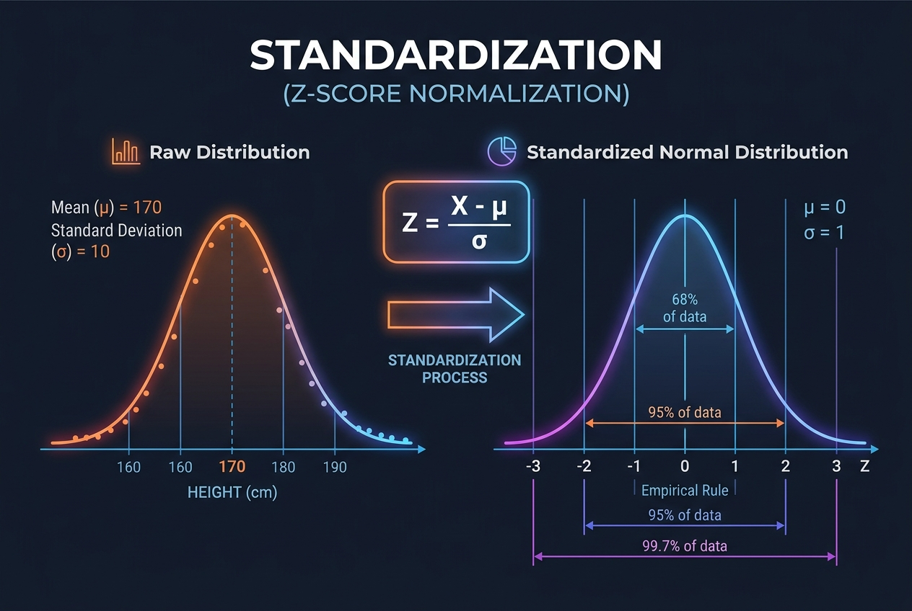

*   **Layman Explanation**: Re-centering data around zero. You adjust the data so that the average becomes 0, and you measure every point by how many standard steps (deviations) it is away from that average.
*   **Technical Explanation**: Rescaling data to have a mean of 0 and standard deviation of 1:
    $$X_{std} = \frac{X - \mu}{\sigma}$$
*   **Data Science Use Case**: Identifying how extreme a specific data point is relative to the average behavior.
*   **Machine Learning Use Case**: Required for optimization algorithms like Gradient Descent (used in Neural Networks, Logistic Regression) to ensure smooth, rapid convergence.
*   **Real-world Scenario**: A college admissions committee compares SAT scores (out of 1600) and ACT scores (out of 36). By standardizing both sets of scores, they can determine which applicant performed better relative to the national average.

### One-Hot Encoding
*   **Layman Explanation**: Converting categories into Yes/No checklists. Instead of a single column called "Color" with values "Red", "Blue", and "Green", you create three new columns: "Is_Red?", "Is_Blue?", and "Is_Green?" filled with 1s (Yes) and 0s (No).
*   **Technical Explanation**: Transforming a categorical variable with $k$ categories into $k$ binary columns (dummy variables), where only one column is active ("hot") at a time.
*   **Data Science Use Case**: Representing customer demographics (like city names or product categories) in statistical models.
*   **Machine Learning Use Case**: Converting non-numerical text columns into numbers so mathematical models (like regression or neural networks) can process them.
*   **Real-world Scenario**: A car rental website stores a feature "Vehicle Type" containing values like "Sedan", "SUV", or "Truck". Before feeding this data to a rental price prediction model, One-Hot Encoding converts it into three columns indicating 0 or 1.

---

## 5. Probability & Statistical Inference

### Normal (Gaussian) Distribution
*   **Layman Explanation**: The classic "bell curve." Most people are average height, a few are very tall, and a few are very short. When plotted, it looks like a symmetrical bell.
*   **Technical Explanation**: A continuous probability distribution symmetric about its mean, defined by:
    $$f(x) = \frac{1}{\sigma \sqrt{2\pi}} e^{-\frac{1}{2}\left(\frac{x-\mu}{\sigma}\right)^2}$$
*   **Data Science Use Case**: Modeling natural features such as physical measurements, blood pressure, or standardized test scores.
*   **Machine Learning Use Case**: Many ML algorithms (like Linear Discriminant Analysis or Gaussian Naive Bayes) assume that features are normally distributed. It is also the basis for assessing model residuals (errors).
*   **Real-world Scenario**: A shoe factory studies the distribution of adult foot sizes to determine how many shoes of each size they should manufacture. The foot sizes form a normal distribution, meaning sizes 8 to 10 are highly common, while sizes 5 and 14 are rare.

### Central Limit Theorem (CLT)
*   **Layman Explanation**: If you roll a single die, the results are flat (1 through 6 are equally likely). But if you roll 10 dice and calculate the average, and repeat this many times, the averages will form a bell curve (with most averages around 3.5).
*   **Technical Explanation**: The distribution of the sample means will approach a normal distribution as the sample size $N$ increases (typically $N \ge 30$), regardless of the shape of the population distribution.
*   **Data Science Use Case**: Allows analysts to calculate confidence intervals and make inferences about population averages without needing to know the exact shape of the underlying population.
*   **Machine Learning Use Case**: Validating the statistical significance of model improvements during cross-validation or A/B testing.
*   **Real-world Scenario**: A polling agency wants to find the average support rating of a political candidate. Rather than surveying all 50 million citizens, they take 100 different random samples of 1,000 citizens each. The averages of these 100 samples form a normal curve, allowing the agency to pinpoint the true candidate rating with high confidence.

### Hypothesis Testing (Null vs. Alternative)
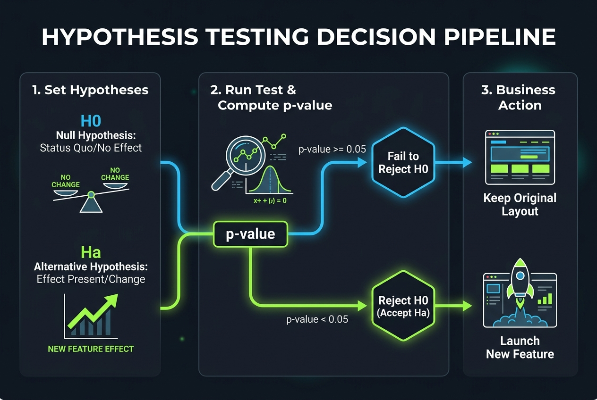

*   **Layman Explanation**: Innocent until proven guilty. 
    *   *Null Hypothesis*: Nothing new happened (e.g., "The new website design did NOT increase sales").
    *   *Alternative Hypothesis*: The new thing worked (e.g., "The new design DID increase sales").
*   **Technical Explanation**: A method of statistical inference where a null hypothesis ($H_0$) is tested against an alternative hypothesis ($H_a$). If the probability of observing the sample data under $H_0$ (p-value) is extremely low, $H_0$ is rejected.
*   **Data Science Use Case**: Conducting A/B tests to decide if a new product feature, layout change, or marketing email significantly improves customer engagement.
*   **Machine Learning Use Case**: Feature selection (e.g., using Chi-Square tests or ANOVA to determine if a feature has a statistically significant relationship with the target class).
*   **Real-world Scenario**: A streaming service changes its recommendations algorithm. The Null Hypothesis ($H_0$) is that users watch the same amount of video as before. The Alternative Hypothesis ($H_a$) is that users watch more. Following a trial, a t-test produces a p-value of 0.002, allowing the company to reject the null hypothesis and launch the new algorithm.
### Time Series & Forecasting
*   **Layman Explanation**: Predicting future patterns based on past timelines. It is like looking at a store's sales over the last five winters to predict how many coats it will sell this coming December.
*   **Technical Explanation**: Time series data is a sequence of data points indexed in chronological order. Forecasting involves building mathematical or statistical models (e.g. ARIMA, ETS, or machine learning sequence models) to predict future values based on historical trends, seasonal cycles, and random variation.
*   **Data Science Use Case**: Decomposing sales data into trend, seasonality, and residuals to understand underlying demand cycles.
*   **Machine Learning Use Case**: Transforming temporal data into supervised learning datasets using sliding windows (lag features) to train regression models like XGBoost, or sequence models like LSTM.
*   **Real-world Scenario**: An electricity provider reviews historical power consumption logs alongside temperature records. They build a forecasting model to predict daily power demand for the next two weeks, helping them schedule power plant outputs.

---

## 6. Mathematics, NumPy & Array Operations

#### 📐 Vector Mathematics & Modeling Concepts

### Linear Algebra
*   **Layman Explanation**: The math of grids and arrows. Instead of doing math one number at a time, linear algebra lets you use vectors (lists of numbers) and matrices (tables of numbers) to solve giant equations all at once.
*   **Technical Explanation**: The branch of mathematics concerning vector spaces, linear transformations, matrices, and systems of linear equations.
*   **Data Science Use Case**: Representing multi-column spreadsheets as matrices and rows as vectors to perform operations like transformations and projections.
*   **Machine Learning Use Case**: The mathematical engine of ML. Linear regression coefficients are solved using ordinary least squares matrix operations ($w = (X^T X)^{-1} X^T y$), and neural networks process layers via matrix multiplications ($W \cdot x + b$).
*   **Real-world Scenario**: Google's PageRank algorithm treats the entire web of billions of pages as a massive matrix and uses linear algebra (eigenvectors and eigenvalues) to rank search results based on link importances.

### Word2Vec (Word-to-Vec) Model
*   **Layman Explanation**: Converting words into coordinates on a map. Words with similar meanings (like "King" and "Queen") end up close to each other on the map. It also allows word math: "King" minus "Man" plus "Woman" equals "Queen".
*   **Technical Explanation**: A neural network-based natural language processing (NLP) technique that maps words from a vocabulary into a continuous vector space (typically 100-300 dimensions) using architectures like Continuous Bag-of-Words (CBOW) or Skip-gram.
*   **Data Science Use Case**: Grouping similar customer text reviews or feedback categories based on semantic meaning.
*   **Machine Learning Use Case**: Preprocessing raw text into numerical feature vectors that machine learning classifiers or deep learning sequence models can process.
*   **Real-world Scenario**: A recruiting website uses Word2Vec to match resumes with job postings. If a resume contains the word "Python" and a job posting asks for "Software Engineer", the model matches them because the two terms have similar vector representations in the software development domain.

### Vector Norm (L1 & L2 Norms)
*   **Layman Explanation**: The length of an arrow. 
    *   *L2 Norm (Euclidean distance)*: The straight-line distance from the start to the end.
    *   *L1 Norm (Manhattan distance)*: The distance you'd travel if you had to follow city streets in a grid pattern.
*   **Technical Explanation**: A function that maps a vector to a non-negative scalar representing its size/magnitude:
    *   **L1 Norm (Manhattan)**: The sum of absolute values:
        $$\|x\|_1 = \sum_{i=1}^n |x_i|$$
    *   **L2 Norm (Euclidean)**: The square root of the sum of squared values:
        $$\|x\|_2 = \sqrt{\sum_{i=1}^n x_i^2}$$
*   **Data Science Use Case**: Calculating the distance/similarity between data points (like user profiles in recommendation engines).
*   **Machine Learning Use Case**: Used in model regularization to prevent overfitting: L1 regularization (Lasso) drives coefficients to zero for feature selection; L2 regularization (Ridge) keeps weights small.
*   **Real-world Scenario**: A GPS navigation system calculates the straight-line distance between your car and your destination using the L2 Norm, but estimates the actual road travel distance using the L1 Norm.

#### ⚙️ Array Operations & Optimization

### Vectorization
*   **Layman Explanation**: Doing arithmetic on an entire list at once instead of going item-by-item. E.g., if you want to double the price of 1,000 items, you multiply the whole list by 2 in one single step.
*   **Technical Explanation**: Eliminating explicit loop structures in Python code and delegating array calculations to highly optimized, compiled C code underneath.
*   **Data Science Use Case**: Running calculations on massive tabular datasets instantly, which would take minutes or freeze python if processed with regular loops.
*   **Machine Learning Use Case**: Essential for model training. Training deep neural networks or running matrix multiplications would be impossibly slow without vectorized math operations.
*   **Real-world Scenario**: A financial analyst calculates the compound interest for 10 million bank accounts. Using a Python loop takes over 30 seconds; using a vectorized NumPy statement (`balances * (1 + rate)**years`) runs in under 0.05 seconds.

### Broadcasting
*   **Layman Explanation**: Automatically stretching a single number to fit a list. If you want to add a $10 shipping charge to a list of 100 different order totals, python automatically "stretches" that single $10 value to add it to every single item in the list.
*   **Technical Explanation**: The rules NumPy follows to perform arithmetic operations on arrays of different shapes. The smaller array is virtually "broadcast" across the larger array so that they have compatible shapes.
*   **Data Science Use Case**: Subtracting the average income from every individual row in a column to center the data.
*   **Machine Learning Use Case**: Implementing scaling techniques (like subtracting the mean vector and dividing by the standard deviation vector) across multi-dimensional feature matrices.
*   **Real-world Scenario**: An image processing model adjusts the brightness of an RGB image (a 3D array of pixels). Instead of writing three loops to add a brightness constant to every pixel value, the constant is broadcast across all dimensions of the image array simultaneously.

### Zip (Python Built-in & NumPy iteration)
*   **Layman Explanation**: Zipping a jacket. It takes two separate lists of data and pairs up their elements one-by-one: pairing the 1st items together, the 2nd items together, and so on.
*   **Technical Explanation**: A Python generator function (`zip(*iterables)`) that aggregates elements from each of the iterables and returns an iterator of tuples.
*   **Data Science Use Case**: Combining separate columns of lists (e.g. lists of dates and sales numbers) into paired pairs for processing.
*   **Machine Learning Use Case**: Iterating through paired batches of training inputs ($X_{batch}$) and target labels ($y_{batch}$) inside custom training loops.
*   **Real-world Scenario**: An online store has a list of product names `['Laptop', 'Mouse']` and a list of prices `[1200, 25]`. Using `zip()`, they pair them into `[('Laptop', 1200), ('Mouse', 25)]` to print receipt receipts.

### Array Shape & Dimensions
*   **Layman Explanation**: The structure of a box. The dimensions tell you if you have a single line of items (1D), a flat sheet of items (2D table), or a stack of sheets (3D cube). The shape tells you the exact count along each edge (e.g., a table with 5 rows and 3 columns has a shape of (5, 3)).
*   **Technical Explanation**: The properties of an n-dimensional array. `.ndim` represents the number of axes (dimensions). `.shape` is a tuple of integers indicating the size of the array along each axis.
*   **Data Science Use Case**: Checking `df.shape` to quickly find how many rows and columns are loaded from a database.
*   **Machine Learning Use Case**: Verifying matrix dimension alignment before training. If a model expects input shape `(batch_size, features)` and receives `(features, batch_size)`, it will fail due to dimension mismatch.
*   **Real-world Scenario**: An image loading library loads a color picture of size 1920x1080. The array dimensions are 3 (width, height, color channels), and the shape is `(1080, 1920, 3)`.

### Squeeze Operation
*   **Layman Explanation**: Flattening a box that is only 1 item thick. If you have a list of lists that only contains one row, like `[[5]]`, squeezing it simplifies it to just `5` so you don't have to keep digging through layers of boxes.
*   **Technical Explanation**: An array manipulation function (`np.squeeze` or `.squeeze()`) that removes one-dimensional axes (dimensions of size 1) from the shape of an array.
*   **Data Science Use Case**: Simplifying output arrays that contain single-item helper dimensions.
*   **Machine Learning Use Case**: Aligning output layers. For example, if a model predicts a single value per input and outputs shape `(64, 1)`, squeezing it converts it to `(64,)` so it matches the target labels format.
*   **Real-world Scenario**: A text classification model predicts a sentiment score for a single sentence. The model output is `[[0.92]]` (shape `(1, 1)`). Squeezing it outputs `0.92`, making it easy to store in a database.

---

## 7. Core Libraries & Tools

### Seaborn
*   **Layman Explanation**: An artist's paintbrush for data. While standard charts can look plain, Seaborn makes beautiful, colorful graphs with just one line of code.
*   **Technical Explanation**: A Python data visualization library built on top of Matplotlib, closely integrated with Pandas data structures.
*   **Data Science Use Case**: Easily creating complex visualizations like correlation matrix heatmaps, jointplots, and violin plots to study relationships between features.
*   **Machine Learning Use Case**: Visualizing distribution plots of residuals (prediction errors) to verify if error variance is constant, and plotting confusion matrices.
*   **Real-world Scenario**: A human resources analyst wants to look at salary distributions across different job roles. They use `sns.boxplot(x="JobRole", y="Salary", data=df)` to create a publication-ready box plot.

### Plotly
*   **Layman Explanation**: Interactive charts. Instead of a flat image, Plotly charts let you hover to see values, zoom in on sections, and toggle variables on/off.
*   **Technical Explanation**: A declarative, browser-based graphing library that generates interactive web plots using Plotly.js.
*   **Data Science Use Case**: Building interactive dashboards or multi-dimensional 3D scatter plots to allow business stakeholders to play with the data.
*   **Machine Learning Use Case**: Plotting interactive decision boundary regions or hyperparameter search grids to see exactly where models make mistakes.
*   **Real-world Scenario**: A sales director presents performance graphs during a meeting. Using Plotly, they hover over specific data points on a map to show exact revenue figures for different branch locations in real-time.

### Plotly Dash (Dash)
*   **Layman Explanation**: An easy way to turn Python scripts into interactive websites. Without knowing HTML, CSS, or JavaScript, you can build a web dashboard with dropdowns, sliders, and charts that updates in real-time as users click around.
*   **Technical Explanation**: A productive Python framework for building web analytic applications, built on top of Flask (web server), React.js (frontend UI components), and Plotly.js (interactive charts). It uses a declarative layout structure and callback functions to bind UI components to Python backend logic.
*   **Data Science Use Case**: Deploying interactive analytical dashboards for business users to filter, drill-down, and explore multi-dimensional datasets without requiring web development resources.
*   **Machine Learning Use Case**: Building interactive model demos or prototype user interfaces where users can adjust sliders (representing model input features) and see prediction results generated by an ML model in real-time.
*   **Real-world Scenario**: A logistics company wants to track fleet operations. The data scientist builds a Dash app displaying a live map of delivery trucks, containing dropdown menus that let dispatchers filter vehicles by fuel status and cargo weight.

### SciPy
*   **Layman Explanation**: A scientific calculator. It provides advanced mathematical toolboxes for complex calculations like physics equations, signals, or probability math.
*   **Technical Explanation**: A library for scientific and technical computing containing modules for optimization, linear algebra, integration, interpolation, FFT, and statistical distributions.
*   **Data Science Use Case**: Running hypothesis tests (like `scipy.stats.ttest_ind` or `scipy.stats.chi2_contingency`) to check if differences in group performance are real.
*   **Machine Learning Use Case**: Optimizing cost functions using gradient-free solvers (`scipy.optimize`), or handling sparse feature matrices (`scipy.sparse`) for high-dimensional text data.
*   **Real-world Scenario**: A website developer wants to check if a new font layout increases signup rates. They feed the click numbers of layout A and layout B into `scipy.stats.chi2_contingency` to calculate the chi-square statistic and p-value.

### Matplotlib
*   **Layman Explanation**: The basic blueprint drawing tool. It allows you to build any chart brick-by-brick (adding labels, lines, ticks, and dots) but requires you to spell out all the instructions manually. It was originally designed to mimic the plotting system of MATLAB.
*   **Technical Explanation**: A low-level, comprehensive library for creating static, animated, and interactive visualizations in Python. It relies heavily on NumPy arrays for its calculations and acts as the underlying plotting engine for Pandas (`df.plot()`) and Seaborn.
*   **Data Science Use Case**: Fine-tuning specific elements of a plot, like customizing axes limits, legends, or layout parameters.
*   **Machine Learning Use Case**: Plotting training loss curves over epochs to monitor models for overfitting or underfitting.
*   **Real-world Scenario**: A researcher plotting global temperature changes over 150 years uses Matplotlib to manually add customized gridlines, custom red-to-blue text annotations, and double y-axes to represent both Celsius and Fahrenheit scales.

### Scikit-learn (sklearn)
*   **Layman Explanation**: A toolkit of pre-built machine learning brains. Instead of writing formulas from scratch, you load a model (like a linear model or decision tree), feed it data, and it learns instantly.
*   **Technical Explanation**: A machine learning library featuring classification, regression, clustering, preprocessing, and model evaluation algorithms.
*   **Data Science Use Case**: Splitting data into training/testing sets and standardizing numeric features prior to analysis.
*   **Machine Learning Use Case**: Model training, hyperparameter tuning (GridSearchCV), and calculating performance metrics (accuracy, F1-score, ROC-AUC).
*   **Real-world Scenario**: A customer retention team imports Scikit-learn's `RandomForestClassifier` to train a model on historical usage data. The model is then run against active customer profiles to flag who is most likely to cancel their subscription.

### Pandas
*   **Layman Explanation**: Excel on steroids. It lets you load, filter, sort, clean, and analyze tables with millions of rows in seconds using code.
*   **Technical Explanation**: A library offering high-performance, easy-to-use data structures (Series, DataFrame) and data analysis tools for tabular data.
*   **Data Science Use Case**: Loading CSV or Excel files, dropping duplicates, grouping by categories, and aggregating sales data.
*   **Machine Learning Use Case**: Loading datasets, slicing features from labels (`X` and `y`), and mapping text categories to numbers before modeling.
*   **Real-world Scenario**: A marketing firm receives thousands of monthly leads spread across multiple CSV files. Using Pandas, they merge the files, filter out rows with missing email addresses, sort the leads by signup date, and export a clean final sheet in seconds.

---

## 8. Statistical Plots & Graphs

#### 📊 Quick Reference: Visualization Categories
| Plot Type Category | Common Charts | Primary Data Science Use Case |
| :--- | :--- | :--- |
| **📊 Distribution & Comparison** | Histogram, Line Plot, Bar Chart, Pie Chart, Box Plot, Violin Plot, Swarm Plot | Comparing categories, viewing numerical spreads, checking skewness, and monitoring values over time. |
| **🔗 Relationship & Correlation** | Scatter Plot, Heatmap, Joint Plot, Pair Plot, Scatter Matrix, 3D Scatter | Studying correlations, finding linear/non-linear patterns, identifying clusters, and checking feature multicollinearity. |
| **🧭 Specialized & Hierarchical** | Sunburst Chart, Gauge Chart, Radar Plot, Area Plot, Treemap | Visualizing hierarchical nested shares, tracking performance progress, showing multi-variable skills, and stacked volume over time. |

### Histogram
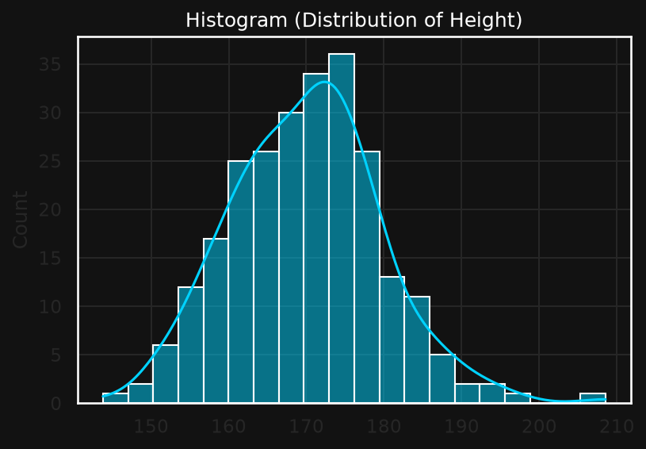

*   **Associated Libraries**: Matplotlib (`plt.hist`), Seaborn (`sns.histplot`), Plotly (`px.histogram`)
*   **Layman Explanation**: A bar chart that shows the shape of your data. If you count how many people fit into different weight categories (e.g., 50-60kg, 60-70kg, etc.) and draw a bar for each group, the tall bars show where most people cluster.
*   **Technical Explanation**: A visual representation of the distribution of a continuous numerical variable. Data is divided into non-overlapping intervals ("bins"), and the height of each bar represents the frequency (or density) of data points within that bin.
*   **Data Science Use Case**: Checking if a numerical variable (like order values) has a normal distribution, is skewed, or has multiple peaks.
*   **Machine Learning Use Case**: Checking feature distributions to decide if they need a log transform to reduce skewness before feeding them to algorithms like linear regression.
*   **Real-world Scenario**: A bank plots the distribution of account balances of their customers to see if the majority of customers are concentrated in low-balance bins.

### Line Plot
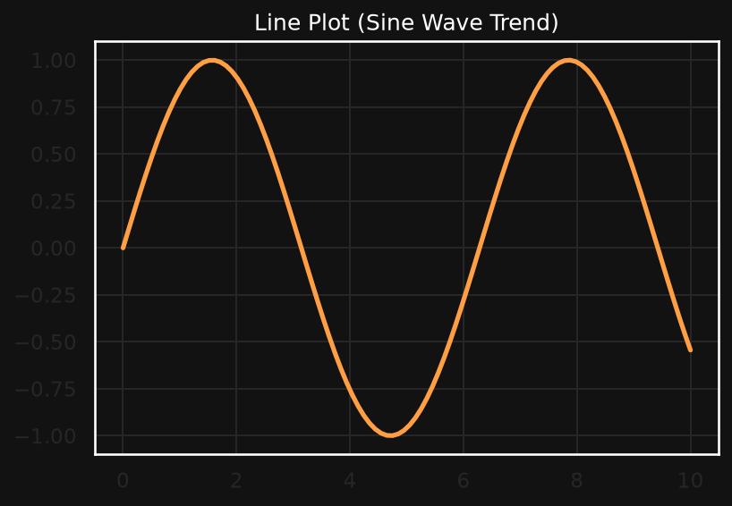

*   **Associated Libraries**: Matplotlib (`plt.plot`), Seaborn (`sns.lineplot`), Plotly (`px.line`)
*   **Layman Explanation**: Connect-the-dots chart showing how things change over time. If you measure temperature every hour and connect those measurements with a line, you can easily see if it's getting warmer or cooler.
*   **Technical Explanation**: A plot that displays information as a series of data points called 'markers' connected by straight line segments, where the x-axis represents an ordered sequence (often time) and the y-axis represents a quantitative value.
*   **Data Science Use Case**: Visualizing time-series trends, such as monthly revenue growth or stock price movements.
*   **Machine Learning Use Case**: Plotting validation loss and training loss curves over epochs to diagnose whether a model is underfitting or overfitting.
*   **Real-world Scenario**: A subscription streaming company plots its monthly active users (MAU) over the last two years to visualize subscriber growth.

### Bar Chart
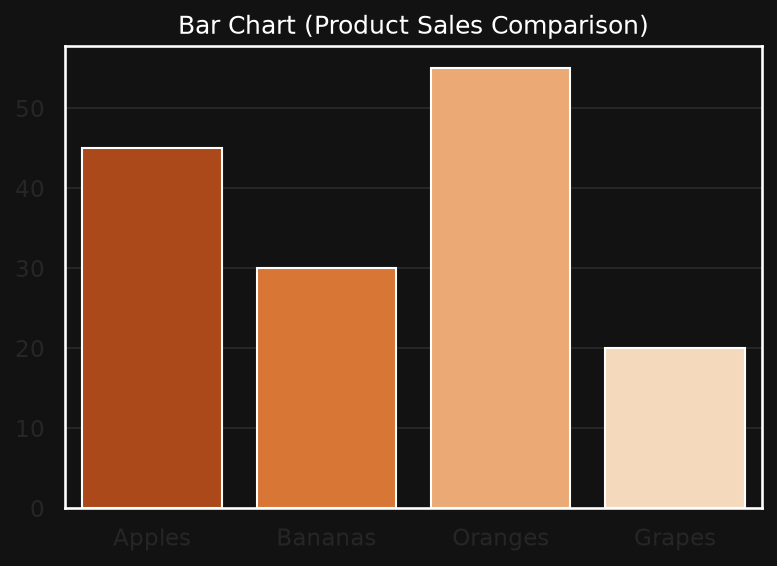

*   **Associated Libraries**: Matplotlib (`plt.bar`), Seaborn (`sns.barplot`), Plotly (`px.bar`)
*   **Layman Explanation**: Comparing different categories side-by-side. Each category gets a bar, and the taller the bar, the larger the number (e.g., comparing sales of apples vs. bananas vs. oranges).
*   **Technical Explanation**: A chart that represents categorical data with rectangular bars with heights or lengths proportional to the values they represent.
*   **Data Science Use Case**: Comparing aggregated metrics (such as average spending or customer counts) across discrete groups (like States or Age Groups).
*   **Machine Learning Use Case**: Plotting "Feature Importances" output by tree-based models (like Random Forests) to show which features have the greatest impact on predictions.
*   **Real-world Scenario**: In Project 3, the AAL Head of Sales and Marketing uses a bar chart to compare the total sales generated by Western Australia, Queensland, and New South Wales.

### Pie Chart
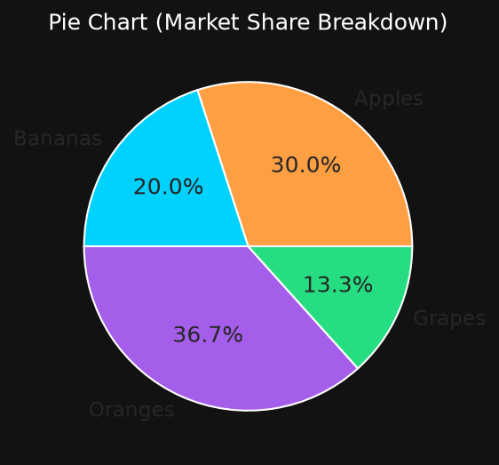

*   **Associated Libraries**: Matplotlib (`plt.pie`), Plotly (`px.pie`)
*   **Layman Explanation**: A sliced pizza representing shares of a whole. Each slice shows what percentage of the total belongs to a category (e.g., showing what percentage of your budget goes to rent vs. food).
*   **Technical Explanation**: A circular statistical graphic divided into slices to illustrate numerical proportion, where the arc length of each slice is proportional to the quantity it represents.
*   **Data Science Use Case**: Showing simple categorical breakdowns of a whole (like market share) when there are only a few categories (ideally under 5).
*   **Machine Learning Use Case**: Visualizing class balance/imbalance in a target classification label (e.g., percentage of fraud vs. non-fraud transactions) during exploratory analysis.
*   **Real-world Scenario**: A product manager uses a pie chart to display the proportion of active users visiting their website from desktop (60%), mobile (35%), and tablet (5%).

### Box Plot (Box-and-Whisker Plot)

*   **Associated Libraries**: Matplotlib (`plt.boxplot`), Seaborn (`sns.boxplot`), Plotly (`px.box`)
*   **Layman Explanation**: A summarizing snapshot of your data. The central box shows where the middle 50% of your data lives, the line inside shows the exact center (median), the "whiskers" show the normal range, and individual dots outside show extreme values (outliers).
*   **Technical Explanation**: A method for graphically depicting groups of numerical data through their quartiles. It displays the median (Q2), the first quartile (Q1), the third quartile (Q3), the interquartile range (IQR), and potential outliers (points beyond $1.5 \times IQR$ from the quartiles).
*   **Data Science Use Case**: Identifying outliers and comparing the spread and skewness of a numerical column across different categories (e.g., salary distributions by job role).
*   **Machine Learning Use Case**: Inspecting features for outliers before deciding which scaling technique (Standardization vs. Robust Scaling) is appropriate.
*   **Real-world Scenario**: A HR department uses a box plot to compare salary ranges across departments (Engineering, Sales, HR), highlighting the median salary and identifying pay outliers.

### Scatter Plot
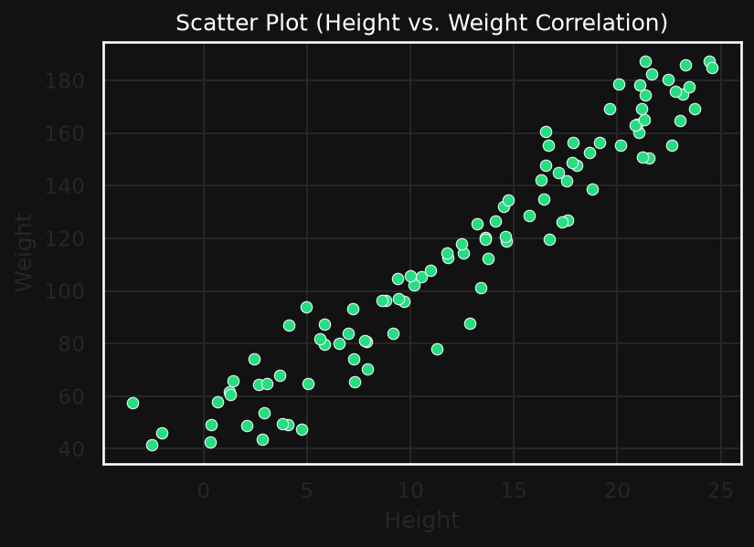

*   **Associated Libraries**: Matplotlib (`plt.scatter`), Seaborn (`sns.scatterplot`), Plotly (`px.scatter`)
*   **Layman Explanation**: A cloud of dots showing if two things are connected. If you plot height on the bottom and weight on the side, each dot is a person. If the dots slope upward, it shows that taller people generally weigh more.
*   **Technical Explanation**: A two-dimensional data visualization that uses dots to represent the values obtained for two different variables - one plotted along the horizontal axis and the other along the vertical axis.
*   **Data Science Use Case**: Examining correlations, identifying clusters of data points, and spot-checking linear or non-linear patterns between two numerical variables.
*   **Machine Learning Use Case**: Visualizing predictions vs. actual target values in regression, or plotting 2D projections of high-dimensional data (e.g., PCA or t-SNE clusters).
*   **Real-world Scenario**: An automobile engineer plots car weight against fuel efficiency (mpg) for 500 car models, showing a clear downward trend (heavier cars are less fuel-efficient).

### Violin Plot
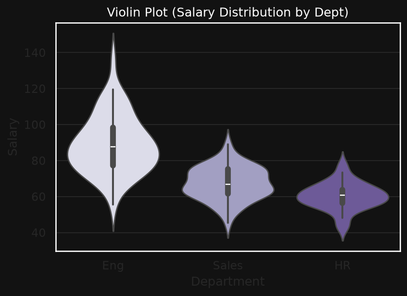

*   **Associated Libraries**: Seaborn (`sns.violinplot`), Plotly (`px.violin`)
*   **Layman Explanation**: A box plot with curves. It does the same job as a box plot (showing the middle and range), but its shape gets wider where there are more data points and narrower where there are fewer, looking like a violin.
*   **Technical Explanation**: A visualization combining a box plot and a kernel density plot, showing the probability density of the data at different values.
*   **Data Science Use Case**: Comparing distributions of a numerical variable across multiple categories when the data has multiple peaks (multimodal distributions) which a box plot would hide.
*   **Machine Learning Use Case**: Inspecting distribution shapes of model residuals across different classification groups to ensure error shapes are consistent.
*   **Real-world Scenario**: A school board uses violin plots to display test scores across different schools. The violin shape reveals that in one school, scores are split into two clusters (some students scored very high, some very low), which a simple average or box plot would mask.

### Heatmap
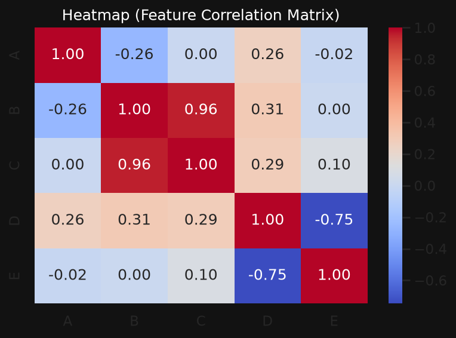

*   **Associated Libraries**: Seaborn (`sns.heatmap`), Plotly (`px.imshow`)
*   **Layman Explanation**: A colored grid where bright colors represent high numbers and dark colors represent low numbers, helping you spot hot spots instantly.
*   **Technical Explanation**: A 2D visualization of data where values in a matrix are represented as colors, often paired with a color scale bar.
*   **Data Science Use Case**: Plotting a correlation matrix of all numerical columns in a dataset to see which variables are strongly related.
*   **Machine Learning Use Case**: Displaying a model's Confusion Matrix (showing actual vs. predicted values) to check which classes the model is confusing the most.
*   **Real-world Scenario**: A website developer uses a heatmap of user click coordinates on a webpage to see exactly which buttons or banner ads get the most attention.

### Sunburst Chart
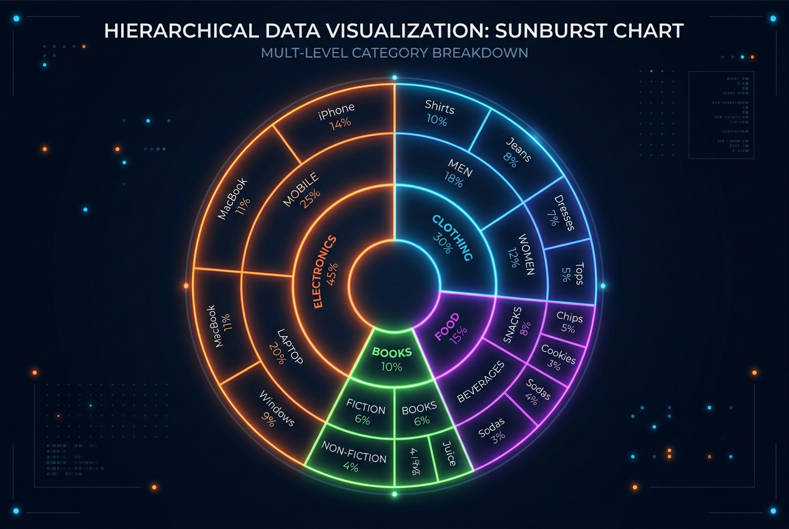

*   **Associated Libraries**: Plotly (`px.sunburst`)
*   **Layman Explanation**: A nested pie chart showing hierarchy. The inner ring shows the main categories (e.g., Countries), and the outer rings break those categories down into subcategories (e.g., States, then Cities), showing how much each slice contributes to the total.
*   **Technical Explanation**: A chart displaying hierarchical data represented by concentric circles, where the circle in the center represents the root node and hierarchy moves outward. Slices are scaled by their metric contribution.
*   **Data Science Use Case**: Exploring categorical structures with nested levels (like sales broken down by Category $\rightarrow$ Sub-Category $\rightarrow$ Product Name).
*   **Machine Learning Use Case**: Visualizing decision trees to see the flow of data splits from root to leaf nodes.
*   **Real-world Scenario**: An apparel retail chain uses a sunburst chart to display sales: the center ring shows demographics (Men, Women, Kids), the second ring shows item type (Shirts, Pants, Outerwear), and the outer ring shows specific fabrics.

### Gauge / Indicator Chart
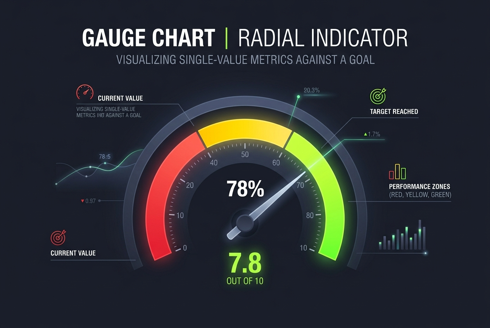

*   **Associated Libraries**: Plotly (`go.Indicator` with mode `gauge`)
*   **Layman Explanation**: A speedometer for your business. It shows a single value on a dial relative to a target or range (e.g., showing current sales at 80k on a dial ranging from 0 to 100k, with a red/yellow/green indicator).
*   **Technical Explanation**: A radial or linear scale visualization displaying a single key metric relative to defined thresholds (minimum, target, maximum, and performance ranges).
*   **Data Science Use Case**: Presenting KPIs (Key Performance Indicators) on executive dashboards where viewers need to instantly see if a metric is on target (green) or in danger (red).
*   **Machine Learning Use Case**: Displaying model performance metrics (like F1-score or Accuracy) on an interface, comparing the current model against a baseline threshold.
*   **Real-world Scenario**: A customer support manager uses a gauge chart on their live monitor showing the current average wait time (3 minutes) sitting in the green zone of a dial that turns red if wait times exceed 5 minutes.

### Pair Plot
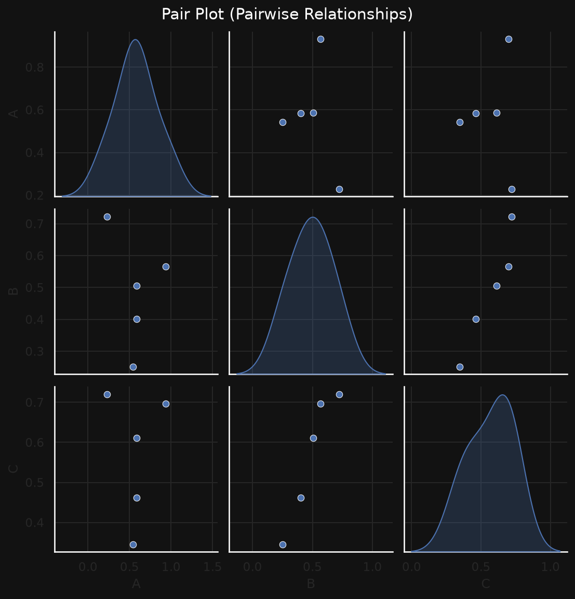

*   **Associated Libraries**: Seaborn (`sns.pairplot`), Plotly (`px.scatter_matrix`)
*   **Layman Explanation**: A matchmaker grid. If you have multiple properties of a house (price, size, rooms, age, distance), a pair plot draws a scatter plot for every possible pair of variables, and a histogram down the center diagonal, letting you see all relationships in one large grid.
*   **Technical Explanation**: A grid of pairwise scatter plots for all numerical variables in a dataset, with univariate distribution plots (histograms or KDE plots) on the diagonal.
*   **Data Science Use Case**: Rapidly performing exploratory analysis to identify correlations and patterns across all numerical columns in a new dataset.
*   **Machine Learning Use Case**: Checking for multi-collinearity (redundant, highly correlated features) and identifying which features have clear linear separating boundaries for classification.
*   **Real-world Scenario**: A banking analyst imports a dataset of credit card customers (balance, age, income, card utilization) and uses a pair plot to quickly find clusters of similar spending behavior.

### Joint Plot
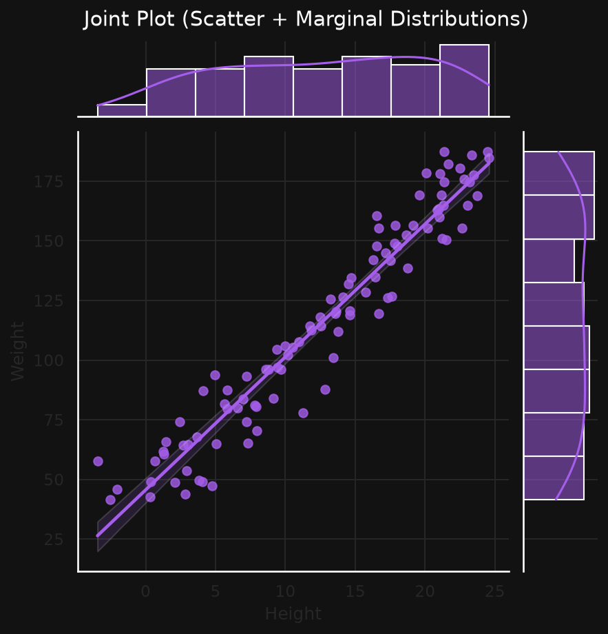

*   **Associated Libraries**: Seaborn (`sns.jointplot`)
*   **Layman Explanation**: A scatter plot with extra detail on the sides. The main chart shows the relationship between two variables, while the top and right margins show the individual distribution (histogram) of each variable, giving you both bivariate and univariate insights at once.
*   **Technical Explanation**: A bivariate visualization that displays the joint relationship between two numerical variables along with their individual marginal distributions on the sides.
*   **Data Science Use Case**: Analyzing how two specific variables (e.g., house price vs. square footage) relate to each other while simultaneously inspecting their individual distributions.
*   **Machine Learning Use Case**: Verifying bivariate normality assumptions or identifying joint outlier boundaries.
*   **Real-world Scenario**: A medical researcher plots patient dosage levels against recovery time using a joint plot, allowing them to see the correlation in the center and the range of dosage levels and recovery times on the margins.

### Swarm Plot
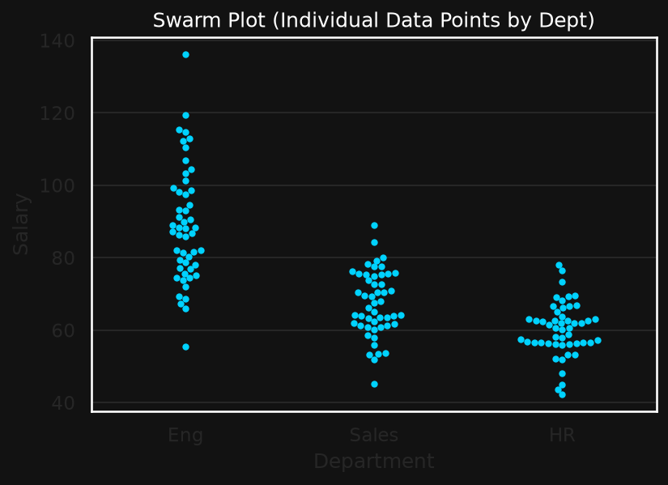

*   **Associated Libraries**: Seaborn (`sns.swarmplot`)
*   **Layman Explanation**: A scatter plot for categories where points don't overlap. It groups points into vertical columns by category, but spreads them out horizontally to form "swarms," so you can see every single data point clearly.
*   **Technical Explanation**: A categorical scatter plot where points are adjusted along the categorical axis so that they do not overlap, preserving the exact shape of the distribution of values.
*   **Data Science Use Case**: Visualizing small-to-medium-sized datasets where you want to see the density and spread of individual data points across categories.
*   **Machine Learning Use Case**: Inspecting categorical feature distributions for small test sets or validation samples.
*   **Real-world Scenario**: A plant researcher plots the height of 100 seedlings across three different soil types, using a swarm plot to see the exact measurement of every single seedling.

### Scatter Matrix / Splom
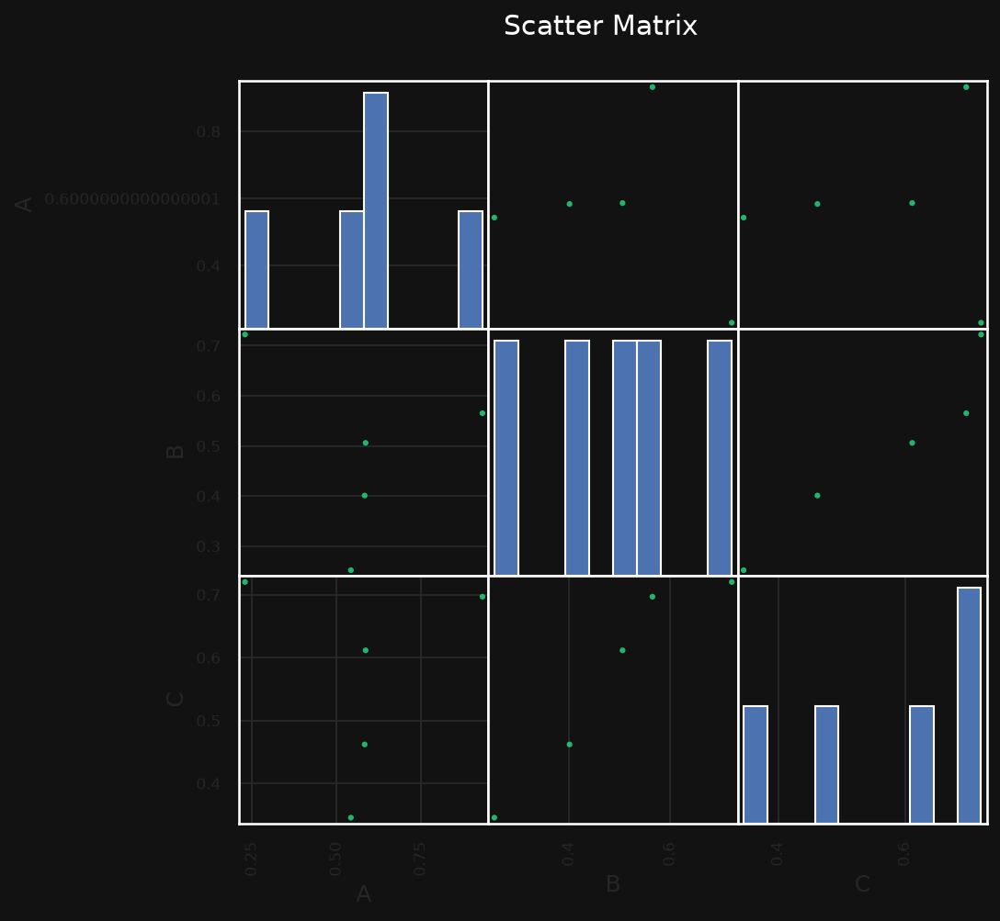

*   **Associated Libraries**: Plotly (`px.scatter_matrix`)
*   **Layman Explanation**: An interactive grid of scatter plots. You can hover, zoom, and select specific points in one plot, and those same points will automatically light up in all other plots in the grid.
*   **Technical Explanation**: A multi-dimensional visualization representing a grid of pairwise scatter plots, enabling interactive filtering, selection, and dimensions-brushing across all pairs.
*   **Data Science Use Case**: Exploring high-dimensional data relationships interactively in a web browser.
*   **Machine Learning Use Case**: Brushing and linking to highlight clusters detected by K-Means across all feature spaces.
*   **Real-world Scenario**: A molecular biologist uses a Scatter Matrix to inspect the expression levels of five different genes across 200 tissue samples.

### Polar / Radar Plot
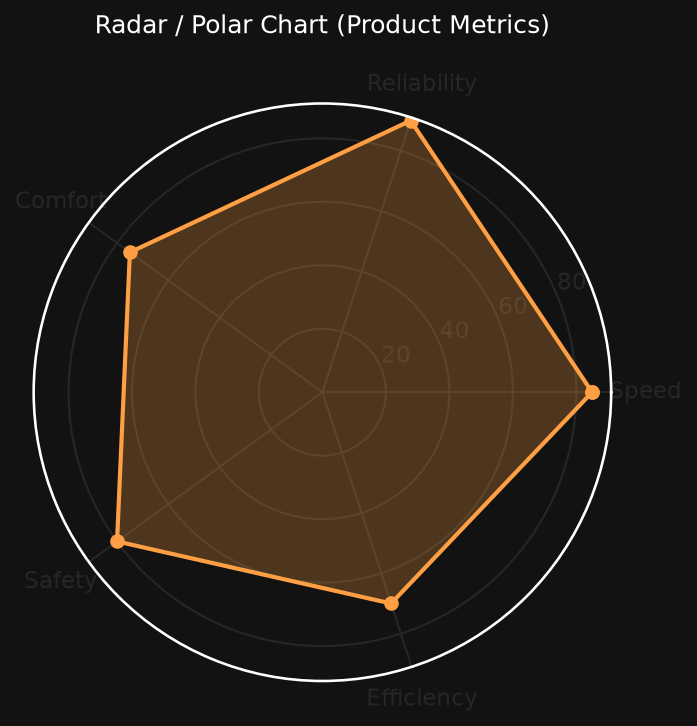

*   **Associated Libraries**: Matplotlib (`plt.polar`), Plotly (`px.line_polar`)
*   **Layman Explanation**: A spiderweb chart. Instead of square X and Y axes, values are plotted on a circular grid radiating outward from the center, often used to display skills or multi-attribute profiles (e.g., video game character stats).
*   **Technical Explanation**: A circular chart that displays values of multiple variables on spokes radiating from the center, where the angle represents the categories and the distance from the center represents the value.
*   **Data Science Use Case**: Comparing a single entity's performance across multiple categorical dimensions (e.g., comparing a store's ratings in service, speed, cleanliness, price).
*   **Machine Learning Use Case**: Visualizing cluster centroids across normalized feature coordinates.
*   **Real-world Scenario**: A manager creates a radar chart to compare the strengths of three job candidates across five key skills: communication, coding, teamwork, design, and leadership.

### Area Plot
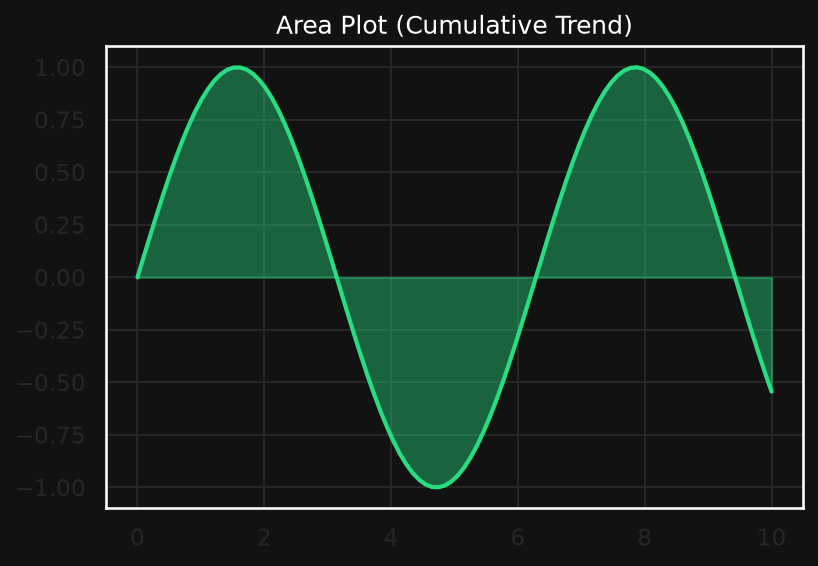

*   **Associated Libraries**: Matplotlib (`plt.fill_between`), Plotly (`px.area`)
*   **Layman Explanation**: A line plot where the space underneath the line is colored in, making it look like a mountain range and emphasizing the total volume or magnitude over time.
*   **Technical Explanation**: A line plot where the area between the line and the x-axis (or between two lines) is filled with color or texture.
*   **Data Science Use Case**: Displaying the cumulative contribution of multiple categories to a total sum over time (e.g., stacked area plot for sales).
*   **Machine Learning Use Case**: Plotting ROC curves or Precision-Recall curves where the "Area Under the Curve" (AUC) measures model performance.
*   **Real-world Scenario**: An energy company plots total power generation over 24 hours, stacking coal, gas, solar, and wind generation as shaded areas to show how the energy mix changes.

### Treemap
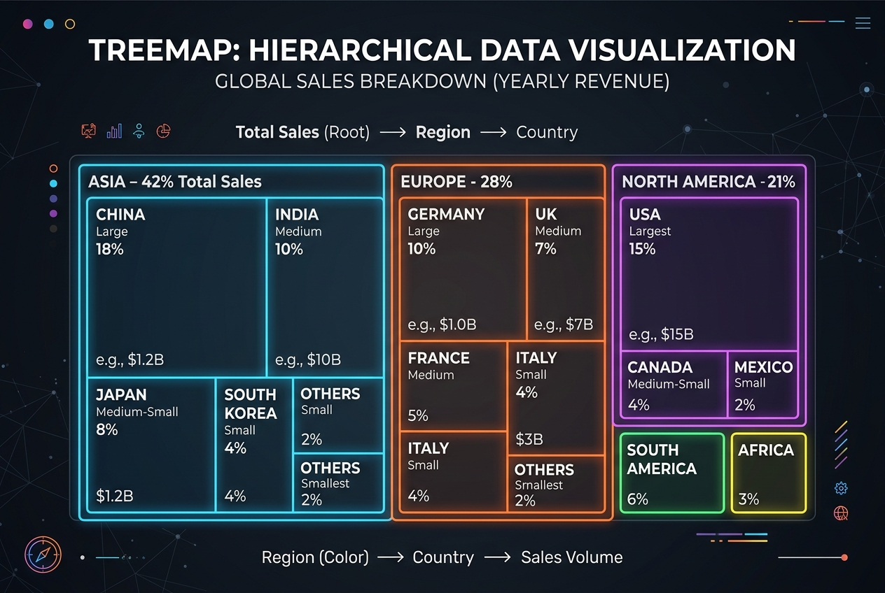

*   **Associated Libraries**: Plotly (`px.treemap`), squarify (`squarify.plot` for Matplotlib)
*   **Layman Explanation**: A nested grid of rectangles. The screen is divided into large boxes representing categories, which are subdivided into smaller boxes representing subcategories. The size of each box shows its share of the total.
*   **Technical Explanation**: A hierarchical visualization that displays nested data as rectangles, where the area of each rectangle is proportional to its value.
*   **Data Science Use Case**: Presenting high-level category breakdowns (e.g., global sales by continent, country, and product category) in a space-efficient layout.
*   **Machine Learning Use Case**: Visualizing decision trees or model feature hierarchies.
*   **Real-world Scenario**: A financial website shows a stock market treemap, where the box sizes represent company market capitalization and box colors represent daily stock gain or loss.

### 3D Scatter / Line Plot
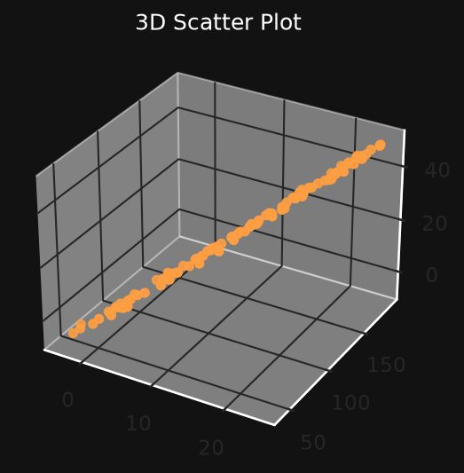

*   **Associated Libraries**: Matplotlib (`ax.scatter3D` / `projection='3d'`), Plotly (`px.scatter_3d`)
*   **Layman Explanation**: A three-dimensional cube of points. Instead of just X and Y axes, you add a Z axis for depth, allowing you to spin the graph around and see how points cluster in 3D space.
*   **Technical Explanation**: A plot that represents three numerical variables mapped to X, Y, and Z spatial coordinates, showing relationships in three-dimensional space.
*   **Data Science Use Case**: Analyzing physical structures, coordinates, or evaluating three interacting numeric factors.
*   **Machine Learning Use Case**: Visualizing the first three components of a Principal Component Analysis (PCA) to check for cluster separation in 3D space.
*   **Real-world Scenario**: A geologist plots seismic sensors' depth, longitude, and latitude in a 3D scatter plot to map the boundary lines of underground fault zones.

---

## 9. Reference Materials & External Resources

### 📘 Mathematics & Deep Learning
*   **Math for Deep Learning**: *What You Need to Know to Understand Neural Networks* (Ronald T. Kneusel)
    *   [Read/Download Book PDF](https://ytx-readings.github.io/AI/books/mathematics/Math%20for%20Deep%20Learning%20What%20You%20Need%20to%20Know%20to%20Understand%20Neural%20Networks%20(Ronald%20T.%20Kneusel)%20(Z-Library).pdf)
*   **Deep Learning for Math (dl4math)**: Resources for learning advanced math for deep learning models.
    *   [GitHub Repository](https://github.com/lupantech/dl4math)

### 📊 Statistics & Probability
*   **Introductory Statistics**: (Shafer and Zhang)
    *   [LibreTexts Book Portal](https://stats.libretexts.org/Bookshelves/Introductory_Statistics/Introductory_Statistics_(Shafer_and_Zhang))
*   **LibreTexts Commons**: A public database for learning materials across fields.
    *   [LibreTexts Home](https://libretexts.org/?gad_source=1&gad_campaignid=23242901420&gbraid=0AAAABB8lt0TVlNz8goze2ld63Sbf-6FvV&gclid=Cj0KCQjw3qLSBhDaARIsAFTiVh5DL63I0E_JIcP9AUD-YnwF5oqQ89o-Fu5puvBkwhqf4AyxA7UDcRgaAhIREALw_wcB)
    *   [LibreTexts Commons Search](https://commons.libretexts.org/)

### 📈 Data Visualization & Python
*   **Python for Data Analysis**: (Wes McKinney, Creator of Pandas)
    *   [Read Online (Free edition)](https://wesmckinney.com/book/)
*   **Seaborn Documentation**: Official guide for Seaborn plotting styles.
    *   [Seaborn Docs](https://seaborn.pydata.org/)
*   **Matplotlib Cheatsheets**: Quick visual reference cards for Pyplot settings.
    *   [Matplotlib Cheatsheet PNG](https://matplotlib.org/cheatsheets/_images/cheatsheets-2.png)
    *   [Matplotlib Cheatsheets Hub](https://matplotlib.org/cheatsheets/)

### 🔮 Time Series Forecasting
*   **Forecasting: Principles and Practice (Python edition)**: (Rob J Hyndman & George Athanasopoulos)
    *   [Read Online (fpppy)](https://otexts.com/fpppy/)
*   **Forecasting Notes**: Theoretical foundations of time series.
    *   [Download PDF Notes](https://robjhyndman.com/uwafiles/fpp-notes.pdf)
*   **Forecasting: Principles and Practice (R/fpp3 edition)**:
    *   [Read Online (fpp3)](https://otexts.com/fpp3/)

### 🗃️ Curated Open Datasets
*   **Awesome Public Datasets**: A topic-centric list of high-quality public datasets.
    *   [GitHub Repository](https://github.com/awesomedata/awesome-public-datasets)
*   **FIFA World Cup 2026 Complete Tournament Statistics**: Available on regional data portals and kaggle.

---

## 💡 Core Questions & Discussion

### ❓ Question: In the real world, is it mostly a multivariate problem?

**Yes, absolutely.** In 99% of real-world scenarios, problems are **multivariate** rather than univariate or bivariate. 

#### Why?
Single outcomes (Target Variables) in complex systems are rarely caused by a single input (Feature). They are almost always the result of multiple interacting, overlapping variables:
*   **Customer Churn**: A customer doesn't leave just because of price (Bivariate). They leave due to a *combination* of their age, how long they've been waiting for customer support, their monthly data usage, and the number of times they've experienced service dropouts (Multivariate).
*   **House Valuation**: A home's price isn't determined just by its size (Bivariate). It is determined by the size, local crime rates, proximity to high-rated schools, age of the building, current federal interest rates, and municipal zoning status (Multivariate).
*   **Medical Prognosis**: A patient's risk of heart disease cannot be predicted using only their cholesterol level. A doctor must evaluate age, weight, smoking habits, genetic background, systolic blood pressure, and daily activity levels together (Multivariate).

#### What does this mean for Data Scientists?
1.  **Confounding Factors**: If you only look at two variables (Bivariate analysis), you might see a strong correlation that is actually caused by a third, hidden variable. For example, ice cream sales and sunscreen sales are highly correlated, but buying ice cream doesn't make you buy sunscreen; they are both driven by *temperature* (a multivariate confounder).
2.  **Model Choice**: This is why simple models like Simple Linear Regression are rarely used in production. Data scientists rely on Multiple Linear Regression, Decision Trees, Random Forests, and Gradient Boosting machines because they can map complex, multi-variable interactions.
