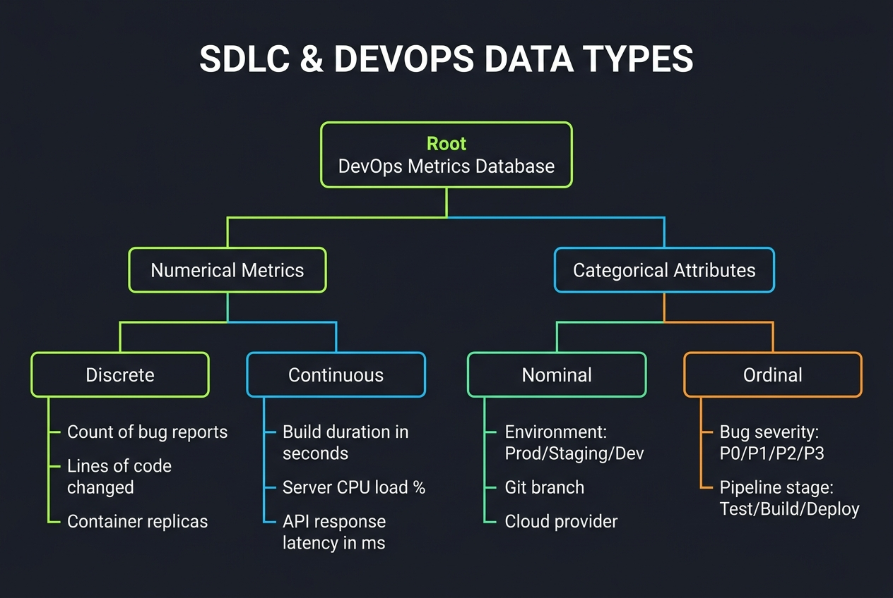

# SDLC & DevOps Analytics — Data Science & Machine Learning Glossary

This document serves as an educational reference guide for Data Science, Machine Learning, and Statistics applied specifically to a **Software Development Lifecycle (SDLC), Software Engineering, and DevOps/Deployment** context (e.g., CI/CD build success, container scaling, server CPU load, code repository commits, API latencies, and release cycle automation).

---

## Table of Contents
1. [Core Statistical Measures](#1-core-statistical-measures)
2. [Data Analysis & Variables](#2-data-analysis--variables)
3. [Data Cleaning & Wrangling](#3-data-cleaning--wrangling)
4. [Feature Engineering & Preprocessing](#4-feature-engineering--preprocessing)
5. [Probability & Statistical Inference](#5-probability--statistical-inference)
6. [Mathematics, NumPy & Array Operations](#6-mathematics-numpy--array-operations)
7. [Core Libraries & Tools](#7-core-libraries--tools)
8. [Statistical Plots & Graphs](#8-statistical-plots--graphs)

---

## 1. Core Statistical Measures

### Descriptive Statistics vs. Inferential Statistics
*   **Layman Explanation**: 
    *   *Descriptive*: Describing how our code builds went yesterday (e.g., "We ran 50 builds, 45 succeeded, and the average build duration was 180 seconds").
    *   *Inferential*: Estimating whether the new code pipeline setup will reduce build times for the entire engineering department based on a pilot test (e.g., "Based on testing the new runners with 100 sample builds, we estimate with 95% confidence that build times will decrease by 15% to 20% on the main pipeline").
*   **Technical Explanation**: 
    *   *Descriptive*: Methods for summarizing historical dataset properties (mean, median, standard deviation, and range) to depict server workloads or code metrics.
    *   *Inferential*: Using probability models and sample statistics to make generalizations and test hypotheses about the parameters of a broader software environment.
*   **Data Science Use Case**: Descriptive stats are used in Grafana dashboards to track live container CPU spikes; Inferential stats are used in performance testing to determine if a code change significantly degrades API latency.
*   **Machine Learning Use Case**: Descriptive statistics verify that training and validation pipelines have similar feature distributions; Inferential statistics determine if model accuracy improvements during build testing are statistically significant.
*   **Real-world Scenario**: A release manager reviews code lint failure logs (Descriptive), and then performs a statistical analysis to predict if deployment success rates will improve if unit testing rules are made stricter (Inferential).

| Feature / Aspect | Descriptive Statistics | Inferential Statistics |
| :--- | :--- | :--- |
| **Primary Goal** | Summarize and describe past historical data. | Make predictions or draw conclusions about a population. |
| **Output Type** | Charts, tables, means, medians, standard deviations. | p-values, confidence intervals, hypothesis test results. |
| **SDLC Example** | Average count of git commits per developer per week. | Estimating production crash rate from staging trial runs. |

### Mean
*   **Layman Explanation**: The standard average. Sum up all microservice response latencies and divide by the number of requests.
*   **Technical Explanation**: The arithmetic average of a dataset, calculated as:
    $$\mu = \frac{\sum_{i=1}^N X_i}{N} \quad \text{(Population)} \qquad \bar{x} = \frac{\sum_{i=1}^n x_i}{n} \quad \text{(Sample)}$$
*   **Data Science Use Case**: Calculating the average build duration in a CI/CD pipeline to estimate runner usage costs.
*   **Machine Learning Use Case**: Centering features (subtracting the mean) during input preprocessing inside ML compile stages.
*   **Real-world Scenario**: A DevOps lead reports that the mean daily CPU utilization of our production Kubernetes cluster is 45.2%.

### Median
*   **Layman Explanation**: The middle value when you sort all API request times in order. This is highly useful because a few queries that freeze or time out will skew the normal average.
*   **Technical Explanation**: The middle value of a sorted dataset. If the dataset has an odd number of observations, it is the middle value. If even, it is the average of the two middle values.
*   **Data Science Use Case**: Describing typical API response speeds. If 99 requests take 0.05 seconds and 1 request times out at 30 seconds, the mean is 0.35 seconds (misleading), but the median is 0.05 seconds (accurate representation of typical user experience).
*   **Machine Learning Use Case**: Imputing missing test coverage numbers in repositories containing extreme coverage outlier values.
*   **Real-world Scenario**: A lead engineer notes that while the mean PR review time is 24 hours (skewed by a few complex PRs), the median review time is a healthy 2 hours.

### Variance & Standard Deviation
*   **Layman Explanation**: How much server workloads vary from the average. If every Docker container uses exactly 1 GB of memory, standard deviation is 0. If some use 10 GB and others are idle, standard deviation is high.
*   **Technical Explanation**: Measures of data dispersion. Variance is the average of squared differences from the Mean. Standard Deviation is the square root of Variance:
    $$\sigma = \sqrt{\frac{\sum_{i=1}^N (X_i - \mu)^2}{N}} \quad \text{(Population)} \qquad s = \sqrt{\frac{\sum_{i=1}^n (x_i - \bar{x})^2}{n-1}} \quad \text{(Sample)}$$
*   **Data Science Use Case**: Analyzing deployment load consistency. High standard deviation in server request volume suggests unpredictable load spikes, requiring autoscaling rules.
*   **Machine Learning Use Case**: Normalizing features so that distance-based anomaly detection models are not dominated by features with massive standard deviations.
*   **Real-world Scenario**: A cloud operations team finds that server request latency has a standard deviation of only 2 milliseconds, indicating a highly stable network interface.

### Range & Interquartile Range (IQR)
*   **Layman Explanation**: 
    *   *Range*: The gap between our shortest pipeline build time and our longest pipeline build time.
    *   *IQR*: The gap between the 25th percentile build time and the 75th percentile build time (representing the middle 50% of our code integration runs).
*   **Technical Explanation**: 
    *   *Range*: $X_{max} - X_{min}$.
    *   *IQR*: $Q3 - Q1$, where $Q1$ is the 25th percentile and $Q3$ is the 75th percentile. Box plot whiskers are defined at $[Q1 - 1.5 \times IQR, Q3 + 1.5 \times IQR]$.
*   **Data Science Use Case**: Constructing box plots to isolate server response latency outliers.
*   **Machine Learning Use Case**: Running robust scaling on features with high outlier rates.
*   **Real-world Scenario**: A QA engineer finds that the range of code lines changed per PR is 1,200 lines, but the IQR is only 15 lines, showing that most PRs are small, incremental changes.

### Skewness
*   **Layman Explanation**: A measure of asymmetry. If most developers commit 1-2 times a day but a tiny handful commit 100 times, the distribution tail stretches far to the right (positive skew).
*   **Technical Explanation**: The third standardized moment measuring the asymmetry of a probability distribution:
    $$\text{Skewness} = E\left[\left(\frac{X-\mu}{\sigma}\right)^3\right]$$
*   **Data Science Use Case**: Identifying highly skewed software metrics (e.g., number of test files per module) to decide on appropriate transformations.
*   **Machine Learning Use Case**: Applying log transformations to highly skewed independent variables (like memory footprints) to help algorithms converge faster.
*   **Real-world Scenario**: Code repository size is highly right-skewed, showing that the majority of repositories contain under 10,000 lines of code, while a small group of monorepos contain millions.

### Kurtosis
*   **Layman Explanation**: A measure of extreme values (heavy tails). High kurtosis means server performance is mostly normal, but occasionally contains massive, unexpected spikes (like a sudden 1000% spike in memory requests due to a memory leak).
*   **Technical Explanation**: The fourth standardized moment measuring the peakedness or tail heaviness of a distribution:
    $$\text{Kurtosis} = E\left[\left(\frac{X-\mu}{\sigma}\right)^4\right]$$
*   **Data Science Use Case**: Spotting anomaly-heavy distributions in database server logs.
*   **Machine Learning Use Case**: Evaluating regression residuals to check if prediction errors are normally distributed (low kurtosis) or contain extreme miscalculations.
*   **Real-world Scenario**: Microservice request latency has high kurtosis, indicating that latencies are highly predictable except during cold-starts or system outages, which produce extreme outlier peaks.

---

## 2. Data Analysis & Variables

#### 📊 Foundational Disciplines & Roles

### Data Science
*   **Layman Explanation**: Analyzing repository logs and server metrics to make the engineering team more efficient (e.g., identifying code patterns that lead to production bugs).
*   **Technical Explanation**: An interdisciplinary field combining math/statistics, programming, and business logic to extract insights from structured and unstructured data.
*   **Real-world Scenario**: A dev-infra team analyzes millions of build logs to predict which types of unit tests are most likely to flake.

### Machine Learning (ML)
*   **Layman Explanation**: Training algorithms on past server metrics to automatically predict when a server is about to run out of memory.
*   **Technical Explanation**: Algorithms that learn patterns from training data ($X$) to predict outcomes ($Y$) on unseen test data without explicit rule programming.
*   **Real-world Scenario**: An intelligent autoscaler uses Machine Learning models trained on historical traffic spikes to spin up Docker containers *before* a traffic surge arrives.

### Data Analysis / Data Analyst (DA)
*   **Layman Explanation**: Reviewing past software logs to build dashboards showing how the engineering team performed (e.g., commit trends, code coverage).
*   **Technical Explanation**: Inspecting, cleaning, and modeling historical data to support descriptive decision-making and report KPIs.
*   **Real-world Scenario**: A DevOps Data Analyst builds a Grafana dashboard tracking Weekly Deployment Frequency and Change Failure Rate (CFR).

### Business Analysis / Business Analyst (BA)
*   **Layman Explanation**: Translating software delivery goals (e.g., "speed up time-to-market by 25%") into concrete requirements for development teams.
*   **Technical Explanation**: Evaluating business processes and defining software requirements to bridge business objectives with technical solutions.
*   **Real-world Scenario**: A BA interviews software developers, maps out the release process, identifies bottlenecks in manual testing, and drafts requirements for an automated testing framework.

#### 🗂️ Core Data Classifications

### Numerical Data (Discrete & Continuous)

*   **Layman Explanation**: 
    *   *Discrete*: Countable items (e.g., "Number of bug reports: 5"). You cannot have 5.3 bug reports.
    *   *Continuous*: Measurable values (e.g., "Build duration: 185.4 seconds").
*   **Technical Explanation**: Numerical data represents quantitative values. Discrete data is countable integer values ($x \in \mathbb{Z}$). Continuous data is measurable floating-point values ($x \in \mathbb{R}$).
*   **Real-world Scenario**: A repository tracks "Commits count" (Discrete) and "Build duration in seconds" (Continuous).

### Categorical Data (Nominal & Ordinal)
*   **Layman Explanation**: 
    *   *Nominal*: Unordered labels (e.g., Environment: "Development", "Staging", "Production").
    *   *Ordinal*: Ordered ranks (e.g., Bug Severity: "P0", "P1", "P2", "P3").
*   **Technical Explanation**: Qualitative categories. Nominal categories have no mathematical order. Ordinal categories have a structured scale or hierarchy.
*   **Real-world Scenario**: An incident report captures "Cloud Provider" (Nominal: AWS, Azure, GCP) and "CI/CD Pipeline Stage" (Ordinal: Build, Test, Deploy).

#### 🎯 Variables & Modeling Roles

### Target Variable (Dependent Variable)
*   **Layman Explanation**: The outcome you want to predict (e.g., "Will this deployment fail?").
*   **Technical Explanation**: The dependent variable ($Y$) modeled as a function of inputs ($X$).
*   **Real-world Scenario**: When building a model to predict deployment risks, the Target Variable is `Build_Result` (1 if the build fails, 0 if it succeeds).

### Feature (Independent Variable)
*   **Layman Explanation**: The clues used to make our prediction (e.g., files changed, test coverage, developer tenure).
*   **Technical Explanation**: The independent variables ($X$) input into models to explain the variance in $Y$.
*   **Real-world Scenario**: Predictors of build success include "Number of lines changed", "Test coverage percentage", and "Days since last deployment".

#### 🔍 Statistical Scopes of Analysis

### Univariate, Bivariate, and Multivariate Analysis
*   **Layman Explanation**: 
    *   *Univariate*: Studying one metric at a time (e.g., "What is the distribution of our build times?").
    *   *Bivariate*: Studying two metrics together (e.g., "Do more files changed in a PR correlate with longer build times?").
    *   *Multivariate*: Studying many metrics together (e.g., "How do developer experience, code complexity, and test coverage jointly predict build failure?").
*   **Technical Explanation**: 
    *   *Univariate*: Analyzing the distribution of a single variable ($f(x)$).
    *   *Bivariate*: Analyzing relationship correlation between two variables ($f(x, y)$).
    *   *Multivariate*: Evaluating relationships within a set of multiple variables ($f(x_1, x_2, \dots, x_n)$).
*   **Real-world Scenario**: An engineering team plots build times (Univariate), checks if build times relate to files changed (Bivariate), and builds a build risk dashboard using experience, complexity, and coverage (Multivariate).

---

## 3. Data Cleaning & Wrangling

### Imputation

*   **Layman Explanation**: Filling in empty database cells with a smart guess (e.g., if a build log has a missing CPU utilization value, you fill it with the average CPU utilization of similar builds).
*   **Technical Explanation**: The process of replacing missing values (NaN) with substituted values based on statistics or modeling.
*   **DevOps Decision Matrix (Which Method to Use When)**:
    | Scenario / Data Type | Recommended Action | Rationale |
    | :--- | :--- | :--- |
    | **Missing rate > 40%** | **Drop Column** | Too little signal to rebuild; dropping is safer (verify with BA first if critical). |
    | **Time-Series / Sequence** | **Forward Fill (`ffill`) / Backward Fill (`bfill`)** | Preserves continuous daily server workloads. |
    | **Numerical (Symmetrical, no outliers)** | **Mean Imputation** | Preserves the overall average of features like test runtimes. |
    | **Numerical (Skewed / Outliers present)** | **Median Imputation** | Robust to extreme outliers in features like build times. |
    | **Categorical (Nominal or Ordinal)** | **Mode Imputation** | Replaces nulls with the most common git branch name. |
    | **Structured / Contextual missingness** | **Constant value (e.g. "Unknown" or 0)** | Marks missing status explicitly (e.g., blank field for "error message"). |

### Outlier Detection & Treatment
*   **Layman Explanation**: Spotting builds or runs with unusual metrics (e.g., a build that takes 5 hours instead of 5 minutes, or a server that suddenly uses 100% memory).
*   **Technical Explanation**: Identifying observations that lie far from other data points using statistical boundaries:
    *   *IQR method*: Values outside $[Q1 - 1.5 \times IQR, Q3 + 1.5 \times IQR]$.
    *   *Z-score method*: Points where $|Z| > 3$.
    *   *Isolation Forest*: Unsupervised algorithm to isolate anomalies (useful for multi-dimensional usage outliers).
*   **Real-world Scenario**: An operations engineer spots a sudden server load spike. The system flags it as an outlier because the Z-score of the request count exceeded +4.0.

---

## 4. Feature Engineering & Preprocessing

#### 💡 Feature Engineering Concepts

### Feature Engineering
*   **Layman Explanation**: Transforming raw database logs into highly useful metrics (e.g., converting "commit timestamps" into a new metric: "Commits per developer per week").
*   **Technical Explanation**: The process of selecting, manipulating, and transforming raw variables into new features that better represent the underlying problem to improve model performance.
*   **Real-world Scenario**: A dev-infra data scientist takes raw `commit_start` and `commit_end` dates and engineers a new feature: `Build_Wait_Time_Seconds`.

#### 🔢 Categorical Data Encoding

### Data Encoding
*   **Layman Explanation**: Converting text categories into numbers so machine learning models can read them (e.g., converting Environment "Dev", "Staging", "Prod" into 0, 1, 2).
*   **Technical Explanation**: Transforming categorical qualitative variables into quantitative numerical variables (e.g., via Ordinal Encoding or One-Hot Encoding).
*   **Real-world Scenario**: Pipeline step categories ("Test", "Build", "Deploy") are encoded into numbers before running an automated pipeline failure classification model.

### One-Hot Encoding
*   **Layman Explanation**: Creating separate Yes/No columns for each category. Instead of a single column called "Cloud" with values "AWS", "Azure", "GCP", you create three new columns: "Is_AWS?", "Is_Azure?", and "Is_GCP?" filled with 1s and 0s.
*   **Technical Explanation**: Transforming a categorical variable with $k$ categories into $k$ binary columns (dummy variables) where only one column is active ("1").
*   **Real-world Scenario**: A pipeline risk scoring model uses One-Hot Encoding to convert a project's nominal `Cloud_Provider` field into binary columns.

#### 📏 Feature Scaling Techniques

### Normalization (Min-Max Scaling)
*   **Layman Explanation**: Squishing values to fit on a scale from 0 to 1. E.g., putting test coverage (0% to 100%) and lines of code changed (10 to 10,000) on a 0-to-1 scale so they can be compared directly.
*   **Technical Explanation**: Rescaling the range of features to scale the data in $[0, 1]$:
    $$X_{scaled} = \frac{X - X_{min}}{X_{max} - X_{min}}$$
*   **Real-world Scenario**: In an engineering team performance clustering model, developer commits and build runtimes are normalized to [0, 1] so that both features contribute equally to the distance calculations.

### Standardization (Z-score Normalization)

*   **Layman Explanation**: Adjusting metrics so the average is 0 and measuring how many standard steps (standard deviations) each build is from that average.
*   **Technical Explanation**: Rescaling data to have a mean of 0 and a standard deviation of 1:
    $$X_{std} = \frac{X - \mu}{\sigma}$$
*   **Real-world Scenario**: A dev-infra team standardizes the feature `Daily_Build_Frequency` before feeding it to a neural network predicting pipeline upgrade probability.

---

## 5. Probability & Statistical Inference

### Normal (Gaussian) Distribution
*   **Layman Explanation**: A bell-shaped curve where most build metrics cluster around the center average, and drop off symmetrically towards the extremes.
*   **Technical Explanation**: A continuous probability distribution defined by its mean ($\mu$) and standard deviation ($\sigma$):
    $$f(x) = \frac{1}{\sigma \sqrt{2\pi}} e^{-\frac{1}{2}\left(\frac{x-\mu}{\sigma}\right)^2}$$
*   **Real-world Scenario**: Build completion times follow a normal distribution around the 180-second average.

### Central Limit Theorem (CLT)
*   **Layman Explanation**: If you take multiple random samples of builds, calculate their averages, and plot those averages, they will always form a perfect normal bell curve, even if individual build behavior is highly erratic or skewed.
*   **Technical Explanation**: The sampling distribution of the sample mean ($\bar{x}$) approaches a normal distribution as the sample size ($n$) becomes large ($n \ge 30$), regardless of the shape of the population distribution.
*   **Real-world Scenario**: Individual build runtimes are highly skewed, but the average runtime calculated across 100 random build groups forms a normal distribution, allowing statistical intervals to be constructed.

### Hypothesis Testing (Null vs. Alternative)

*   **Layman Explanation**: Innocent until proven guilty. 
    *   *Null Hypothesis*: The new pipeline setup did not make any difference.
    *   *Alternative Hypothesis*: The new pipeline setup reduced build times.
*   **Technical Explanation**: A method of statistical inference where a null hypothesis ($H_0$) is tested against an alternative hypothesis ($H_a$). If the p-value is less than the significance level ($\alpha = 0.05$), $H_0$ is rejected.
*   **Real-world Scenario**: A dev-infra team changes its Docker base image.
    *   $H_0$: The average build time remains at 180 seconds.
    *   $H_a$: The average build time is less than 180 seconds.
    *   *Outcome*: A t-test yields a p-value of 0.01. The company rejects $H_0$ and launches the new base image.

### Time Series & Forecasting
*   **Layman Explanation**: Predicting future build metrics based on past timelines (e.g., forecasting next quarter's server capacity requirements using the last 3 years of server logs).
*   **Technical Explanation**: Modeling sequentially ordered data points to identify underlying trends, seasonality, and cyclic variations, and projecting future values.
*   **Real-world Scenario**: A dev-infra team builds a forecasting model to predict next month's server usage and hosting costs.

---

## 6. Mathematics, NumPy & Array Operations

#### 📐 Vector Mathematics & Modeling Concepts

### Linear Algebra
*   **Layman Explanation**: Using grids and lists of numbers to process server loads in bulk rather than one-by-one.
*   **Technical Explanation**: The branch of mathematics concerning vector spaces, linear transformations, matrices, and systems of linear equations.
*   **Real-world Scenario**: A recommendation engine runs dot products on a developer-to-repo matrix to recommend code reviewers.

### Word2Vec (Word-to-Vec) Model
*   **Layman Explanation**: Mapping code commit messages into coordinate points so similar code changes end up close to each other.
*   **Technical Explanation**: A neural network-based NLP technique mapping words into continuous vector spaces to capture semantic similarities.
*   **Real-world Scenario**: Code change comments containing "fixed memory leak" and "optimized memory utilization" are mapped to similar vector spaces to help group bug reports.

### Vector Norm (L1 & L2 Norms)
*   **Layman Explanation**: Calculating distances. L2 norm calculates the straight-line distance, while L1 norm calculates distance along grid lines (Manhattan distance).
*   **Technical Explanation**: Magnitude functions mapping a vector to a scalar:
    $$\|x\|_1 = \sum |x_i| \qquad \|x\|_2 = \sqrt{\sum x_i^2}$$
*   **Real-world Scenario**: A developer clustering model calculates developer experience similarities using L2 distance (Euclidean distance).

#### ⚙️ Array Operations & Optimization

### Vectorization
*   **Layman Explanation**: Performing arithmetic on millions of log rows simultaneously in C instead of using slow Python loops.
*   **Technical Explanation**: Delegating array calculations to highly optimized compiled code underneath.
*   **Real-world Scenario**: Running `df['Build_Success_Count'] / df['Total_Builds']` to calculate build success rate runs in milliseconds using vectorized operations.

### Broadcasting
*   **Layman Explanation**: Stretches a single number to fit a whole list of numbers (e.g., adding a flat 10-second offset to all build times automatically).
*   **Technical Explanation**: The rules NumPy follows to perform arithmetic operations on arrays of different dimensions.
*   **Real-world Scenario**: A billing engine subtracts a flat discount array from a massive hosting costs matrix.

---

## 7. Core Libraries & Tools

*   **Pandas**: The core library for loading, cleaning, and transforming SDLC spreadsheets (DataFrames).
*   **NumPy**: The core engine for high-speed mathematical array calculations.
*   **Scikit-learn**: The primary package used to train ML models (like classification trees for build failure prediction).
*   **Seaborn**: Built on Matplotlib, used to generate high-quality statistical plots like heatmaps of correlation metrics.
*   **SciPy**: Used for running advanced scientific calculations and statistical tests (like calculating p-values for pipeline A/B tests).

---

## 8. Statistical Plots & Graphs

#### 📊 Quick Reference: Visualization Categories
| Plot Type Category | Common Charts | Primary Data Science Use Case |
| :--- | :--- | :--- |
| **📊 Distribution & Comparison** | Histogram, Line Plot, Bar Chart, Pie Chart, Box Plot, Violin Plot, Swarm Plot | Comparing categories, viewing numerical spreads, checking skewness, and monitoring values over time. |
| **🔗 Relationship & Correlation** | Scatter Plot, Heatmap, Joint Plot, Pair Plot, Scatter Matrix, 3D Scatter | Studying correlations, finding linear/non-linear patterns, identifying clusters, and checking feature multicollinearity. |
| **🧭 Specialized & Hierarchical** | Sunburst Chart, Gauge Chart, Radar Plot, Area Plot, Treemap | Visualizing hierarchical nested shares, tracking performance progress, showing multi-variable skills, and stacked volume over time. |

### Histogram

*   **DevOps Use Case**: Visualizing the distribution of build durations (in seconds) across all commits to identify slow build outliers.

### Line Plot

*   **DevOps Use Case**: Tracking daily server CPU utilization trends over a 2-year period.

### Bar Chart

*   **DevOps Use Case**: Comparing total build failures across different project repositories.

### Pie Chart

*   **DevOps Use Case**: Showing the percentage share of build failure root causes (Compilation Error, Test Failure, Environment Issue, Timeout).

### Box Plot (Box-and-Whisker Plot)

*   **DevOps Use Case**: Summarizing the spread of API response latency across different microservices and highlighting extreme outliers.

### Scatter Plot

*   **DevOps Use Case**: Plotting build size (MB) against deploy duration (seconds) to see if larger builds correlate with longer deployment times.

### Violin Plot

*   **DevOps Use Case**: Displaying the density distribution of memory usage across container replicas, showing if usage is multimodal.

### Heatmap

*   **DevOps Use Case**: Displaying a correlation matrix of pipeline metrics (test count, coverage, compile time, deploy time) to find which stages impact overall cycle time.

### Sunburst Chart

*   **DevOps Use Case**: Visualizing server infrastructure cost nested by Cloud Provider $\rightarrow$ Service Type $\rightarrow$ Region.

### Gauge / Indicator Chart

*   **DevOps Use Case**: Presenting the current deployment success rate on a dial gauge relative to a target benchmark of 99.9%.

### Pair Plot

*   **DevOps Use Case**: Inspecting pairwise correlations between all active container metrics (CPU, Memory, Network I/O, Disk I/O) in a single grid.

### Joint Plot

*   **DevOps Use Case**: Analyzing the correlation between test coverage and deployment frequency, with marginal histograms on the sides showing individual densities.

### Swarm Plot

*   **DevOps Use Case**: Showing the exact deployment times of our top 100 releases grouped by target environment, ensuring no points are hidden.

### Scatter Matrix / Splom

*   **DevOps Use Case**: Displaying interactive multidimensional scatter grids for build success/failure cohorts.

### Polar / Radar Plot

*   **DevOps Use Case**: Visualizing an engineering team's DORA metrics across five categories (Deployment Frequency, Lead Time for Changes, Mean Time to Recovery, Change Failure Rate, Customer Satisfaction).

### Area Plot

*   **DevOps Use Case**: Plotting stacked monthly active microservice requests over a 12-month period, colored by protocol (HTTP, gRPC, WebSocket).

### Treemap

*   **DevOps Use Case**: Displaying global cloud hosting cost allocations, where rectangle sizes show the cost contributions of different services (EC2, RDS, S3, Lambda).

### 3D Scatter / Line Plot

*   **DevOps Use Case**: Evaluating cluster boundaries of microservices across three dimensions: CPU usage, memory utilization, and network traffic volume.
