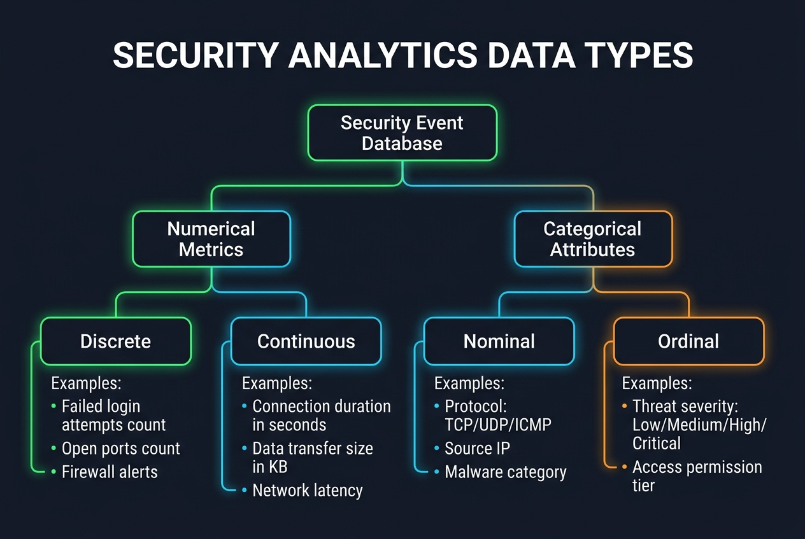

# Security Analytics — Data Science & Machine Learning Glossary

This document serves as an educational reference guide for Data Science, Machine Learning, and Statistics applied specifically to a **Security Analytics and Cyber Security** context (e.g., intrusion detection, security audit logs, anomaly logins, firewall traffic monitoring, malware classification, phishing detection, and threat intelligence).

---

## Table of Contents
1. [Core Statistical Measures](#1-core-statistical-measures)
2. [Data Analysis & Variables](#2-data-analysis--variables)
3. [Data Cleaning & Wrangling](#3-data-cleaning--wrangling)
4. [Feature Engineering & Preprocessing](#4-feature-engineering--preprocessing)
5. [Probability & Statistical Inference](#5-probability--statistical-inference)
6. [Mathematics, NumPy & Array Operations](#6-mathematics-numpy--array-operations)
7. [Core Libraries & Tools](#7-core-libraries--tools)
8. [Statistical Plots & Graphs](#8-statistical-plots--graphs)

---

## 1. Core Statistical Measures

### Descriptive Statistics vs. Inferential Statistics
*   **Layman Explanation**: 
    *   *Descriptive*: Listing security events that occurred yesterday (e.g., "Our firewall blocked 50,000 requests, and we had 3 failed admin login attempts").
    *   *Inferential*: Estimating the likelihood of a system breach based on a sample of system audit logs (e.g., "Based on analyzing a sample of 1,000 network connections, we estimate that 0.5% to 1.2% of all incoming connections are potentially malicious port scans").
*   **Technical Explanation**: 
    *   *Descriptive*: Summarizing historical event characteristics using mean, median, standard deviation, and histograms to describe data distributions.
    *   *Inferential*: Running statistical tests, computing confidence intervals, and using probability models to make assertions about population security characteristics from sample observations.
*   **Data Science Use Case**: Descriptive stats are used in Security Operations Center (SOC) dashboards to track daily event counts; Inferential stats are used in penetration testing analysis to predict system failure rates.
*   **Machine Learning Use Case**: Descriptive statistics establish normal activity baselines for security features; Inferential statistics validate if a new anomaly detection model has a statistically lower False Positive Rate (FPR).
*   **Real-world Scenario**: A security analyst reviews daily login failures (Descriptive), and then performs statistical analysis on connection logs to estimate the probability that the system is currently undergoing a distributed brute-force attack (Inferential).

| Feature / Aspect | Descriptive Statistics | Inferential Statistics |
| :--- | :--- | :--- |
| **Primary Goal** | Summarize and describe past historical data. | Make predictions or draw conclusions about a population. |
| **Output Type** | Charts, tables, means, medians, standard deviations. | p-values, confidence intervals, hypothesis test results. |
| **Security Example** | Total bytes transferred last week. | Predicting intrusion likelihood based on access patterns. |

### Mean
*   **Layman Explanation**: The average value. Sum up the size of all network packets and divide by the number of packets.
*   **Technical Explanation**: The arithmetic average of a dataset, calculated as:
    $$\mu = \frac{\sum_{i=1}^N X_i}{N} \quad \text{(Population)} \qquad \bar{x} = \frac{\sum_{i=1}^n x_i}{n} \quad \text{(Sample)}$$
*   **Data Science Use Case**: Calculating the average response time of security API requests to check performance degradation.
*   **Machine Learning Use Case**: Centering feature coordinates (subtracting the mean) during data normalization before model training.
*   **Real-world Scenario**: A network monitoring dashboard displays that the average daily bandwidth consumption per employee is 1.2 GB.

### Median
*   **Layman Explanation**: The middle value when you line up all session durations in order. This is highly useful because a few users who leave remote sessions open for weeks will skew the standard average.
*   **Technical Explanation**: The middle value of a sorted dataset. If the dataset has an odd number of observations, it is the middle value. If even, it is the average of the two middle values.
*   **Data Science Use Case**: Calculating typical database query durations. If 99 queries take 0.01 seconds and 1 query takes 100 seconds (waiting for a lock), the mean query time is 1 second (misleading), but the median query time is 0.01 seconds (accurate representation of standard performance).
*   **Machine Learning Use Case**: Imputing missing audit values where extreme outlier events are common.
*   **Real-world Scenario**: A security analyst finds that while the average alert resolution time is 3 hours (pulled high by a few low-priority tickets), the median resolution time is a fast 5 minutes.

### Variance & Standard Deviation
*   **Layman Explanation**: How much network traffic fluctuates around the average. If every connection transfers exactly 10 KB, standard deviation is 0. If some transfer 1 GB and others transfer 0, standard deviation is extremely high.
*   **Technical Explanation**: Measures of data dispersion. Variance is the average of squared differences from the Mean. Standard Deviation is the square root of Variance:
    $$\sigma = \sqrt{\frac{\sum_{i=1}^N (X_i - \mu)^2}{N}} \quad \text{(Population)} \qquad s = \sqrt{\frac{\sum_{i=1}^n (x_i - \bar{x})^2}{n-1}} \quad \text{(Sample)}$$
*   **Data Science Use Case**: Identifying abnormal server loads. High standard deviation in data transfers indicates unstable or potentially compromised network activity (e.g., data exfiltration).
*   **Machine Learning Use Case**: Normalizing security features so that distance-based anomaly detectors are not dominated by features with massive standard deviations.
*   **Real-world Scenario**: A security engineer tracks daily firewall block rates. The average is 1,200 blocks with a standard deviation of 15 (highly consistent, so a sudden jump to 10,000 blocks indicates a clear DDoS attack).

### Range & Interquartile Range (IQR)
*   **Layman Explanation**: 
    *   *Range*: The gap between the smallest payload size and the largest payload size.
    *   *IQR*: The gap between the 25th percentile connection size and the 75th percentile connection size (representing the middle 50% of our normal traffic).
*   **Technical Explanation**: 
    *   *Range*: $X_{max} - X_{min}$.
    *   *IQR*: $Q3 - Q1$, where $Q1$ is the 25th percentile and $Q3$ is the 75th percentile. Box plot whiskers are defined at $[Q1 - 1.5 \times IQR, Q3 + 1.5 \times IQR]$.
*   **Data Science Use Case**: Creating box plots to isolate outlier network packet sizes for deep packet inspection.
*   **Machine Learning Use Case**: Running robust scaling on features with high outlier rates.
*   **Real-world Scenario**: A security analyst finds that the range of connection attempts is 200 attempts, but the IQR is only 3 (indicating that almost all normal users attempt connection 1-4 times before succeeding).

### Skewness
*   **Layman Explanation**: A measure of asymmetry. If most employees have 0 security policy violations but a tiny handful have many, the distribution tail stretches far to the right (positive skew).
*   **Technical Explanation**: The third standardized moment measuring the asymmetry of a probability distribution:
    $$\text{Skewness} = E\left[\left(\frac{X-\mu}{\sigma}\right)^3\right]$$
*   **Data Science Use Case**: Spotting highly skewed traffic patterns (e.g., port scan connection rates) to define threat boundaries.
*   **Machine Learning Use Case**: Applying log transformations to highly skewed independent variables (like payload sizes) to help algorithms converge faster.
*   **Real-world Scenario**: User failed login attempts are highly right-skewed, showing that the majority of employees make 0-1 mistakes, while a small group under brute-force attack shows hundreds of failures.

### Kurtosis
*   **Layman Explanation**: A measure of extreme values (heavy tails). High kurtosis means system events are mostly normal, but occasionally contain massive, unexpected spikes (like a sudden 10,000% spike in outgoing database traffic).
*   **Technical Explanation**: The fourth standardized moment measuring the peakedness or tail heaviness of a distribution:
    $$\text{Kurtosis} = E\left[\left(\frac{X-\mu}{\sigma}\right)^4\right]$$
*   **Data Science Use Case**: Identifying anomaly-heavy distributions in database server logs.
*   **Machine Learning Use Case**: Evaluating regression residuals to check if prediction errors are normally distributed (low kurtosis) or contain extreme miscalculations.
*   **Real-world Scenario**: A security operations team finds that network packet sizes have high kurtosis, indicating that packets are highly predictable in size except during file download attacks, which produce extreme outlier peaks.

---

## 2. Data Analysis & Variables

#### 📊 Foundational Disciplines & Roles

### Data Science
*   **Layman Explanation**: Extracting value from security logs to identify threat patterns (e.g., analyzing API usage data to see which endpoints are vulnerable).
*   **Technical Explanation**: An interdisciplinary field combining math/statistics, programming, and domain expertise to extract insights from structured and unstructured data.
*   **Real-world Scenario**: A security team analyzes millions of firewall traffic events to define baseline usage patterns, making it easier to spot future anomalous activity.

### Machine Learning (ML)
*   **Layman Explanation**: Training algorithms on historical file data to automatically predict if a new, unseen file is safe or malware.
*   **Technical Explanation**: Algorithms that learn patterns from training data ($X$) to predict outcomes ($Y$) on unseen test data without explicit rule programming.
*   **Real-world Scenario**: An antivirus system uses Machine Learning models trained on millions of benign and malicious executables to block zero-day ransomware.

### Data Analysis / Data Analyst (DA)
*   **Layman Explanation**: Reviewing past security logs to build dashboards showing threat trends (e.g., successful blocks, failed login trends).
*   **Technical Explanation**: Inspecting, cleaning, and modeling historical data to support descriptive decision-making and report KPIs.
*   **Real-world Scenario**: A Security Data Analyst builds a Splunk dashboard tracking weekly firewall blocks and intrusion attempts by geographic origin.

### Business Analysis / Business Analyst (BA)
*   **Layman Explanation**: Translating security requirements (e.g., compliance with GDPR) into concrete technical instructions for IT and security engineers.
*   **Technical Explanation**: Evaluating business processes and defining software requirements to bridge business objectives with technical solutions.
*   **Real-world Scenario**: A BA reviews compliance requirements, identifies security gaps in server backups, and drafts requirements for an automated encryption system.

#### 🗂️ Core Data Classifications

### Numerical Data (Discrete & Continuous)

*   **Layman Explanation**: 
    *   *Discrete*: Countable items (e.g., "Failed login attempts: 4"). You cannot have 4.3 login attempts.
    *   *Continuous*: Measurable values (e.g., "Connection latency: 24.5 milliseconds").
*   **Technical Explanation**: Numerical data represents quantitative values. Discrete data is countable integer values ($x \in \mathbb{Z}$). Continuous data is measurable floating-point values ($x \in \mathbb{R}$).
*   **Real-world Scenario**: A SIEM dashboard tracks "Number of open ports" (Discrete) and "Total bytes transferred in KB" (Continuous).

### Categorical Data (Nominal & Ordinal)
*   **Layman Explanation**: 
    *   *Nominal*: Unordered labels (e.g., Protocol Type: "TCP", "UDP", "ICMP").
    *   *Ordinal*: Ordered ranks (e.g., Threat Severity: "Low", "Medium", "High", "Critical").
*   **Technical Explanation**: Qualitative categories. Nominal categories have no mathematical order. Ordinal categories have a structured scale or hierarchy.
*   **Real-world Scenario**: An incident response ticket captures "Access Method" (Nominal: SSH, RDP, HTTPS) and "User clearance tier" (Ordinal: L1 Analyst, L2 Lead, L3 Administrator).

#### 🎯 Variables & Modeling Roles

### Target Variable (Dependent Variable)
*   **Layman Explanation**: The outcome you want to predict (e.g., "Is this email a phishing attempt?").
*   **Technical Explanation**: The dependent variable ($Y$) modeled as a function of inputs ($X$).
*   **Real-world Scenario**: When building a model to flag malware, the Target Variable is `Is_Malicious` (1 if the file contains a threat, 0 if it is clean).

### Feature (Independent Variable)
*   **Layman Explanation**: The clues used to make our prediction (e.g., sender address, domain age, number of links, spelling errors).
*   **Technical Explanation**: The independent variables ($X$) input into models to explain the variance in $Y$.
*   **Real-world Scenario**: Predictors of a phishing email include "Days since sender domain was registered", "Count of external URL links", and "Contains urgent keywords".

#### 🔍 Statistical Scopes of Analysis

### Univariate, Bivariate, and Multivariate Analysis
*   **Layman Explanation**: 
    *   *Univariate*: Studying one metric at a time (e.g., "What is the distribution of our daily failed login attempts?").
    *   *Bivariate*: Studying two metrics together (e.g., "Does connection latency correlate with the volume of bytes transferred?").
    *   *Multivariate*: Studying many metrics together (e.g., "How do protocol type, login location, and time of day jointly predict a system intrusion?").
*   **Technical Explanation**: 
    *   *Univariate*: Analyzing the distribution of a single variable ($f(x)$).
    *   *Bivariate*: Analyzing relationship correlation between two variables ($f(x, y)$).
    *   *Multivariate*: Evaluating relationships within a set of multiple variables ($f(x_1, x_2, \dots, x_n)$).
*   **Real-world Scenario**: A security analyst plots IP connection counts (Univariate), checks if connections relate to geographical origin (Bivariate), and builds a machine learning intrusion model combining origin, protocol, payload size, and time (Multivariate).

---

## 3. Data Cleaning & Wrangling

### Imputation

*   **Layman Explanation**: Filling in empty database cells with a smart guess (e.g., if a security log has a missing protocol name, you fill it with the most common protocol observed in that port range).
*   **Technical Explanation**: The process of replacing missing values (NaN) with substituted values based on statistics or modeling.
*   **Security Decision Matrix (Which Method to Use When)**:
    | Scenario / Data Type | Recommended Action | Rationale |
    | :--- | :--- | :--- |
    | **Missing rate > 40%** | **Drop Column** | Too little signal to rebuild; dropping is safer (verify with Lead Analyst first if critical). |
    | **Time-Series / Sequence** | **Forward Fill (`ffill`) / Backward Fill (`bfill`)** | Preserves continuous temporal connection logs. |
    | **Numerical (Symmetrical, no outliers)** | **Mean Imputation** | Preserves the overall average of features like connection durations. |
    | **Numerical (Skewed / Outliers present)** | **Median Imputation** | Robust to extreme outliers in features like transfer sizes. |
    | **Categorical (Nominal or Ordinal)** | **Mode Imputation** | Replaces nulls with the most common protocol (TCP). |
    | **Structured / Contextual missingness** | **Constant value (e.g. "Unknown" or 0)** | Marks missing status explicitly (e.g., blank field for "device ID"). |

### Outlier Detection & Treatment
*   **Layman Explanation**: Spotting systems or IPs with unusual metrics (e.g., an IP address sending 100,000 requests in 1 hour might be a DDoS attempt, or a user account downloading 100x more data than their normal average).
*   **Technical Explanation**: Identifying observations that lie far from other data points using statistical boundaries:
    *   *IQR method*: Values outside $[Q1 - 1.5 \times IQR, Q3 + 1.5 \times IQR]$.
    *   *Z-score method*: Points where $|Z| > 3$.
    *   *Isolation Forest*: Unsupervised algorithm to isolate anomalies (useful for multi-dimensional threat anomalies).
*   **Real-world Scenario**: A security analyst spots a sudden network traffic spike. The system flags it as an outlier because the Z-score of the connection count exceeded +4.0.

---

## 4. Feature Engineering & Preprocessing

#### 💡 Feature Engineering Concepts

### Feature Engineering
*   **Layman Explanation**: Transforming raw firewall or authentication logs into highly useful security metrics (e.g., converting "connection timestamps" into a new metric: "Connection rate per IP per minute").
*   **Technical Explanation**: The process of selecting, manipulating, and transforming raw variables into new features that better represent the underlying threat detection problem to improve model performance.
*   **Real-world Scenario**: A security data scientist takes raw `login_timestamp` and `logout_timestamp` dates and engineers a new feature: `Session_Duration_Seconds`.

#### 🔢 Categorical Data Encoding

### Data Encoding
*   **Layman Explanation**: Converting text categories into numbers so machine learning models can read them (e.g., converting Threat Severity "Low", "Medium", "High" into 0, 1, 2).
*   **Technical Explanation**: Transforming categorical qualitative variables into quantitative numerical variables (e.g., via Ordinal Encoding or One-Hot Encoding).
*   **Real-world Scenario**: Threat categories ("Malware", "Phishing", "DDoS") are encoded into numbers before running an automated security incident classification model.

### One-Hot Encoding
*   **Layman Explanation**: Creating separate Yes/No columns for each category. Instead of a single column called "Protocol" with values "TCP", "UDP", "ICMP", you create three new columns: "Is_TCP?", "Is_UDP?", and "Is_ICMP?" filled with 1s and 0s.
*   **Technical Explanation**: Transforming a categorical variable with $k$ categories into $k$ binary columns (dummy variables) where only one column is active ("1").
*   **Real-world Scenario**: An intrusion detection model uses One-Hot Encoding to convert an incoming request's nominal `Protocol` field into binary columns.

#### 📏 Feature Scaling Techniques

### Normalization (Min-Max Scaling)
*   **Layman Explanation**: Squishing values to fit on a scale from 0 to 1. E.g., putting connection durations (1ms to 10,000ms) and failed login counts (0 to 50) on a 0-to-1 scale so they can be compared directly.
*   **Technical Explanation**: Rescaling the range of features to scale the data in $[0, 1]$:
    $$X_{scaled} = \frac{X - X_{min}}{X_{max} - X_{min}}$$
*   **Real-world Scenario**: In an anomaly detection clustering model, connection frequency and bytes transferred are normalized to [0, 1] so that both features contribute equally to the distance calculations.

### Standardization (Z-score Normalization)

*   **Layman Explanation**: Adjusting metrics so the average is 0 and measuring how many standard steps (standard deviations) each connection or login rate is from that average.
*   **Technical Explanation**: Rescaling data to have a mean of 0 and a standard deviation of 1:
    $$X_{std} = \frac{X - \mu}{\sigma}$$
*   **Real-world Scenario**: A security operations team standardizes the feature `Daily_Failed_Logins` before feeding it to a neural network predicting intrusion probability.

---

## 5. Probability & Statistical Inference

### Normal (Gaussian) Distribution
*   **Layman Explanation**: A bell-shaped curve where most system metrics (like CPU load or login durations) cluster around the center average, and drop off symmetrically towards the extremes.
*   **Technical Explanation**: A continuous probability distribution defined by its mean ($\mu$) and standard deviation ($\sigma$):
    $$f(x) = \frac{1}{\sigma \sqrt{2\pi}} e^{-\frac{1}{2}\left(\frac{x-\mu}{\sigma}\right)^2}$$
*   **Real-world Scenario**: Daily alert volumes across different server cohorts follow a normal distribution.

### Central Limit Theorem (CLT)
*   **Layman Explanation**: If you take multiple random samples of logs, calculate their averages, and plot those averages, they will always form a perfect normal bell curve, even if individual connection behavior is highly erratic or skewed.
*   **Technical Explanation**: The sampling distribution of the sample mean ($\bar{x}$) approaches a normal distribution as the sample size ($n$) becomes large ($n \ge 30$), regardless of the shape of the population distribution.
*   **Real-world Scenario**: Active session lengths are highly skewed, but the average session length calculated across 100 random server cohorts forms a normal distribution, allowing statistical intervals to be constructed.

### Hypothesis Testing (Null vs. Alternative)

*   **Layman Explanation**: Innocent until proven guilty. 
    *   *Null Hypothesis*: The new security patch did not reduce system intrusion rates.
    *   *Alternative Hypothesis*: The new security patch significantly reduced system intrusion rates.
*   **Technical Explanation**: A method of statistical inference where a null hypothesis ($H_0$) is tested against an alternative hypothesis ($H_a$). If the p-value is less than the significance level ($\alpha = 0.05$), $H_0$ is rejected.
*   **Real-world Scenario**: A cloud company deploys a new firewall rule.
    *   $H_0$: The daily breach rate remains at 0.05%.
    *   $H_a$: The daily breach rate is lower than 0.05%.
    *   *Outcome*: A proportion z-test yields a p-value of 0.01. The team rejects $H_0$ and keeps the new firewall rule.

### Time Series & Forecasting
*   **Layman Explanation**: Predicting future security incidents based on past timelines (e.g., forecasting next month's alert volumes using the last 3 years of incident logs).
*   **Technical Explanation**: Modeling sequentially ordered data points to identify underlying trends, seasonality, and cyclic variations, and projecting future values.
*   **Real-world Scenario**: A security operations center (SOC) builds a forecasting model to predict next week's threat alert volumes and staffing requirements.

---

## 6. Mathematics, NumPy & Array Operations

#### 📐 Vector Mathematics & Modeling Concepts

### Linear Algebra
*   **Layman Explanation**: Using grids and lists of numbers to process security logs in bulk rather than one-by-one.
*   **Technical Explanation**: The branch of mathematics concerning vector spaces, linear transformations, matrices, and systems of linear equations.
*   **Real-world Scenario**: A threat classifier runs dot products on an IP-to-feature matrix to calculate threat scores.

### Word2Vec (Word-to-Vec) Model
*   **Layman Explanation**: Mapping system logs (e.g., "connection timeout from IP X") into coordinate points so similar network alerts end up close to each other.
*   **Technical Explanation**: A neural network-based NLP technique mapping words into continuous vector spaces to capture semantic similarities.
*   **Real-world Scenario**: System error logs containing "unauthorized access" and "invalid credentials" are mapped to similar vector spaces to help group security incidents.

### Vector Norm (L1 & L2 Norms)
*   **Layman Explanation**: Calculating distances. L2 norm calculates the straight-line distance, while L1 norm calculates distance along grid lines (Manhattan distance).
*   **Technical Explanation**: Magnitude functions mapping a vector to a scalar:
    $$\|x\|_1 = \sum |x_i| \qquad \|x\|_2 = \sqrt{\sum x_i^2}$$
*   **Real-world Scenario**: *   **Real-world Scenario**: An anomaly detection system calculates system behavior similarities using L2 distance (Euclidean distance).

#### ⚙️ Array Operations & Optimization

### Vectorization
*   **Layman Explanation**: Performing arithmetic on millions of firewall log rows simultaneously in C instead of using slow Python loops.
*   **Technical Explanation**: Delegating array calculations to highly optimized compiled code underneath.
*   **Real-world Scenario**: Running `df['Bytes_Sent'] + df['Bytes_Received']` to calculate total network traffic per IP runs in milliseconds using vectorized operations.

### Broadcasting
*   **Layman Explanation**: Stretches a single number to fit a whole list of numbers (e.g., adding a base timestamp offset to all firewall log rows automatically).
*   **Technical Explanation**: The rules NumPy follows to perform arithmetic operations on arrays of different dimensions.
*   **Real-world Scenario**: A security log parser subtracts a base timestamp offset from a massive access log matrix.

---

## 7. Core Libraries & Tools

*   **Pandas**: The core library for loading, cleaning, and transforming security spreadsheets (DataFrames).
*   **NumPy**: The core engine for high-speed mathematical array calculations.
*   **Scikit-learn**: The primary package used to train ML models (like classification trees for threat prediction).
*   **Seaborn**: Built on Matplotlib, used to generate high-quality statistical plots like heatmaps of correlation metrics.
*   **SciPy**: Used for running advanced scientific calculations and statistical tests (like calculating p-values for A/B tests).

---

## 8. Statistical Plots & Graphs

#### 📊 Quick Reference: Visualization Categories
| Plot Type Category | Common Charts | Primary Data Science Use Case |
| :--- | :--- | :--- |
| **📊 Distribution & Comparison** | Histogram, Line Plot, Bar Chart, Pie Chart, Box Plot, Violin Plot, Swarm Plot | Comparing categories, viewing numerical spreads, checking skewness, and monitoring values over time. |
| **🔗 Relationship & Correlation** | Scatter Plot, Heatmap, Joint Plot, Pair Plot, Scatter Matrix, 3D Scatter | Studying correlations, finding linear/non-linear patterns, identifying clusters, and checking feature multicollinearity. |
| **🧭 Specialized & Hierarchical** | Sunburst Chart, Gauge Chart, Radar Plot, Area Plot, Treemap | Visualizing hierarchical nested shares, tracking performance progress, showing multi-variable skills, and stacked volume over time. |

### Histogram

*   **Security Use Case**: Visualizing the distribution of network connection duration (in seconds) to identify if most connections are short-lived or if there are long-lived persistent connections (potential data exfiltration).

### Line Plot

*   **Security Use Case**: Tracking the hourly rate of failed login attempts over a 7-day period to spot brute-force attack trends.

### Bar Chart

*   **Security Use Case**: Comparing total firewall blocks across different protocol categories (TCP vs. UDP vs. ICMP).

### Pie Chart

*   **Security Use Case**: Showing the percentage share of detected malware categories (Trojans, Ransomware, Adware, Spyware) in a month.

### Box Plot (Box-and-Whisker Plot)

*   **Security Use Case**: Summarizing the spread of login response latencies and identifying outlier authentication attempts.

### Scatter Plot

*   **Security Use Case**: Plotting the volume of bytes sent against bytes received for external IP addresses to find data exfiltration patterns (high sent, low received).

### Violin Plot

*   **Security Use Case**: Displaying the distribution of network traffic payload sizes across different ports, showing if port usage is multimodal.

### Heatmap

*   **Security Use Case**: Displaying a correlation matrix of threat features (failed logins, file modifications, privilege escalation alerts) to identify co-occurring indicators of compromise (IoC).

### Sunburst Chart

*   **Security Use Case**: Visualizing security alerts nested by Alert Severity $\rightarrow$ Threat Category $\rightarrow$ Affected Asset.

### Gauge / Indicator Chart

*   **Security Use Case**: Presenting the current system vulnerability score or risk rating relative to a critical benchmark of 30.

### Pair Plot

*   **Security Use Case**: Inspecting pairwise correlations between all network metrics (packets, bytes, duration, ports used) in a single grid.

### Joint Plot

*   **Security Use Case**: Analyzing the correlation between failed logins and total account lockouts, with marginal histograms on the sides showing individual densities.

### Swarm Plot

*   **Security Use Case**: Showing the exact CPU usage of our top 100 virtual machines grouped by system environment, ensuring no points are hidden.

### Scatter Matrix / Splom

*   **Security Use Case**: Displaying interactive multidimensional scatter grids for incident response triage cohorts.

### Polar / Radar Plot

*   **Security Use Case**: Visualizing a server's security health across five threat categories (Malware Detection, Network Anomalies, Failed Logins, File Integrity, Patch Status).

### Area Plot

*   **Security Use Case**: Plotting stacked firewall block volumes over a 12-month period, colored by block source (IP Blacklist, Geo-Block, Rule Violation).

### Treemap

*   **Security Use Case**: Displaying annual security event allocations, where rectangle sizes show the event volumes of different server environments (Staging, Production, Dev).

### 3D Scatter / Line Plot

*   **Security Use Case**: Evaluating cluster boundaries of IP addresses across three dimensions: Request rate, payload size, and unique ports targeted.
