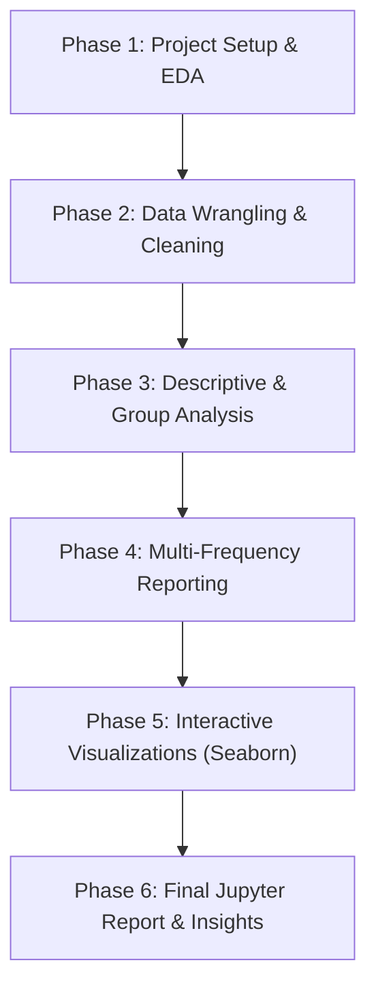

# Project Roadmap & Execution Plan: AAL Sales Analysis (Q4 2020)

This document outlines the original problem definition, the step-by-step roadmap, high-level task list, and critical engineering considerations for completing **Project 3: Sales Analysis** for Australia Apparel League (AAL).

> [!NOTE]
> For a detailed, step-by-step educational guide explaining the mathematical formulas, library choices, and analysis methodology, see [project_explanation.md](file:///media/jignesh/Data/ihfc/IHFC-Leaning/project3%20-%20SalesAnalysis/problem_description/project_explanation.md).

---

## 1. Problem Definition

### Context
AAL, established in 2000, is a well-known brand in Australia, particularly recognized for its clothing business. It has opened branches in various states, metropolises, and tier-1 and tier-2 cities across the country. The brand caters to all age groups, from kids to the elderly.

Currently experiencing a surge in business, AAL is actively pursuing expansion opportunities. To facilitate informed investment decisions, the CEO has assigned the responsibility to the head of AAL’s sales and marketing (S&M) department. 

### Specific Tasks
1. Identify the states that are generating the highest revenues.
2. Develop sales programs for states with lower revenues. The head of sales and marketing has requested your assistance with this task.
3. Analyze the sales data of the company for the fourth quarter in Australia, examining it on a state-by-state basis. Provide insights to assist the company in making data-driven decisions for the upcoming year.

*Data Source: `AusApparalSales4thQrt2020.csv`*

---

## 2. Requirements & Steps to Perform

### Step 1: Data Wrangling
* Ensure that the data is clean and free from any missing or incorrect entries.
* Inspect the data manually to identify missing or incorrect information using the functions `isna()` and `notna()`.
* Include recommendations for treating missing and incorrect data (dropping the null values or filling them).
* Choose a suitable data wrangling technique—either data standardization or normalization. Execute the preferred normalization method and present the resulting data. (*Normalization is the preferred approach for this problem.*)
* Share insights regarding the application of the `GroupBy()` function for either data chunking or merging, and offer a recommendation based on your analysis.

### Step 2: Data Analysis
* Perform descriptive statistical analysis on the data in the `Sales` and `Unit` columns. Utilize techniques such as mean, median, mode, and standard deviation for this analysis. (Use suitable libraries such as NumPy, Pandas, and SciPy.)
* Identify the demographic group with the highest sales and the group with the lowest sales based on the data provided.
* Generate weekly, monthly, and quarterly reports to document and present the results of the analysis conducted.

### Step 3: Data Visualization
* Construct a dashboard for the head of sales and marketing encompassing key parameters:
  * State-wise sales analysis for different demographic groups (kids, women, men, and seniors).
  * Group-wise sales analysis (Kids, Women, Men, and Seniors) across various states.
  * Time-of-the-day analysis: Identify peak and off-peak sales periods to facilitate strategic planning for S&M teams. This information aids in designing programs like hyper-personalization and Next Best Offers to enhance sales.
* Ensure the visualization is clear and accessible for effective decision-making.
* The dashboard must contain daily, weekly, monthly, and quarterly charts.
* Seaborn is preferred for statistical plotting. Include your recommendation and indicate why you are choosing the recommended visualization package.

### Step 4: Report Generation
* Use JupyterLab Notebook for generating reports, which includes tasks such as data wrangling, analysis, and visualization.
* Use Markdown in suitable places while presenting your report.
* Use suitable graphs, plots, and analysis reports along with recommendations. 
* **Specific Chart Types Required**:
  * Use a **box plot** for descriptive statistics.
  * Use the **Seaborn distribution plot** (e.g., `histplot` or `displot` with KDE) for any other statistical plotting.

---

## 3. Project Roadmap (Phases of Development)

---

## 4. High-Level Task List

| Task ID | Task Category | Description | Deliverables |
| :--- | :--- | :--- | :--- |
| **T1.1** | Setup | Initialize Jupyter Notebook and import dependencies | `sales_analysis.ipynb` setup with pandas, numpy, seaborn, matplotlib, scipy |
| **T1.2** | Data Load | Load the CSV and inspect its raw metadata (shape, types, columns) | Raw data summary |
| **T2.1** | Text Cleaning | Strip leading/trailing spaces from categorical columns (`State`, `Group`, `Time`) | Cleaned text columns |
| **T2.2** | Missing Data | Inspect missing values using `isna()` / `notna()` and apply handling | Null handling justification |
| **T2.3** | Scaling | Normalize the numerical data (`Sales`, `Unit`) and explain MinMax vs Z-score | Scaled features & explanation |
| **T2.4** | GroupBy Analysis | Implement GroupBy for data chunking/merging and explain when each is used | GroupBy methodology review |
| **T3.1** | Descriptive Stats | Compute mean, median, mode, and standard deviation for `Sales` and `Unit` | Statistical summary table |
| **T3.2** | Group Analysis | Identify the demographic groups generating the highest and lowest sales | Target demographic identification |
| **T4.1** | Datetime Prep | Parse string dates to datetime and extract Week, Month, Quarter | Time-series ready dataset |
| **T4.2** | Reporting | Aggregate daily, weekly, monthly, and quarterly sales | High-level business reports |
| **T5.1** | Box Plots | Generate box plots to visualize distribution and outliers in `Sales` and `Unit` | Box plot visualization |
| **T5.2** | Group Plots | Plot state-wise sales by demographic group and group-wise sales by state | Group-level bar/count plots |
| **T5.3** | Peak Hour Analysis| Analyze Morning, Afternoon, Evening sales trends | Peak time-of-day insights |
| **T5.4** | Distribution Plots| Create Seaborn distribution plots (histograms/KDE) of sales and unit distributions | Frequency distribution curves |
| **T6.1** | Jupyter Report | Structure notebook with Markdown headers, clean code, and business recommendations | Final submitted notebook |

---

## 5. Key Underlying Areas & Things to Keep in Mind

### ⚠️ A. Data Anomalies (Whitespaces)
* **Problem**: In our initial exploration, text columns like `State` (`' WA'`), `Group` (`' Kids'`), and `Time` (`' Morning'`) contain leading spaces.
* **Impact**: If left uncleaned, string comparisons (e.g., `df[df['State'] == 'WA']`) will return empty DataFrames, and visualizations will display incorrect labels.
* **Solution**: Apply `.str.strip()` to all object/categorical columns immediately after loading.

### 🧹 B. Missing Values Treatment
* **Analysis**: We must check for nulls using `isna()` or `notna()`.
* **Strategy**:
  * If nulls exist in non-critical columns or represent a tiny fraction (< 1%), we can drop them.
  * If they represent systematic missingness, we can impute them (mean/median for numerical, mode for categorical) to prevent data loss.

### 📊 C. Standardization vs. Normalization
* **Normalization (Min-Max Scaling)**: Scales data to a fixed range, typically $[0, 1]$.
  * *Formula*: $x_{norm} = \frac{x - x_{min}}{x_{max} - x_{min}}$
  * *Why use*: Preserves relative distances, keeps values bounded, and is preferred when the distribution is not normal (which is common in skewed sales data).
* **Standardization (Z-Score Scaling)**: Centers data around mean 0 with standard deviation 1.
  * *Formula*: $x_{std} = \frac{x - \mu}{\sigma}$
  * *Why use*: Preferred for algorithms that assume normally distributed inputs (e.g., PCA, linear regression).
  * **Project Choice**: The problem statement specifies **Normalization** as the preferred approach. We will implement Min-Max scaling.

### 🔄 D. GroupBy for Chunking vs. Merging
* **Data Chunking**: Using `GroupBy` to split a massive dataset into manageable sub-groups to perform independent computations (e.g., computing statistics per state).
* **Data Merging**: Combining grouped datasets back into a unified table (e.g., joining aggregated sales back to the main user profile table).
* **Our Recommendation**: We will use GroupBy primarily for **data chunking (split-apply-combine)** to compute statistical summaries and aggregations for reporting.

### 📈 E. Why Choose Seaborn for Visualization?
* **Seaborn** builds on top of Matplotlib and integrates seamlessly with Pandas DataFrames.
* **Advantages**:
  1. High-level interface that requires less code for complex plots (e.g., automatic grouping/hue separation).
  2. Beautiful default aesthetics, professional color palettes, and styled grids.
  3. Built-in statistical estimation (automatically computes error bars, confidence intervals, and density curves).

---

## 6. Let's Learn Step-by-Step!

To ensure you learn *why* we write each line of code, we will proceed block-by-block. 
For each step:
1. We will discuss the theory and python methods used.
2. We will write the corresponding code block.
3. We will inspect the output together to draw business conclusions.

> [!TIP]
> Make sure your python environment has Jupyter, Pandas, NumPy, Seaborn, Matplotlib, and OpenPyXL/python-docx (if needed). Since we have JupyterLab in this project, we will write our code in a well-structured `.ipynb` file.
