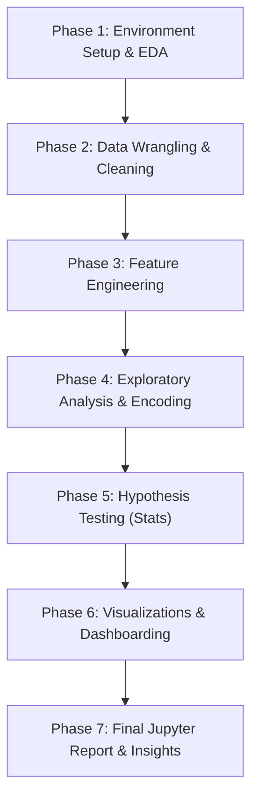

# Project Roadmap & Execution Plan: Marketing Campaigns Analysis

This document outlines the original problem definition, data dictionary, step-by-step roadmap, high-level task list, and critical considerations for completing **Project 4: Marketing Campaigns Analysis**.

> [!NOTE]
> For a detailed, step-by-step educational guide explaining the mathematical formulas (like t-tests, Pearson correlation, IQR), encoding techniques (One-Hot vs. Ordinal), and detailed statistical analysis, see [project_explanation.md](file:///media/jignesh/Data/ihfc/IHFC-Leaning/project4%20-%20MarketingCampaigns/problem_description/project_explanation.md).

---

## 1. Problem Definition

### Context & Scenario
Marketing mix stands as a widely utilized concept in the execution of marketing strategies. It encompasses various facets within a comprehensive marketing plan, with a central focus on the four Ps of marketing: **Product**, **Price**, **Place**, and **Promotion**.

### Objective
As a data scientist, you must conduct exploratory data analysis (EDA) and hypothesis testing to enhance your comprehension of the diverse factors influencing customer acquisition and campaign engagement.

### Key Questions & Hypotheses to Test
1. **Hypothesis 1 (In-store vs. Tech)**: Older individuals may not possess the same level of technological proficiency and may, therefore, lean toward traditional in-store shopping preferences.
2. **Hypothesis 2 (Convenience of Online)**: Customers with children likely experience time constraints, making online shopping a more convenient option.
3. **Hypothesis 3 (Cannibalization)**: Sales at physical stores may face the risk of cannibalization by alternative distribution channels (Web/Catalog).
4. **Hypothesis 4 (US Performance)**: Does the United States significantly outperform the rest of the world in total purchase volumes?

### Visual Analyses Requested
* Identify the top-performing products and those with the lowest revenue.
* Examine if there is a correlation between customers' age and the acceptance rate of the last campaign (`Response`).
* Determine the country with the highest number of customers who accepted the last campaign.
* Investigate if there is a discernible pattern in the number of children at home and the total expenditure.
* Analyze the educational background of customers who lodged complaints in the last two years.

---

## 2. Data Dictionary

Below is the dictionary of variables based on our initial inspection of `marketing_data.csv`:

| Column Name | Data Type (Raw) | Description | Category |
| :--- | :--- | :--- | :--- |
| **ID** | `int64` | Customer's unique identifier | Identifier |
| **Year_Birth** | `int64` | Customer's birth year (contains outliers like 1893) | Demographics |
| **Education** | `object` | Education level (`Graduation`, `PhD`, `2n Cycle`, `Master`, `Basic`) | Demographics |
| **Marital_Status** | `object` | Marital status (contains outliers like `Alone`, `YOLO`, `Absurd`) | Demographics |
| **` Income `** | `object` | Yearly household income (formatted with `$` and `,`, e.g., `$84,835.00`) | Demographics (Price) |
| **Kidhome** | `int64` | Number of small children in the customer's household | Demographics |
| **Teenhome** | `int64` | Number of teenagers in the customer's household | Demographics |
| **Dt_Customer** | `object` | Date of customer's enrollment with the company | Demographics |
| **Recency** | `int64` | Number of days since customer's last purchase | Promotion |
| **MntWines** | `int64` | Amount spent on wine in the last 2 years | Product |
| **MntFruits** | `int64` | Amount spent on fruits in the last 2 years | Product |
| **MntMeatProducts** | `int64` | Amount spent on meat in the last 2 years | Product |
| **MntFishProducts** | `int64` | Amount spent on fish in the last 2 years | Product |
| **MntSweetProducts** | `int64` | Amount spent on sweets in the last 2 years | Product |
| **MntGoldProds** | `int64` | Amount spent on gold in the last 2 years | Product |
| **NumDealsPurchases** | `int64` | Number of purchases made with a discount | Price / Promo |
| **NumWebPurchases** | `int64` | Number of purchases made through the company's website | Place |
| **NumCatalogPurchases**| `int64` | Number of purchases made using a catalog | Place |
| **NumStorePurchases** | `int64` | Number of purchases made directly in stores | Place |
| **NumWebVisitsMonth** | `int64` | Number of visits to company's website in the last month | Place |
| **AcceptedCmp3** | `int64` | 1 if customer accepted the offer in the 3rd campaign, 0 otherwise | Promotion |
| **AcceptedCmp4** | `int64` | 1 if customer accepted the offer in the 4th campaign, 0 otherwise | Promotion |
| **AcceptedCmp5** | `int64` | 1 if customer accepted the offer in the 5th campaign, 0 otherwise | Promotion |
| **AcceptedCmp1** | `int64` | 1 if customer accepted the offer in the 1st campaign, 0 otherwise | Promotion |
| **AcceptedCmp2** | `int64` | 1 if customer accepted the offer in the 2nd campaign, 0 otherwise | Promotion |
| **Response** | `int64` | 1 if customer accepted the offer in the last campaign, 0 otherwise | Promotion |
| **Complain** | `int64` | 1 if customer complained in the last 2 years, 0 otherwise | Promotion |
| **Country** | `object` | Customer's country of residence (`SP`, `SA`, `CA`, `AUS`, `IND`, `GER`, `US`, `ME`) | Demographics |

---

## 3. Project Roadmap

---

## 4. High-Level Task List

| Task ID | Task Category | Description | Deliverables |
| :--- | :--- | :--- | :--- |
| **T1.1** | Setup | Initialize Jupyter Notebook and import packages | `marketing_campaign_analysis.ipynb` setup with pandas, numpy, scipy.stats, seaborn, matplotlib |
| **T1.2** | Data Load | Load the CSV and inspect its raw metadata (shape, types, columns) | Raw data summary |
| **T2.1** | Column Cleaning| Strip whitespaces from column names (fix `' Income '` spacing) | Standardized column names |
| **T2.2** | Text Cleaning | Clean the `Income` column by removing `$`, `,`, and trailing spaces, then convert to float | Numeric income column |
| **T2.3** | Categorical Fix| Scrutinize `Education` and `Marital_Status`. Map rare groups (`Alone` $\rightarrow$ `Single`, `YOLO`/`Absurd` $\rightarrow$ `Single` or `Other`) | Cleaned categories |
| **T2.4** | Missing Values | Impute missing incomes using the average/median income of similar `Education` + `Marital_Status` groups | Fully populated dataset |
| **T2.5** | Outlier Treatment| Identify and cap/remove extreme outliers (e.g. Birth Year < 1940, Income > $150,000) using box plots/IQR | Cleaned and filtered dataset |
| **T3.1** | Features: Demogr| Calculate **Age** (`2014 - Year_Birth`) and **Total_Children** (`Kidhome + Teenhome`) | Demographic features |
| **T3.2** | Features: Spend | Compute **Total_Spending** (sum of Wines, Fruits, Meat, Fish, Sweet, Gold) | Financial feature |
| **T3.3** | Features: Purch | Compute **Total_Purchases** (sum of Web, Catalog, and Store purchases) | Behavioral feature |
| **T4.1** | Categorical Enc | Apply Ordinal encoding to `Education` and One-Hot encoding to `Marital_Status` & `Country` | Encoded features |
| **T4.2** | Correlation | Generate a correlation matrix and heatmap to examine relationships | Pearson correlation matrix & heatmap |
| **T5.1** | Hypothesis 1 | Test whether older individuals prefer in-store purchases (correlation or group comparison) | T-test/Correlation result |
| **T5.2** | Hypothesis 2 | Test if customers with children purchase more online (t-test) | T-test statistic & p-value |
| **T5.3** | Hypothesis 3 | Check for cannibalization between Store sales and Web/Catalog sales (correlation) | Correlation analysis |
| **T5.4** | Hypothesis 4 | Test if USA significantly outperforms the rest of the world in purchase volumes (t-test) | US vs. ROW T-test |
| **T6.1** | Product Analysis| Plot top-performing and lowest-revenue product categories | Product sales bar plot |
| **T6.2** | Campaign Age | Visualize correlation between Age and Last Campaign acceptance (`Response`) | Box plot / Logistic curve |
| **T6.3** | Country Acceptance| Find and visualize the country with the highest accepted last campaign responses | Country-wise response count plot |
| **T6.4** | Kids vs Spending| Plot expenditure patterns based on the number of children at home | Box plot/Line plot |
| **T6.5** | Complaints | Analyze educational background of complaining customers | Complaining demographic breakdown |
| **T7.1** | Final Report | Structure notebook with Markdown headers, clean code, visualizations, and business recommendations | Completed project notebook |

---

## 5. Key Underlying Areas & Things to Keep in Mind

### ⚠️ A. Data Formatting Pitfalls
* **Whitespaces**: The column name for income is `' Income '` (spaces on both sides). We must rename it or strip spaces from columns using `df.columns = df.columns.str.strip()`.
* **String Values**: Incomes are represented as `"$84,835.00 "`. Standard mathematical operations will fail. We must clean and cast it: `df['Income'] = df['Income'].str.replace('$', '').str.replace(',', '').str.strip().astype(float)`.
* **Date Parsing**: `Dt_Customer` contains dates in various formats (e.g. `2012-08-31` or `8/31/12`). We should parse them using `pd.to_datetime(df['Dt_Customer'], format='mixed')`.

### 🧹 B. Sophisticated Imputation
* **Group-by Imputation**: Instead of imputing missing income with a global mean/median, the prompt asks us to use the average income of similar groups based on `Education` and `Marital_Status`.
* **Implementation**: We can calculate a grouping key:
  `df['Income'] = df.groupby(['Education', 'Marital_Status'])['Income'].transform(lambda x: x.fillna(x.median()))`.

### 📈 C. Outlier Filtering
* **Age Outliers**: Birth years like `1893`, `1899`, and `1900` correspond to unrealistic ages. They must be removed or imputed to prevent severe bias.
* **Income Outliers**: The maximum income of `$666,666` dwarfs the 75th percentile of `$68,522`. We should filter out incomes above `$120,000` or use IQR boundaries.
